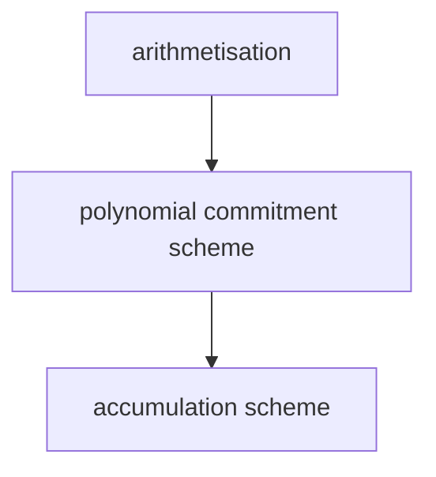
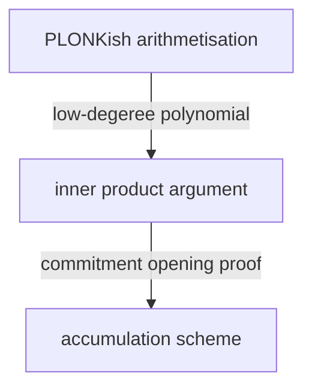

Understanding and building user-facing applications with `Halo2` and `PLONKish` proving systems
 - Circuits
 - Toolstack
 - Developer tools

halo2 proving system consists of these 3 components :



halo2 use :
 - [arithmetisation] : PLONKish arithmetisation 
 - [polynomial commitment scheme] :  inner product argument
 - [accumulation scheme]  accumulation scheme




### PLONKish arithmetisation 

![[Pasted image 20230821110734.png]]


![[Pasted image 20230821111605.png]]

 - qs : pre-processed polynomials also called selectors, generated by the $V$. and they're basically hard-coded for your circuit
 - $x_a, x_b, \ldots$ are witnesses by the $P$ and these have **different values in each proof instance**
#### custom gate(TurboPLONK)

$$\underbrace{\textcolor{red}{q_{add}} \cdot (a_0 + a_1 - a_2)}_{add \ \ gate} + k \cdot \left( \underbrace{\textcolor{red}{q_{mul}}  \cdot (a_0 \cdot a_1 - a_2)}_{mul \ \ gate} \right) + k^2 \cdot \left( \underbrace{\textcolor{red}{q_{bool}} \cdot (a_0 \cdot a_0 -a_0)}_{bool \ \ gate} \right)$$
all these gates are then combined with $k,  \ k^2$  in a linearly independent way and we check that all of these gates are fulfilled.

so in this way we can move from giant primitive `plonk equation` to any number of gates any arbitrary linear combinations of expressions that we need.

#### Back to PLONK

![[Pasted image 20230821141056.png]]

cause the wire routing is baked into the trusted setup, so if you wanted a circuit that wired things differently you would need a different trusted setup.  

whereas plonk is trying to avoid this and for this same trusted setup is trying to enable you to wire your circuit all kinds of ways  —— using Permutation Argument.

#### Lookup(ultraPLONK)

**problem** : SHA256(hash) is **expensive** to do in-circuit
**solution** : load precomputed SHA (e.g. for 8-bit values) as lookup table

![[Pasted image 20230821142653.png]]

$$
\begin{align*}
(\textcolor{red}{q_{lookup}} \cdot w_0 , \ t_0) \\
(\textcolor{red}{q_{lookup}} \cdot w_1 , \ t_1) \\
\end{align*}
$$
=> 
$$
\begin{align*}
&(\textcolor{red}{1} \cdot 42 , \  t_0 = 0) \\
&(\textcolor{red}{1} \cdot SHA(69) , \  t_1= SHA(2)) \\
\end{align*}
$$

why?. ..

$$
\begin{array}{lllll}
&(q_{lookup} \cdot w_0 +  \textcolor{red}{(1-q_{lookup}}) \cdot 0 , &t_0 ) \\
&(q_{lookup} \cdot w_1 +  \textcolor{red}{(1-q_{lookup}}) \cdot SHA(0) , &t_1 ) \\

\end{array}
$$

lookup default value when  $q_{lookup}$  is not enabled, so that lookup argument passes on every row. (??)

the lookup argument is a more permissive version of the permutation argument. it enforces that: 
>  every  cell   in a set of input columns is equal to
>  **some**  cell   in a set of table columns 

>  every  **expression**   in a set of input columns is equal to
>  **some**  **expression**   in a set of table columns 

we conceptualise the circuit as a matrix of m columns and n rows,  over a given finite field $\mathbb{F}$ 
 - `instance columns` contain inputs shared between prover/verifier , generally used for public inputs
	 - e.g.  the res of SHA256
	 - a root of a Merkle Tree. 
 - `advice columns` contain private values witnessed by the prover
 - `fixed columns` contain preprocessed values set at key generation
	 - 常量 constant
	 - 查表 : Lookup table column
	 - 选择子 (Selector), 同一行可以支持若干种不同的约束, 比如三元三次, 或者三元二次, 选择子就保证了, 比如说有  3 个 custom gate, 可以只满足其中一个就 OK , 或者满足其中的 2 个


**Regions**

what is regions ?

![[Pasted image 20230821163948.png]]

 - the `instance` columns are white (public inputs), 
 - and the `advice` columns(witnessed) are pink and the
 - `fixed` columns(preprocessed value) are purple

![[Pasted image 20230821165358.png]]
 - the advice columns(witness) are still $\textcolor{pink}{pink}$
 - the $\textcolor{green}{green}$ boxes just means that they have been assigned
 - the $\textcolor{purple}{purple}$ regions are `fixed` columns (preprocessed value)
	 - $\textcolor{violet}{light \ \ purple}$ : fixed column that is binary (0/1) we call these `selector` like in PLONK paper.
	 - $\textcolor{purple}{light \ \ purple}$ : non-binary so that you can witness constant values in them. for example like a fix column is **five** and you wanna your gate does like five times something, and we use these fixed columns.

Throughout the diagram, what are we trying to optimize?
 - we're trying to reduce the space being used .
 - Casue we do a lot of FFTs on the rows

![[Pasted image 20230821171338.png]]

What does columns do ? 
 - each column, the priver needs to make a `commitment` to the column.
 - so, more columns, more commitments ;  more commitments, larger proof.


"regions" are the boundary between `gates` and the global circuit `layouter` : 
 - a block of assignments preserving relative offsets: easy to reason about how gates apply within the region
 - not affected by offsets in other regions: can be freely rearranged to optimise global space usage
 - each region is completely independent of other regions, and if you were to try to write some constraint that crossed the boundary between two regions you would quickly find that you run into problems

halo2 gadgets : 

![[Pasted image 20230821191128.png]]

![[Pasted image 20230821191251.png]]


**open problems / wishlist**

- DSL / intermediate representation
	- add an API to construct a Halo 2 circuit from a set of constraints ([halo2#550](https://github.com/zcash/halo2/issues/550))
	- improve connection between gate configuration and assignment ([halo2#365](https://github.com/zcash/halo2/issues/550))
- multi-phase prover ([halo2#593](https://github.com/zcash/halo2/pull/593))
- dynamic lookup tables ([halo2#534](https://github.com/zcash/halo2/pull/534))

- what other features would you like to see?


#####  multipoint opening argument

**arithmetisation (cont.)**

> (cont.) i.e. continue, 续

1. arithmetise statement using `UltraPLONK` circuit
2. **commit to polynomials** encoding the main components of the circuit ;
$$
\begin{align*}
&Commit(p) = \sum^n \ [p[i]] \cdot G _i \\
&\qquad \small{where  \ \ i =[0\ldots n] , \ \ and \ \ {G_i} ' \ s \ \ are \ commitments \ to \ the \ Lagrange \ Basis \ Polys } \\
&a_i(X) : \ \ \ advice \ \ polys \\
&f_i(X) : \ \ \ fixed \ \ polys \\
\end{align*}
$$
3. construct **vanishing argument** to constrain all circuit relations to zero ;
$$
\begin{align*}
&h(X) = \frac{{gate}_0 (X) + y \cdot {gate}_1(X) +  \ldots + y^n \cdot  {gate}_n(X) }{t(X )} \\
&\qquad \small{where \ \  t(X)  \ \ is \  the \  vanishing \ polynomial \  on \ the } \\
&\qquad \small{domain \ \{\omega^0,…,\omega^{n-1}\} ; \ \  in \ other \ words, \ \ t(X) = X^n-1 }
\end{align*}
$$

4. evaluate the above polynomials at all necessary points ;
$$
\begin{align*}
&a_0(x), \ \ a_0(\omega x), \ \ a_1(\omega x),  \ldots \\
&f_0(x), \ \ f_1(\omega x), \ \ f_1(\omega^{-1} x),  \ldots \\
&h(X) = \frac{{gate}_0 (X) + y \cdot {gate}_1(X) +  \ldots + y^n \cdot  {gate}_n(X) }{t(X )} \\
\end{align*}
$$
5.  construct the **multipoint opening argument** to check that all evaluations are consistent with their respective commitments ;
5.a.  group commitments by the **sets of points** at which they were queried:  
$$
\begin{array}{cc}
\{x\} & \{x, \omega x\} \\
A_0 & A_2 \\
A_1 & A_3
\end{array}
$$
> $A_0, \ \ A_1$ are gates , and is only every queries on the current row (at point set x )
> advice columns(witness) $A_2, \ A_3$  queries on the current row ($x$) as well as the next row ($\omega x$)


5.b.  construct polynomials to accumulate polynomials at each point set;   sample(随机) $x_1$ to keep them linearly independent:   
$$
\begin{align*}
q_0(x) = A_0(x) + x_1 \cdot A_1(x) \\
q_1(x) = A_2(x) + x_1 \cdot A_3(x) \\
\end{align*}
$$
5.c  evaluate the $q_i$ 's at their respective points:
$$
q_0(x) , \ \ q_1(x), \ \ q_1(\omega x)
$$
5.d  at each query point, interpolate the relevant qi evaluations:  
$$
\begin{array}{ll}
r_\theta(X)\ \  \text { s.t. } & r_\theta(x)=A_\theta(x)+x_1 \cdot A_1(x) \\
& r_1(x)=A_2(x)+x_1 \cdot A_3(x) \\
r_1(X) \ \ \text { s.t. } & r_1(\omega x)=A_2(\omega x)+x_1 \cdot A_3(\omega x)
\end{array}
$$
5.e  construct polynomials to check the correctness of qi polynomials
$$
\begin{align*}
&f_\theta(x) = \frac{q_\theta(x) - r_\theta(x)}{X-x} \\
&f_1(x) = \frac{q_1(x) - r_1(x)}{(X-x) \cdot (X - \omega x)} \\
\end{align*}
$$

5.f  construct $f(X) = f_{\emptyset}(X) + x2 \cdot f_1(X)$ , with random $x_2$ to keep  $f_i$  polynomials linearly independent

5.g  construct  
$$
final\_poly(X) = f(X) +   x_4 \cdot q_{\emptyset}(X)  + {x_4}^2 \cdot q_{1}(X)
$$
with random $x_4$ challenge to keep polynomials linearly independent.  
this checks that all evaluations are consistent with their respective commitments.

### inner product argument

Polynomial commitment General process:
1. $Setup()$ : generate a setup $pk$
2. $Commit(pk, \ p)$ : creates a commitment $c$ to $P$
3. $VerifyPoly(pk, \ c,  \ P)$ : checks $c$ is a valid commitment to $P$
4. $Open(pk, \ P, \ x)$ : generates an opening proof π
5. $VerifyOpen(pk, \ c, \  x,  \ y,  \ \pi)$ : checks if $y = P(x)$ using $\pi$


Use cases
- zkEVM: KZG
- plonky2: fri  

`KZG` / `fri` are alternatives for `inner product argument`

----

`inner product argument`  is a type of polynomial commitment scheme .


### halo2 API 

![[Pasted image 20230821203602.png]]


**Column data structure**

```rust
/// Advice column.
Column<Advice>
/// Column for public input.
Column<Instance>
/// A fixed column for constants.
Column<Fixed>
/// A fixed column that holds binary constants.
Selector
/// A fixed column for a lookup table.
TableColumn
```

**Constraint system**
> The constraint system is used to create `columns` and define `custom gates`.

```rust
fn advice_column(&mut self) -> Column<Advice> 
fn instance_column(&mut self) -> Column<Instance>
fn fixed_column(&mut self) -> Column<Fixed>
fn selector(&mut self) -> Selector
fn complex_selector(&mut self) -> Selector
fn lookup_table_column(&mut self) -> TableColumn
/// Enable the ability to enforce equality over cells in this column
fn enable_equality<C: Into<Column<Any>>>(&mut self, column: C)
/// Creates a new gate.
fn create_gate<C: Into<Constraint<F>>, Iter: IntoIterator<Item = C>>(
    &mut self,
    name: &'static str,
    constraints: impl FnOnce(&mut VirtualCells<'_, F>) -> Iter,
)
```

- selector : only involving some very simple custom gate and custom constraints
- complex_selector : you can use that to construct a lookup argument (with arbitrary times.)
- The last 2 apis are used to set up actual constraints,  such as copy constraints and custom gates. In particular, for copy constraint/permutation check, the `enable_equality` API must be used together with the `copy_advice` API (see example1.rs for more details).


#### Layouter

The layouter will be used during the assignment, namely(亦即) when you fill up a table with the witness. Each time you will fill up a region(每次都会填满一个 Region). You won't fill the entire table at once (你不会一下子填满整个表).  layouter takes a region as input and assign values to that region.

1. **A region doesn’t need to have the same shape as custom gate,  but must cover all related custom gates.**

![[Pasted image 20230823145220.png]]
左边 Valid Region ✅:   
 - 假设上面的 $S_0 = 1$ , 下面的  $S_0 = 0$ 
 - 则只开启了左边的 `Custom Gate`.

右边的 invalid Region ❌: 
 - it didn't cover all of the cells related to the `Custom Gate`.  and it doesn't assign all the cells you need for that`Custom Gate`
 - if you turn on the selector, you should cover all of cells controlled by this `Custom Gate`.

2 layouters in halo2:
1. **SimpleFloorPlanner**
2. TwopassPlanner ?
##### SimpleFloorPlanner
- It is a single-pass layouter. 
- It finds the first empty row, for each column used in the region and takes a maximum.
- trying to pack all our region as much as possible to use the **fewer rows** 

![[Pasted image 20230823151041.png]]
- Region `1` : use one cell for 3 advice column
- Region `2` :  "L shape"
- Region `3` :  "L shape"

Q: how does region `1` not include a selector ?
A: you can think of region `1` is some **private input** you want to initialize it doesn't involve any check.

![[Pasted image 20230823152500.png]]

对于 Region 4 , 它本可以填到红色的 hole 里面, 但是这不是咱们 SimpleFloorPlanner 该考虑的事 ~

----

**Chip:**
> The chip is not strictly necessary, but it is good to create gadgets. For more complex circuits you will have multiple chips and use them as lego blocks. A Circuit can use different chips.

------

**Three steps to implement a circuit :** 
1. Define a `Config` struct that includes the columns used in the circuit
2. Define a `Chip` struct that configures the constraints in the circuit and provides assignment functions
3. Define a `Circuit` struct that implements the `Circuit trait` and instantiates a circuit instance that will be fed into the prover

```rust
pub trait Circuit<F: Field> {
    type Config: Clone;
    type FloorPlanner: FloorPlanner; //we use SimpleFloorPlanner

    /// Returns a copy of this circuit with no witness values
    // without real Witness, it can still generate vk & pk..
    fn without_witnesses(&self) -> Self;

    /// The circuit is given an opportunity to describe the exact gate
    /// arrangement, column arrangement, etc.
    fn configure(meta: &mut ConstraintSystem<F>) -> Self::Config;

    /// Given the provided `cs`(constrain system), synthesize the circuit.
    fn synthesize(&self, config: Self::Config, layouter: impl Layouter<F>) -> Result<(), Error>;
}
```

- cs : constrain system
	- the $Prover$ will generate this constraint systems

- **chips are a way to make circuits modular**

Why we need Region : 
 - heuristically you can think of a region as like a self-contained block of flick and within this block you are concerned with relative offsets and you need certain cells to be placed relative to other cells in a specific way . whereas(相反) if you do not care about how two blocks interact with each other then you should define them in separate regions and the reason why this is better is you can hand some control to the `layouter` to optimize the layout of your regions
	 - 启发式地来说, 您可以将一个 region 视为一个自包含的 Block，在该块内你关心相对偏移(relative offsets)，并且需要以特定方式相对于其他单元放置某些单元。 而如果您不关心两个块如何相互作用，那么您应该将它们定义在 separate regions 中，原因是可以将一些控制权交给“layouter”以优化区域的布局
 - so as opposed to like using a one region for your whole circuit,  you should try and break it up as far as possible into self-contained regions,  unless your whole circuit is literally the same gate repeating over and over.  in that case,  you just need one region.
	 - 因此，与为整个电路使用一个 region 相反，您应该尝试将其尽可能分解 self-contained regions ，除非整个电路实际上是一遍又一遍重复的同一个门。 在这种情况下，您只需要一个 region

Q: what's the cost model for halo2 are we trying to minimize the number of rows
A: 


### fibonacci

**GOAL** : Given $f(0) = x, \ f(1) = y$ , we will prove $f(9) = z$

![[Pasted image 20230823230126.png]]

```bash
mkdir fibonacci
cd fibonacci
cargo init . 
code .
```

right now our layouter it can compress things horizontally for you, but it cannot do it vertically. the layouter has no control over like the config . so if you want two chips to reuse the same columns you have to manually specify it.


#### QA

Q: Is there a solidity snark verifier for halo2 ?
A: Yes, you can use `halo2-wrong` by pse for that

Q: Do you need to supply the entire witness or can you let the circuit generate it by itself?
A: You need to supply the entire witness, but, of course, you can create scripts that are able to do that. For example you can check the `assign_row` method inside the `example1.rs` file.

Q: What is the **rotation** doing ?
A: In the example we used the rotation feature when `querying` values that will be used to set up custom gates. In the case of the example we are creating a custom gate that covers only one row. So we query value from the current row using `cur()`. If we wanted to create more complex gates we could use the `next()` or `prev()` method to query values from the next row or also access value from a specifc row by specifying the offset!
我们在 `querying` values (values 将用于设置 custom gates) 时使用了 `rotation` 功能。在本例中，我们创建一个仅覆盖一行的自定义门。因此，我们使用 `cur()` 从当前行查询值。如果我们想创建更复杂的门，我们可以使用 `next()` 或 `prev()` 方法来查询下一行的值，或者通过指定偏移量来访问特定行的值！

Q: What does `meta` represent?
A: `Meta` is an instance of a *default constraint system* . You can see it's been used inside the mock prover when calling the configure function

```rust
let mut cs = ConstraintSystem::default();
let config = ConcreteCircuit::configure(&mut cs);
```

The process look like:

**key gen time**
- create a circuit instance
- define the constraint system by calling `configure`
- `synthesize` runs ignoring witness assignment

**proving time**
- the prover receives a circuit instance
- The prover assign the values inside the circuit by calling `synthesize`


Q: Where does `region` come from in `assign_region` method (file example1.rs)?
A: This may sound confusing because it seems like the region is an input parameter coming out of nowhere. In order to understand it we should go back to the `assign_region` method defined on the Layouter trait. 

The `assign_region` function takes an assignment as input which is a closure that takes a mutable reference to a Region instance as its argument, and returns a result of type AR. The closure is responsible for assigning variables and constraints to the Region. So, to answer the initial question, the region parameter used inside layouter.assign_region is not derived from any external source; rather, it is created by the assign_region method itself and passed to the closure as an argument.
`assign_region` takes an assignment as input，这是一个闭包，它以一个对 Region 实例的可变引用作为其参数，并返回一个类型为 AR 的结果。这个闭包负责将变量和约束分配给 Region。因此，为了回答最初的问题，`layouter.assign_region` 内部使用的 region 参数并不是从任何外部来源派生出来的；相反，它是由 assign_region 方法自己创建的，并作为参数传递给闭包。


Q: When would you even set the selector to 0?
A: You can set the selector to 0 when you want to *skip a constraint*. Also the number of rows is always $2^k$ , so if you are not using the entire rows you can set the selector to 0.

Q: Would it be possible to create a region that doesn't involve any selector?
A: Yes, for example when you want to initalize some input values. You can create a region that doesn't involve any selector and just assign values to the table. (?)


```bash
cargo test
> running 1 test
> test fibonacci::tests::test_fib ... ok
```


**Reference:** 
 - [halo2 hand write notes](https://www.remnote.com/a/Halo2-Notes/63c6758305f78c10a175b0c5)
 - [halo2 intro from YingTong](https://docs.google.com/presentation/d/1zMY25DVTS2dUdXQWQMXiHsVyqLCKApcD4-vMHdYtZxM/edit#slide=id.g11fcf3d3017_4_955)
 - 