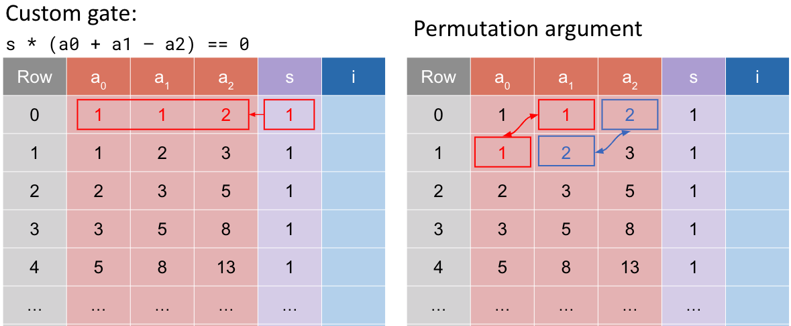
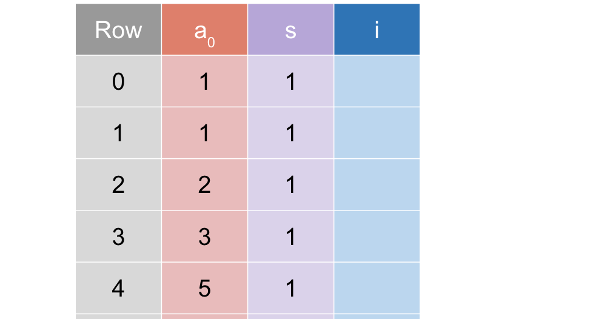

> author: [@Demian](https://github.com/Demian101)
> 
> references: https://learn.0xparc.org/materials/halo2

[TOC]
### Fibonacci Example 2

回顾 Example-1 里的 Table：



在 example-1 中有一些问题：
  - **重复单元格太多**，每次需要将 2 个单元格从上一行复制到下一行，效率不高
  - **更好的解决方案**：使用 Rotation 来访问多行是个更好的方案

如下图：


### Overview

在本例子中, 代码将更加紧凑和模块化, 以下是一些主要的区别 :

**Advice Columns**:    
- **ex 1** : 
	- 用了 3 个 advice columns：`col_a`, `col_b` 和 `col_c`，表的的第一行用来存储 Fibonacci 序列的连续的 3 个数
- **ex 2**: 
	- 仅使用了**一个** advice column，并依赖 Rotation（轮转, 即 $\color{red}row$）来访问连续的行，减少了各种复制

```rust
// example-1
pub fn configure(.., advice: [Column<Advice>; 3], ..) {
    let col_i = advice[ii];	
    meta.enable_equality(col_i); // 很多列需要声明 和 需要 enable...

    meta.create_gate("add", |meta| {
        let s = meta.query_selector(selector);
        let a = meta.query_advice(col_a, Rotation::cur()); //📢
        let b = meta.query_advice(col_b, Rotation::cur()); //📢
        let c = meta.query_advice(col_c, Rotation::cur()); //📢
    vec![s * (a + b - c)]
}

----------------------------------------

// example-2
pub fn configure(.., advice: Column<Advice>, ..) {
    let col_i = advice[ii];	
	meta.enable_equality(advice);
	meta.enable_equality(instance);

	// Gen Custom Gate:
	meta.create_gate("add", |meta| {
		//
		// advice | selector
		//   a    |   s
		//   b    |
		//   c    |
		//
		let s = meta.query_selector(selector);
		let a = meta.query_advice(advice, Rotation::cur());
		let b = meta.query_advice(advice, Rotation::next());
		let c = meta.query_advice(advice, Rotation(2));
		vec![s * (a + b - c)]
	});
```

 - `Rotation::cur()`  当前行 
 - `Rotation::next()`  下一行
 - `Rotation(2)`  再下一行

The Polynomial Identity: 
$$
S(x) \cdot \left( A(\textcolor{red}{x}) + A(\textcolor{red}{\omega x})  - A(\textcolor{red}{\omega^2 x}) \right) = 0
$$


**数据赋值**:
- **ex 1**: 初始的 Fibonacci 数 `a` 和 `b` 被赋值到两个不同的 advice columns，而他们的和则被赋值到第三个 column。
- **ex 2**: 所有的 Fibonacci 数都在同一个 advice column，但在不同的行 (thanks to rotation)

```rust
////  Example 2  ////
pub fn assign(
	&self,
	mut layouter: impl Layouter<F>,
	nrows: usize,  // 前 2 列赋值之后, 后面要搞的列数.. 
) -> Result<ACell<F>, Error> {
	layouter.assign_region(
		|| "entire fibonacci table",
		|mut region| {
			// 为前两行启用 selector, 这意味着我们将从 instance (public input) 列中复制 Fibo 序列的前 2 个数字
			self.config.selector.enable(&mut region, 0)?;
			self.config.selector.enable(&mut region, 1)?;
			
			// assign_advice_from_instance 方法，将 instance (public input) 列的前 2 个值
			//   (即 Fibonacci 序列的前两个数字）赋给 advice 列中的前 2 个单元格
			//   后面在 MockProver 中, 我们会传入 instance 作为 Public input
			let mut a_cell = region.assign_advice_from_instance(
				|| "1",
				self.config.instance,
				0,  // instance column's row 0
				self.config.advice,
				0, // 复制到当前的 region 的 row 0
			).map(ACell)?;

			let mut b_cell = region.assign_advice_from_instance(
				|| "1",
				self.config.instance,
				1, // instance column's row 1
				self.config.advice,
				1,  // 复制到当前的 region 的 row 1
			).map(ACell)?;

            /// .....
		},
	)
}
```

**生成的 Fibonacci 数**:    
- **ex 1**: 使用方法 `assign_row` 从前两个数生成下一个数。
- **ex 2**: 使用一个循环在整个 Fibonacci 表格中为所有的数赋值。

```rust
////  Example 2  ////
pub fn assign(..., nrows){

    /// .....

	// 赋值好了前 2 行(递归基), 其余的行就累加过去就好了
	for row in 2..nrows { // 对于最后两行, 不需要启用 Selector
		if row < nrows - 2 {
			self.config.selector.enable(&mut region, row)?;
		}

		let c_cell = region.assign_advice(
			|| "advice",
			self.config.advice,
			row,
			|| a_cell.0.value().copied() + b_cell.0.value(),
		).map(ACell)?;

		a_cell = b_cell; // let mut a_cell ...
		b_cell = c_cell;
	}

	Ok(b_cell) // return the last cell.
}
```

### Test 

如下 `instance` , 里面是 Public input 

```rust
#[test]
fn test_example2() {
	let k = 4;

	let a = Fp::from(1); // F[0]
	let b = Fp::from(1); // F[1]
	let out = Fp::from(55); // F[9]

	let circuit = MyCircuit(PhantomData);

	let mut public_input = vec![a, b, out];

	let prover = MockProver::run(k, &circuit, vec![public_input.clone()]).unwrap();
	prover.assert_satisfied();

	public_input[2] += Fp::one();
	let _prover = MockProver::run(k, &circuit, vec![public_input]).unwrap();
	// uncomment the following line and the assert will fail
	// _prover.assert_satisfied();
}
```

change k from `13` to `4`, the line will be smaller so now you are not calim about the main function
 - the MockProver will tell you constrains that $\textcolor{red}{failed}$
 - the `png` will tell you a  $\textcolor{blue}{missing}$  constraint `you have ignored` !

### Usage

```bash
cargo test -- --nocapture fibonacci::example1

# Draw
cargo test --release --all-features plot_fibo1
```

 - the white column is the instance column, 
 - the pink one is the advice and 
 - the purple one is the selector.
 - the green part shows the cells that have been assigned
	 - light green : selector not used.

### Reference :
 - [Jason Morton](https://github.com/jasonmorton/halo2-examples/blob/master/src/fibonacci/example1.rs)

### ------ 中文版本结束 ------
### Example 2

Recap Table in Example-1 ：


the problem we noticed like inside example-1  is that there are basically
 - **too many duplicate cells** , so every time you need copy two cells from previous row to next row , not efficient 
 - *better solution* :  Use rotation to access to the multiple rows.


在本例子中, 代码将更加紧凑和模块化, 以下是一些主要的区别 :

**Advice Columns**:    
- **ex 1** : 
	- 用了 3 个 advice columns：`col_a`, `col_b` 和 `col_c`，这 3 个 columns 的第一行用来存储 Fibonacci 序列的连续的 3 个数
	- `configure()` 在 3 个 advice columns 中为每一个需启用 `enable_equality`，并为每一个都建立了门约束。
- **ex 2**: 
	- 仅使用了**一个** advice column，并依赖 rotation（轮转, 即 $\color{red}row$）来访问连续的数, 减少了各种复制

```rust
// example-1
pub fn configure(
	.., advice: [Column<Advice>; 3], .. 
	{
    let col_i = advice[ii];	
    meta.enable_equality(col_i); // 很多列需要声明, 需要 enable...

    meta.create_gate("add", |meta| {
        let s = meta.query_selector(selector);
        let a = meta.query_advice(col_a, Rotation::cur()); //📢
        let b = meta.query_advice(col_b, Rotation::cur()); //📢
        let c = meta.query_advice(col_c, Rotation::cur()); //📢

}

----------------------------------------

// example-2
pub fn configure(  
	.., advice: Column<Advice>, .. 
	{
    meta.enable_equality(advice); //所有 advice 列只在此 enable once.

    meta.create_gate("add", |meta| {
        let s = meta.query_selector(selector);
        let a = meta.query_advice(advice, Rotation::cur()); //💡
        let b = meta.query_advice(advice, Rotation::next());//💡
        let c = meta.query_advice(advice, Rotation(2));}    //💡
```

 - `Rotation::cur()`  当前行 
 - `Rotation::next()`  下一行
 - `Rotation(2)`  再下一行

The Polynomial Identity : 
$$
S(x) \cdot \left( A(\textcolor{red}{x}) + A(\textcolor{red}{\omega x})  - A(\textcolor{red}{\omega^2 x}) \right) = 0
$$


2. **数据赋值**:
    - **ex 1**: 初始的 Fibonacci 数 `a` 和 `b` 被赋值到两个不同的 advice columns，而他们的和则被赋值到第三个 column。
    - **ex 2**: 所有的 Fibonacci 数都在同一个 advice column，但在不同的行 (thanks to rotation)

```rust
////  Example 2  ////
pub fn assign(..., nrows){
  layouter.assign_region("entire fibonacci table",
    |mut region| {
    // 为前两行启用 selector,这意味着我们将从 instance 列（可能是公共输入）
    // 中复制 Fibonacci 序列的前 2 个数字
    self.config.selector.enable(&mut region, 0)?;
    self.config.selector.enable(&mut region, 1)?;

    // assign_advice_from_instance 方法，将 instance 列的前两个值
	//   (即 Fibonacci 序列的前两个数字）赋给 advice 列中的前两个单元格
	//   后面在 MockProver 中, 我们会传入 instance 作为 Public input
	let mut a_cell = region.assign_advice_from_instance(
		|| "1",
		self.config.instance,
		0,
		self.config.advice,
		0,  // row
	)?;
	let mut b_cell = region.assign_advice_from_instance(
		|| "1",
		self.config.instance,
		1,  // 这里写 0 也不报错, 写 1/2/3 就会报错了..
		self.config.advice,
		1,  // row
    )?;
    
	// 赋值好了前 2 行(递归基) ,其余的行就累加过去就好了
	for row in 2..nrows {
		if row < nrows - 2 {
			self.config.selector.enable(&mut region, row)?;
		}

		let c_cell = region.assign_advice(
			|| "advice",
			self.config.advice,
			row,
			|| a_cell.value().copied() + b_cell.value(),
		)?;

		a_cell = b_cell;
		b_cell = c_cell;
	}

	Ok(b_cell)	
}
```


3. **生成的 Fibonacci 数**:    
    - **Version 1**: 使用方法 `assign_row` 从前两个数生成下一个数。
    - **Version 2**: 使用一个循环在整个 Fibonacci 表格中为所有的数赋值。

```rust
////  Example 2  ////
pub fn assign(..., nrows){
	// 赋值好了前 2 行(递归基) ,其余的行就累加过去就好了
	for row in 2..nrows {
		if row < nrows - 2 {
			self.config.selector.enable(&mut region, row)?;
		}

		let c_cell = region.assign_advice(
			|| "advice",
			self.config.advice,
			row,
			|| a_cell.value().copied() + b_cell.value(),
		)?;

		a_cell = b_cell;
		b_cell = c_cell;
	}

	Ok(b_cell)
}
```

如下 `instance` , 里面是 Public input 

```rust
#[test]
fn test_example2() {
	let k = 4;

	let a = Fp::from(1); // F[0]
	let b = Fp::from(1); // F[1]
	let out = Fp::from(55); // F[9]

	let circuit = MyCircuit(PhantomData);

	let mut public_input = vec![a, b, out];

	let prover = MockProver::run(k, &circuit, vec![public_input.clone()]).unwrap();
	prover.assert_satisfied();

	public_input[2] += Fp::one();
	let _prover = MockProver::run(k, &circuit, vec![public_input]).unwrap();
	// uncomment the following line and the assert will fail
	// _prover.assert_satisfied();
}
```

#### print

 - the white column is the instance column, 
 - the pink one is the advice and 
 - the purple one is the selector.
 - the green part shows the cells that have been assigned
	 - light green : selector not used.

```bash
cargo test --all-features -- --nocapture print
```

change k from 13 to 4, the line will be more small so now you are not calim about the main function .

 - the MockProver will tell you constrains that $\textcolor{red}{failed}$ ,
 - the `png` will tell you a  $\textcolor{blue}{missing}$  constraint `you have ignored` !


#### Row & Column in Region 

Compared  `example-1 ` with `example-2`  : 

```rust
meta.create_gate("add", |meta| {
	// col_a | col_b | col_c | selector
	//   a      b        c       s
	let s = meta.query_selector(selector);
	let a = meta.query_advice(col_a, Rotation::cur());
	let b = meta.query_advice(col_b, Rotation::cur());
	let c = meta.query_advice(col_c, Rotation::cur());
	vec![s * (a + b - c)]

---------------------------------------------

meta.create_gate("add", |meta| {
	// advice | selector
	//   a    |   s
	//   b    |
	//   c    |
	let s = meta.query_selector(selector);
	let a = meta.query_advice(advice, Rotation::cur());
	let b = meta.query_advice(advice, Rotation::next());
	let c = meta.query_advice(advice, Rotation(2));
	vec![s * (a + b - c)] 
```

We see : 
 - `col_a / col_b / col_c` represent different  $\color{red}columns$
 - `Rotation::cur() / Rotation::next() / Rotation::prev() / Rotation(2)`  represent different $\color{red}rows$

```bash
cargo test -- --nocapture fibonacci::example2
```

### References :
 - [Jason Morton halo2 codes](https://github.com/jasonmorton/halo2-examples/blob/master/src/fibonacci/example1.rs)
 - [ZCash halo2 books](https://zcash.github.io/halo2/user/simple-example.html#define-a-chip-implementation)
 - [trapdoor-tech halo2 book](https://trapdoor-tech.github.io/halo2-book-chinese/user/simple-example.html)
 - [icemelon/HaiCheng Shen](https://github.com/icemelon/halo2-examples/blob/master/src/fibonacci/example3.rs)
 - [0xPARC halo2](https://learn.0xparc.org/)