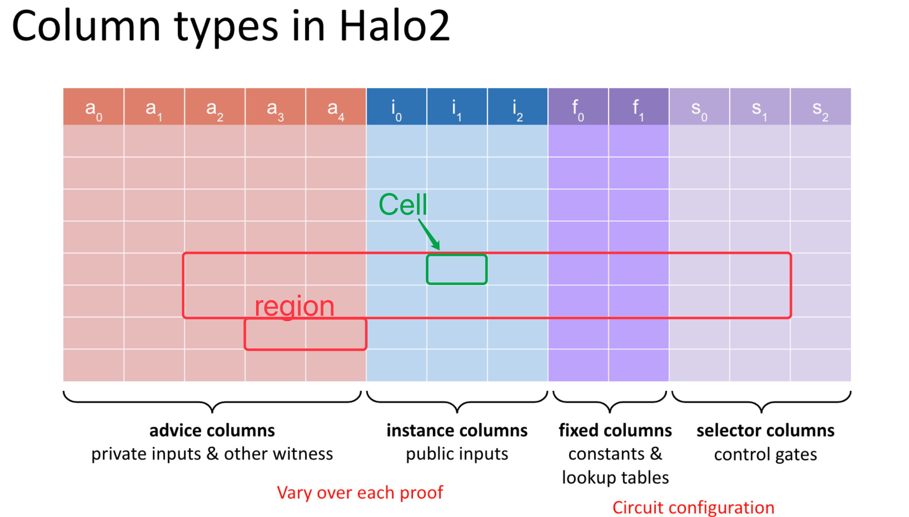
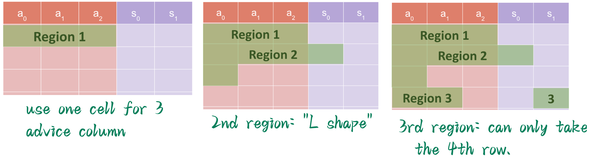
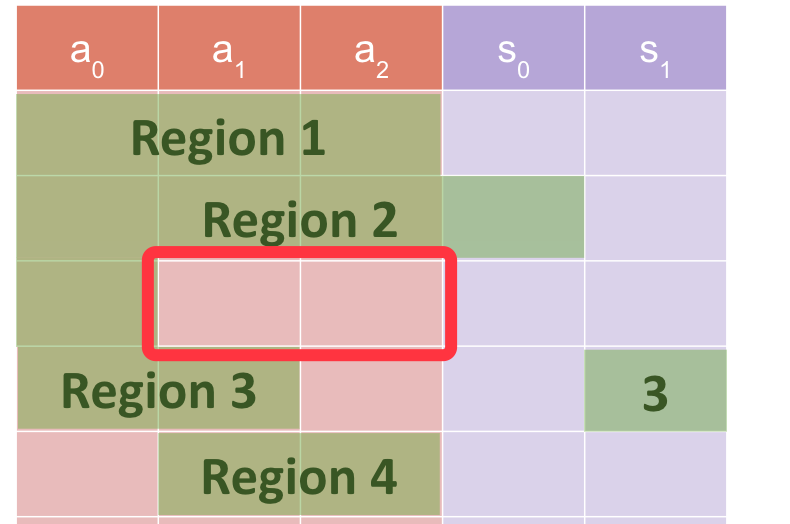

> - 作者:  [@Po](https://github.com/dajuguan) / [@Demian](https://github.com/demian101)
> - 时间: 2023-10-18
> - 校对:  [@Po](https://github.com/dajuguan) / [@Demian](https://github.com/demian101)

[TOC]

在前面的 prerequisite 课程中，我们学习了 PLONK 协议及其 lookup table 优化，在下面的章节中，我们将会以 [halo2](https://github.com/zcash/halo2) 这个 Rust library 为基础，详细讲解如何应用 PLONK 及其进阶协议写出支持现代零知识证明功能的电路代码！

### halo2 电路结构

我们知道，在 [Vanilla PLONK 协议](https://learn.z2o-k7e.world/plonk-intro-cn/plonk-intro.html) 中，门约束系统相对固定和局限，表现力并不强：
$$f(x)=Q_L(x) \cdot a(x)+Q_R(x)\cdot b(x)+Q_O(x)\cdot c(x)+Q_M(x)\cdot a(x) b(x)+Q_C(x)$$
为了支持更复杂和更高阶的运算，halo2 中引入了 `custom gate` 和 `lookup table`，这使得约束系统中的约束并不限定在某一行上的变量，`custom gate` 可以任意指定约束需要的计算。 [^1]

如下图，可以清晰地看到 PLONK 每个版本的演进，从而支撑了 halo 2 对 custom constraints 和 lookup table 的引进：


在一般的电路代码结构中，都会有输出、输出、约束等必要构件，在 halo2 中也不列外。只不过，不像 R1CS 那般每个约束都严丝合缝地写成 $c === a * b$ 的格式，halo2 中的约束和输出输入可以形象地”拉平“ 成一张表 (table)。

如下图可以看到：
- 电路表整体由单元（`cell`）、列（`Column`）和行（`Row`）组成，
- `cell`、`row` 和 `colum` 的任意组合可以构成 `region`
- 列又可以分为三种类型：`advice`，`instance` 和 `selector`，
	- 其中 `advice/instance` columns 对每个具体的 proof 过程可能都不一样
	- `fixed` 和 `selector` columns 在电路 preprocessed 阶段生成，同个电路程序面对不同的用户是相同的，可以视为是电路结构固定的一部分

下面，我们会分别详细讲解各部分组件的用途及使用方法 [^2]



#### Columns

我们可以将电路的**输入**和**输出**概念化为给定有限域 $\mathbb{F}$ 上 $m$ 列 $n$ 行的矩阵

下面我们来详细讲解各个 columns 的含义和用途：

**`instance columns`** ：包含了 $Prover/Verifier$ 之间共享的输入，通常用于公共输入 (public inputs)
- 例如 SHA256 的结果
- Merkle Tree 的根

**`advice columns`**：包含了 `private values` & intermediate values **witnessed** by the $Prover$

**`fixed columns`** ：包含在 key generation 阶段设置的 preprocessed values，可以视为是电路结构固定的一部分
 - 如电路中 hardcoded constant 
 - 查找表 Lookup table column

**`selector columns`** ：即选择器，同样是在 key generation 阶段设置的 preprocessed values

> 有些教程中也会直接将  selector columns 放入 fixed columns 中，这完全正确！因为 Selector 就是特殊的 fixed columns
> 
> Tips: 同一行可以支持若干种不同的约束, 比如三元三次, 或者三元二次, 选择子就保证了：比如有  3 个 custom gate, 可以只满足其中一个就 OK , 或者满足其中的 2 个，非常灵活

<!--
we conceptualise the circuit as a matrix of m columns and n rows,  over a given finite field $\mathbb{F}$ 
 - `instance columns` contain inputs shared between prover/verifier , generally used for public inputs
	 - e.g.  the res of SHA256
	 - a root of a Merkle Tree. 
 - `advice columns` contain private values witnessed by the prover
 - `fixed columns` contain preprocessed values set at key generation

fixed columns contain  preprocessed values set at key generation
-->
#### Region

如果是第一次看视频或者读相关文档，你可能会发现 Region 是一个略显抽象的概念，不过没关系，向下读！

在 halo2 中我们不会直接约束一整个电路的行和列，而是将整个电路划分为由相邻的行和列组成的 region，在 region 中可以采用相对偏移(relative offsets)的方式**访问 Cell**。 在一个 region 中，我们只关心 cells 之间的**相对关系**

如果两个约束没有关系，或者您也不关心两个 "block" 之间如何相互作用的话，那么就应该将它们分别定义在 2 个不同的 regions 中，如此就可以将控制权交给 layouter，让 layouter 去优化整体电路 region 分布的布局（layouter 后面会讲解）。

因此，并不推荐将整个电路的逻辑都塞进同一个庞大的 region，您应该尝试将其尽可能分解为逻辑清晰，结构简单的 regions components。  [^4] 


<!--
 - heuristically you can think of a region as like a self-contained block of flick and within this block you are concerned with relative offsets and you need certain cells to be placed relative to other cells in a specific way. whereas(相反) if you do not care about how two blocks interact with each other then you should define them in separate regions and the reason why this is better is you can hand some control to the `layouter` to optimize the layout of your regions
 - so as opposed to like using a one region for your whole circuit,  you should try and break it up as far as possible into self-contained regions,  unless your whole circuit is literally the same gate repeating over and over.  in that case,  you just need one region.
	 - 
	 -->

<!--
电路构建往往是相对于一个 Region。同一个电路模块，可以在不同的 Region中“复制”。

"regions" 是 `gates` 和全局电路 `layouter` 之间的界限：

- 一个保留相对偏移的分配块：容易理解 gates 在区域内如何应用
- 不受其他区域中的偏移影响：可以自由地重新排列以优化全局空间使用
- 每个区域都是完全独立的，如果你试图编写跨越两个区域之间的界限的某些约束，你会很快发现你遇到了问题。[^3]

"regions" are the boundary between `gates` and the global circuit `layouter` : 
 - a block of assignments preserving relative offsets: easy to reason about how gates apply within the region
 - not affected by offsets in other regions: can be freely rearranged to optimise global space usage
 - each region is completely independent of other regions, and if you were to try to write some constraint that crossed the boundary between two regions you would quickly find that you run into problems. [^3] 
-->

#### Layouter

看完了 region 的定义和讲解后，是不是还是有点不得要领？下面我们会介绍如何使用 Layouter 去布局 region，看完后也许你会对 region 有更进一步的认识。

layouter 作用在 assignment （电路赋值）期间，即当你用 Witness 去填充整个 Circuit table 时使用，每次都会 assign 赋值一个 region。实际操作中，不会一下子填满整个 table。 layouter 会取一个 Region 作为 input，将对应的值 assign 到该 Region。

<!-- 
The layouter will be used during the assignment, namely when you fill up a table with the witness. Each time you will fill up a region. You won't fill the entire table at once.  layouter takes a region as input and assign values to that region.
-->

Layouter 规则： **Region 不需要与 custom gate 具有相同的形状，但 Region 必须覆盖所有相关的 custom gate**


比如上面的例子，在最上方是一个 custom gate 的 shape ：

左边的浅绿色矩形 Region 是 Valid Region ✅ :
- 在 Region 中做的赋值 sssignments 已经完全覆盖了左边的 `Custom Gate` 所需要的
- 假设在 selector col 中，上面的 $S_0 = 1$ , 下面的  $S_0 = 0$ ，则说明用到了左边的 3 个 Cell 

而右边的浅绿色矩形 Region 是 invalid Region ❌: 
- 它没有覆盖与 `Custom Gate` 相关的所有单元格。 并且它并没有 assign `Custom Gate` 所需的所有单元格
- 如果您打开了 selector，Region 应该覆盖由 `Custom Gate` 控制的所有单元格。

<!--
1. **A region doesn’t need to have the same shape as custom gate,  but must cover all related custom gates.**
[pic]
 - it didn't cover all of the cells related to the `Custom Gate`.  and it doesn't assign all the cells you need for that `Custom Gate`
 - if you turn on the selector, you should cover all of cells controlled by this `Custom Gate`.
-->

目前在 halo2 中有 2 套 Layouter 的实现：
1. **SimpleFloorPlanner** (重点关注)
2. TwopassPlanner ?  V1/V1Plan ？

<!--
2 layouters in halo2:
1. **SimpleFloorPlanner**
2. TwopassPlanner ?  V1/V1Plan ？
-->

##### SimpleFloorPlanner
- 这是一个单通道布局器 (single-pass layouter)
- 它为该区域中使用的每一列找到第一个空行并获取最大值。
- 它尝试尽可能多地打包 (pack) 所有的 regions 以使用**更少的行**

<!--
- It is a single-pass layouter. 
- It finds the first empty row, for each column used in the region and takes a maximum.
- trying to pack all our region as much as possible to use the **fewer rows** 
-->


- Region `1` : use one cell for 3 advice column
- Region `2` :  "L shape"
- Region `3` :  "L shape"

以下几个 Q&A 可以帮你进一步理解 region：
- Q：区域“1”如何不包含选择器？
- A：你可以认为 region 1 是你想要初始化的一些 **private input**，它不涉及任何检查 (selector)
- Q：如下图，为什么 region 4 不向上填充到红色区域？
- A：对于 Region 4 , 它本可以填到红色区域里面, 但是这不是咱们 SimpleFloorPlanner 能做的事 ~ （@Dr. Shen haicheng）



<!-- 
Q: how does region `1` not include a selector ?
A: you can think of region `1` is some **private input** you want to initialize, it doesn't involve any check (Selectors).
-->


#### Diagrams

diagrams 是一种非常直观的可视化方式，能让你看到电路中各种 columns 的状态和电路整体布局，可以帮我们优化电路、查找 bug 等

halo2 提供了适用的 API 来打印 diagram & 在本地生成图片，一般可以通过如下命令执行：

```rust
#[cfg(test)]
mod tests {
  use halo2_proofs::{dev::MockProver, pasta::Fp};
  use super::*;

  // ...
  #[cfg(feature = "dev-graph")]
  #[test]
  fn plot_chap_1_circuit(){
      // Instantiate the circuit with the private inputs.
      let circuit = MyCircuit::<Fp>::default();
      // Create the area you want to draw on.
      // Use SVGBackend if you want to render to .svg instead.
      use plotters::prelude::*;
      let root = BitMapBackend::new("./images/chap_1_simple.png", (1024, 768)).into_drawing_area();
      root.fill(&WHITE).unwrap();
      let root = root
          .titled("Simple Circuit without chip", ("sans-serif", 60))
          .unwrap();
      halo2_proofs::dev::CircuitLayout::default()
          // You can optionally render only a section of the circuit.
          // .view_width(0..2)
          // .view_height(0..16)
          // You can hide labels, which can be useful with smaller areas.
          .show_labels(true)
          // Render the circuit onto your area!
          // The first argument is the size parameter for the circuit.
          .render(5, &circuit, &root)
          .unwrap();
  }
}
```

所需的 `Cargo.toml` 配置

```bash
[features]
dev-graph = ["halo2_proofs/dev-graph", "plotters", "plotters/bitmap_backend","plotters/bitmap_encoder"]

plotters = { version = "0.3.0", default-features = true, optional = true }
```

常用打印命令：
```bash

```


如上图，在一个电路布局图里：
 - advice columns(witness) 是  $\textcolor{pink}{pink}$  (粉色的)
 - the $\textcolor{lime}{light \ green}$ cells 说明在电路定义时用到了，是 Region 的一部分
 - the $\textcolor{green}{drak \ green}$ cells 说明被赋值了
 - the $\textcolor{purple}{purple}$ regions 是 `fixed` columns (preprocessed value)
	 -  $\textcolor{violet}{light \ \ purple}$ : fixed column that is binary (0/1) we call these `selector` like in PLONK paper. 
	 -  $\textcolor{purple}{light \ \ purple}$ : constant values，比如 5

从电路布局图 (Circuit layout diagram) 中单通道布局器 vs 双通道布局器的对比中，我们可以观察到一些有意思的结论:
- 双通道布局器做了更多 region 布局方面的优化，将电路行数由 $2^{12}$ 优化到了 $2^{11}$ ，不过列数也有所增加
- 一般而言，我们希望减少电路使用的空间 (space) ，因为行数越多，fft 操作越多
- 同时，因为 $Prover$ 需要 commit 每个列。(make a `commitment` for each column.)
- 所以，更多的列数，意味着更多的 `commitments`，也就意味着更大的 `proof size`
- 总而言之，这里有一个对行数和列数的权衡：列数越多，proof size 越大；行数越多 -> fft 越多 -> Prove 过程就越慢

> 为什么需要 commit  column?   类似 PLONK 论文中提到的，电路结构在 preprocess 阶段已经确定，Prover 分别针对每列进行 commitment，可以有效防止 Prover 作弊，并将后续 commitment batch 起来
>
> 为什么 rows 需要 fft ? 在 PLONK 中使用了多项式承诺，可以将证明生成中涉及到大量的多项式求值、以及计算商多项式等，这些都需要使用 fft 来加速运算 (FFT提供了一个高效的方法来转换多项式系数形式和它们的点值表示)。从而验证该行的多项式约束（custom gate）是否得到满足


 <!--
 - the advice columns(witness) are still $\textcolor{pink}{pink}$
 - the $\textcolor{green}{drak \ green}$ boxes just means that they have been assigned
 - the $\textcolor{purple}{purple}$ regions are `fixed` columns (preprocessed value)
	 - $\textcolor{violet}{light \ \ purple}$ : fixed column that is binary (0/1) we call these `selector` like in PLONK paper.
	 - $\textcolor{purple}{light \ \ purple}$ : non-binary so that you can witness constant values in them. for example like a fix column is **five** and you wanna your gate does like **five** times something, and we use these fixed columns.  [^5]

Throughout the diagram, what are we trying to optimize?
 - we're trying to reduce the space being used .
 - Casue we do a lot of FFTs on the rows.

What does columns do ? 
 - each column, the prover needs to make a `commitment` to the column.
 - so, more columns, more commitments ;  more commitments, larger proof.

-->


## Overview

Prover 宣称：它拥有满足 $a^2 * b^2 * constant = out$  约束关系，同时结果公开为 $out$ 的一组 $witness$

现在 Prover 的目的是，写出一个 halo2 电路，能产生可验证其 statement 的一组 proof，让大家信服他的 statement。


考虑如下电路:

```bash
private inputs:  a, b, constant
public inputs :  out
constraints   :  a^2 * b^2 * constant = out
```
从电路的角度，只使用`乘法门`和乘法`选择器`，上述约束可以算数化为:

| instance | advice_0 | advice_1 | selector_mul |
| -------- | -------- | -------- | ------------ |
| *out*    | a        |          |              |
|          | b        |          |              |
|          | constant |          |              |
|          | ab       | b        | 1            |
|          | ab       |          | 0            |
|          | ab       | ab       | 1            |
|          | absq     |          | 0            |
|          | absq     | const    | 1            |
|          | *out*    |          | 0            |

> absq 即 ab_square


我们的目的则是：

1. 利用 Halo2 定义好上述约束 (gates 和 equality constrains)，
2. 并使用其 private value 填好上述表格 (即 assign witness)。


使用 Halo2 编写电路，需要为 `struct Circuit` 实现三个 Trait: [^1]

- `without_witnesses`: 创建默认无需 witness 的 Circuit 实例
- `configure`: 需要自定义:
    1. 电路配置: 
       1. advice cols (即 witness，包含 private inputs 和 trace), 
       2. instance cols (Public Inputs)
       3. selector (电路选择器)
    2. custom gate 约束
- `synthesize`: 需要根据上述表格实现填充 witness 的逻辑，即按照验证程序的逻辑正确写入将数据写入表格的每个 Cell:
    1. 填充以 Region 为基本单位(多行+多列构成的矩形)，可以在 region 中以相对引用的方式引用其他Row
    2. 有两种填充方式: copy_advice (还会产生 equality 约束) + assign_advice(不会产生 equality 约束)

一旦定义好上述 3 个 Trait，Halo2 便可以在电路实例化后调用相关 API **自动运行**(不需要手动触发上述函数)上述逻辑来填充witness 和生成 proof。


## 创建电路和 Config [^2]

在知道了电路构建需要的模块上述电路一共需要四列: 

- 2 列 witness(advice) 用来填充上述表格的`a0`和`a1`列，
  - 其中 3 个 Private inputs: `a`, `b` 和 `constant` 填入 `a0` 列的前三行。
- 1 列 instance (填入公共输出 out), 
- 1 列乘法门选择器(s_mul); 

```rust
#[derive(Debug, Clone)]
struct CircuitConfig {
    advice: [Column<Advice>;2],
    instance: Column<Instance>,
    s_mul: Selector,
}

#[derive(Default)]
struct MyCircuit<F:Field> {
    constant: F,
    a: Value<F>,
    b: Value<F>
}
```


## 实现 Circuit 前两个 trait

```rust
impl <F:Field> Circuit<F> for MyCircuit<F> {
  fn without_witnesses(&self) -> Self {
        Self::default()
    }

    fn configure(meta: &mut ConstraintSystem<F>) -> Self::Config {
        let advice = [meta.advice_column(),meta.advice_column()];
        let instance = meta.instance_column();
        let constant = meta.fixed_column();

        meta.enable_equality(instance);
        meta.enable_constant(constant);
        for c in &advice {
            meta.enable_equality(*c);
        }
        let s_mul = meta.selector();
        /* Gate design:
            | a0 | a1 | s_mul|
            |----|----|------|
            |lhs |rhs |s_mul |
            |out |    |      |  
        */
        meta.create_gate("mul_gate", |meta| {
            let lhs = meta.query_advice(advice[0], Rotation::cur());
            let rhs = meta.query_advice(advice[1], Rotation::cur());
            let out = meta.query_advice(advice[0], Rotation::next());
            let s_mul = meta.query_selector(s_mul);
            vec![s_mul * (lhs*rhs - out)]
        });

        CircuitConfig {
            advice,
            instance,
            s_mul
        }
    }
}
```
需要注意的是 Halo2 中为了优化需要通过 enable_equality 明确指定哪些列设置 equality 约束。同时由于要保证 gate 对每一行的 witness 都满足约束，所以只能通过 query_advice 来获取每个门`虚拟的`输入和输出(实际的值在 synthesize 时填入)以生成多项式约束，即保证 gate 返回的 vec 为 0。


## 实现 witness 填充

按照表格,一步步填充 witness：
1. load private inputs `a`, `b` 和 `constant`
2. 分别计算三个乘法的输入输出值 (`ab`, `absq`, `out`)，并通过 `assign_advice` 和 `copy_advice` 这两个 API 填充 Cell 
3. 通过 `constrain_instance` API, 约束 out 所在的 Cell 和 instance 列的第一个 cell 相等
```rust
fn load_private<F:Field>( 
    config: &CircuitConfig,
    mut layouter: impl Layouter<F>,
    value: Value<F>) -> Result<Number<F>, Error> {
    layouter.assign_region(
        || "load private", 
        |mut region| {
            region.assign_advice(
                || "private input", 
                config.advice[0], 
                0, 
                || value
            ).map(Number)
    })
}

fn load_constant<F:Field>( 
    config: &CircuitConfig,
    mut layouter: impl Layouter<F>,
    constant: F
) -> Result<Number<F>, Error> {
    layouter.assign_region(
        || "load private", 
    |mut region| {
        region.assign_advice_from_constant(
            || "private input", 
            config.advice[0], 
            0, 
            constant
        ).map(Number)
    })
}

fn mul<F:Field>(
    config: &CircuitConfig,
    mut layouter: impl Layouter<F>,
    a: Number<F>,
    b: Number<F>,
) -> Result<Number<F>, Error> {
    layouter.assign_region(
        || "mul", 
    |mut region| {
        config.s_mul.enable(&mut region, 0)?;
        a.0.copy_advice(|| "lhs", &mut region, config.advice[0], 0)?;
        b.0.copy_advice(|| "rhs", &mut region, config.advice[1], 0)?;

        let value = a.0.value().copied() * b.0.value().copied();
        region.assign_advice(|| "out=lhs*rhs", config.advice[0], 1, || value)
        .map(Number)
    })
}

impl <F:Field> Circuit<F> for MyCircuit<F> {
    //...
    fn synthesize(&self, config: Self::Config, mut layouter: impl Layouter<F>) -> Result<(), Error> {
        let a = load_private(&config,layouter.namespace(|| "load a"), self.a)?;
        let b = load_private(&config,layouter.namespace(|| "load b"), self.b)?;
        let constant = load_constant(&config,layouter.namespace(|| "load constant"), self.constant)?;


        let ab = mul(&config,layouter.namespace(|| "a*b"), a, b)?;
        let absq = mul(&config,layouter.namespace(|| "ab*ab"), ab.clone(), ab)?;
        let c = mul(&config, layouter.namespace(|| "absq*constant"), absq, constant)?;

        //expose public
        layouter.namespace(|| "expose c").constrain_instance(c.0.cell(), config.instance, 0)
    }
}
```


## Mock prove

最后实例化电路，并调用相应的Mock Prover来验证:

```rust
#[cfg(test)]
mod tests {
    use halo2_proofs::{dev::MockProver, pasta::Fp};
    use super::*;
    #[test]
    fn test_simple() {
        // ANCHOR: test-circuit
        // The number of rows in our circuit cannot exceed 2^k. Since our example
        // circuit is very small, we can pick a very small value here.
        let k = 5;
    
        // Prepare the private and public inputs to the circuit!
        let constant = Fp::from(2);
        let a = Fp::from(2);
        let b = Fp::from(3);
        let c = constant * a.square() * b.square();
        println!("c=:{:?}",c);
    
        // Instantiate the circuit with the private inputs.
        let circuit = MyCircuit {
            constant,
            a: Value::known(a),
            b: Value::known(b),
        };
    
        // Arrange the public input. We expose the multiplication result in row 0
        // of the instance column, so we position it there in our public inputs.
        let mut public_inputs = vec![c];
    
        // Given the correct public input, our circuit will verify.
        let prover = MockProver::run(k, &circuit, vec![public_inputs.clone()]).unwrap();
        assert_eq!(prover.verify(), Ok(()));
    
        // If we try some other public input, the proof will fail!
        public_inputs[0] += Fp::one();
        let prover = MockProver::run(k, &circuit, vec![public_inputs]).unwrap();
        assert!(prover.verify().is_err());
        println!("simple success!")
        // ANCHOR_END: test-circuit
    }
}
```

其中:`MockerProver.run`会分别调用实例化电路的 `configure` 和 `synthesis` 函数以生成电路约束和填充 witness 列(详见 Prover 的[assign_advice函数](https://github.com/zcash/halo2/blob/f9838c127ec9c14f6f323e0cfdc0c1392594d37f/halo2_proofs/src/plonk/prover.rs#L135))。
`prover.verify()` 则会检查所有的门、lookup、permuation等生成的约束是否满足。

运行`cargo run test_chap_1_simple`, 测试成功。


## 检查 Circuit 布局

同时，还可以利用 Halo2 的 tool 输出电路的整个布局图，advice 列均为红色，instance 列为浅蓝色，selector 列为深蓝色；不同的 region 之间由黑色线分隔，填充过值的 advice 和 instance 列的单元格由绿色和浅绿色组成，填充过值的instance单元格则为深蓝色。可根据此图检查电路是否欠约束(under constraint)，如果欠约束会明显发现对应的单元格**不是绿色**。
```rust

    #[cfg(feature = "dev-graph")]
    #[test]
    fn plot_circuit(){
        // Instantiate the circuit with the private inputs.
        let circuit = MyCircuit::<Fp>::default();
        // Create the area you want to draw on.
        // Use SVGBackend if you want to render to .svg instead.
        use plotters::prelude::*;
        let root = BitMapBackend::new("layout.png", (1024, 768)).into_drawing_area();
        root.fill(&WHITE).unwrap();
        let root = root
            .titled("Simple Circuit without chip", ("sans-serif", 60))
            .unwrap();

        halo2_proofs::dev::CircuitLayout::default()
            // You can optionally render only a section of the circuit.
            // .view_width(0..2)
            // .view_height(0..16)
            // You can hide labels, which can be useful with smaller areas.
            .show_labels(true)
            // Render the circuit onto your area!
            // The first argument is the size parameter for the circuit.
            .render(5, &circuit, &root)
            .unwrap();
    }
```

运行`cargo test plot_chap_1_circuit  --features dev-graph`，可以输出电路结构图。

从下图可以看出，整个电路一共9行4列，与表格设计一致。


[^1]: `./halo2_proofs::plonk::Circuit`
[^2]: 完整代码在 [halo2-tutorials: chap-1](https://github.com/zkp-co-learning/halo2-step-by-step/blob/main/halo2-tutorials/src/chap_1/simple.rs) 
