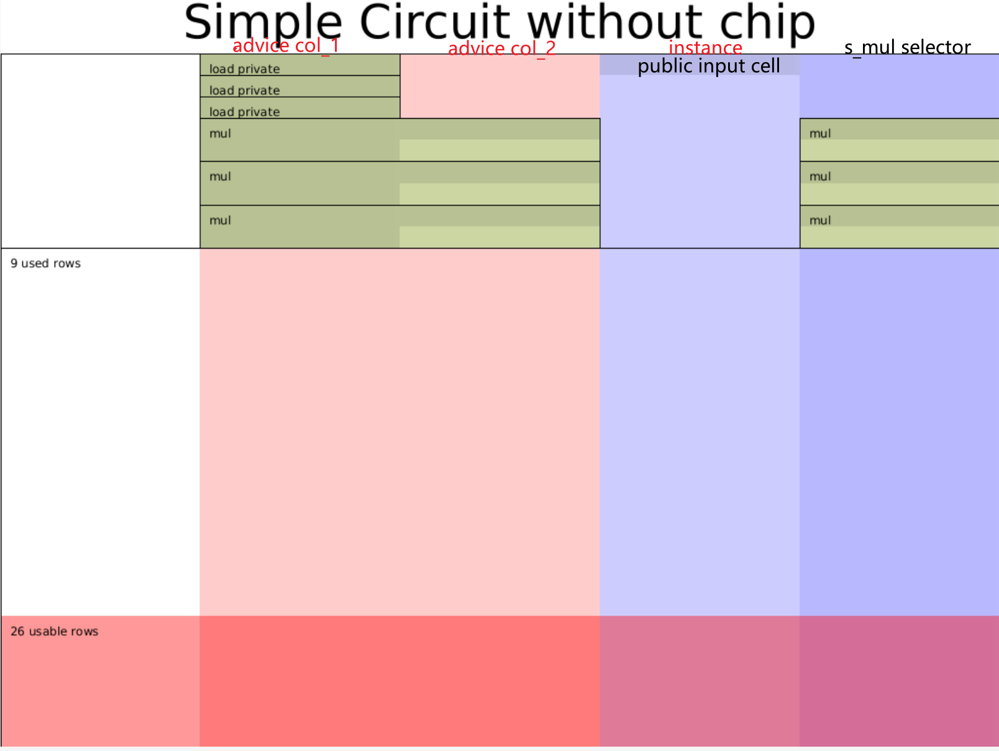

> - 作者:  [@Po@Ethstorage.io](https://github.com/dajuguan) / [@Demian](https://github.com/demian101)
> - 时间: 2023-10-18
> - 校对:  [@Po@Ethstorage.io](https://github.com/dajuguan) / [@Demian](https://github.com/demian101)

[TOC]

# Halo2 API 简介

## Overview

上节我们介绍了Halo2的核心概念，本节则以 $a^2 * b^2 * c = out$ 这个电路为例，来说明如何使用 Halo2 API来写电路。
该电路的各个参数说明如下：

```bash
private inputs:  a, b, c
public inputs :  out
constraints   :  a^2 * b^2 * c = out
```
我们的目的是写一个电路，让Prover证明对于公共输入`out`,他知道三个秘密输入`a, b, c`满足 $a^2 * b^2 * c = out$ 这个约束。
从电路的角度，只使用 `乘法门` 和 `乘法选择器`，上述约束可以算数化为:

| instance | advice_0 | advice_1 | selector_mul |
| -------- | -------- | -------- | ------------ |
| *out*    | a        |          |              |
|          | b        |          |              |
|          | c        |          |              |
|          | a        | b        | 1            |
|          | ab       |          | 0            |
|          | ab       | ab       | 1            |
|          | absq     |          | 0            |
|          | absq     | c        | 1            |
|          | *out*    |          | 0            |

> 看到这里可能会产生疑问，这个 table 是如何填写出来的呢？其实，这个填写规则是与门约束一一对应的，而门约束可以很随意设计，所以关键是得确定
> - 有几种门约束
> - 每种门约束涉及哪几个单元格及多项式约束公式
> absq 即 ab 的平方。

我们的目的则是：

1. 利用 Halo2 定义好上述约束 (gates 和 equality constrains)，
2. 并使用其 private value 填好上述表格 (即 assign witness)。

使用 Halo2 编写电路，需要为 `struct MyCircuit` 实现 `halo2_proofs::plonk::Circuit` trait, 其中包括以下 3 个关联方法: [^1]

- `without_witnesses`: 创建默认无需 witness 的 Circuit 实例
- `configure`: 需要自定义:
    1. 电路配置: 
       1. advice cols (即 witness，包含 private inputs 和 trace), 
       2. instance cols (Public Inputs)
       3. selector (电路选择器)
    2. custom gate 约束
- `synthesize`: 需要根据上述表格实现填充 witness 的逻辑，即按照验证程序的逻辑正确写入将数据写入表格的每个 Cell:
    1. 填充以 Region 为基本单位(多行+多列构成的矩形)，可以在 region 中以相对引用的方式引用其他Row
    2. 有两种填充方式: copy_advice (还会产生 equality 约束) + assign_advice(不会产生 equality 约束)

一旦定义好上述 3 个关联方法，Halo2 便可以在电路实例化后调用相关 API **自动运行**(不需要手动触发上述函数)上述逻辑来填充 witness 和生成 proof。

## 创建电路和 Config 

根据电路构建所需模块，首先需要确定电路配置，上述电路一共需要四列: [^2]

- 2 列 witness(advice) 用来填充上述表格的`a0`和`a1`列，
  - 其中 3 个 Private inputs: `a`, `b` 和 `c` 填入 `a0` 列的前三行。
- 1 列 instance (填入公共输出 out), 
- 1 列乘法门选择器(s_mul); 

```rust
#[derive(Debug, Clone)]
struct CircuitConfig {
    advice: [Column<Advice>;2],
    instance: Column<Instance>,
    s_mul: Selector,
}

#[derive(Default)]
struct MyCircuit<F:Field> {
    c: F,
    a: Value<F>,
    b: Value<F>
}
```

## 实现 Circuit trait 的前两个关联方法

根据电路配置以及我们只需要乘法门，来实现`configure` 方法：

```rust
impl <F:Field> Circuit<F> for MyCircuit<F> {
  fn without_witnesses(&self) -> Self {
        Self::default()
    }

    fn configure(meta: &mut ConstraintSystem<F>) -> Self::Config {
        let advice = [meta.advice_column(),meta.advice_column()];
        let instance = meta.instance_column();

        meta.enable_equality(instance);
        for c in &advice {
            meta.enable_equality(*c);
        }
        let s_mul = meta.selector();
        /* Gate design:
            | a0 | a1 | s_mul|
            |----|----|------|
            |lhs |rhs |s_mul |
            |out |    |      |  
        */
        meta.create_gate("mul_gate", |meta| {
            let lhs = meta.query_advice(advice[0], Rotation::cur());
            let rhs = meta.query_advice(advice[1], Rotation::cur());
            let out = meta.query_advice(advice[0], Rotation::next());
            let s_mul = meta.query_selector(s_mul);
            vec![s_mul * (lhs*rhs - out)]
        });

        CircuitConfig {
            advice,
            instance,
            s_mul
        }
    }
}
```
需要注意的是 Halo2 中为了优化需要通过 enable_equality 明确指定哪些列设置 equality 约束。同时由于要保证 gate 对每一行的 witness 都满足约束，所以只能通过 query_advice 来获取每个门`虚拟的`输入和输出(实际的值在 synthesize 时填入)以生成多项式约束，即保证 gate 返回的 vec 为 0。

## 实现 witness 填充

按照表格,一步步填充 witness：
1. load private inputs `a`, `b` 和 `c`
2. 分别计算三个乘法的输入输出值 (`ab`, `absq`, `out`)，并通过 `assign_advice` 和 `copy_advice` 这两个 API 填充 Cell 
3. 通过 `constrain_instance` API, 约束 out 所在的 Cell 和 instance 列的第一个 cell 相等
```rust
fn load_private<F:Field>( 
    config: &CircuitConfig,
    mut layouter: impl Layouter<F>,
    value: Value<F>) -> Result<Number<F>, Error> {
    layouter.assign_region(
        || "load private", 
        |mut region| {
            region.assign_advice(
                || "private input", 
                config.advice[0], 
                0, 
                || value
            ).map(Number)
    })
}

fn load_constant<F:Field>( 
    config: &CircuitConfig,
    mut layouter: impl Layouter<F>,
    c: F
) -> Result<Number<F>, Error> {
    layouter.assign_region(
        || "load private", 
    |mut region| {
        region.assign_advice_from_constant(
            || "private input", 
            config.advice[0], 
            0, 
            c
        ).map(Number)
    })
}

fn mul<F:Field>(
    config: &CircuitConfig,
    mut layouter: impl Layouter<F>,
    a: Number<F>,
    b: Number<F>,
) -> Result<Number<F>, Error> {
    layouter.assign_region(
        || "mul", 
    |mut region| {
        config.s_mul.enable(&mut region, 0)?;
        a.0.copy_advice(|| "lhs", &mut region, config.advice[0], 0)?;
        b.0.copy_advice(|| "rhs", &mut region, config.advice[1], 0)?;

        let value = a.0.value().copied() * b.0.value().copied();
        region.assign_advice(|| "out=lhs*rhs", config.advice[0], 1, || value)
        .map(Number)
    })
}

impl <F:Field> Circuit<F> for MyCircuit<F> {
    //...
    fn synthesize(&self, config: Self::Config, mut layouter: impl Layouter<F>) -> Result<(), Error> {
        let a = load_private(&config,layouter.namespace(|| "load a"), self.a)?;
        let b = load_private(&config,layouter.namespace(|| "load b"), self.b)?;
        let c = load_constant(&config,layouter.namespace(|| "load c"), self.c)?;


        let ab = mul(&config,layouter.namespace(|| "a*b"), a, b)?;
        let absq = mul(&config,layouter.namespace(|| "ab*ab"), ab.clone(), ab)?;
        let out = mul(&config, layouter.namespace(|| "absq*c"), absq, c)?;

        //expose public
        layouter.namespace(|| "expose out").constrain_instance(out.0.cell(), config.instance, 0)
    }
}
```

## Mock prove

最后实例化电路，并调用相应的Mock Prover来验证:

```rust
#[cfg(test)]
mod tests {
    use halo2_proofs::{dev::MockProver, pasta::Fp};
    use super::*;
    #[test]
    fn test_simple() {
        // ANCHOR: test-circuit
        // The number of rows in our circuit cannot exceed 2^k. Since our example
        // circuit is very small, we can pick a very small value here.
        let k = 5;
    
        // Prepare the private and public inputs to the circuit!
        let c = Fp::from(2);
        let a = Fp::from(2);
        let b = Fp::from(3);
        let out = c * a.square() * b.square();
        println!("out=:{:?}",out);
    
        // Instantiate the circuit with the private inputs.
        let circuit = MyCircuit {
            c,
            a: Value::known(a),
            b: Value::known(b),
        };
    
        // Arrange the public input. We expose the multiplication result in row 0
        // of the instance column, so we position it there in our public inputs.
        let mut public_inputs = vec![out];
    
        // Given the correct public input, our circuit will verify.
        let prover = MockProver::run(k, &circuit, vec![public_inputs.clone()]).unwrap();
        assert_eq!(prover.verify(), Ok(()));
    
        // If we try some other public input, the proof will fail!
        public_inputs[0] += Fp::one();
        let prover = MockProver::run(k, &circuit, vec![public_inputs]).unwrap();
        assert!(prover.verify().is_err());
        println!("simple success!")
        // ANCHOR_END: test-circuit
    }
}
```

其中:`MockerProver.run`会分别调用实例化电路的 `configure` 和 `synthesis` 函数以生成电路约束和填充 witness 列(详见 Prover 的[assign_advice函数](https://github.com/zcash/halo2/blob/f9838c127ec9c14f6f323e0cfdc0c1392594d37f/halo2_proofs/src/plonk/prover.rs#L135))。
`prover.verify()` 则会检查所有的门、lookup、permuation等生成的约束是否满足。

运行`cargo run test_chap_1_simple`, 测试成功。


## 检查 Circuit 布局

同时，还可以利用上节提到的 Halo2 的 tool 输出电路的整个布局图，advice 列均为红色，instance 列为浅蓝色，selector 列为深蓝色；不同的 region 之间由黑色线分隔，填充过值的 advice 和 instance 列的单元格由绿色和浅绿色组成，填充过值的instance单元格则为深蓝色。可根据此图检查电路是否欠约束(under constraint)，如果欠约束会明显发现对应的单元格**不是绿色**。

```rust

    #[cfg(feature = "dev-graph")]
    #[test]
    fn plot_circuit(){
        // Instantiate the circuit with the private inputs.
        let circuit = MyCircuit::<Fp>::default();
        // Create the area you want to draw on.
        // Use SVGBackend if you want to render to .svg instead.
        use plotters::prelude::*;
        let root = BitMapBackend::new("layout.png", (1024, 768)).into_drawing_area();
        root.fill(&WHITE).unwrap();
        let root = root
            .titled("Simple Circuit without chip", ("sans-serif", 60))
            .unwrap();

        halo2_proofs::dev::CircuitLayout::default()
            // You can optionally render only a section of the circuit.
            // .view_width(0..2)
            // .view_height(0..16)
            // You can hide labels, which can be useful with smaller areas.
            .show_labels(true)
            // Render the circuit onto your area!
            // The first argument is the size parameter for the circuit.
            .render(5, &circuit, &root)
            .unwrap();
    }
```

运行`cargo test plot_chap_1_circuit  --features dev-graph`，可以输出电路结构图。

从下图可以看出，整个电路一共9行4列，与表格设计一致。


## 总结
我们实现电路时一般可遵循三步法:
1. 确定电路配置：需要几列
2. 确定好电路需要怎样的门:乘法门，还是自定义门，还是需要加 lookup。这样就可以实现 Circuit 的 `configure` 关联方法
3. 根据电路所需的输入输出，填充好 witness。这样就可以实现 Circuit 的 `synthesize` 关联方法


[^1]: `./halo2_proofs::plonk::Circuit`

[^2]: 完整代码在 [halo2-tutorials: chap-1](https://github.com/zkp-co-learning/halo2-step-by-step/blob/main/halo2-tutorials/src/chap_1/simple.rs) 
