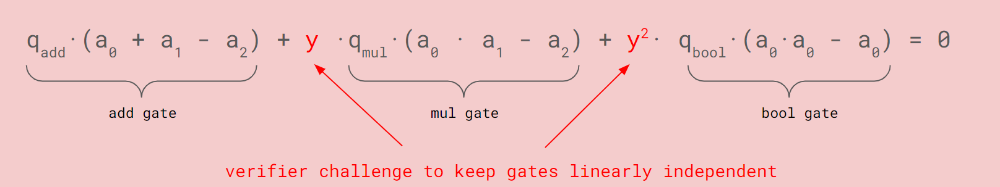
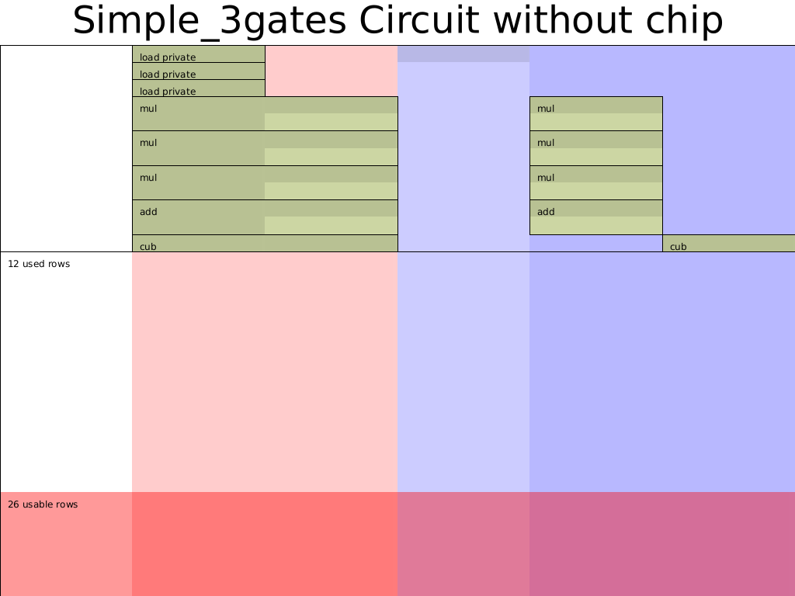
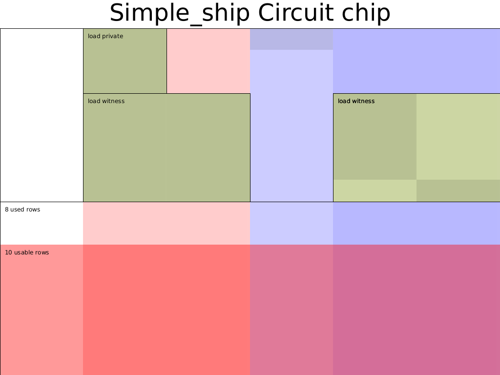

> - 作者:  [@Po@Ethstorage.io](https://github.com/dajuguan)
> - 时间: 2023-10-20
> - 校对:  [@Demian](https://github.com/demian101)

[TOC]

# Custom gates and Chip

本节我们以一个简单的电路为例，介绍 Halo2 中的自定义门(custom gates) 和 chip 的概念。

在上一节中，我们使用 Halo2 的 API 实现了只包含乘法门的简单电路，但是如果有多种 gate 呢，这种情况如何处理?

## Custom gates

在 Halo2 中可通过自定义门(custom gate) 来实现，这里需要回顾下 Halo2 中自定义门(custom gate) 的 mental model [^1]:
 

如上式，自定义门可以由任意多种不同的门线性相加构成，每一个门由选择器和门运算逻辑构成，如上式中第一个加法门选择器为 $q_{add}$，电路逻辑为 $a_2=a_0 + a_1$ ，Halo2中可以通过 `create_gate` 创建每个门。不过需要注意的是，看起来这些门之间是独立的，但实际上这些门在最终的电路约束检查中会通过乘以一个随机数`y`，一次行检查一行的 witness 是否**同时满足所有门**的约束。

### 问题定义

本节则是证明如下电路:

```rust
private inputs: a,b,c
public inputs: out
constraints:
    d = a^2 * b^2 * c 
    e = c + d
    out = e^3
```

注意到在 vanilla plonk 中约束的 degree 不能超过 2（只支持加法门和乘法门，witness有三列,且门的2个输入和1个输出只能在一行），但 halo2 支持通过 Ultra plonk 来实现更高阶数以及使用更灵活的单元格的 custom gate。这里我们使用一个高阶 custom gate 来实现 $out=d^3$ 这条约束 (注: 其实 Ultra plonk 中乘法门和加法门也可以看作 custom gate，因此下文我们将该这条三次方约束的门称为**立方门**)，相比于原来需要 2 个乘法门实现该约束，custom gate 可以减少帮助约束的行数。

因此，我们可以画出电路 witness 表格:

| ins   | a0    | a1    | s_mul | s_add | s_cub |
|-------|-------|-------|-------|-------|-------|
|  out  |    a  |       |       |       |       |
|       |    b  |       |       |       |       |
|       |    c  |       |       |       |       |
|       |    a  |   b   |   1   |   0   |   0   |
|       |   ab  |       |   0   |   0   |   0   |
|       |   ab  |  ab   |   1   |   0   |   0   |
|       |  absq |       |   0   |   0   |   0   |
|       |  absq |   c   |   1   |   0   |   0   |
|       |  d    |       |   0   |   0   |   0   |
|       |  d    |   c   |   0   |   1   |   0   |
|       |  e    |       |   0   |   0   |   0   |
|       |  e    |  out  |   0   |   0   |   1   |

看到这里可能会产生疑问，这个 table 是如何填写出来的呢？其实，这个填写规则是与门约束一一对应的，而门约束可以很随意设计，所以关键是得确定

1. 有几种门约束 

2. 每种门约束涉及哪几个单元格及多项式约束公式

> 完整代码见 [Halo2 tutotials: chap_2/custom_gates](https://github.com/zkp-co-learning/halo2-step-by-step/blob/main/halo2-tutorials/src/chap_2/exercise_1.rs)

### Config

首先，需要明确电路配置(CircuitConfig)，即选取所需的 Advices, Selectors 和 Instance 列，并在 `fn configure` 中创建相应的门。

```rust
#[derive(Debug, Clone)]
struct CircuitConfig {
    advice: [Column<Advice>;2],
    instance: Column<Instance>,
    s_mul: Selector,
    s_add: Selector,
    s_cub: Selector,
}

impl <F:Field> Circuit<F> for MyCircuit<F> {
    type Config = CircuitConfig;
    type FloorPlanner = SimpleFloorPlanner;

    fn without_witnesses(&self) -> Self {
        Self::default()
    }

    fn configure(meta: &mut ConstraintSystem<F>) -> Self::Config {
        let advice = [meta.advice_column(),meta.advice_column()];
        let instance = meta.instance_column();

        meta.enable_equality(instance);
        for c in &advice {
            meta.enable_equality(*c);
        }
        let s_mul = meta.selector();
        let s_add = meta.selector();
        let s_cub = meta.selector();

        meta.create_gate("mul_gate", |meta| {
            let lhs = meta.query_advice(advice[0], Rotation::cur());
            let rhs = meta.query_advice(advice[1], Rotation::cur());
            let out = meta.query_advice(advice[0], Rotation::next());
            let s_mul = meta.query_selector(s_mul);
            Constraints::with_selector(s_mul, vec![(lhs * rhs - out)])
        });

        meta.create_gate("add_gate", |meta| {
            let lhs = meta.query_advice(advice[0], Rotation::cur());
            let rhs = meta.query_advice(advice[1], Rotation::cur());
            let out = meta.query_advice(advice[0], Rotation::next());
            let s_add = meta.query_selector(s_add);
            Constraints::with_selector(s_add, vec![(lhs + rhs - out)])
        });

        meta.create_gate("cub_gate", |meta| {
            let lhs = meta.query_advice(advice[0], Rotation::cur());
            let out = meta.query_advice(advice[1], Rotation::cur());
            let s_cub = meta.query_selector(s_cub);
            Constraints::with_selector(s_cub, vec![(lhs.clone()*lhs.clone()*lhs - out)])
        });

        CircuitConfig {
            advice,
            instance,
            s_mul,
            s_add,
            s_cub
        }
    }
    ...
}
```

这里我们使用了新的 API —— `Constraints::with_selector`，其实等价于我们之前熟悉的 `vec![selecter * gate expression]` 。

### 填入 Witness

除了上述的加法门和乘法门之外，我们需要为立方运算增加一个填 witness 的辅助函数 `fn cub` :

```rust
...
fn cub<F:Field>(
    config: &CircuitConfig,
    mut layouter: impl Layouter<F>,
    a: Number<F>,
) -> Result<Number<F>, Error> {
    layouter.assign_region(
        || "cub", 
    |mut region| {
        config.s_cub.enable(&mut region, 0)?;
        a.0.copy_advice(|| "lhs", &mut region, config.advice[0], 0)?;
        let value = a.0.value().copied()*a.0.value().copied()*a.0.value().copied();
        region.assign_advice(|| "out=lhs^3", config.advice[1], 0, || value)
        .map(Number)
    })
}
...
```

> 注意: 推导并填入 witness 的方式一定要与上述自定义门中引用的单元格和计算方式一致，否则会导致**欠约束**或**约束错误**。

然后补充 Circuit Trait 中的 `synthesis` 函数:

```rust
impl <F:Field> Circuit<F> for MyCircuit<F> {
    ...
    fn synthesize(&self, config: Self::Config, mut layouter: impl Layouter<F>) -> Result<(), Error> {
        let a = load_private(&config,layouter.namespace(|| "load a"), self.a)?;
        let b = load_private(&config,layouter.namespace(|| "load b"), self.b)?;
        let c = load_constant(&config,layouter.namespace(|| "load c"), self.c)?;


        let ab = mul(&config,layouter.namespace(|| "a*b"), a, b)?;
        let absq = mul(&config,layouter.namespace(|| "ab*ab"), ab.clone(), ab)?;
        let d = mul(&config, layouter.namespace(|| "absq*c"), absq, c.clone())?;

        let e = add(&config, layouter.namespace(|| "absq + c"), d, c)?;
        let out = cub(&config, layouter.namespace(|| "absq^3"), d)?;

        //expose public
        layouter.namespace(|| "expose out").constrain_instance(out.0.cell(), config.instance, 0)
    }
}

```

### 测试

实例化电路，并调用相应的 Mock Prover 来验证。

```rust
cargo test test_simple_3gates
```
输出相应的电路布局图`cargo test plot_3gates_circuit --features dev-graph`:


> 可以看出 Halo2 的 Simple Layouter 对乘法门选择器(`s_mul`) 和加法门选择器(`s_add`) 做了优化，将这两列合并为了 1 列。

## Chip

在上述实现中，我们填入 witness 的函数和 Config 是分离的，为了更好地复用这些代码，类似于集成电路由很多个 Chip 构成，Halo2 一般将一系列紧密相关的实现特定约束的函数(config 以及相应的提供 witness 的函数) **抽象到一个 Chip 模块**。

具体的代码参考[在这里](https://github.com/zkp-co-learning/halo2-step-by-step/tree/main/halo2-tutorials)，这里我们简单对比一下 2 部分代码的区别：

在前部分的 `custom_gate` 的实现中：
- 手动定义了 `load_private(),  load_constant()` 
- 手动定义了 `fn mul() / fn add()/ fn cub()` 这几个处理 witness 的函数

```rust
// custom_gate.rs
fn load_private() { ... }
fn load_constant() { ... }
fn mul() / fn add() / fn cub() { ... }

impl <F: Field> Circuit<F> for MyCircuit<F> {
    fn configure()
    fn synthesize() {
        let (a, b) = load_private() ..;
        let ab = mul(a, b);
        // ...
    }
}
```

在本节的 `simple_chip` 的实现中:
- 将 load_private()、mul()、cub() 等操作直接封装到了 SimpleChip 中
- 在实现 MyCircuit 时，直接调用 SimpleChip 里的 configure() 来构建约束; 和 assign() 来填入 witness

```rust
impl <F: Field> SimpleChip<F> {
    fn configure()  // same as in custom_gate.
    fn assign() {
        // load_private:
        assign_region(
            assign_advice
        )
        // like fn mul / fn add() / fn cub()
        copy_advice() .. 
    }

impl <F: Field> Circuit<F> for MyCircuit<F> {
    let chip = SimpleChip::construct(config);
    let out = chip.assign(layouter.namespace(|| "simple ship"), self.a, self.b, self.c)?;
    chip.expose_public(layouter, out, 0)
}
```

> 建议仔细阅读、对比上下 2 部分代码，体会其在设计上的不同和 chip 这种模块化封装的思维。

我们将本节中的约束抽象为 `SimpleChip`，将原来独立的 assign witness 的几个函数 (`load_private`、`load_constant`、`add`、`mul`和`cub`) 合并到 Simple Chip 的 `assign` 方法中。此外，采用如下电路布局压缩所需的行数（在电路中我们只划分了了两个大的 region，这样就减小了复制 `ab`、`absq`、`c` 和 `c` 这四个约束） :

| ins   | a0    | a1    | s_mul | s_add | s_cub |
| ------|-------|-------|-------|-------|-------|
| out   |    a  |       |       |       |       |
|       |    b  |       |       |       |       |
|       |    c  |       |       |       |       |
|       |   a   |   b   |   1   |   0   |   0   |
|       |   ab  |   ab  |   1   |   0   |   0   |
|       | absq  |   c   |   1   |   0   |   0   |
|       |  d    |   c   |   0   |   1   |   0   |
|       |  e    |   out |   0   |   0   |   1   |

完整代码见 [Halo2 tutorials: chap_2/simple_chip](https://github.com/zkp-co-learning/halo2-step-by-step/blob/main/halo2-tutorials/src/chap_2)

### test & 输出电路布局图

```rust
cargo test test_simple_ship
cargo test plot_chip_circuit --features dev-graph
```
采用 Chip 的电路布局图为:



references:

[^1]: 0xPARC halo2 lectures https://learn.0xparc.org/halo2/
