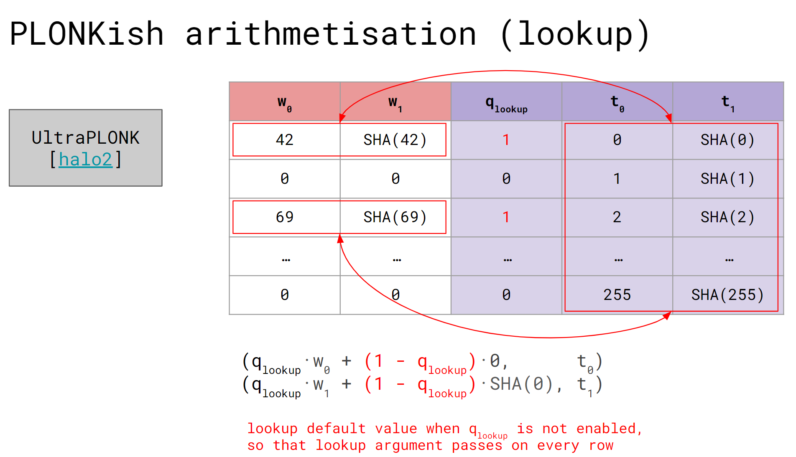
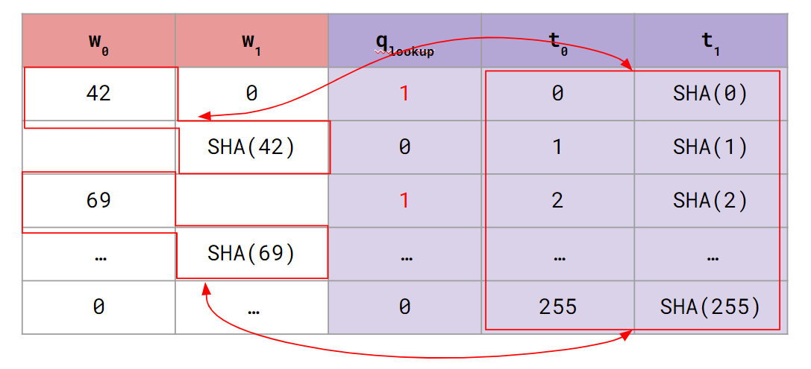
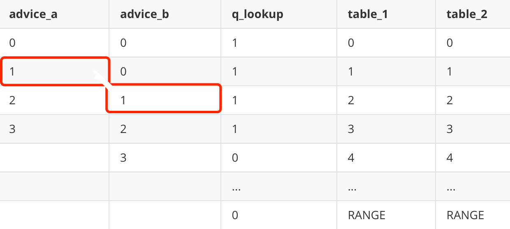

> - 作者:  [@Po@Ethstorage.io](https://github.com/dajuguan)
> - 时间: 2023-10-31
> - 校对:  [@Demian](https://github.com/demian101)

[TOC]

# lookup
前面的章节中我们介绍了 Halo2 的 API 和电路布局等核心概念，这节则介绍 Plonk 证明系统中基于 permutation argment 抽象出的一个强大功能 lookup 。Halo2 中使用的 lookup 对 [plookup](https://eprint.iacr.org/2020/315.pdf) 进行了简化，可以约束**一列或多列**的 cells 的值属于对应的 lookup 列。

如下图，我们可以通过 lookup 约束 $w_0,w_1$ 两列中的第 1、3 行属于查找表( $t_0, t_1$ 列)中的某一行; 对于不需要查找的则约束其属于查找表的某个默认行（自己指定）。


关于 Zcash 版本的 lookup，有两个问题需要注意:
1. 多列 lookup 不同列的相同行必须**同时存在**于查找表中，Halo2 底层通过一个随机数将各列对应行的 row 组合起来使其回归到单列 lookup;
2. 多列 lookup 时，需约束的多列 witness 不一定在同一行（如下图中的 $W_0$ 在第一行，$W_1$ 在第二行，这 2 个 witness 不同行），但是查找表中对应的所有列是在同一行（在 lookup table 中 2 个 witness 对应的 42, SHA(42) 是需要再同一行的）。比如上述例子也可以进行如下的 lookup:


同时可参考对不在同一行的两列进行 lookup 的[示例代码: halo2-tutorials/chap_4/circuit_1](https://github.com/zkp-co-learning/halo2-step-by-step/blob/main/halo2-tutorials/src/chap_4/circuit_3.rs)。

## 单列 lookup

首先从最简单的单列 lookup 介绍如何使用 lookup API。我们的目的是证明 `a[N]` 数组里的每一个 value 都在 `[0, RANGE]` 这个范围里面：

```bash
private inputs: a[N]
constant: RANGE
s.t: a[i] ∈ [0, RANGE], ∀ i ∈ [0, N-1]
```

若直接采用 gate 约束的话，我们需要设计形如

$$(a[i] - 0) * (a[i]-1) * (a[i]-2)...(a[i]-RANGE) = 0, \ \   \forall i \in [0, N-1] $$

这样一个连乘表达式约束的电路，这种方式固然直观，但问题在于：当 RANGE 很大时 (比如 $2^{16}$ )，电路的 degree 会很高, 这会导致整个 proof 很大。

因此，我们可以采用 lookup 方式实现（回忆 permutation argument 只会将 degree 增加 1)，将 $[0, \ RANGE]$ 这些值填入 `TableColumn` 中 ( Zcash 版本的 Halo2 只支持静态查找表, 因此只能填入 `TableColumn`)，并借助 `lookup` API 来证明 所有的 `a[i]` 属于该 `TableColumn` 的某一行。 

整个电路结构如下:

| adv   | q_lookup|  table  |
|-------|---------|---------|
| a[0]  |    1    |    0    |
| a[1]  |    1    |    1    |
| a[2]  |    1    |    2    |
| a[3]  |    1    |    3    |
| a[4]  |    1    |    4    |
|  ...  |   ...   |   ...   |
| a[N]  |    1    |   N-1   |
|       |    0    |    N    |
|       |   ...   |   ...   |
|       |    0    |  RANGE  |

[完整代码见: halo2-tutorials/chap_4/circuit_2](https://github.com/zkp-co-learning/halo2-step-by-step/blob/main/halo2-tutorials/src/chap_4/circuit_1.rs)

### 电路配置及 lookup 约束

如上表电路需要 1 列 Advice , 1 列 TableColumn, 1 列 Selector : 

```rust
#[derive(Debug, Clone)]
struct RangeConfig<F:PrimeField, const RANGE: usize, const NUM: usize>{
    value: Column<Advice>,
    table: LookUpTable<F, RANGE>,
    q_lookup: Selector,
}
```

该电路配置定义为 `RangeConfig`，将其中的查找表单独定义为 `LookUpTable`。下面代码的 `[(q_lookup * v, table.table)]` 即表示：当 q_lookup 启用时，v 需要存在于 table 查找表中。相应代码为:

```rust
impl <F:PrimeField, const RANGE: usize, const NUM: usize> RangeConfig<F, RANGE, NUM>{
    fn configure(meta: &mut ConstraintSystem<F>,value: Column<Advice>) -> Self {
        let q_lookup = meta.complex_selector();
        let table = LookUpTable::<F,RANGE>::configure(meta);
        meta.lookup(|meta| {
            let q_lookup = meta.query_selector(q_lookup);
            let v = meta.query_advice(value, Rotation::cur());
            vec![(q_lookup * v, table.table)]
        });

        RangeConfig {value, table, q_lookup}
    }
    
    fn assign(
        &self,
        mut layouter: impl Layouter<F>,
        value: [Value<Assigned<F>>;NUM]
    ) -> Result<ACell<F>,Error> {
        
        layouter.assign_region(|| "value to check", |mut region|{ //instantiate a new region, so it's not ref
            self.q_lookup.enable(&mut region, 0)?;
            let mut cell= region.assign_advice(||"value", self.value, 0, || value[0]).map(ACell);
            for i in 1..value.len() {
                self.q_lookup.enable(&mut region, i)?;
                cell = region.assign_advice(||"value", self.value, i, || value[i])
                .map(ACell);
            }
            cell
        })
    }
}

```

lookup 必须使用 `complex_selector`，因为 Halo2 可以根据这个标记知道这种 Selecotr 列不需要优化，而普通的 Selector 则可能会被 Layouter 进行合并等优化操作。

对于 `LookUpTable`, 使用 `assign_table` 来填充 witness :

```rust
#[derive(Debug, Clone)]
pub(crate) struct LookUpTable<F:PrimeField, const RANGE: usize> {
    pub(crate) table: TableColumn,
    _maker: PhantomData<F>
}

impl <F:PrimeField, const RANGE: usize> LookUpTable<F, RANGE> {
    pub fn configure(meta: &mut ConstraintSystem<F>) -> Self {
        let table = meta.lookup_table_column();
        Self {table, _maker: PhantomData }
    }

    pub fn load(&self, layouter: &mut impl Layouter<F>) -> Result<(), Error>{
        layouter.assign_table( || "load range lookup table", 
        |mut table|{
            for value in 0..RANGE{
               table.assign_cell(||"table cell", self.table, value, || Value::known(F::from(value as u64)))?;
            }
            Ok(())
        })
   
    }
}
```

电路具体的 Trait 方法实现就比较简单了，在此不再赘述。

## 多列 lookup

还可以对多列 witness 与对应的多列查找表进行 `lookup` 约束。本小节考虑如下例子: 证明某个值只有 `bit[N]` 比特位:

```bash
private inputs:  a[N], bit[N]
s.t: a[i] ≤ 2^bit[i] -1，  ∀ i ∈ [0, N-1]
```

具体来说，假设对于一个 8 位的查找表，它可以存储 $2^8=256$ 个可能的值（即 [0,255] ），但我们并不总是需要用所有 256 个值，也就是即使查找表可以存储 8 位的值，我们也可以使用它来约束小于 8 位的值。

例如，对于一个 1 位的值，我们只需查找两种可能的值（0 或 1）；对于一个 2 位的值，我们可以查找四种可能的值（00、01、10 或 11）...

举个具体的例子：比如某 Prover 想证明其 value 确实只有 5 位 (即 value <=  2^5 - 1 = 31 ) ，
- (value = 31/32, bit = 5 ) 是 private value.
- 对于 value = 31，其二进制表达为 `11111`，确实只有 5 位，满足约束
- 对于 value = 32，其二进制表达为 `100000`，其位数到达了 6 位，但是 Prover 填入电路的 bits 是 5 ，(这里你可以认为这是一个 malicious Prover)，它想作弊，但这是不可能的！ Prover 传入的这 2 个 private inputs 不满足 lookup table 在该处的约束。


我们可以设计两列`TableColumn`, 其中一列 lookup table 为整数值 `table_value`，另一列为其对应的 bit 位数 `table_n_bits`； 

并约束 witness 中值那一列 `value` 和比特位那一列 `bit` 属于前述的两列 `TableColumn` lookup table


| value     |      bit    |   q_lookup  |  table_n_bits  |  table_value  |
|-----------|-------------|-------------|----------------|---------------|
|   v[0]    |      0      |      1      |        1         |       0     |
|   v[1]    |      1      |      1      |        1         |       1     |
|   ...     |     ...     |     ...     |        2         |       2     |
|   ...     |     ...     |     ...     |        2         |       3     |
|   ...     |     ...     |     ...     |        3         |       4     |


[完整代码见: halo2-tutorials/chap_4/circuit_3](https://github.com/zkp-co-learning/halo2-step-by-step/blob/main/halo2-tutorials/src/chap_4/circuit_2.rs)

### 电路配置

这里我们重点关注 `lookup` 约束相关代码:

```rust
#[derive(Debug, Clone)]
struct RangeCheckConfig<F:PrimeField, const NUM_BITS: usize, const RANGE: usize>{
    value: Column<Advice>,
    bit: Column<Advice>,
    q_lookup: Selector,
    table: RangeCheckTable<F, NUM_BITS, RANGE>
}

impl <F:PrimeField, const NUM_BITS: usize, const RANGE: usize> RangeCheckConfig<F, NUM_BITS, RANGE> {
    fn configure(meta: &mut ConstraintSystem<F>, ) -> Self {
        //when to configure the colum, during config or circuit instance: configure time
        let value = meta.advice_column();
        let bit = meta.advice_column();
        let q_lookup = meta.complex_selector();
        let table = RangeCheckTable::configure(meta);

        meta.lookup(|meta|{
            let default_value = Expression::Constant(F::ZERO);
            let default_bit = Expression::Constant(F::ONE);
            let mut v = meta.query_advice(value, Rotation::cur());
            let mut b = meta.query_advice(bit, Rotation::cur());
            let q = meta.query_selector(q_lookup);
            let non_q = Expression::Constant(F::ONE) - q.clone();
            v = v*q.clone() + non_q.clone()*default_value;
            b = b*q + non_q*default_bit;
            vec![(b, table.n_bits),(v, table.value)]
        });

        RangeCheckConfig { value,bit, q_lookup, table }
    }
...
}
```

这里我们对于不需要 `lookup` 的行为其指定默认值保证所有行均满足 `lookup` 约束， `vec![(b, table.n_bits), (v, table.value)]` 则范围两组对应的`(cell expression, lookup table)`。

## 多列错行 lookup table

如下图所示，假若想约束的的 2 列 witness 不在同一行，而是错行的：



对于这种情况 halo2 也可以灵活地处理：

```rust
impl<F: PrimeField> LookupChip<F> {
    fn construct(config: LookupConfig) -> Self {
        LookupChip {
            config,
            _marker: PhantomData,
        }
    }

    fn configure(meta: &mut ConstraintSystem<F>) -> LookupConfig {
        let a = meta.advice_column();
        let b = meta.advice_column();
        let s = meta.complex_selector();
        let t1 = meta.lookup_table_column();
        let t2 = meta.lookup_table_column();

        meta.enable_equality(a);
        meta.enable_equality(b);

        meta.lookup(|meta| {
            let cur_a = meta.query_advice(a, Rotation::cur());
            let next_b = meta.query_advice(b, Rotation::next());
            let s = meta.query_selector(s);
            // we'll assgin (0, 0) in t1, t2 table
            // so the default condition for other rows without need to lookup will also satisfy this constriant
            vec![(s.clone() * cur_a, t1), (s * next_b, t2)]
        });

        LookupConfig { a, b, s, t1, t2 }
    }

    fn assign(
        &self,
        mut layouter: impl Layouter<F>,
        a_arr: &Vec<Value<F>>,
        b_arr: &Vec<Value<F>>,
    ) -> Result<(), Error> {
        layouter.assign_region(
            || "a,b",
            |mut region| {
                for i in 0..a_arr.len() {
                    self.config.s.enable(&mut region, i)?;
                    region.assign_advice(|| "a col", self.config.a, i, || a_arr[i])?;
                }

                for i in 0..b_arr.len() {
                    region.assign_advice(|| "b col", self.config.b, i, || b_arr[i])?;
                }

                Ok(())
            },
        )?;
```
在上面的代码中，
1. 利用 `[(s.clone() * cur_a, t1), (s * next_b, t2)]` 这 2 个需要同时成立的约束，我们同时约束了 `a` 的当前行和 `b` 的下一行需要存在于多列查找表中。
2. 在 assign 函数中，我们只对 advice column `a` 进行了约束，而没有对 advice column `b` 应用 selector，目的是只对 a 有值的这些行进行约束。如此就给 b 列提供了更多的灵活性。

```rust
    #[test]
    fn test_lookup_on_different_rows() {
        let k = 5;
        let a = [0, 1, 2, 3, 4];
        let b = [0, 0, 1, 2, 3, 4, 5, 6, 7, 8, 9];
        let a = a.map(|v| Value::known(Fp::from(v))).to_vec();
        let b = b.map(|v| Value::known(Fp::from(v))).to_vec();
        let circuit = MyCircuit { a, b };
        let prover = MockProver::run(k, &circuit, vec![]).unwrap();
        prover.assert_satisfied();
    }
```
- 如上代码，只对 a 列有值的情况进行了约束，b 列的取值变得灵活。


### lookup Debug 相关

在 lookup 电路设计时，以典型的 `halo2-tutorials/chap_4/circuit_1` 为例，可能会遇到如下报错:

```rust
error: lookup input does not exist in table
  (L0, L1) ∉ (F0, F1)

  Lookup inputs: 每一个 lookup 会出现这一行,整个 lookup 分为两组: L0 和 L1
    L0 = x1 * x0 :，这是第一组 (witness: A0 列, table: F2 列), 电路中为`(b, table.n_bits)`
    ^
    | Cell layout in region 'a b':
    |   | Offset | A0 | F2 |
    |   +--------+----+----+
    |   |    1   | x0 | x1 | <--{ Lookup inputs queried here
    |
    | Assigned cell values:
    |   x0 = 1
    |   x1 = 1

    L1 = x1 * x0 : 这是第二组 (witness: A0 列, table: F2 列), 电路中为 `(v, table.value)`
    ^
    | Cell layout in region 'a b':
    |   | Offset | A1 | F2 |
    |   +--------+----+----+
    |   |    1   |    | x1 | <--{ Lookup inputs queried here
    |   |    2   | x0 |    |
    |
    | Assigned cell values:
    |   x0 = 0x3
    |   x1 = 1
```

理解上述报错，可以让我们更快地调试。报错结构如何理解在上图中均已表明，且 cell 的相对值也体现的很清楚(注意 `L1` 中的 `x0` 相对 `L0` 中的 `x0` 向下偏移了 1 , 这与电路一致)。

## 动态查找表 `PSE Halo2's lookup_any API`


注意到使用 Zcash 版本 Halo2 进行 `lookup` 约束时，由于没法对 TableColumn 进行 `query_advice`这导致除了 `lookup` 约束外，无法灵活地对 `TableColumn` 中的 cell 进行 gate 约束，即`TableColumn`必须在电路初始化阶段写死，无法再更改了，即只能进行静态查找。

因此，Zcash 团队的核心开发者为 [PSE Halo2](https://github.com/privacy-scaling-explorations/halo2/blob/0c3e3b569519b86653a64f412bbce17e4e8acac4/halo2_proofs/src/plonk/circuit.rs#L1761) 版本开发了 `lookup_any` API, 使其也支持对任意类型的列，如`Advice`、`FixedColumn` 等进行 `lookup`, 即实现了动态查找表。`lookup_any` 使用方式与 `lookup` 没有太大的区别，来看其具体的[一些例子](https://github.com/privacy-scaling-explorations/halo2/blob/0c3e3b569519b86653a64f412bbce17e4e8acac4/halo2_proofs/src/dev.rs#L1800)

下面的代码中，定义了 2 个 lookup table： `instance_table` & `advice_table` :
```rust
	#[test]
	fn bad_lookup_any() {
	
		impl Circuit<Fp> for FaultyCircuit {
			fn configure(meta: &mut ConstraintSystem<Fp>) -> Self::Config {
				let instance_table = meta.instance_column(); // lookup as Instance Columns
				let advice_table = meta.advice_column();
				let a = cells.query_advice(a, Rotation::cur());
				
                meta.annotate_lookup_any_column(instance_table, || "Inst-Table");
                meta.enable_equality(instance_table);
                meta.annotate_lookup_any_column(advice_table, || "Adv-Table");
                meta.enable_equality(advice_table);

                meta.lookup_any("lookup", |cells| {
                    let advice_table = cells.query_advice(advice_table, Rotation::cur());
                    let instance_table = cells.query_instance(instance_table, Rotation::cur());
				// ..
                    vec![
                        (
                            q.clone() * a.clone() + not_q.clone() * default.clone(),
                            instance_table,
                        ),
                        (q * a + not_q * default, advice_table),
                    ]});
		}
		// ...
	let custom_lookup_table = vec![vec![
			Fp::from(1u64),
			Fp::from(2u64),
			Fp::from(4u64),
			Fp::from(6u64),
		]];
	let prover = MockProver::run(
			K,
			&FaultyCircuit {},
			// This is our "lookup table".
			custom_lookup_table,
		)
		.unwrap();
		assert_eq!(
			prover.verify(),
			Err(vec![VerifyFailure::Lookup {
				name: "lookup".to_string(),
				lookup_index: 0,
				location: FailureLocation::InRegion {
					region: (1, "Faulty synthesis").into(),
					offset: 1,
				}
			}])
		);
	}
```

如上代码的动态查找表中：
- 2 个 lookup table 在 Circuit `configure` 阶段被分别定义为了 instance column 和 advice columns，而后在 "lookup" 门约束中（`lookup_any()`），advice col `a` 须满足 2 个约束：
	- `a` 需能在 lookup table `instance_table` 中被查找到，且同时也
	- 能在 lookup table `advice_table` 中被查找到
- 在 `synthesize()` 阶段，`advice_table` 这个 lookup table 由 instance col 生成（可以理解为复制了一份 `instance_table` 到 `advice_table` ）
	- 在 "Good synthesis" 中，advice 的赋值都能在 2 个 lookup tables 中被查找到，满足约束；
	- 而在 "Faulty synthesis" 中，`Fp::from(5)` 这个 advice 赋值不能在 lookup tables 中被查找到，所以不满足约束。
- Prover 在 prove 阶段，可以将 **Public Input(PI) 或 advice column(witness)** 作为 lookup table， 这种方式提供给了 halo2 电路更大的灵活度。


除此之外，还可以参考[`brainfuck zkvm`的例子](https://github.com/dajuguan/zkvm_brainfuck/blob/257014e29a81ba3a3e03800893cae8f00082f84d/bf_zk/src/main_config.rs#L46)。


