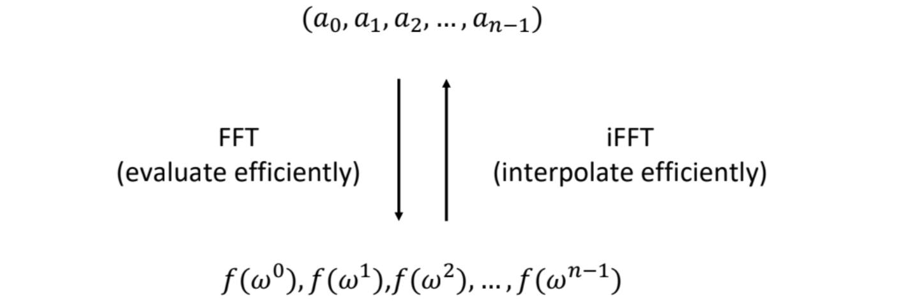
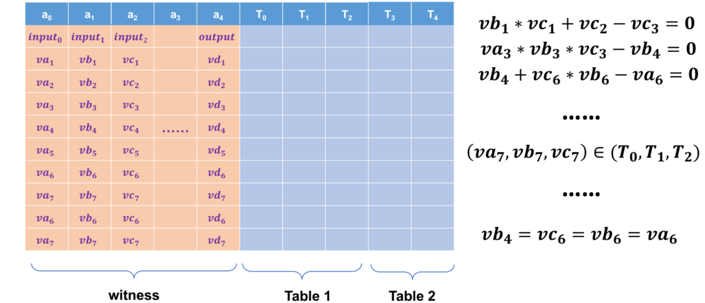
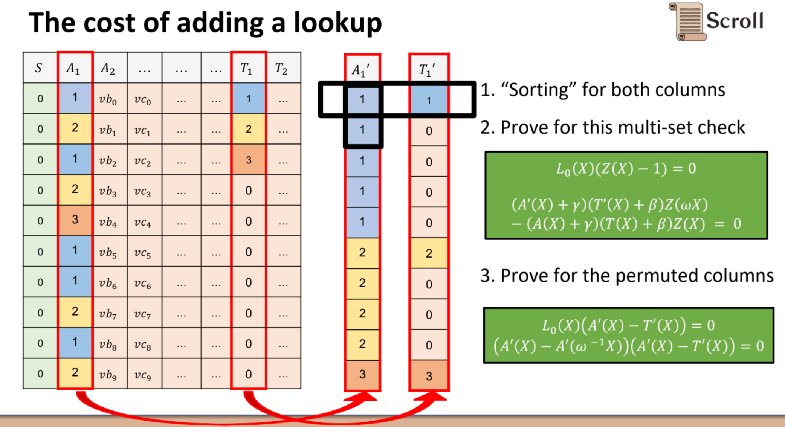
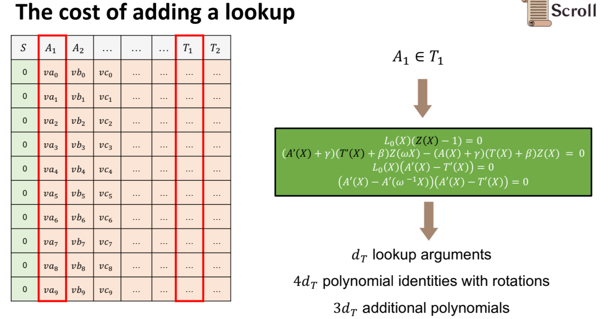
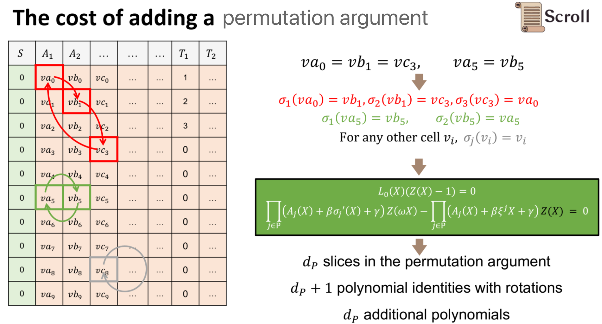
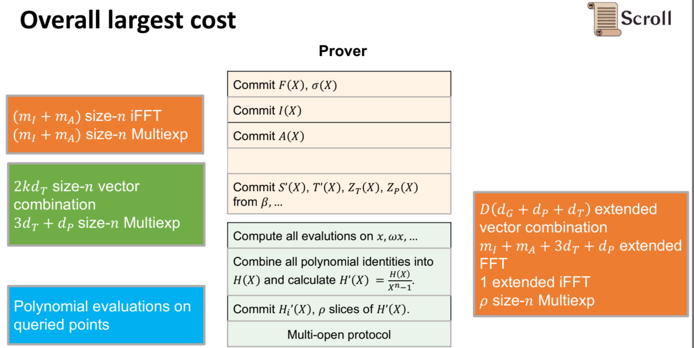

> - ref: https://scroll.io/blog/proofGeneration#user-content-fnref-2
> - ref: [@Ye sharing at 0xPARC](https://learn.0xparc.org/materials/halo2/learning-group-1/cost-model/)
> - translator: [Demian](https://github.com/Demian101)

[TOC]

## Builing blocks

表示 Polynomial 的 2 种方式：
- coefficients form: $f(x)=a_0+a_1 x+a_2 x^2+\ldots+a_{n-1} x^{n-1}$
- evaluation form: $f(x) = \left( x_0, f(x_0) \right) , \  \left( x_1, f(x_1)\right)  , \ \ldots ,  \left(x_{n-1}, f(x_{n-1}) \right)$

**多项式计算**  ->  FFT & iFFT
- 通过 FFT，将系数形式的多项式转化为评估形式；
- 通过 iFFT，将评估形式的多项式转化为系数形式；

**多项式乘法 multiplication:** 
- $\text{iFFT}\left( \  \text{FFT}\left( f(x) \right) \odot  \text{FFT}\left( g(x) \right) \ \right)$
- 通过 evaluation form 相乘是比较好计算的，只需要将相同 x 坐标的对应的 y 坐标相乘， x 坐标保持不变，从而完成多项式乘法计算。

**多项式除法 division** (vanishing polynomial):
$$
\begin{gathered}
h(x)=\frac{f(x) \cdot g(x)}{x^n-1}\\
h\left(\sigma \omega^i\right)=\frac{f\left(\sigma \omega^i\right) g\left(\sigma \omega^i\right)}{\left(\sigma \omega^i\right)^n-1} \\
\operatorname{coset-iFFT}\left(\frac{\operatorname{coset-FFT}(f(x)) \odot \operatorname{coset-FFT}(g(x))}{\sigma^n-1}\right)
\end{gathered}
$$
- 如上公式，对于 $x^n -1$ ，如果我们知道  $\omega^i -1 = 0$ ，那么  $x^n -1=0$ ，因为不可以除 0，所以这里会有一些问题。
- 解决方案是**使用 coset-fft**，即通过 $\sigma$ 做一次 shifted ，这样  $\left(\sigma \omega^i\right)^n-1$ 就不会等于 0 了，而是等于某些常数形式，如此就可以正常进行除法操作。

**承诺 Commitment -> MSM (Multiexp)**
- MSM: 即将标量向量 (scalar vector) 和椭圆曲线上的点 (point vector) 做点乘

**Commit to a polynomial**
- 对于 $f(x)=a_0+a_1 x+a_2 x^2+\ldots+a_{n-1} x^{n-1}$
- $\text { Coefficient: }{\color{green} [f]_1} = a_0 {\color{green} \left[g^0\right]_1} + a_1 {\color{green} \left[g^{s}\right]_1}+a_2{\color{green} \left[ g^{s^2}\right]_1} +\cdots+a_{n-1}{\color{green}\left[ g^{s^{n-1}}\right]_1}$
- $\text { Lagrange: }{\color{green} [f]_1}=f\left(x_0\right){\left[\color{green} L_0\right]_1} + f\left(x_1\right){\color{green} \left[L_1\right]_1}+f\left(x_2\right){\color{green} \left[L_2\right]_1} + \cdots+f\left(x_{n-1}\right){\color{green} \left[L_{n-1}\right]_1}$

> - 对于多项式的承诺形式，可以分别使用 coefficient 和 Lagrange 形式表示，其中
> -  👆🏻  ${\color{green} \left[g^0\right]_1}, \  {\color{green} \left[g^s\right]_1} \ldots$  是 SRS，通过系数 vector 和 srs 相乘的方法，得到 coefficient form 的 commitment。
> -  ${\color{green} L_{n-1}}$ 是 Lagrange Basis，下文中会有详细解释

<!--
**In proving...:**
- `FFT` : `MSM` in Groth16: `30%` : `65%` (`5%` for witness generation)
- `FFT` : `MSM` will be larger in Halo2 if you use many many custom gates
	- if you use many custom gate, because each custom gate will bring new polynomials and bringing a lot of new ffts.
- FFT is not easy to parallel ! . [^1]
	- bounded by the memory access pattern (fft algo is actually have some irregular memory access patterns because in each )
	- Improve the bandwidth utilization (cache/recursion/...) [^2]
- MSM is easy to parallel
	- bounded by the computation (much larger than FFT)
		- fft is still like 10 times faster than MSM in practice (say in the same scale like in $2^{20}$ ), and this is why snark is often considered slower than stark, cause STARK is only need fft.
	- Pippenger Algorithm + WNAF + Batch add (affine) + GLV
-->

## Square-Fibonacci

我们将在本文中使用如下 Square-Fibonacci 示例，来演示证明生成的过程和在其中的计算成本 (cost)

- 设 $f_0 = 1$, $f_1 = 1$  
- 对于 $i \ge 2$ , 定义 $f_{i} := (f_{i-2})^2 + (f_{i-1})^2 \pmod q$ 
	- $q$ 是一个大素数。 使用这个 $q$ 来限制元素大小，以便它可以用一些预定的 bits 来表示

- 设 $n$  为大整数，为了方便 FFT 计算，不妨假设 n 是 2 的幂。
- 设 $k$  为第  $n^{th}$  个 Square-Fibonacci number.

**目标**：生成一个可被高效验证 (efficiently-verifiable) 的证明 $\pi$，来证明其确实是第  $n^{th}$  个 Square-Fibonacci 数（即 Prove  $f_n=k$ ）

> 验证者可以朴素(naively) 地自己计算 $f_2$  , $f_3$ ... $f_4$ ... 一直算到 $f_n$ ，然后自己检查是否 $f_n =k$  来检查该 statement。 然而，这需要许多计算步骤（注意 $n$ 非常大），不是理想的方法。

## The phases of proof generation

在 high level 层面上，证明生成（proof generation）由 3 个阶段组成：
1. **phase 1**: 填入 `witness`
2. **phase 2**: commit to the `witness`
3. **phase 3**: prove that the witness 是正确的

**phase 1**: 填入 `witness`:
- `witness` (或者说 `trace`) 指的是一组数据，可以展示为什么某个 statement 是正确的。
	- 例如，在 Square-Fibonacci 示例中，我们可以在 trace table 中逐步写出计算结果，每行一步：
		- 第一行： $[f_0, f_1, f_2]$ , where  $f_2 = (f_0)^2 + (f_1)^2$
		- 第二行： $[f_1, f_2, f_3]$ , where  $f_3 = (f_1)^2 + (f_2)^2$ 
		- ... 以此类推，直到到达  $[f_{n-2}, \ f_{n-1}, \ f_{n} ]$ 

**phase 2**: commit to the `witness`
- 对 `witness` 的 commitment 涉及到输出 witness 的一些简洁表示 (succient representations)，并在此意义上压缩 witness
- 在这一步中使用多项式承诺方案 (polynomial commitment scheme) 使我们能够仅通过简洁的承诺 (succinct commitment) 来证明 original witness 里 referencing 的某些属性。

**phase 3**: prove that the witness 是正确的
- `phase 1` 阶段生成的 witness 必须遵从某些特定属性才能认证为 valid
	- 在 Square-Fibonacci case 中，每一行都需要满足约束: $f_{i} := (f_{i-2})^2 + (f_{i-1})^2$
- 如若 original witness 满足了这些约束，那么一个简短的 proof 就可以被正常生成
- 验证 proof 不需要访问 original witness table - 验证可以做到仅参考在 **phase 2** 生成的 succinct commitment 来进行。

## Phase 1: 填入 trace table

### filling in the trace table

trace table 是一个二维矩阵，其中记录了 “Witness” 或者说 “trace”。 除了 Witness 之外，trace table 还包括其他值（比如 fixed columns 或 Public Input），这些值有助于证明 Witness 是正确的。 trace table 中的每个 Cell 都是大有限域  $\mathbb{F}_q$  中的一个元素

对于示例，trace table 可能如下所示：

如上图， 
- $A/B/C$ 代表 witness data (aka. private value)；
- $S$ 表示 Selector，当它启用时，该处必须要满足定义好的某种数学关系（custom gate）。注意在最后一行，witness 是空的，所以 $S$ 被关闭了，这里加入空行只是为了方便—— 让表的高度（行数）能达到 2 的幂次。
- $P$ 即代表 Public Input，是众所周知的公共输入：
	- $f_1, \ f_2$  是大家都知道的；
	- $k$  是 the value in the statement **to be proved**.

### witness generation

实际 filling in the trace table 的过程就是 witness generation 的过程，不要忘了，填表过程中的算术运算是在大有限域上实现的，这种运算比在原始类型（如 `int` or `long`.）上昂贵得多。

有限域上的字段元素通常需要约 ~256 位来表示，这比 modern CPU 的[字长](https://en.wikipedia.org/wiki/Word_(computer_architecture)) 要大得多。 
- Having to split each element’s representation across **words**, 
- in addition to needing to compute all values modulo $q$  , adds a computational overhead to each arithmetic operation.

在本例中，使用 $f_{i+2} = (f_{i})^2 + (f_{i+1})^2 \pmod q$  做约束运算，就需要  $\mathbb{F}_q$  上的乘法和加法。不过这个约束会在每一行上不断重复应用，是相对特殊的用例。

在更常见用例中， witness 计算所需要的计算会非常复杂，可能其单独一步的计算就需要很多 witness rows (某些情况下 > 1000 行）。这种更复杂的表示 或 算术化（Arithmetization）通常会导致 trace table  的大小显着增加。那么 proof generation 所需的时间和计算量也会随之增加。

### Additional processing

一旦 witness data (or "private input") 被填入并被 committed to, 就会对 trace table 进行一些额外处理：

Auxiliary columns (也被称为 "virtual columns") 是为了方便证明 trace 的有效性而生成的额外列。 某些类型的约束（constraints）需要这些 Auxiliary columns 来辅助。

举个例子： `wiring constraints` ，这个约束会强制要求 trace table 中的某些 Cells 采用**相同的值**。即使用 Permutation argument 来实现 Copy Constraints

回顾 PLONK 协议，在 high level 层面，在 Permutation argument 过程中，根据 witness 计算出的累积多项式（accumulator polynomial）就会以 evaluation form 的形式存储在 Auxiliary column $Z$  中，而后，证明 wire constraints 成立就简化为证明 $Z$ 上的某些约束成立，以及 $Z$ 与其他 witness column 的关系。

另一种需要 Auxiliary column 的约束是查找表(lookup table)。 查找表由 [plookup](https://eprint.iacr.org/2020/315.pdf) 于 2020 年首次推出，可实现高效的 set-membership 检查。 除了算术运算之外，用于查找的 Auxiliary column 生成所需的计算还可能涉及排序。

请注意，辅助列 Auxiliary column 仅**在 witness data 完全生成（generated）并提交（committed to）后**才进行计算。 

Auxiliary column 不仅取决于 witness data ，还取决于一些额外的随机性。 这种随机性是使用 [Fiat-Shamir heuristic](https://en.wikipedia.org/wiki/Fiat%E2%80%93Shamir_heuristic) 启发式计算的，其所依赖的 transcript 包括了对 witness data 的 commitment。

### Phase 1 cost summary

- Enter witness data into `trace table`
    - 迭代并填充 all witness cells in `trace table`
    - 计算 witness values  需要大量的有限域运算
- 生成用于 wiring constraints 和 lookup constraints 的 auxiliary columns 
    - 需要额外的 large finite field arithmetic (as well as sorting, in the case of lookups)

## Phase 2: Committing to the trace table

### trace table 插值为多项式

考察 trace table 中的 Column $A$ , 我们可以将 A 列视为有限域中 (n−1) 次唯一多项式的求值形式 (evaluation form)：$A$  中的第  $i^{th}$  个值对应着其 evaluation  $A(\omega^{i})$ 。 这就是 **evaluation form** 的列多项式们（包括 Auxiliary column $Z$ ）:

通过对 $A$ 的 **evaluation form** (iFFT, `evaluation` form  2  `coefficient` form) : 
$$\left[\left(\omega^0, \ A(\omega^{0})\right),\  \left(\omega^1, \ A(\omega^{1})\right),\ \ldots , \left(\omega^{n-1}, \ A(\omega^{n-1})\right)  \right]$$

的拉格朗日插值，我们可以得到 $A(X)$ 

### Commit to column polynomials

现在我们有了每一列的 Polynomials 的 coefficient form（系数），可以使用 polynomial commitment scheme(PCS) 来 commit 它们中的每一个。这允许我们将每一列都 “压缩”成一个简短的表示。 对所有列执行此操作，会生成整个 trace table 的简洁表示（succinct representation）

> 使用 PCS 还允许我们生成 proofs of evaluation - Prover 可以说服 Verifier 它承诺的多项式穿过了某个特定点，而无需透露整个多项式。

### Computing KZG commitments

设 $\tau \in \mathbb{F}_p$  表示 KZG trusted setup ceremony 中的 secret value，写做 $([\tau^0]_1, [\tau^1]_1, [\tau^2]_1\ldots, [\tau^l]_1)$
- notation:  ${[r]}_1$ 表示 $r\cdot g$ ,  $g$  是椭圆曲线群 $G_1$ 的生成元
- 注意:  $l$  是可以从 setup 中 committed 的多项式的上限(upper bound)，如果多项式再大的话，可能需要更换一个更高度数的 $\tau \in \mathbb{F}_p$ 

现在我们有了每一列的多项式系数表达形式，如 $A(x)$ ，对其进行承诺(committed to) ，即计算 $[A(\tau)]_1$ :
$$
[A(\tau)]_1 = \sum_{i=0}^{n-1} A^{(i)}\cdot [\tau^i]_1
$$

如果我们想省略拉格朗日插值得到 $A(x)$ 这一步，直接使用 **evaluation form**  去计算  $[A(\tau)]_1$  能否做到呢？ 有一个方法，叫 [Lagrange basis polynomials](https://en.wikipedia.org/wiki/Lagrange_polynomial) ，可以满足如上需求。

- 对于 polynomial  $A(x)$  over the evaluation domain  $\{ x_0, x_1, \ldots, x_{n-1} \}$
	- 定义 $n$  "Lagrange basis polynomials":
		- For  $0 \leq i < n$ : 
			- $\ell_{i}(x):= \prod_{j \neq i} \frac{x-x_j}{x_i - x_j}$ 
	- 可以写出:  $A(x) = \sum_{i=0}^{n-1} A(x_i) \cdot \ell_i(x)$ 
		- 特别:  $A(\tau) = \sum_{i=0}^{n-1} A(x_i) \cdot \ell_i(\tau)$
		- 所以有:
$$
[A(\tau)]_1 = \left[\sum_{i=0}^{n-1} A(x_i) \cdot \ell_i(\tau)\right]_1 = \sum_{i=0}^{n-1} A(x_i) \cdot \left[\ell_i(\tau)\right]_1
$$

FYI : 
$$
\begin{align*}
\ell_{{\color{blue} 0}}(x) := \frac{x - x_{\color{red} 1}}{x_{\color{blue} 0} - x_{\color{red} 1}} \cdot \frac{x - x_{\color{red} 2}}{x_{\color{blue} 0} - x_{\color{red} 2}} \cdot \frac{x - x_{\color{red} 3}}{x_{\color{blue} 0} - x_{\color{red} 3}}  \cdot \ldots \cdot \cdot \cdot \\

\ell_{{\color{blue} 1}}(x) := \frac{x - x_{\color{red} 0}}{x_{\color{blue} 1} - x_{\color{red} 0}} \cdot \frac{x - x_{\color{red} 2}}{x_{\color{blue} 1} - x_{\color{red} 2}} \cdot \frac{x - x_{\color{red} 3}}{x_{\color{blue} 1} - x_{\color{red} 3}}  \cdot \ldots \cdot \cdot \cdot \\

\ell_{{\color{blue} 2}}(x) := \frac{x - x_{\color{red} 0}}{x_{\color{blue} 2} - x_{\color{red} 0}} \cdot \frac{x - x_{\color{red} 1}}{x_{\color{blue} 2} - x_{\color{red} 1}} \cdot \frac{x - x_{\color{red} 3}}{x_{\color{blue} 2} - x_{\color{red} 3}}  \cdot \ldots \cdot \cdot \cdot \\

\end{align*}
$$
对于 $A(x)$ : 
$$
\begin{align*}
A(x) &= \sum_{i=0}^{n-1} A(x_i) \cdot \ell_i(x) \\
&= A(x_0) \cdot \ell_{{\color{blue} 0}}(x) +  A(x_1) \cdot \ell_{{\color{blue} 1}}(x) + \ldots \\
\end{align*}
$$
- 当 $x = x_1 =  {\color{grey} \omega^1}$ 时，只有 $\ell_{{\color{blue} 1}}(x) \neq 0, \ \ \ell_{{\color{blue} 1}}(x)  = \frac{x_1 - x_{\color{red} 0}}{x_{1} - x_{\color{red} 0}} = 1$  ;  $A(x_1) =  A(x_1) \cdot 1$ 
	- 上式的确穿过 $(x_1, A(x_1))$  这个 **evaluation form** 的点
- 当 $x = x_2 =  {\color{grey} \omega^2}$ 时，只有 $\ell_{{\color{blue} 1}}(x) \neq 0, \ \ \ell_{{\color{blue} 2}}(x)  = \frac{x_2 - x_{\color{red} 0}}{x_{2} - x_{\color{red} 0}} \cdot ..= 1$  ;  $A(x_2) =  A(x_2) \cdot 1$ 
	- 上式也的确穿过 $(x_2, A(x_2))$  这个 **evaluation form** 的点
- ... 以此类推

在我们的例子中，evaluation domain 是 $\{ x_0, x_1, \ldots, x_{n-1} \} = \{ \omega^0, \omega^1, \ldots, \omega^{n-1} \}$ ，所以每一个 basis polynomial 都能被表达为 $\ell_i(x) = \prod_{j \neq i} \frac{x - \omega^j}{\omega^i - \omega^j}$ , 进一步来说，每个 $[\ell_i(\tau)]_1$  都可以被预计算 (precomputed) :
$$
[\ell_i(\tau)]_1 = \left[ \sum_{j=0}^{n-1} \ell_i^{(j)}\cdot \tau^j \right]_1= \sum_{j=0}^{n-1} \ell_i^{(j)} \cdot [\tau^j]_1
$$
当  $[\ell_i(\tau)]_1$  被预计算 (precomputed) 好之后，committing to A 列只需要在 proof generation 时进行以下计算即可：
$$
[A(\tau)]_1 = \sum_{i=0}^{n-1} A(\omega^i) \cdot [\ell_i(\tau)]_1
$$
注意：
- 每个 $A(\omega^i)$  都是有限域 $\mathbb{F}_q$ 的元素
- $A(\omega^i)$  是 trace table 中 column A 的第 $i^{th}$  个元素，即第 $\omega^i$ 行 (从  $\omega^0, \ \omega^1$ ... 到  $\omega^i$  )
- 每个 $[\ell_i(\tau)]_1$  都是椭圆曲线群 $\mathbb{G}_1$  上的元素，因此，该计算可以看作**标量向量(scalars) 和群元素(group) 向量** 之间的点积。 (MSM, [great post](https://www.entropy1729.com/multiscalar-multiplication/))

### Phase 2 cost summary

- commit Trace Table 的每一列 (real and auxiliary cols)
- 对于长度为 $n$ 的每个列，其 KZG 承诺可以通过大小为 $n$ 的 MSM 计算

## Phase 3: Proving the trace table’s correctness

至此，我们已经填写了整个 Trace Table，并 committed 它的每个列（包括 auxiliary cols 辅助列）。

现在剩下要做的就是证明原始 Trace Table 是**有效的 (valid)**。即意味特定的约束是被满足的，在示例中，我们有以下约束：
- Square-Fibonacci 约束
	- 每个 selector 启用的行 $i$ 必须满足 $c_i = a_i^2 + b_i^2 \pmod q$
- 线约束 (Wiring constraints)
	- 对于 $[a_i, b_i, c_i]$ 和 $[a_{i+1}, b_{i+1}, c_{i+1}]$ 这连续的 2 行，要求 $a_{i+1} = b_i$ 且 $b_{i+1} = c_i$
- Public input 约束:
	- 第一行必须以前 2 个 Square-Fibonacci 数开始，它们写在公共输入列 (public input column) 的前 2 行中: $a_0 = p_0, b_0 = p_1$
	- 第 $n^{th}$ 个斐波那契平方数对应的单元格必须与声明的结果值匹配，该结果值写入公共输入列的第 3 行: $c_{n-2} = p_2$

通过将每一列，都看作是个多项式的评估形式 (**evaluation form**, i.e. 把 $a_i$ 视为 $A(\omega^i))$，上面提到的约束都可以被看做是多项式之间的某种关系，例如 Square-Fibonacci 约束可以被表达为：
$$
S(x) \cdot (A(x)^2 + B(x)^2 - C(x)) = 0, \text{ for all } x \in \{\omega^0, \omega^1, \ldots, \omega^{n-1} \}
$$
为方便起见，将左边标记为 
$$
\phi_0(x) := S(x) \cdot (A(x)^2 + B(x)^2 - C(x))
$$
上面提到的所有约束 (custom gate/wiring/Public input) 都可以被表达为：
$$
\phi_{\color{red} i}(x) = 0, \ \ \text{ for all } x \in \{ \omega^0, \omega^1, \ldots, \omega^{n-1}\}
$$

#### Combining constraints

一般来说，当我们有 $m$ 个 constraint polynomials:  $\phi_0(x), \phi_1(x), \ldots, \phi_{m-1}(x)$  需要在 evaluation domain 上评估为 0 时，它们也完全可以被 batch 起来形成一个约束多项式 —— $\phi(x)$ ，我们可以通过选择随机数 $\gamma \in \mathbb{F}_q$  来将这  $m$ 个 constraint polynomials:  $\phi_0(x), \phi_1(x), \ldots, \phi_{m-1}(x)$  通过随机线性组合 (linear combination) batch 起来：
$$
\phi(x) := {\color{red} \gamma^0} \cdot \phi_0(x) + {\color{red} \gamma^1} \cdot \phi_1(x) + \ldots + {\color{red} \gamma^{m-1}} \cdot \phi_{m-1}(x), \quad \quad x \in \{ \omega^0, \ldots, \omega^{n-1}\}
$$
如果所有的约束多项式都满足 $\phi_i(x)$ 在 evaluation domain 上评估为 0， 那么显然 $\phi(x)$ 也在  evaluation domain 上评估为 0； 即使有某个约束多项式在某点上评估不为 0，那么 $\phi(x)$ 也无法满足在 domain 上评估为 0，所以可知 :
$$
\text{constraints satisfied at every row} \iff \hspace{-2mm}{_p} \hspace{2mm} \ \ \phi(\omega^i)=0 \ \ \text{ for all } 0 \leq i < n
$$
如何证明右边这个说法呢？我们可以为每个多项式在每个 evaluation domain 点上都做 reveal 并 Prove ，但是这样会导致极大的 proof size。

事实证明，我们可以仅使用每列多项式的**一个评估证明 (evaluation proof)** 来证明这样的约束。

#### The quotient polynomial

如果要证明 meta-constrain $\phi(x)$ 在 trace table 上每行都成立，这很困难；但好在我们可以推导出一个等价的命题，该命题相对容易证明：
$$
\begin{aligned} \text{constraints satisfied at every row} &\iff \hspace{-2mm}{_p} \hspace{2mm} \phi(\omega^i) = 0 \text{ for all } 0 \leq i < n\\ & \iff (x- \omega^i) \mid \phi(x) \ \  \text{ for all } 0 \leq i < n\\ & \iff \prod_{i=0}^{n-1} (x - \omega^i) \mid \phi(x)\\ & \iff (x^n -1) | \phi(x)\\ & \iff \exists Q(x) \text{ s.t. } \phi(x) = Q(x) \cdot (x^n - 1) \end{aligned}
$$

why   $(x- \omega^i) \mid \phi(x)\ \  \text{ for all } 0 \leq i < n$   ?
 - 如果一个多项式在某点为零，这个点是多项式的根，则多项式可以被这个根对应的线性因子整除

所以，如果我们想证明**所有约束**在**每一行上**都成立，那么就相当于证明存在一个满足上述性质的多项式 $Q(x)$ ， 该多项式通常称为“商多项式(quotient polynomial)”

#### Computing and committing to the quotient polynomial

虽然商多项式在理论上很容易表达 :
$$Q(x) := \frac{\phi(x)}{x^n - 1} = \frac{\gamma^0 \phi_0(x) + \gamma^1 \phi_1(x) + \ldots + \gamma^{m-1}\phi_{m-1}(x)}{x^n -1}$$

但在实践中计算中，它实际上往往是最复杂且计算成本最高的步骤之一。

首先考虑 $Q(x)$ 的 degree，它的 degree 等于有着最高次数的某个 constraint polynomial ，再减 $n$ 

在我们的例子中，Square-Fibonacci constraint $\phi_0(x) = S(x) \cdot (A(x)^2 + B(x)^2 - C(x))$   有着最高的 degree $3n-3$ ，所以对应的 $Q(x)$ 的 degree 就是 $2n-3$ ，为了完全定义这样一个多项式，我们需要至少 $2n-2$ 个 evaluation points.

> - 假设 $S(x)$ , $A(x)$ 都是  $n−1$ 阶的多项式，${A(x)}^2$ 的阶数为 $2(n-1)$
> - 所以 $\phi_0(x)$ 的阶数为  $(n-1) + 2(n-1) = 3(n-1)$

因此，我们重新需要大小至少为 $2n$ 的一系列 evaluation points。 之前的 evaluation domain 不 work 了 - 因为 $\omega$ 的阶是 $n$    ( $\{ \omega^i \mid i \in \mathbb{N} \}$  的大小只有 $n$ )

因此，我们需要选择一些其他元素 $\beta \in \mathbb{F}_q$​ ，阶数为 $2n$。 然后，我们可以在 $\{ \beta^0, \beta^1, \ldots, \beta^{2n-1}\}$ 的  evaluation domain 上评估 $Q(x)$ ，以获得我们需要的  $2n$ 大小的 evaluations

<!--
So, let’s make it a nice round number and use $2n$ evaluation points. Our previous evaluation domain will not work - the order of  $\omega$  is  $n$, and so the set of  $\{ \omega^i | i \in \mathbb{N} \}$  only has size $n$. 

We therefore need to pick some other element  $\beta \in \mathbb{F}_q$​ with order $2n$. We can then evaluate $Q(x)$ over the evaluation domain of  $\{ \beta^0,  \beta^1, \ldots, \beta^{2n-1}\}$  to obtain the  $2n$ evaluations that we need.
-->

以下是最有效地执行此操作所需的步骤：
- 对于每列多项式，从 `evalution` form 转换为 `coefficient` form.
	- 使用 `iFFT` 可以在 $O(n \log n)$ 内实现每个变换
- 对于 `coefficient` form 的每列多项式，根据我们选择的  $\{ \beta^0, \beta^1, \ldots, \beta^{2n-1}\}$  ，生成 $2n$ 个 evaluations
	- 使用 `FFT` 可以在 $O(2n \log 2n) = O(n \log n)$ 中实现每个变换
- with $2n$ evaluations of each polynomials，我们现在可以计算 $Q(x)$ 的 $2n$  个 evaluations
	- 这仅需要根据商多项式的公式进行 field arithmetic 计算

> - **傅立叶变换**（Fourier transform）：从系数形式转换到评估形式的过程。简单来说，就是取一个多项式的系数，然后计算这个多项式在一组特定点上的值
> - **逆傅立叶变换**（Inverse Fourier transform）：这是相反的过程，即从评估形式转换回系数形式。它涉及到从一组特定点上的多项式值反推出原始多项式的系数

有了 $Q(x)$ 的评估形式 (`evalution` form)，我们现在可以像计算列多项式一样计算它的承诺：

$$
[Q(\tau)]_1 = \sum_{i=0}^{2n-1} Q(\beta^i) \cdot [\ell_i’(\tau)]_1
$$
注意，由于此时  $Q(x)$  的 degree 大于列多项式的 degree ，因此我们需要使用更大的 Lagrange basis，虽然可以预计算 (precompute) 这个更大的 Lagrange basis ，并用它来计算 commitment，但它 requires a **larger** KZG trusted setup  -  但 setup 的大小必须 $>$ 商多项式的 degree。

为了解决上面的问题，在实践中用 tricks，让我们只需 commit   $degree < n$  的 $Q(x)$
1. 我们首先使用大小为 $2n$ 的 `iFFT` 将 $Q(x)$ 转换为系数形式。 
2. 然后，我们将 $Q(x)$ 拆分为两个较小的多项式  $Q_{lo}(x), \ \  Q_{hi}(x)$，使得 $Q(x) = Q_{lo}(x) + x^n \cdot Q_{hi}(x)$
3. 因为每个较小的多项式的 $degree < n$ ，因此每个多项式都可以被 committing to 来用大小为 $n$ 的 MSM
<!--
In practice, we use a trick so that we only have to commit to polynomials with $degree < n$. We first transform $Q(x)$  to coefficient form using a size $2n$  iFFT. Then, we split  $Q(x)$  into two smaller polynomials  $Q_{lo}(x), Q_{hi}(x)$  such that  $Q(x) = Q_{lo}(x) + x^n \cdot Q_{hi}(x)$.  Each smaller polynomial has $degree  < n$ , and therefore each can be committed to using a size $n$ MSM.
-->

> 注意，被分解的子多项式的数量取决于商多项式的 degree - 如果商多项式的 degree 为 $3n$ ，我们需要将其分成 3 个子多项式

#### Proving the quotient polynomial’s existence

至此，Prover 已 committed 了 trace table 中的所有 column polynomials，并且还 committed 了 quotient polynomial。 Prover 现在需要证明商多项式 $Q(x)$ 确实存在并且计算正确。 请记住，如果  $Q(x)$  存在且成立，则说明所有的约束在每一行上都成立，即 trace table 是 valid

步骤：
- 选择(Sample) 一个随机数 ${\color{red} \alpha} \in \mathbb{F}_q$
- 生成并输出所有 列多项式 和 商多项式 在点 ${\color{red} \alpha}$  处的的 KZG 评估证明
	 - 为了生成评估 $A({\color{red} \alpha} )=z$  的 KZG 证明，我们计算并输出 $\left[ \frac{A(\tau) - z}{(\tau - {\color{red} \alpha})}\right] _1$
	 - 与 KZG 承诺类似，该值按 MSM 计算
		- 每个列多项式需要大小 $n$ MSM
		- 商多项式需要 2 个大小 $n$ MSM

<!--
1. Sample a random point   $\alpha \in \mathbb{F}_q$
2. Generate and output KZG evaluation proofs [7](https://scroll.io/blog/proofGeneration#user-content-fn-7) for all column polynomials and the quotient polynomial at the point $\alpha$

- To generate a KZG proof of an evaluation $A(\alpha)=z$,  we compute and output  $\left[ \frac{A(\tau) - z}{(\tau - \alpha)}\right]_1$
- Similarly to the KZG commitments, this value is computed as an MSM
    - Each column polynomial requires a size $n$ MSM
    - The quotient polynomial requires 2 size $n$ MSMs
-->

#### Verifying the quotient polynomial

verifier 收到 proof 须检查其正确性。 一个完整的 proof 包括：
- 对每列（包括 auxiliary cols 辅助列）和商多项式的承诺 Commitments
- 每列和商多项式在 ${\color{red} \alpha}$ 处的的评估证明 Evaluation proofs

verifier 可按如下方式检查 proofs ：
1. Verify that each evaluation proof is correct
2. Verify that the quotient polynomial formula holds at the evaluation point  ${\color{red} \alpha}$

$$Q(\alpha) = \frac{\phi(\alpha)}{\alpha^n - 1} = \frac{\gamma^0 \phi_0(\alpha)+\gamma^1\phi_1(\alpha) + \ldots + \gamma^{m-1}\phi_{m-1}(\alpha) }{\alpha^n -1}$$
如果上步 2 里的式子在 ${\color{red} \alpha}$ 处成立，那么（几乎可以肯定）它在任何地方都成立，因为  ${\color{red} \alpha}$ 是随机采样的。

每个 evaluation proof verification 都需要计算椭圆曲线配对 (pairing) 。 验证商多项式公式需要一些有限域算术运算（方程右侧）

总之，与 proof generation 阶段所需的计算相比，验证所需的计算是轻量级的，并且通常能够在链上高效地执行。

<!--
The verifier receives the proof and must check that it is correct. The complete proof consists of:
- Commitments to each column (including auxiliary columns) and to the quotient polynomial
- Evaluation proofs for each column and the quotient polynomial at  ${\color{red} \alpha}$

The verifier can check the proof as follows:
1. Verify that each evaluation proof is correct
2. Verify that the quotient polynomial formula holds at the evaluation point  ${\color{red} \alpha}$
-->

### Phase 3 cost summary

- 计算 evaluation form 中的商多项式 $Q(x)$
     - 通过 $n$  `iFFT` 将每列多项式转换为系数形式
     - 通过 $2n$  `FFT` 将每个列多项式转换为 expanded 评估形式 (expanded evaluation form)
     - 使用每个列多项式的评估形式，评估 2 2n 个点中每个点的商多项式
- 致力于商多项式
     - 通过大小为 2 2n iFFT 转换为系数形式，以便拆分
     - 致力于每个分割多项式，总共需要 2 个大小 $n$ MSM
- 为随机评估的每个多项式生成评估证明 ${\color{red} \alpha}$
     - 每个列多项式需要大小 $n$ MSM
     -（分裂）商多项式需要 2 个大小 $n$ MSM

请注意，“FFT/iFFT”的大小和 MSM 的数量取决于商多项式的次数，而商多项式的次数又取决于最高次数多项式约束。 在我们的例子中，最高次数约束的次数为 $\approx 3n$，这导致商多项式的次数为 $\approx 2n$

<!--
- Compute the quotient polynomial in evaluation form
    - Convert each column polynomial to coefficient form via size $n$ iFFT
    - Convert each column polynomial to expanded evaluation form via size 2 2n FFT
    - Evaluate the quotient polynomial at each of the 2 2n points, using the evaluation form of each column polynomial
- Commit to the quotient polynomial
    - Convert to coefficient form via size 2 2n iFFT, in order to split
    - Commit to each split polynomial, requiring a total of 2 size  $n$ MSMs
- Generate evaluation proofs for each polynomial evaluated at random  ${\color{red} \alpha}$
    - Each column polynomial requires a size $n$ MSM
    - The (split) quotient polynomial requires 2 size $n$  MSMs

Note that the size of the `FFTs/iFFTs` and the number of MSMs depend on the degree of the quotient polynomial, which in turn depends on the highest degree polynomial constraint. In our case, the highest degree constraint had degree $\approx 3n$, which led to a quotient polynomial of degree $\approx 3n$.
-->

## Conclusion

### Recap

快速回顾一下与 proof generation 相关的 cost :

**Phase 1: Filling in the trace table**
- Filling in witness data requires arithmetic operations over a large finite field
- trace table 通常很大，Auxiliary 辅助列需要额外的算术运算和排序

**Phase 2: Committing to the trace table**
- Committing to each column requires a size  $n$  MSM

**Phase 3: Proving the trace table’s correctness**
- 计算商多项式的 evaluation form 需要 :
	- A size  $n$  iFFT for each column
	- A size  $2n$  FFT for each column
	- Arithmetic operations over a large finite field
- **Committing to the quotient** polynomial requires
	- A size  $2n$  `iFFT` to convert to evaluation form  
	- 2 size  $n$ MSMs, one per split polynomial  $(Q_{lo}(x), \ \  Q_{hi}(x))$
- Generating the **KZG** evaluation proofs requires
	- A size  $n$  MSM for each column 
	- 2 size  $n$  MSMs for the (split) quotient polynomial

可以清楚地看出，phase-2 和 phase-3 以 `MSM`、`FFT` 和 `iFFT` 等计算量大的算法为主。 同样明显的是，所有计算步骤都随着 $n$ 的增加而增加，包括 phase-1 的 witness generation 计算。

### Paths toward acceleration

1. 对重计算任务的硬件加速 (**Hardware acceleration**)
我们已经看到，如 MSM（多项式标量乘法），FFT（快速傅里叶变换），和 iFFT（逆快速傅里叶变换）等重计算在证明生成所需的总计算中占了很大一部分。这些算法在 CPU 上运行通常相当缓慢，可以通过在 GPU，FPGA 或 ASIC 上运行来大大加速。

2. 减少 trace table 中的行数
我们还看到，几乎所有涉及证明生成的计算都与 $n$  (即 trace table 行数) 成比例增长（也被称为“门的数量” ）。如何在使用最少行数的同时表示某些复杂计算，是一个具有重大效率影响的研究领域。

3. **Parallelize and pipeline**

许多证明系统，包括我们在这里研究的系统，都有自然的并行化机会。例如，在第二阶段的列承诺步骤中，每列的承诺都可以并行计算。更进一步，每个见证列的承诺 `MSM` 可以与其生成同时并行计算。并行化和流水线化计算可以显著加快整个过程。

4. **Alternative proof systems**

本文介绍了一个特定证明系统的计算需求。这个证明系统只是众多系统中的一个 - 在理论证明系统的设计空间中存在很多，每个证明系统都有自己的一套计算需求和权衡。研究正在积极进行以进一步探索这个设计空间，并设计理论构造来减少或消除计算瓶颈。

<!--

Get a better sense of ......

`Prover acceleration`
 - The dominant computation modules in prover (theoretically)
	 - Prover 中的主要计算模块
 - How fast and how parallel is the prover (theoretically)
	 - Prover 的速度和并行程度如何

`Circuit layout optimization`
 - More custom gates or More lookups
 - Higher degree custom gates  or  Lower degree custom gates (more internal cells)
 - Wider & Shorter circuit   or   Thinner & Taller circuit

-->

## Take a deeper look at Halo2

对于如下这个 trace table，我们可以定义 Custom gate ：
$$
vb_1 *  vc_1 + vc_2 - vc_3 = 0
$$
也可以在其上定义 lookup table，permutation argument 等等... 这些都会转化为具体的 Polynomial cost :

有 3 种类型的 Constraints 我们需要关注：
1. custome gate
2. lookup table 
3. permutation

下面我们来看：halo2 后端发生了什么，以及这些 Constraints 将如何影响 Proving time。

### lookup table cost

如上是 lookup table 的具体作用步骤：
1. 2 个 columns 排序
2. Prove for this multi-set check
3. Prove for the permuted columns, 公式逻辑是：对于 $A'$ 中的每个元素，要么和上一个相等，要么和同 Rotation 处的 $T'$ 相等。

<!-- each time when you're adding a `lookup` , it's nearly equivalent to adding **4** custom gates and even worse.  because you introduce some more new polynomials. -->

每次添加一个 `lookup`，几乎相当于添加 **4** 个 custom gates 甚至更糟。

### permutation argument cost

### Prover cost

$F(X),\ \sigma(X)$ 分别是对 fixed columns 以及 permutation argument 的 commitment，是在电路生成阶段由 `key_gen` 负责 pre-compute 的，因此不算做 Prover 的工作。

$I(X) ,\ A(X)$ 分别是对 Instance column(PI) 和 private value 的 commitment，$m_I, m_A$ 分别代表 2 个多项式的 degree

从 Verifier 处收到  $\beta,\ \gamma$  random value 后，Prover 
- 为 lookup commit  $S'(X), T'(X)$ 和 $Z_T(X)$ 
- 为 permutation argument commit $Z_P(X)$

> 在 Fiat-Shamir heuristic 中， $\beta,\ \gamma$  不由 Verifier 生成，而是由 $Hash(transcript)$ 得到

总体最大 cost（粗略估计）
1. $\left(m_I + m_A + 3d_T + d_p\right)$  $\text{size-n}$ iFFT
2. $\left(m_I + m_A + 3d_T + d_p\right)$  $\text{coset}$ FFT
3. $\left(m_I + m_A + 3d_T + d_p + \rho \right)$  $\text{size-n}$ Multiexp (MSM)
4. $\left(2 k \ d_T\right)$  $\text{size-n}$ vector "sorting"
5. $D(d_G + d_T + d_P)$  extended vector combination.
6. Evaluations in polynomial evaluation.

<!--
Halo2 Circuit Tradeoffs

Many columns + custom gates, **fewer rows**: 
- Faster proving speed
- Higher verification cost
Fewer columns, more rows:
- Slower proving speed (FFT hard to parallelize)
- **Cheaper verification cost**
General design pattern:
- Complicated circuits (like zkEVM) use many columns
- Verify with help of aggregation circuit with fewer columns
- Requires crypto primitives in cheap-to-verify circuit
-->

## References list

 - https://scroll.io/blog/proofGeneration
 - https://drive.google.com/file/d/1Es6SasxViICEQySiDy8vSQvjzZCNcV33/view
 - https://www.youtube.com/watch?v=3FwoXozVQ9Q
 - Slides: [https://tinyurl.com/4pexkwpe](https://www.youtube.com/redirect?event=video_description&redir_token=QUFFLUhqa3RYampULTlUd1Y5V0FrUW1CYXdZMWE5MTNBZ3xBQ3Jtc0tuOUJXbzNLbG9FTDF1dWtyY2lKQzAyUDJQaUQ2a3FjM0k4Wk1QNk9KUGJYblQ5WlFrVXBmdTF2OXRHUkt3Ylh5aTZPeGJJdEhlZHZtVjhpbkRHa3h1NDlTUC1RdzhYNEpfcGM1dUN0aTllVXljU2M2QQ&q=https%3A%2F%2Ftinyurl.com%2F4pexkwpe&v=3FwoXozVQ9Q)
 - https://drive.google.com/file/d/1Es6SasxViICEQySiDy8vSQvjzZCNcV33/view

----

[^1]: 并行
 [^2]: 提高带宽利用率
 [^3]: https://docs.google.com/presentation/d/1e-gmKzFNv4nN-A6rya__Jg_oIUV5U66_9oO_cGQ3Hm4/edit#slide=id.g13bba0f074e_0_5