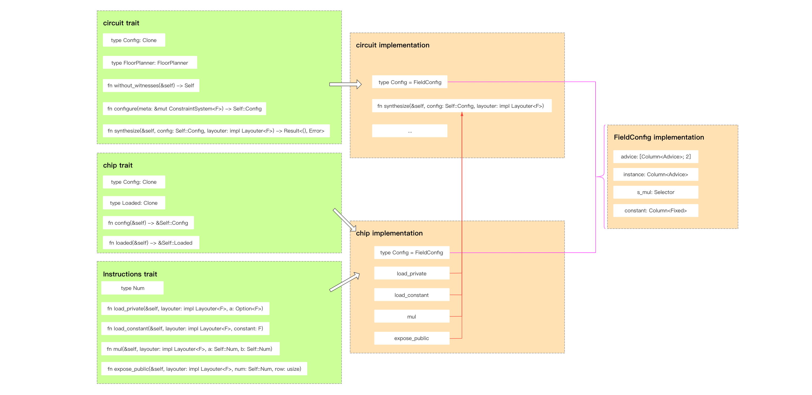

> author: [@Demian](https://github.com/Demian101)
>
> references: [https://learn.0xparc.org/halo2/](https://learn.0xparc.org/halo2/)

[TOC]
### Overview




### 简单例子

我们先从一个简单的电路开始，介绍常用的 API 以及它们的使用方法。 该电路将采用 public input `c`，并将证明两个 private inputs $a$ and $b$ 的知识，以使
$$ a^2 \cdot b^2=c$$
#### [定义 instructions](https://zcash.github.io/halo2/user/simple-example.html#define-instructions)

首先，我们需要定义我们的电路所依赖的指令集(instructions)

Instructions 介于 high-level gadgets 和底层的电路操作之间。指令既可以细粒度也可以粗粒度，但在实践中，指令的功能应当足够小，这样可以重复使用；但又要足够大，这样可以优化它的实现。设计者应当在这两者之间取得平衡

对于我们的电路，我们将使用三个 instructions：
- 将 private number 加载到电路中。
- 两个数字相乘。
- 将数字公开(Expose) 为电路的 public input。

我们还需要一个代表数字的变量的类型(`type Num`)。指令接口(Instruction interfaces) 为其输入和输出提供关联类型(associated types)，以允许实现以对其优化目标最有意义的方式表示这些类型 (to allow the implementations to represent these in a way that makes the most sense for their optimization goals.)

```rust
trait NumericInstructions<F: Field>: Chip<F> {
    /// Variable representing a number. 用于表示一个数的变量
    type Num;

    /// Loads a number into the circuit as a private input. 加载隐私输入
    fn load_private(&self, layouter: impl Layouter<F>, a: Value<F>) -> Result<Self::Num, Error>;

    /// Loads a number into the circuit as a fixed constant.
    fn load_constant(&self, layouter: impl Layouter<F>, constant: F) -> Result<Self::Num, Error>;

    /// Returns `c = a * b`.
    fn mul(
        &self,
        layouter: impl Layouter<F>,
        a: Self::Num,
        b: Self::Num,
    ) -> Result<Self::Num, Error>;

    /// Exposes a number as a public input to the circuit.
    /// 将一个数置为电路的公开输入
    fn expose_public(
        &self,
        layouter: impl Layouter<F>,
        num: Self::Num,
        row: usize,
    ) -> Result<(), Error>;
}
```

Among them,
  - *Num* 用于适配此 interface 中处理的类型
  - _load_private_ 用于加载 witness
  - _load_constant_ 用于加载常量 (constant)
  - _mul_ 用于计算两个数字的乘法
  - _expose_public_ 用于设置实例 (instance)

#### [定义芯片的实现](https://zcash.github.io/halo2/user/simple-example.html#define-a-chip-implementation)

对于我们的电路，我们将构建一个[芯片(chip)](https://zcash.github.io/halo2/concepts/chips.html)，在有限域上实现提到的 Numeric Instruction (`trait NumericInstructions`)

> 如果您想开发自定义 chip，则需要去实现 Halo 2 的 _chip_ Trait
>
> 大多数时候，使用 Halo 2 进行电路开发不需要自己定义 Instructions 和 chip。 但如果你需要使用 Halo 2 没有提供的复杂算法，就需要自己实现（例如实现一种新兴的密码算法）。

```rust
/// 这块芯片将实现我们的指令集 instructions！
/// 芯片存储它们自己的配置，以及(如有必要的) 类型标记
struct FieldChip<F: Field> {
    config: FieldConfig,
    _marker: PhantomData<F>,
}
```

每一个"芯片"类型**都要实现 `Chip` trait** , `Chip` trait 定义了 `Layouter` 在 synthesizing 电路时可能需要的关于电路的某些属性，以及若将该芯片加载到电路所需要设置的任何初始状态
> synthesizing 电路 : 一般指的是类似 R1CS 那种写约束的意思

```rust
/// Every chip needs to implement the `Chip` trait !!
impl<F: FieldExt> Chip<F> for FieldChip<F> {
    type Config = FieldConfig;
    type Loaded = ();

    fn config(&self) -> &Self::Config {
        &self.config
    }

    fn loaded(&self) -> &Self::Loaded {
        &()
    }
}
```

#### [配置芯片](https://zcash.github.io/halo2/user/simple-example.html#configure-the-chip)

接下来需要为芯片 `chip` 配置好实现我们想要的功能所需要的那些列、置换、门（columns, permutations, and gates）：

```rust
/// 芯片 chip 的状态被存储在一个 FieldConfig 结构体中，它是在配置过程中由 chip 生成，
/// 并且存储在芯片内部 (type Config = FieldConfig;)
#[derive(Clone, Debug)]
struct FieldConfig {
    /// 对于这块芯片，我们将用到两个 advice 列来实现我们的指令集。
    /// 它们也是我们与电路其他部分进行通信的列。
    advice: [Column<Advice>; 2],
    instance: Column<Instance>, // public input 列（instance）

    // 我们需要一个 selector 来激活乘法门，在用不到 `NumericInstructions::mul`指令的 cells
    // 上不设置任何约束。这非常重要，尤其在构建更大型的电路的情况下，列会被多条指令集用到
    s_mul: Selector,
}
```

下面我们来构建约束 :
 - 最关键的函数 _configure_ 和 _enable_equality_ 用于检查传入参数的相等性
 - 如下图 : 在 `create_gate` 函数中 :
	 - 乘数 $(a, \ \ b)$ 分别在同一行的 $a_0 , \ \ a_1$  advice 列  ;
	 - 乘积 $(out)$  和 $a$ 同在 $a_0$ 列, $out$ 在 $a$  的下一行 :
 -  可以看到在代码中, 都是使用相对位置(relative position) 来描述的 !
```rust
// | a0  | a1  | s_mul |
// |-----|-----|-------|
// | lhs | rhs | s_mul |
// | out |     |       |
let lhs = meta.query_advice(advice[0], Rotation::cur());
let rhs = meta.query_advice(advice[1], Rotation::cur());
let out = meta.query_advice(advice[0], Rotation::next()); // Attention !!
```

最后函数返回多项式约束：
 - 若选择器(Selector) `s_mul` 不为 0，则**激活**校验乘法约束 :
	 - 当 `s_mul * (lhs * rhs - out) == 0`，则说明 _lhs * rhs = out_ 约束成立；
	 - 当 `s_mul * (lhs * rhs - out) != 0`，说明  _lhs * rhs = out_ 约束不成立！！程序报错
 - 若 `s_mul` 为 0，则**不会激活**检查乘法约束，any subsequent values are fine！

```rust
impl<F: FieldExt> FieldChip<F> {
    fn construct(config: <Self as Chip<F>>::Config) -> Self {
        Self {
            config,
            _marker: PhantomData,
        }
    }

    fn configure(
        meta: &mut ConstraintSystem<F>,
        advice: [Column<Advice>; 2],
        instance: Column<Instance>,
        constant: Column<Fixed>,
    ) -> <Self as Chip<F>>::Config {
        meta.enable_equality(instance);
        meta.enable_constant(constant);
        for column in &advice {
            meta.enable_equality(*column);
        }
        let s_mul = meta.selector();

        // 定义我们的乘法门（multiplication gate）
        meta.create_gate("mul", |meta| {
            // To implement multiplication, we need 3 advice `cells`
            // and 1 selector.  We arrange them like so:
            //
            // | a0  | a1  | s_mul |
            // |-----|-----|-------|
            // | lhs | rhs | s_mul |
            // | out |     |       |
            //
            // 门可以用任意相对偏移(relative offsets)，但每一个 offset 都会增加证明的开销
            // 最常见的偏移值 offset 是 0 (当前行), 1(下一行), -1(上一行)。
            // 这 3 种情况 `Rotation` 都有特定的 constructors : cur/next/prev
            let lhs = meta.query_advice(advice[0], Rotation::cur());
            let rhs = meta.query_advice(advice[1], Rotation::cur());
            let out = meta.query_advice(advice[0], Rotation::next());
            let s_mul = meta.query_selector(s_mul);

            // Finally, we return the polynomial expressions that constrain this gate.
            // 最终，我们将约束门的多项式表达式返回. 对于目前的乘法门，仅需要一个多项式约束
            //
            // `create_gate` 函数返回的多项式表达式，在 proving system 中会被约束等于 0.
            // 约束表达式有以下性质：
            // - 当 s_mul = 0 时，lhs, rhs, out 可以是任意值。
            // - 当 s_mul != 0 时，lhs, rhs, out 需要满足 lhs * rhs = out 这条约束。
            vec![s_mul * (lhs * rhs - out)]
        });

        FieldConfig {
            advice,
            instance,
            s_mul,
        }
    }
}
```

到目前为止，我们对电路的实现的大致过程是：
1. 定义一套指令集（NumericInstructions），这是一套操作码，用来控制"计算机"(芯片)
2. 变出一块芯片（定义在有限域上），就像是一块电路板
3. 有了”指令集“和”电路板“，我们可以选择一些元件来对该电路板子实现特定功能(struct FieldConfig)，例如，如果想实现声控功能，我们需要电容麦，模拟-数字转换器 (ADC)，二极管... 在 halo2 中，我们就需要选取需要的 column: advice/instance/constant/selectors ....
4. 有了这些元器件，我们需要按照执行逻辑将其连接起来(fn configure())


#### [实现 chip Traits](https://trapdoor-tech.github.io/halo2-book-chinese/user/simple-example.html#%E5%AE%9E%E7%8E%B0%E8%8A%AF%E7%89%87%E5%8A%9F%E8%83%BD)

我们前面定义的 `instructions interface` 需要 implemention，定义 `NumericInstructions` 的实现就是封装 finite field elements.

It should be noted that, 除了行和列之外，Cell 单元的位置还可以通过相对位置偏移(relative position offset) 来确定)

> Generally, there are `3` types of offsets, `0` representing the current position, `1` representing the next position, and `-1` representing the previous position.

```rust
struct Number<F: Field>(AssignedCell<F, F>); /// 用于表示数的 struct

impl<F: FieldExt> NumericInstructions<F> for FieldChip<F> {
    type Num = Number<F>;
    fn load_private(){ ... }
    fn load_constant(){ ... }

    fn mul(
        &self,
        mut layouter: impl Layouter<F>,
        a: Self::Num,
        b: Self::Num,
    ) -> Result<Self::Num, Error> {
        let config = self.config();

        layouter.assign_region(
            || "mul",
            |mut region: Region<'_, F>| {
                // 在此 region 中，我们只想用一个乘法门，所以我们在 region offset=0 处激活它；
                // 这意味着它将对 offsets 0 and 1 处的 2 个 cells 都进行约束(为啥？)
                config.s_mul.enable(&mut region, 0)?;

                // 给我们的输入(a: Self::Num / b: Self::Num,) 有可能在电路的任何位置.
                // 但在region 中，我们只能依靠相对偏移。所以我们需要在 region 内分配新的 cells
                // 并限制新分配的 cells 的值 与输入(a: Self::Num / b: Self::Num,) 的值相等。
                a.0.copy_advice(|| "lhs", &mut region, config.advice[0], 0)?;
                b.0.copy_advice(|| "rhs", &mut region, config.advice[1], 0)?;

                // 现在我们可以把乘积放到输出的位置了。
                let value = a.0.value().copied() * b.0.value();

				// 最后，我们对输出进行赋值，返回一个要在电路的另一部分使用的变量
                region
                    .assign_advice(|| "lhs * rhs", config.advice[0], 1, || value)
                    .map(Number)
            },
        )
    }
    fn expose_public(
        &self,
        mut layouter: impl Layouter<F>,
        num: Self::Num,
        row: usize,
    ) -> Result<(), Error> {
        let config = self.config();

        layouter.constrain_instance(num.0.cell(), config.instance, row)
    }
}
```

#### [构建电路](https://trapdoor-tech.github.io/halo2-book-chinese/user/simple-example.html#%E6%9E%84%E9%80%A0%E7%94%B5%E8%B7%AF)

现在我们有了所需的指令以及实现它们的芯片，我们终于可以构建我们的电路了！

**circuit** Trait 是电路开发的入口。 我们需要定义自己的电路结构并访问 *witness* input

struct `MyCircuit` :
 - 在这个结构体中，我们保存隐私输入变量。我们使用  `Option<F>` 类型是因为，在生成密钥阶段，他们不需要有任何的值。在证明阶段中，如果它们任一为 `None` 的话，将得到一个错误。

The interfaces defined before are all used here. _configure_ creates a storage column for advice/instance/constant. _synthesize_ uses a custom chip to get the input witness and constant, and finally, calculate the result and return the public input.

In fact, it can satisfy most scenarios by simply implementing the _circuit_ trait for general circuit development. Some common functions of the chip have already been implemented in Halo 2.

```rust
// Store the private input variables in this circuit.
// Value<F> 用了 Option<F>,  因为在 key generation 阶段这个 struct 不会有值
// 而在 Proving 阶段，如果任意位置为空就会 throw Error.
struct MyCircuit<F: Field> {
    constant: F,
    a: Value<F>,
    b: Value<F>,
}

impl<F: Field> Circuit<F> for MyCircuit<F> {
    // 因为 we are using a single chip for everything，所以我们可以重用它的配置。
    type Config = FieldConfig;  // 电路元件(column(advice/instance/selector..))
    type FloorPlanner = SimpleFloorPlanner;

    fn without_witnesses(&self) -> Self {
        Self::default()
    }

    fn configure(meta: &mut ConstraintSystem<F>) -> Self::Config {
        // 我们创建两个 advice 列，作为 FieldChip 的 I/O.
        let advice = [meta.advice_column(), meta.advice_column()];

        // 我们还需要一个 instance 列来存储公开输入 public inputs.
        let instance = meta.instance_column();

        // 创建一个 fixed 列来加载常数 load constants.
        let constant = meta.fixed_column();

        FieldChip::configure(meta, advice, instance, constant)
    }
    // Prove a2⋅b2 = c
    fn synthesize(
        &self,
        config: Self::Config,
        mut layouter: impl Layouter<F>,
    ) -> Result<(), Error> {
        let field_chip = FieldChip::<F>::construct(config);

        // 将我们的隐私值加载到电路中。
        let a = field_chip.load_private(layouter.namespace(|| "load a"), self.a)?;
        let b = field_chip.load_private(layouter.namespace(|| "load b"), self.b)?;

        // 将常数因子加载到电路中
        let constant =
            field_chip.load_constant(layouter.namespace(|| "load constant"), self.constant)?;

        // 我们仅有乘法可用，因此我们按以下方法实现电路：
        //     asq  = a * a
        //     bsq  = b * b
        //     absq = asq * bsq
        //     c    = constant * asq*bsq
        //
        // 但是，按下面的方法实现，更加高效:
        //     ab   = a*b
        //     absq = ab^2
        //     c    = constant*absq
        let ab = field_chip.mul(layouter.namespace(|| "a * b"), a, b)?;
        let absq = field_chip.mul(layouter.namespace(|| "ab * ab"), ab.clone(), ab)?;
        let c = field_chip.mul(layouter.namespace(|| "constant * absq"), constant, absq)?;

        // 将结果作为电路的公开输入进行公开
        field_chip.expose_public(layouter.namespace(|| "expose c"), c, 0)
    }
} }
```

#### [测试电路](https://zcash.github.io/halo2/user/simple-example.html#testing-the-circuit)

我们在 chapter about tools 中提到的 _MockProver_ 和 _CircuitLayout_ 可以派上用场

可以用 `halo2::dev::MockProver` 来测试一个电路是否正常工作。构造电路的一组 Private/Public input ，这组输入可直接用来计算合法证明，但我们把这组输入传入到 `MockProver::run` 函数中之后，就能得到一个可用于检验电路中每一条约束是否满足的对象。而且电路验证不过，这个对象还能输出那条不满足的约束

如下代码 , `MockProver::run`  中只知道 Public input `c` , 他并不知道 Private 是什么, 但仍可以进行验证

```rust
fn main() {
    // 我们电路的行数不能超过 2^k. 因为我们的示例电路很小，我们选择一个较小的值
    let k = 4;

    // 准备好电路的隐私输入和公开输入
    let constant = Fp::from(7);
    let a = Fp::from(2);
    let b = Fp::from(3);
    let c = constant * a.square() * b.square();  // 算出来

    // 用隐私输入来实例化电路
    let circuit = MyCircuit {
        constant,
        a: Value::known(a),
        b: Value::known(b),
    };

    // 将公开输入进行排列。乘法的结果被我们放置在 instance 列的第0行，
    // 所以我们把它放在公开输入的对应位置。
    let mut public_inputs = vec![c];

    // 给定正确的公开输入，我们的电路能验证通过
    let prover = MockProver::run(k, &circuit, vec![public_inputs.clone()]).unwrap();
    assert_eq!(prover.verify(), Ok(()));

    // 如果我们尝试用其他的公开输入(此处是 +1)，证明将失败！
    public_inputs[0] += Fp::one();
    let prover = MockProver::run(k, &circuit, vec![public_inputs]).unwrap();
    assert!(prover.verify().is_err());
}
```

### Code Ref / [Full example](https://zcash.github.io/halo2/user/simple-example.html#full-example)

You can find the source code for this example [here](https://github.com/zcash/halo2/tree/main/halo2_proofs/examples/simple-example.rs).

```bash
cargo run --example simple-example
```

### References:
 - [Jason Morton halo2 codes](https://github.com/jasonmorton/halo2-examples/blob/master/src/fibonacci/example1.rs)
 - [ZCash halo2 books](https://zcash.github.io/halo2/user/simple-example.html#define-a-chip-implementation)
 - [trapdoor-tech halo2 book](https://trapdoor-tech.github.io/halo2-book-chinese/user/simple-example.html)
 - [icemelon/HaiCheng Shen](https://github.com/icemelon/halo2-examples/blob/master/src/fibonacci/example3.rs)
 - [0xPARC halo2](https://learn.0xparc.org/)

### ----- 中文版本 End ------


### Simple Example

Let's start with a simple circuit, to introduce you to the common APIs and how they are used. The circuit will take a public input c, and will prove knowledge of two private inputs $a$ and $b$ such that
$$ a^2 \cdot b^2=c$$
#### [Define instructions](https://zcash.github.io/halo2/user/simple-example.html#define-instructions)

Instructions are the boundary between high-level [gadgets](https://zcash.github.io/halo2/concepts/gadgets.html) and the low-level circuit operations. Instructions may be as coarse or as granular as desired, but in practice you want to strike a balance between an instruction being large enough to effectively optimize its implementation, and small enough that it is meaningfully reusable.

For our circuit, we will use three instructions:
- Load a private number into the circuit.
- Multiply two numbers.
- Expose a number as a public input to the circuit. (将一个数设置为电路的公开输入)


We also need a type for a variable representing a number. Instruction interfaces provide associated types for their inputs and outputs, to allow the implementations to represent these in a way that makes the most sense for their optimization goals.
我们还需要一个代表数字的变量的类型。指令接口为其输入和输出提供关联类型，以允许实现以对其优化目标最有意义的方式表示这些类型

```rust
trait NumericInstructions<F: Field>: Chip<F> {
    /// Variable representing a number. 用于表示一个数的变量
    type Num;

    /// Loads a number into the circuit as a private input. 隐私输入
    fn load_private(&self, layouter: impl Layouter<F>, a: Value<F>) -> Result<Self::Num, Error>;

    /// Loads a number into the circuit as a fixed constant.
    fn load_constant(&self, layouter: impl Layouter<F>, constant: F) -> Result<Self::Num, Error>;

    /// Returns `c = a * b`.
    fn mul(
        &self,
        layouter: impl Layouter<F>,
        a: Self::Num,
        b: Self::Num,
    ) -> Result<Self::Num, Error>;

    /// Exposes a number as a public input to the circuit.
    /// 将一个数置为电路的公开输入
    fn expose_public(
        &self,
        layouter: impl Layouter<F>,
        num: Self::Num,
        row: usize,
    ) -> Result<(), Error>;
}
```

Among them,
 - *Num* is used to adapt to the type handled in this interface, (适配该接口中处理的类型)
 - _load_private_ is used to load witness,
 - _load_constant_ is used to load constants, 
 - _mul_ is used to calculate the multiplication of two numbers, and 
 - _expose_public_ is used to set instance.

#### [Define a chip implementation](https://zcash.github.io/halo2/user/simple-example.html#define-a-chip-implementation)

定义芯片的实现 : For our circuit, we will build a [chip](https://zcash.github.io/halo2/concepts/chips.html) that provides the above numeric instructions for a finite field.

If you want to develop a custom chip, you need to implement the _chip_ trait of Halo 2.

Most of the time, using Halo 2 for circuit development does not need to define instructions and chips by oneself. But if you need to use complex ones that Halo 2 does not provide, you need to implement them yourself, such as implementing an emerging(新兴的) cryptographic algorithm.

```rust
/// 这块芯片将实现我们的指令集！芯片存储它们自己的配置，
struct FieldChip<F: Field> {
    config: FieldConfig,
    _marker: PhantomData<F>,
}
```

Every chip needs to implement the  `Chip`  trait.  This defines the properties of the chip that a `Layouter` may rely on when synthesizing a circuit, as well as enabling any initial state that the chip requires to be loaded into the circuit.
每一个"芯片"类型都要实现 `Chip` trait , `Chip` trait 定义了 `Layouter` 在 synthesizing 电路时可能需要的关于电路的某些属性，以及若将该芯片加载到电路所需要设置的任何初始状态
> synthesizing 电路 : 一般指的是类似 R1CS 那种写约束的意思

```rust
impl<F: FieldExt> Chip<F> for FieldChip<F> {
    type Config = FieldConfig;
    type Loaded = ();

    fn config(&self) -> &Self::Config {
        &self.config
    }

    fn loaded(&self) -> &Self::Loaded {
        &()
    }
}
```

#### [Configure the chip](https://zcash.github.io/halo2/user/simple-example.html#configure-the-chip)

The chip needs to be configured with the columns, permutations, and gates that will be required to implement all of the desired instructions.  (需要为芯片配置好实现我们想要的功能所需要的那些列、置换、门) :
```rust
#![allow(unused)]
fn main() {
/// 芯片的状态被存储在一个 config 结构体中，它是在配置过程中由芯片生成，
/// 并且存储在芯片内部。
#[derive(Clone, Debug)]
struct FieldConfig {
    /// 对于这块芯片，我们将用到两个 advice 列来实现我们的指令集。
    /// 它们也是我们与电路的其他部分通信所需要用到列。
    advice: [Column<Advice>; 2],
    instance: Column<Instance>, //公开输入（instance）列

    // 我们需要一个 selector 来激活乘法门，从而在用不到`NumericInstructions::mul`指令的
    //cells 上不设置任何约束。这非常重要，尤其在构建更大型的电路的情况下，列会被多条指令集用到
    s_mul: Selector,

    /// 用来加载常数的 fixed 列
    constant: Column<Fixed>,
}
```

下面我们来构建约束 :
 - the most critical functions _configure_ and _enable_equality_ are used to check the equality of the incoming parameters(传入的参数).
 - 如下图 : 在 `create_gate` 函数中 :
	 - 乘数 $(a, \ \ b)$ 分别在同一行的 $a_0 , \ \ a_1$  advice 列  ;
	 - 乘积 $(out)$  和 $a$ 同在 $a_0$ 列, $out$ 在 $a$  的下一行 :
 -  可以看到在代码中, 都是使用 相对位置来描述的 !
```rust
// | a0  | a1  | s_mul |
// |-----|-----|-------|
// | lhs | rhs | s_mul |
// | out |     |       |
let lhs = meta.query_advice(advice[0], Rotation::cur());
let rhs = meta.query_advice(advice[1], Rotation::cur());
let out = meta.query_advice(advice[0], Rotation::next()); // Attention !!
```

最后函数返回多项式约束：
 - 若 `s_mul` 不为 0，则**激活**校验乘法约束 :
	 - 当 `s_mul * (lhs * rhs - out) == 0`，则 _lhs * rhs = out_ 约束成立；
	 - 当 `s_mul * (lhs * rhs - out) != 0`， _lhs * rhs = out_ 约束不成立；程序报错
 - 若 `s_mul` 为 0，则**不会激活**检查乘法约束，any subsequent values are fine

```rust
impl<F: FieldExt> FieldChip<F> {
    fn construct(config: <Self as Chip<F>>::Config) -> Self {
        Self {
            config,
            _marker: PhantomData,
        }
    }

    fn configure(
        meta: &mut ConstraintSystem<F>,
        advice: [Column<Advice>; 2],
        instance: Column<Instance>,
        constant: Column<Fixed>,
    ) -> <Self as Chip<F>>::Config {
        meta.enable_equality(instance.into());
        meta.enable_constant(constant);
        for column in &advice {
            meta.enable_equality((*column).into());
        }
        let s_mul = meta.selector();

        // 定义我们的乘法门
        meta.create_gate("mul", |meta| {
            // To implement multiplication, we need 3 advice `cells`
            // and 1 selector.  We arrange them like so:
            //
            // | a0  | a1  | s_mul |
            // |-----|-----|-------|
            // | lhs | rhs | s_mul |
            // | out |     |       |
            //
            // 门可以用任一相对偏移，但每一个不同的偏移都会对证明增加开销。
            // 最常见的偏移值是 0 (当前行), 1(下一行), -1(上一行)。
            // 针对这三种情况，有特定的构造函数来构造`Rotation` 结构。
            let lhs = meta.query_advice(advice[0], Rotation::cur());
            let rhs = meta.query_advice(advice[1], Rotation::cur());
            let out = meta.query_advice(advice[0], Rotation::next());
            let s_mul = meta.query_selector(s_mul);

            // 最终，我们将约束门的多项式表达式返回。
            // 对于我们的乘法门，我们仅需要一个多项式约束。
            //
            // `create_gate` 函数返回的多项式表达式，在证明系统中一定等于0。
            // 我们的表达式有以下性质：
            // - 当 s_mul = 0 时，lhs, rhs, out 可以是任意值。
            // - 当 s_mul != 0 时，lhs, rhs, out 将满足 lhs * rhs = out 这条约束。
            vec![s_mul * (lhs * rhs - out)]
        });

        FieldConfig {
            advice,
            instance,
            s_mul,
            constant,
        }
    }
}
}
```

#### [Implement chip Traits](https://trapdoor-tech.github.io/halo2-book-chinese/user/simple-example.html#%E5%AE%9E%E7%8E%B0%E8%8A%AF%E7%89%87%E5%8A%9F%E8%83%BD)

The `instructions interface` we defined earlier needs to be implemented, and defining the implementation of Number is to en**capsul**ate(封装) finite field elements.

 It should be noted that, in addition to row and column, the position of the cell can also be determined by the relative position offset  (除了行和列之外，单元的位置还可以通过相对位置偏移来确定).

 Generally, there are `3` types of offsets, 0 representing the current position, `1` representing the next position, and `-1` representing the previous position.

```rust
/// A variable representing a number.
#[derive(Clone)]
struct Number<F: Field>(AssignedCell<F, F>);

impl<F: Field> NumericInstructions<F> for FieldChip<F> {
    type Num = Number<F>;
    fn load_private(
        &self,
        mut layouter: impl Layouter<F>,
        value: Value<F>,
    ) -> Result<Self::Num, Error> {
        let config = self.config();

        layouter.assign_region(
            || "load private",
            |mut region| {
                region
                    .assign_advice(|| "private input", config.advice[0], 0, || value)
                    .map(Number)
            },
        )
    }

    fn load_constant(
        &self,
        mut layouter: impl Layouter<F>,
        constant: F,
    ) -> Result<Self::Num, Error> {
        let config = self.config();

        layouter.assign_region(
            || "load constant",
            |mut region| {
                region
                    .assign_advice_from_constant(|| "constant value", config.advice[0], 0, constant)
                    .map(Number)
            },
        )
    }

	fn mul(
		&self,
		mut layouter: impl Layouter<F>,
		a: Self::Num,
		b: Self::Num,
	) -> Result<Self::Num, Error> {
		let config = self.config();

		layouter.assign_region(
			|| "mul",
			|mut region: Region<'_, F>| {
				// We only want to use a single multiplication gate in this region,
				// so we enable it at region offset 0; this means it will constrain
				// cells at offsets 0 and 1.
				config.s_mul.enable(&mut region, 0)?;

				// The inputs we've been given could be located anywhere in the circuit,
				// but we can only rely on relative offsets inside this region. So we
				// assign new cells inside the region and constrain them to have the
				// same values as the inputs.
				a.0.copy_advice(|| "lhs", &mut region, config.advice[0], 0)?;
				b.0.copy_advice(|| "rhs", &mut region, config.advice[1], 0)?;

				// Now we can assign the multiplication result, which is to be assigned
				// into the output position.
				let value = a.0.value().copied() * b.0.value();

				// Finally, we do the assignment to the output, returning a
				// variable to be used in another part of the circuit.
				region
					.assign_advice(|| "lhs * rhs", config.advice[0], 1, || value)
					.map(Number)
			},
		)
	}
```

#### [Build the Circuit](https://trapdoor-tech.github.io/halo2-book-chinese/user/simple-example.html#%E6%9E%84%E9%80%A0%E7%94%B5%E8%B7%AF)

既然我们已经有了所需要的指令，以及一块实现了这些指令的芯片，我们终于可以构造示例电路啦

The **circuit** trait is the entrance to the circuit development. We need to define our own circuit structure and access the *witness* input.

struct `MyCircuit` :
 - 在这个结构体中，我们保存隐私输入变量。我们使用  `Option<F>` 类型是因为，在生成密钥阶段，他们不需要有任何的值。在证明阶段中，如果它们任一为 `None` 的话，将得到一个错误。

The interfaces defined before are all used here. _configure_ creates a storage column for advice/instance/constant. _synthesize_ uses a custom chip to get the input witness and constant, and finally, calculate the result and return the public input.

In fact, it can satisfy most scenarios by simply implementing the _circuit_ trait for general circuit development. Some common functions of the chip have already been implemented in Halo 2.

```rust
struct MyCircuit<F: FieldExt> {
    constant: F,
    a: Option<F>,
    b: Option<F>,
}

impl<F: FieldExt> Circuit<F> for MyCircuit<F> {
    // 因为我们在任一地方值用了一个芯片，所以我们可以重用它的配置。
    type Config = FieldConfig;
    type FloorPlanner = SimpleFloorPlanner;

    fn without_witnesses(&self) -> Self {
        Self::default()
    }

    fn configure(meta: &mut ConstraintSystem<F>) -> Self::Config {
        // 我们创建两个 advice 列，作为 FieldChip 的输入。
        let advice = [meta.advice_column(), meta.advice_column()];

        // 我们还需要一个 instance 列来存储公开输入。
        let instance = meta.instance_column();

        // 创建一个 fixed 列来加载常数
        let constant = meta.fixed_column();

        FieldChip::configure(meta, advice, instance, constant)
    }
    // Prove a2⋅b2 = c
    fn synthesize(
        &self,
        config: Self::Config,
        mut layouter: impl Layouter<F>,
    ) -> Result<(), Error> {
        let field_chip = FieldChip::<F>::construct(config);

        // 将我们的隐私值加载到电路中。
        let a = field_chip.load_private(layouter.namespace(|| "load a"), self.a)?;
        let b = field_chip.load_private(layouter.namespace(|| "load b"), self.b)?;

        // 将常数因子加载到电路中
        let constant =
            field_chip.load_constant(layouter.namespace(|| "load constant"), self.constant)?;

        // 我们仅有乘法可用，因此我们按以下方法实现电路：
        //     asq  = a*a
        //     bsq  = b*b
        //     absq = asq*bsq
        //     c    = constant*asq*bsq
        //
        // 但是，按下面的方法实现，更加高效:
        //     ab   = a*b
        //     absq = ab^2
        //     c    = constant*absq
        let ab = field_chip.mul(layouter.namespace(|| "a * b"), a, b)?;
        let absq = field_chip.mul(layouter.namespace(|| "ab * ab"), ab.clone(), ab)?;
        let c = field_chip.mul(layouter.namespace(|| "constant * absq"), constant, absq)?;

        // 将结果作为电路的公开输入进行公开
        field_chip.expose_public(layouter.namespace(|| "expose c"), c, 0)
    }
} }
```

#### [Testing the circuit](https://zcash.github.io/halo2/user/simple-example.html#testing-the-circuit)

The _MockProver_ and _CircuitLayout_ that we mentioned in the chapter about tools can come in handy (派上用场).

可以用 `halo2::dev::MockProver` 来测试一个电路是否正常工作。构造电路的一组 Private/Public input ，这组输入可直接用来计算合法证明，但我们把这组输入传入到 `MockProver::run` 函数中之后，就能得到一个可用于检验电路中每一条约束是否满足的对象。而且电路验证不过，这个对象还能输出那条不满足的约束

如下代码 , `MockProver::run`  中只知道 Public input `c` , 他并不知道 Private 是什么, 但仍可以进行验证

```rust
fn main() {
    // 我们电路的行数不能超过 2^k. 因为我们的示例电路很小，我们选择一个较小的值
    let k = 4;

    // 准备好电路的隐私输入和公开输入
    let constant = Fp::from(7);
    let a = Fp::from(2);
    let b = Fp::from(3);
    let c = constant * a.square() * b.square();  // 算出来

    // 用隐私输入来实例化电路
    let circuit = MyCircuit {
        constant,
        a: Value::known(a),
        b: Value::known(b),
    };

    // 将公开输入进行排列。乘法的结果被我们放置在 instance 列的第0行，
    // 所以我们把它放在公开输入的对应位置。
    let mut public_inputs = vec![c];

    // 给定正确的公开输入，我们的电路能验证通过
    let prover = MockProver::run(k, &circuit, vec![public_inputs.clone()]).unwrap();
    assert_eq!(prover.verify(), Ok(()));

    // 如果我们尝试用其他的公开输入(此处是 +1)，证明将失败！
    public_inputs[0] += Fp::one();
    let prover = MockProver::run(k, &circuit, vec![public_inputs]).unwrap();
    assert!(prover.verify().is_err());
}
```

### Code Ref / [Full example](https://zcash.github.io/halo2/user/simple-example.html#full-example)

You can find the source code for this example [here](https://github.com/zcash/halo2/tree/main/halo2_proofs/examples/simple-example.rs).

```bash
cargo run --example simple-example
```


### ----- 问题 Question -----

1.

这意味着它将对 offsets 0 and 1 处的 2 个 cells 都进行约束(为啥？)

```rust
config.s_mul.enable(&mut region, 0)?;
```


2.

奇怪的一点是，在 `fn mul() `函数中，既然已经使用了参数 a: Self::Num, b: Self::Num, 设置了 lhs Cell 和 rhs Cell，那么 a.cell 和 lhs、 b.cell 和 rhs 肯定就是相等的，为什么还要再 region.constrain_equal 约束一次呢？这个约束看起来是多余的且没有必要的？

```rust
// 在此 region 中，我们只想用一个乘法门，所以我们在 region offset=0 处激活它；
// 这意味着它将对 offsets 0 and 1 处的 2 个 cells 都进行约束(为啥？)
config.s_mul.enable(&mut region, 0)?;

// 给我们的输入有可能在电路的任一位置，但在当前 region 中，我们仅可以用
// 相对偏移。所以，我们在 region 内分配新的 cells 并限定他们的值与输入 cells 的值相等。
let lhs = region.assign_advice(
	|| "lhs",
	config.advice[0], // 第 0 列 (advice 列)
	0,                // 第 0 行
	|| a.value.ok_or(Error::SynthesisError), // 放 a 的值进去
)?;
let rhs = region.assign_advice(
	|| "rhs",
	config.advice[1], // 第 1 列,
	0,                // 第 0 行
	|| b.value.ok_or(Error::SynthesisError),
)?;
region.constrain_equal(a.cell, lhs)?;
region.constrain_equal(b.cell, rhs)?;
```

GPT：
> 虽然 `lhs` 和 `rhs` 的值被设置为 `a.value` 和 `b.value`，但是这并不意味着它们在电路中是相等的。在电路的布局中，`a.cell` 和 `b.cell` 可能已经在其他位置被（意外地）赋值和约束过了。而在这个新的区域（region）中，为了进行乘法操作，你需要确保新分配的 `lhs` 和 `rhs` cells 与原始的 `a.cell` 和 `b.cell` 相等
>
> 这就是为什么 `region.constrain_equal` 是必要的：它确保了在这个区域（region）中的计算使用了正确的输入值
>
> 你可以将其视为一个安全性保障。如果没有这个约束，有可能会有其他的值进入这个区域，并可能导致电路生成错误的结果。通过加入这个约束，你确保了乘法操作是在正确的值上进行的。

目前的 halo2_proofs，一般直接使用 `copy_advice`：

```rust

```
