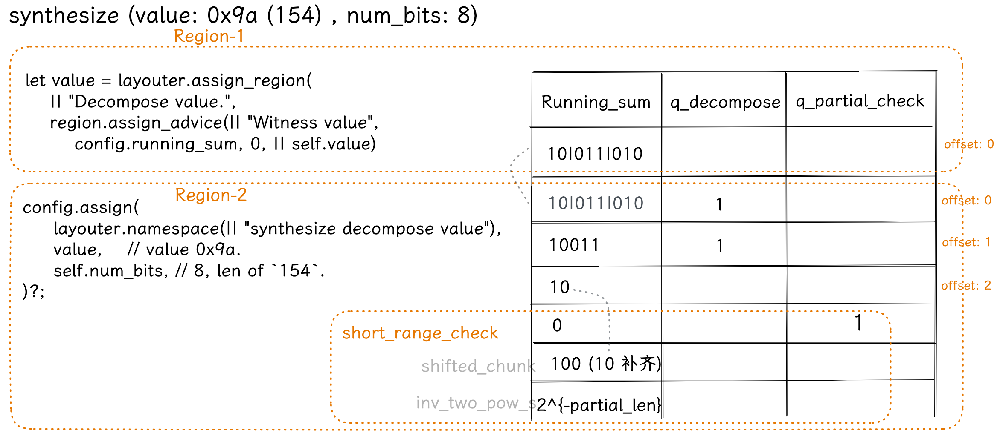
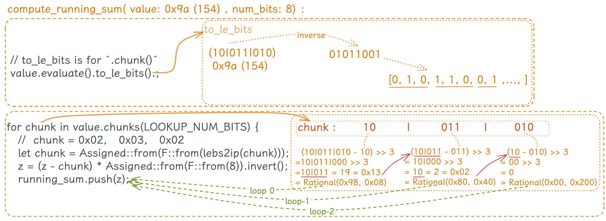
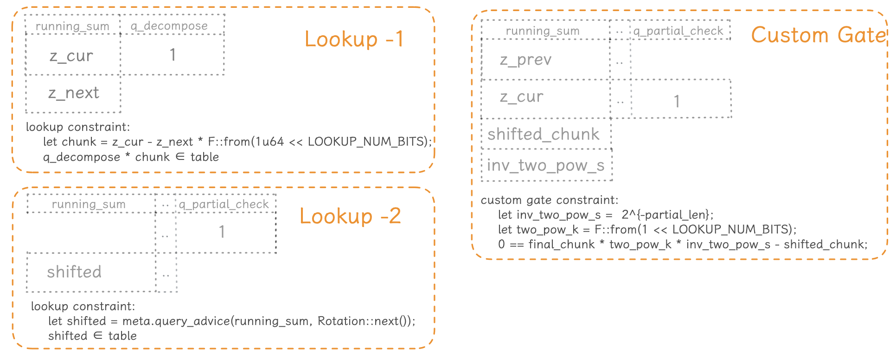
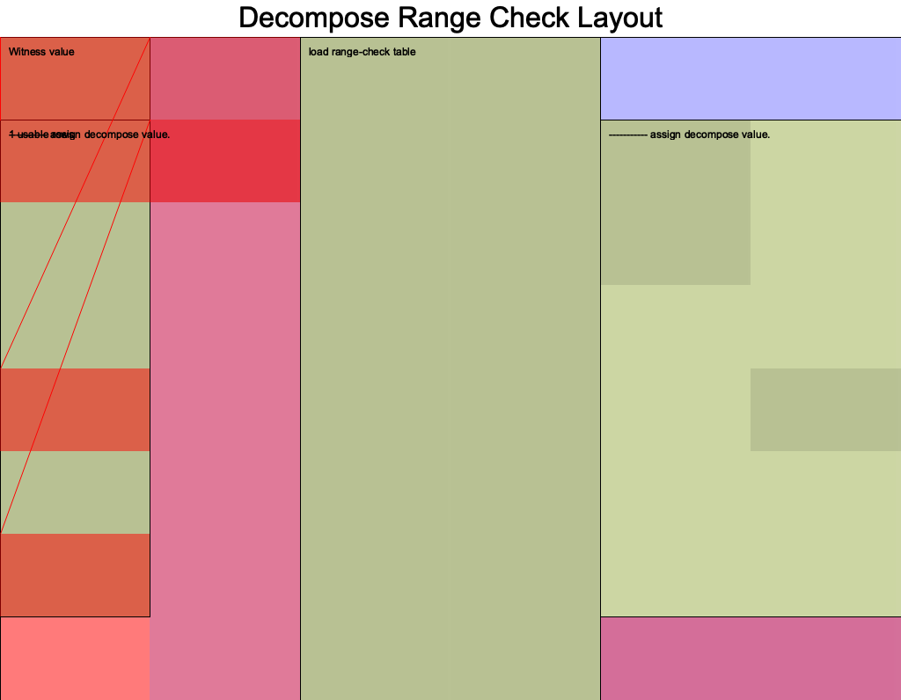

> - author: [@Demian](https://github.com/Demian101)
> - references: https://learn.0xparc.org/materials/halo2/learning-group-1/exercise-3
> - code:  https://github.com/icemelon/halo2-examples/pull/10/files

[TOC]

## background

一个数学事实：对于一个 $n$ 位二进制数如 $110011$，让其对 $2^m$ 取模，余数正好是该数的最低 $m$ 位，如 $m =4$ ：
$$
10\underbrace{1011}_{\quad} \pmod{2^4} = 1011
$$
这个事实比较显而易见，考虑二进制数的表示方法：
$$
2^0 \cdot b_0 + 2^1 \cdot b_1 + 2^2 \cdot b_2 + 2^3 \cdot b_3 + \ldots + 2^{n-1}  \cdot  b_{n-1}
$$
对于该数对 $2^m$ 取模的结果：
1. 所有 $\ge 2^m$ 的项（即 $2^m, \ 2^{m+1} ,\ldots$ ）都会被 $2^m$ 整除，模的结果都 $= 0$, 所以对取模的结果不会有影响或贡献
2. 所有 $< 2^m$ 的项都加起来才 $= 2^m -1 < 2^m$ ，所以 mod $2^m$  就等于其所有低位 (的和)

假设对于 $1100101$， 设 $m=3$  即  $\pmod{2^3}$  : 
$$
\begin{align*}
\textcolor{red}{ \underbrace{2^{n-1}  \cdot  b_{n-1}  + \ldots + 2^3 \cdot b_3}_{discard}} + \underbrace{2^2 \cdot b_2 + 2^1 \cdot b_1 + 2^0 \cdot b_0}_{retain}  \\
(1100101)_{2} \ \ \ \Rightarrow (\textcolor{red}{ \underbrace{1100}_{discard}}101)_{2}  \pmod{2^3} = 101
\end{align*}
$$
因此，对 $2^m$ 取模将保留原数的最低 $m$ 位，并且舍去所有更高的位

## Goal

对于一个 10000+ 的数字，使用 lookup Table 就需要一个对应的 10000+ 行的表来约束，这样的线性同步增长显然也是低效的。考虑设计一种算法，将一个大数表示分解（Decompose）成很多个小二进制数的组合如 `(101)(110)(011)(001)...`，然后对其分解的每个小 Group 进行分组约束

举个例子，对于 `value` = 165 （在二进制中为 `10100101`），这个 8 位二进制数，则 $N = 8$ 。 设 $K = 3$，也就是我们想将它分解为 3 位的块:

- $z_0 = value = 165$
- $c_0 = value \pmod{2^K} = 165 \ \ \% \ \ 2^3 = \textcolor{red}{5 = (101)_2}$

- $z_1 = (z_0 - c_0) * 2^{-K} = (165-5) \times \frac{1}{8} = 20$
- $c_1 = value \pmod{2^3} = 20 \ \ \% \ \ 2^3 = \textcolor{red}{4 = (100)_2}$
- (更新  $value = value / 2^3 = 20/8 =2$ )

- $z_2 = (z_1 - c_1) * 2^{-K} = (20 - 4)  \times \frac{1}{8} = 2$
- $c_2 = value \pmod{2^3} = 2 \ \ \% \ \ 2^3 = \textcolor{red}{2 = (010)_2}$
- (更新  $value = value / 2^3 = 2/8 =0$ )

> - $\pmod{2^K}$  是一个取  K 个低位的操作
> -   $* \ 2^K$  就是一个右移操作，上一步取完低位后，对于大数来说，我们需要将原来二进制数的高位落到低位，即让新的低位变成原来的高位，方便下一步再取低位。如此循环往复，不断取低位 -> 右移 -> 取低位 ... 直到把大数分解完毕

于是，我们可以得到： 

$$
\begin{align*}
 165 (10100101) &= 5 \textcolor{red}{(101)_2} + 2^3 * 4 (100) + 2^6 * 2 (010) \\
&= c_0 + 2^K * c_1  + 2^{2K} * c_2 + ... + 2^{(C-1)K} * c_{C-1}
\end{align*}
$$

这个方法的核心思想是将一个较长的二进制数分解成多个较小的二进制块。这样做的好处是可以通过查找表(range_check) 来验证这些小块是否都在正确的范围内，从而验证整个数字是否在预期的范围内。

> 看懂了这一部分后，就大概可以理解下面 Protocol 所表述的内容。

几个关键步骤：
1. **初始化 running sum** : 我们用该大二进制数字作为起始值。这个值随着每个步骤的进行会逐渐减小，直到它变为零。
2. **分解数字**: 在每个步骤中，我们从 running sum 中取出一个 K 位块。这就是用余数操作实现的。取出的这个块是当前 running sum 的最低 K 位
3. **更新 running sum**: 一旦取出一个块，就从 running sum 中减去它，并将结果除以 $2^K$ 。这实际上就是**移除已处理的 K 个低位（Little endian, 小端）**，并准备处理下一块
4. **验证**: 使用 `range_check` 查找表验证每个块是否在  $[0, 2^K)$  范围内
5. **终止条件**: 当 running sum 变为零时，整个数字已经完全分解。此时，我们已经验证了整个数字的每一个部分

此方法的优势是它可以有效地验证一个数字是否在给定的范围内，而不需要对整个数字进行查找。它只需要验证分解出来的每个小块。

> - $K$ 的选择可能主要依赖于想要构建的查找表的大小
> - 此方法提供了一个有效的方式来验证大数是否在给定的范围内，即 decompose 后，利用查找表(range_check) 来大幅度减少计算量。

### 图解：

如下是二进制数字 `593`，我们要将其分解为 `K=3` 位的块：

```bash
593 = 1001010001
    = 1 001 010 001

 _____ 数字 593 ________
|  1 | 001 | 010 | 001 |  
|____|_____|_____|_____|
```

**逐块分解**:  从最右侧开始（Little endian, 小端）逐步处理每个块，并更新 running sum :
1. 取第一个块(001)，更新 running sum：subtract (001) , 并右移 K (K=3) 位
2. 取第二个块(010)，更新running sum：subtract (010) , 并右移 K 位
3. ...

如果用户所持有的大数 value 和该 value 所有的块都在预期的范围内，那么整个数字也在预期的范围内。

## Protocol description : 

This gadget range-constrains an element witnessed in the circuit to be $N$ bits.

Internally, this gadget uses the `range_check` helper, which provides a $K$-bit
lookup table.

Given an element `value`, we use a running sum to break it into K-bit chunks.
**Assume** for now that  $N \mid K,$  and define $C = N / K$.

$$
\begin{align*}
value &= [b_0, b_1, ..., b_{N-1}]  \ \ \   (little-endian) \\
      &= c_0 + 2^K * c_1  + 2^{2K} * c_2 + ... + 2^{(C-1)K} * c_{C-1}
\end{align*}          
$$
> little-endian 表示小端，即一个二进制表示中相对较小的那些位数

Initialise the running sum at  $value = z_0$ .

Consequent terms of the running sum are  $z_{i+1} = (z_i - c_i) * 2^{-K}$ :

$$
\begin{align}
	z_1 &= (z_0 - c_0) * 2^{-K} \\
    z_2 &= (z_1 - c_1) * 2^{-K} \\
       ...  \\
z_{C-1} &= c_{C-1} \\
    z_C &= (z_{C-1} - c_{C-1}) * 2^{-K} \\
        &= 0 \\
\end{align}
$$

One configuration for this gadget could look like:

```
| running_sum |  q_decompose  |  q_decompose_short  |  table_value  |
---------------------------------------------------------------------
|     z_0     |       1       |          0          |       0       |
|     z_1     |       1       |          0          |       1       |
|     ...     |      ...      |         ...         |      ...      |
|   z_{C-1}   |       1       |          1          |      ...      |
|     z_C     |       0       |          0          |      ...      |
```

In the case where N is not a multiple of K, we have to handle a final chunk
that is `n` bits, where `n` < `K`. To do this:

- derive `z_C` from running sum
- witness `z_shifted` = $z_C * 2^{K - n}$
- assign a constant `shift` = $2^{-n}$

- constrain:
    - $z_C * 2^K * shift = z_{shifted}$

- lookup:
    - $z_C$ is in the range $[0..K)$
    - z_shifted is in the range $[0..K)$  (no underflow)

----

We constrain $K \leq 3$ for this helper.
$$\alpha = k_0 + (2^K) k_1 + (2^{2K}) k_2 + ... + (2^{(W-1)K}) k_{W-1}$$

$z_0$ is initialized as $\alpha$. Each successive $z_{i+1}$ is computed as
$$z_{i+1} = (z_{i} - k_i) / (2^K).$$
$z_W$ is constrained to be zero.

The difference between each interstitial running sum output is constrained
to be $K$ bits, i.e. `range_check`($k_i$,  $2^K$),

where
```text
  range_check(word)
    = word * (1 - word) * (2 - word) * ... * ((range - 1) - word)
```

Given that the `range_check` constraint will be toggled by a selector, in
practice we will have a `selector * range_check(word)` expression
of degree `range + 1`.

This means that $2^K$ has to be at most `degree_bound - 1` in order for
the range check constraint to stay within the degree bound.

This is a custom built version of the decompose running sum function.

## bottom-up 代码分析 

### 执行流程

这里面可以明确注意到函数体中描述的一些调用关系。

```rust
MyCircuit - configure() {
    DecomposeConfig::configure(meta, value);  
}

DecomposeConfig - configure() {
    let table = RangeTableConfig::configure(meta);
    meta.lookup(|meta| { ... } );  // Range-constrain each K-bit chunk
    meta.create_gate("final partial chunk");
    meta.lookup(|meta| { ... } );  // selector to handle the final partial chunk
}

RangeTableConfig - configure {
	let num_bits = meta.lookup_table_column();
	let value = meta.lookup_table_column();
}

MyCircuit - synthesize() {
    config.table.load(&mut layouter)?;
    let value = layouter.assign_region(
        region.assign_advice(|| "Witness value", config.running_sum, 0, || self.value);
        
    config.assign("synthesize decompose value", value, self.num_bits)
}

DecomposeConfig - assign(){
    
}
```

Decompose:
0. Copy in the witnessed `value` 
1. Compute the interstitial running sum values {z_0, ..., z_C}}
2. Assign the running sum values
3. Make sure to enable the relevant selector on each row of the running sum
4. Constrain the final running sum `z_C` to be 0.

### lookup table

```rust
// Lookup Table for Range Check
/// A lookup table of values up to LOOKUP_RANGE
/// e.g. LOOKUP_RANGE = 256, values = [0..255]
/// This table is tagged by an index `k`, where `k` is the number of bits of the element in the `value` column.
#[derive(Debug, Clone)]
pub(super) struct RangeTableConfig<F: PrimeField, const LOOKUP_NUM_BITS: usize, const LOOKUP_RANGE: usize> {
    pub(super) num_bits: TableColumn,
    pub(super) value: TableColumn,
    _marker: PhantomData<F>,
}
```

|num_bits|value|
|---|---|
|1|1|
|2|2|
|2|3|
|3|4|
|3|5|
|3|6|
|3|7|
|4|8|
|4|9|
|4|10|
|4|11|
|4|12|
|4|13|
|4|14|
|4|15|
|5|16|
| .. | .. |

如上图，比如，4 位 num_bits 可以表示的值是 `8 ~ 16-1`
为了适应对 8 字节数字 (u8) 的约束，查找表的大小通常被设计为 8 位，256 行：

```rust
LOOKUP_NUM_BITS == 8
LOOKUP_RANGE    == 2 << 8 == 256
```

对于每个具体的电路实现，_常量泛型(Const generics_) 都支持实现不同大小的查找表：
```rust
const LOOKUP_NUM_BITS: usize = 10;
const LOOKUP_RANGE: usize = 1 << LOOKUP_NUM_BITS;  // 1024.
let circuit = MyCircuit::<Fp, LOOKUP_NUM_BITS, LOOKUP_RANGE> {
	value,
	num_bits,
};
```

### synthesize

- 154 的 16 进制是 `0x9A` :
- 将 0x9A 赋值进 `config.running_sum`  col 的第一行
- 调用 `config.assign()` 

```rust
// `self.value`  is  `9a` , is the raw num itself.
let value = layouter.assign_region(
	|| "Witness value",
	|mut region| {
		region.assign_advice(|| "Witness value", config.running_sum, 0, || self.value)
	},
)?;

config.assign(
	layouter.namespace(|| "synthesize Decompose value"),
	value,    // value 0x9a.
	self.num_bits, // 8, the len of binary form of the num `154`.
)?;
```


### config.assign()

传入参数： 
 - value: `0x9a.`
 - num_bits :  `8` , 是 154 的二进制形式的长度
```rust
config.assign(
	layouter.namespace(|| "Decompose value"),
	value,    // value 0x9a.
	self.num_bits, // 8, the len of binary form of the num `154`.
)?;
```

assign() 函数:
 -  `compute_running_sum`  的计算原理

```rust
fn assign() {
    // 8 % 3 = 2, 所以最后一个 chunk 只有 2 位， 不足 3 位
    let partial_len = num_bits % LOOKUP_NUM_BITS; // 8 % 3 = 2
    
    /// ...

    let running_sum: Vec<_> = value
     .value()
     .map(|&v| compute_running_sum::<_, LOOKUP_NUM_BITS>(v, num_bits)) // 0x9a, 8
     .transpose_vec(expected_vec_len);
    
    // println!("running_sum {:?}", running_sum);
    /* running_sum : 
     Rational(0x98, 0x08)  ,   0x98 / 0x08 = 0x13 = 19 (decimal)
     Rational(0x80, 0x40)  ,   0x80 / 0x40 = 0x02 = 2 
     Rational(0x00, 0x200) ,   0x00 / 0x200= 0x00 = 0 (循环到这里结束.)
    */
```

将上一步计算出的 Running-sum 值循环放入 `self.running_sum` col 
```rust
	// 2. Assign the `running sum` values
	for z_i in running_sum.into_iter() {
		z = region.assign_advice(
			|| format!("assign z_{:?}", offset),
			self.running_sum,
			offset,
			|| z_i,
		)?;
		offset += 1;
	}
```




处理最高位的 chunk: 
 - 对于 decimal: 154 ， binary: 10|011|010 这个例子
 - 最高位的 `10|`  是不足 3 位的，所以需要后面补齐 (`short_range_check()`)
```rust
// Handle partial chunk
// println!("value.value(){:?}", value.value());
if partial_len > 0 { //  8 % 3 = 2
	// The final chunk, value.value():  Trivial(0x9a) i.e. 154
	let final_chunk = value.value().map(|v| {
		let v: Vec<_> = v
			.evaluate()
			.to_le_bits()
			.iter()
			.by_vals()
			.take(num_bits)
			.collect();
		
		//  println!("v .. {:?}", v) : [false, true, false, true, true, false, false, true]    
		//  i.e. [01011001] <-  这个是低位在前, 高位在后. 因为 154 的二进制表示是 [10011010]
		let final_chunk = &v[(num_bits - partial_len)..num_bits];
		// final_chunk: [false, true]    ;      println!("final_chunk{:?}", final_chunk);
		
		Assigned::from(F::from(lebs2ip(final_chunk))) // 0x02
	});
	// final_chunk: 0x02,  i.e. `10` in binary format.
	self.short_range_check(&mut region, offset - 1, final_chunk, partial_len)?;
}
```

### custom gate

这部分配置了 3 个 gate:

`meta.lookup(|meta| {...})` : 主 lookup gate，用来对主体块 chunk 进行区间约束

`meta.create_gate("final partial chunk", |meta| {...})`
- 处理特殊情况，当最后一个部分块的位数小于`LOOKUP_NUM_BITS`时，需要对其进行"shift"操作，以使其能够与完整的数据块对比 —— 

`meta.lookup(|meta| {...})`
- 第二个 lookup gate，用来对 shifted_chunk 进行区间约束。



### DecomposeConfig


```rust
struct DecomposeConfig<
    F: PrimeField + PrimeFieldBits,
    const LOOKUP_NUM_BITS: usize,  // 10 
    const LOOKUP_RANGE: usize,     // 1024
> {
    // You'll need an advice column to witness your running sum;
    running_sum: Column<Advice>,
    // A selector to constrain the running sum;
    q_decompose: Selector,
    // A selector to handle the final partial chunk
    q_partial_check: Selector,
    // And of course, the K-bit lookup table
    table: RangeTableConfig<F, LOOKUP_NUM_BITS, LOOKUP_RANGE>,
    _marker: PhantomData<F>,
}
```

约束 1：
$$z_{i+1} = (z_i - c_i) * 2^{-K}$$ 
```rust
// z_{i+1} = (z_i - c_i) / 2^K i.e.  `c_i = z_i - z_{i+1} * 2^K`.
// Range-constrain each K-bit chunk  `c_i = z_i - z_{i+1} * 2^K` derived from the running sum.
meta.lookup(|meta| {
	let q_decompose = meta.query_selector(q_decompose);

	// z_i
	let z_cur = meta.query_advice(running_sum, Rotation::cur());
	// z_{i+1}
	let z_next = meta.query_advice(running_sum, Rotation::next());
	// c_i = z_i - z_{i+1} * 2^K
	let chunk = z_cur.clone() - z_next.clone() * F::from(1u64 << LOOKUP_NUM_BITS);
	// println!("z_cur: {:?}, z_next: {:?} ,chunk: {:?}",z_cur, z_next ,chunk); // 0400

	// Lookup default value 0 when q_decompose = 0
	let not_q_decompose = Expression::Constant(F::ONE) - q_decompose.clone();
	let default_chunk = Expression::Constant(F::ZERO);

	vec![(
		q_decompose * chunk + not_q_decompose * default_chunk,
		table.value,
	)]
});
```

约束 2：

```rust
// Handle the final partial chunk.
// 用于处理二进制数的最后一个部分块 (高位 chunk)
// Shifted: 当我们到达 final chunk 且它的位数 < LOOKUP_NUM_BITS 时，
// 需要 "shift"这个块, 以使其能够与完整的块进行交互或对比
meta.create_gate("final partial chunk", |meta| {
	let q_partial_check = meta.query_selector(q_partial_check);

	// z_{C-1}
	let z_prev = meta.query_advice(running_sum, Rotation::prev());
	// z_C
	let z_cur = meta.query_advice(running_sum, Rotation::cur());
	// c_{C-1} = z_{C-1} - z_C * 2^K
	let final_chunk = z_prev - z_cur * F::from(1u64 << LOOKUP_NUM_BITS);

	// shifted_chunk final_chunk * 2^{K - num_bits}
	let shifted_chunk = meta.query_advice(running_sum, Rotation::next());

	// 2^{-num_bits}
	let inv_two_pow_s = meta.query_advice(running_sum, Rotation(2));

	let two_pow_k = F::from(1 << LOOKUP_NUM_BITS);
	let expr = final_chunk * two_pow_k * inv_two_pow_s - shifted_chunk;

	Constraints::with_selector(q_partial_check, [expr])
});
```

- 考虑这样一个情况：假设 LOOKUP_NUM_BITS = 4，但你的最后一个部分块只有 2 位，例如 '10'。为了确保此块能与其他完整的4位块进行适当的交互，我们将其左移为 '1000'。
- **inv_two_pow_s**: 这是 $2^{- num\_bits}$ 的值，其中 num_bits 是最后一个部分块的实际位数。这个值用于将 shifted_chunk "移回"到它原始的大小，以便我们可以对其进行适当的处理或检查。
- **expr**: 这个表达式确保 final_chunk 在经过移位处理后与 shifted_chunk 匹配。这是一个约束，它确保 shifted_chunk 正确地表示了 final_chunk。


----


从 Test 开始，以 `num = 154` 为例，

```rust
#[test]
fn test_decompose_3() {
	// 本例中, K (NUM_BITS) 为 10 (即分解为大小为 10 的块, 查找表的大小为 2^10 )
	let k = 11;
	// i.e. `K` in fomula, const NUM_BITS: usize = 10;
	// const RANGE: usize = 1024; // 10-bit value
	const NUM_BITS: usize = 3; // LOOKUP_NUM_BITS
	const RANGE: usize = 8; // 10-bit value // LOOKUP_RANGE

	// Random u64 value
	// let value: u64 = rand::random();
	let value = 154; // hex is `9A`
	let value = Value::known(Assigned::from(Fp::from(value)));
	// println!("test value  {:?}", value); // 9a
	let circuit = MyCircuit::<Fp, NUM_BITS, RANGE> {
		value,       // 154
		num_bits: 8, // `154` : 10011010 是 8 位
	};

	let prover = MockProver::run(k, &circuit, vec![]).unwrap();
	prover.assert_satisfied();
}
```


开始：
```bash
decimal: 154
binary: 10011010
hex: 0x9A

------- INIT -------
K=3, z_0 = 154, 
10|011|010
runnning_sum = [9A,]

------- step 1.  -------
  c_0 = 154 % 2^3 = 2, 对应着 尾部的 |010
  z_1' = z_0 - c_0 = 154 -2 
    = 152 = 0x98
  z_1 = z_1' / 2^3  = 0x98 / 2^3 = 19 = (0x13)
  19 means  10|011   (i.e. 16 + 2 + 1)

  runnning_sum = [9A, 0x13,]
  
------- step 2.  -------
  c_1 = z_1 % 2^3 = 19 % 8 = 3  对应着中间位置的 |011|
  z_2' = z_1 - c_1 = 19 - 3
    = 16 = 0x10
  z_2 = z_2' / 2^3 = 16 / 8 = 2 = (0x02)
 
  runnning_sum = [9A, 0x13, ]
```

> short_range_check 约束 `01` 即 `2` 即 `0x02` 是一个 2 位的二进制数。

`MockProver::run` 会调用 `fn configure` 和 `fn synthesize`


## Usage

```bash
cargo test -- --nocapture test_decompose_should_success

# Draw
cargo test --features dev-graph -- --nocapture print_decompose 
```



 - the white column is the instance column, 
 - the pink one is the advice and 
 - the purple one is the fixed column is so-called constant fixed columns
	 - so we loaded the constant 0 over here
	 - and we constrained that $z_c = 0$  and this last fixed column here um
 - the green part shows the cells that have been assigned
	 - light green : selector not used.

## References : 
 - code : https://github.com/icemelon/halo2-examples/pull/10/files
 - https://github.com/enricobottazzi/halo2-intro/blob/master/src/range_check/example5/table.rs
 - [Jason Morton halo2 codes](https://github.com/jasonmorton/halo2-examples/blob/master/src/fibonacci/example1.rs)
 - [ZCash halo2 books](https://zcash.github.io/halo2/user/simple-example.html#define-a-chip-implementation)
 - [trapdoor-tech halo2 book](https://trapdoor-tech.github.io/halo2-book-chinese/user/simple-example.html)
 - [icemelon/HaiCheng Shen](https://github.com/icemelon/halo2-examples/blob/master/src/fibonacci/example3.rs)
 - [0xPARC halo2](https://learn.0xparc.org/)
