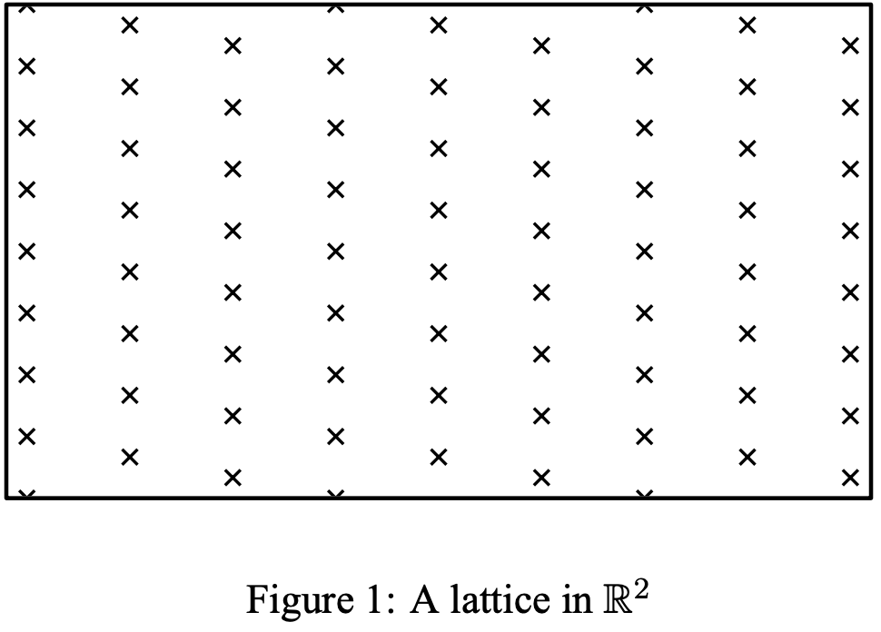
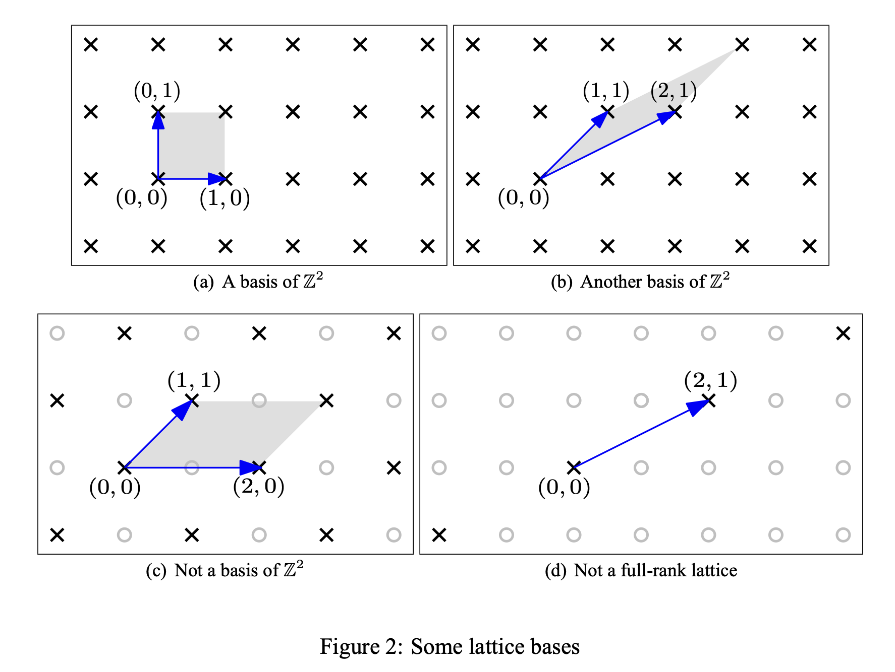
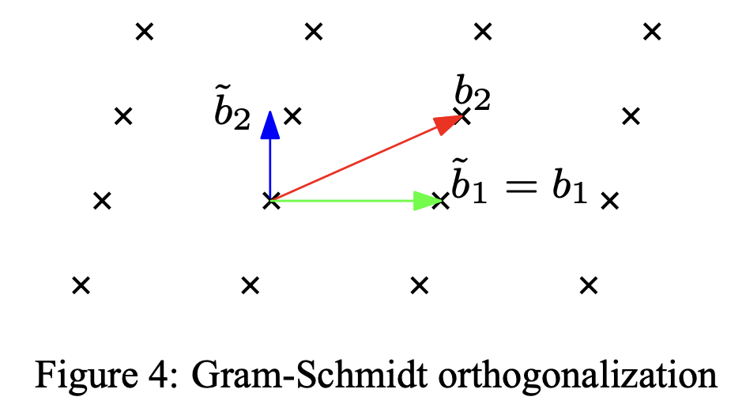
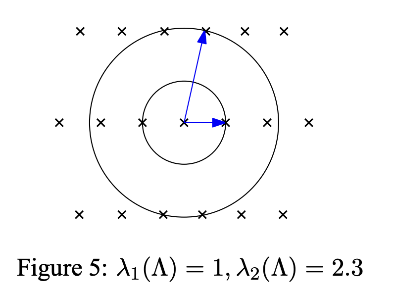
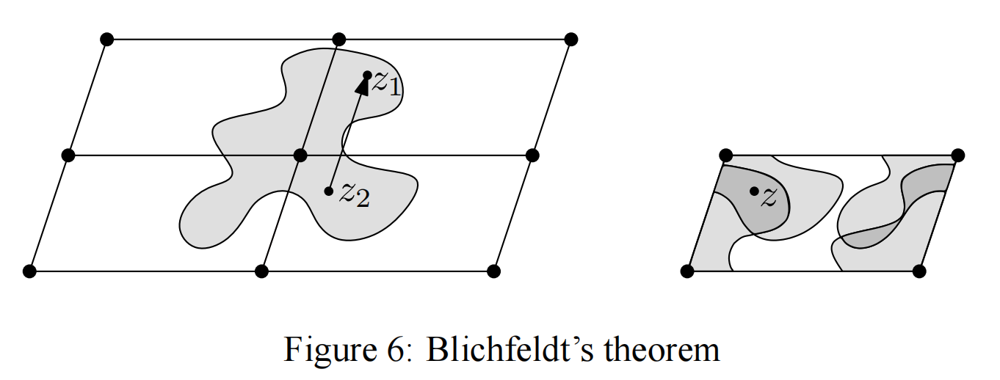

# Lattice基础

> 作者简介：Xor0v0，硕士在读，零知识证明小白，目前在做一些circom开发和zk审计，密码学爱好者，打过一些web2/3 CTF，最近对zkHACK产生兴趣。欢迎各位大佬一起交流学习。

Lattice是现代密码学非常重要的一部分，它也可以被用于构造零知识证明方案，比如这篇[Lattice-Based zk-SNARKs from Square Span Programs](https://eprint.iacr.org/2018/275.pdf)。

我们知道密码学的底层依赖于一些数学难题，基于Lattice的密码学的底层当然依赖于一些Lattice的的数学难题，这些数学难题在本篇最后都会提及。格密码学被认为是一种后量子安全的密码学。

之所以想出这一系列，不是说基于Lattice的ZKP方案有多好或者多有前景。纯粹是一个密码学爱好者的个人分享，这是一个非常有意思的领域，另外如果有兴趣参加web2/web3 CTF、密码学竞赛或者ZK Puzzle的同学，这一块知识拼图也是必不可少的。BTW，了解这个领域需要大家拥有**线性代数基础**。

总之，我会在这一系列中跟大家一起学习lattice的知识，分享我在Web3 CTF或者ZK Puzzle中遇到的可以使用到lattice的解法【第二篇LLL算法应该就有题分享】。

希望大家各有所获！！

参考文献：最经典最地道的 [Regev](https://cims.nyu.edu/~regev/teaching/lattices_fall_2009/) 讲义（源于它，但不仅仅是它），需要注意的是，这些讲义中通篇使用列向量表示矩阵，而非常规的行向量，这对于数学工作者也许不是什么大毛病，但是初学者一定要注意分辨，因为这样的矩阵使得整数线性组合向量在乘法的右边。

> 强力推荐大家看原文，如果觉得英文不好理解，可以再看这里有没有答案。

## 1. 什么是格Lattice？

格Lattice，顾名思义，就是一个个格子。严格来讲，格是一个数学对象，它的数学定义是：格Lattice由n维空间中具有周期结构的点集构成。【划重点：**Lattice是空间内的离散点集**】下图展示了一个二维实数空间的格点：

18世纪的大数学家们如Lagrange, Gauss 和后来的Minkowski，都研究过格。近年来，格被计算机科学领域所关注，被用于作为一种算法工具去解决各种问题，在密码学和密码分析中也有大量运用，并且这些构造出来的格从计算复杂性角度上讲拥有着独特的性质。

对于一个格，更正式的定义是：在m维实数空间，给定n个线性无关的m维向量 $\pmb{b_1}, \pmb{b_2}, \dots, \pmb{b_n}\in\mathbb{R}^m$，由这些向量定义的格就是：

$$
\mathcal{L}(\pmb{b_1}, \pmb{b_2}, \dots, \pmb{b_n})=\{\sum{x_i\pmb{b_i}|x_i\in \mathbb{Z}}\}
$$

说明：如果没有特别说明，粗体字母表示向量。

> 线性无关向量：给定一组向量 $\pmb{v}_1, \pmb{v}_2,\dots,\pmb{v}_n$ ，如果存在一组不全为零的系数 $a_1,a_2,\dots,a_n$ ，使得下面的等式成立：
> 
> $$
> a_1\pmb{v}_1+a_2\pmb{v}_2+\dots+a_n\pmb{v}_n=\pmb{0}
> $$
> 
> 则称这组向量是线性无关的。线性无关表示每一个元素都是相互独立，而没有冗余信息。

我们把这组线性无关向量称为**格基**(Basis of the lattice)。等价地，我们可以把这组向量按列展开，于是就得到它们的矩阵表示B，有：

$$
\mathcal{L}(B)=\mathcal{L}(\pmb{b_1}, \pmb{b_2}, \dots, \pmb{b_n})=\{\sum{x_i\pmb{b_i}|x_i\in \mathbb{Z}}\}
$$

我们定义格的**秩(**rank of lattice)为n，格的**维度**(dimension)为m。如果 $m=n$ ，那么则称这个格为**满秩格**(full-rank lattice)。如果没有特殊说明，本系列文章讲只讨论满秩格，因为其他情况并没有实质的差异。下面给出几个格的例子：

特别是： $\mathcal{L}((1))$ 是一个1维的满秩格。注意，一个维度空间的格基不唯一。

下面介绍两个概念：张成空间Span和基础区域fundamental parallelepiped。

- 张成空间： $\mathcal{L}(B)$ 中基向量的所有线性组合(linear combinations)所形成的集合，就叫做这组基向量所张成的空间(SPAN),
- 基础区域：在不包含其他格点的前提下，格基所能张成的区域。【这个概念很重要！！】

$$
span(\mathcal{L}(B))=span(B)=\{{B\pmb{y}|\pmb{y}\in \mathbb{R}^n}\} \\
\mathcal{P}(B)=\{B\pmb{x}|\pmb{x}\in\mathbb{R}^n,\forall i:0\le x_i<1\}
$$

如Figure 2阴影部分所示，就是fundamental parallelepiped的示例。假如把维度空间内所有的**格点**都做一个 $\mathcal{P}(B)$, 就能平铺(tiling)掉整个维度空间(span)。一定要注意：格 $\Lambda$ 不能表示整个n维空间， $span(\Lambda)$ 才能表示整个n维空间。区别就在于span的系数是实数，而格基的系数只能是整数，所以格只能表示一群离散的格点。

正如Figure 2(c)所示它就不是一个格基，那么第一个问题：**给定n个m维向量，如何判断它是否是m维空间的一个格基呢？**

定理1：格基所生成的基础平行四边形不应该包含除了初始格点（也就是 `0 `格点）以外的任何格点。

所有的Proof都省略，想了解的去看讲义。

第二个问题是：**如何判断两个给定格基是否是等价的？**

这里需要引入一个工具**幺模矩阵**Unimodular matrix：如果一个矩阵的行列式等于正负一，那么就称其为幺模矩阵。比如下面这个矩阵就是一个幺模矩阵：

$$
\begin{pmatrix}
1&2\\
0&1\\
\end{pmatrix}
$$

定理2：幺模矩阵的逆也是幺模矩阵。

定理3：两个格基 $B_1,B_2\in\mathbb{R}^{m\times n}$ 是等价的，当且仅当存在某个幺模矩阵 $U\in\mathbb{Z}^{n\times n}$ 使得 $B_2=B_1U$ 成立。

推论1：一个n维整数空间的格基 $B\in \mathbb{Z}^{n\times n}$必然是一个幺模矩阵。

对于第二个问题还有一个判断方法，需要引入格基的行列式(Determinant)概念。如果格基是一个方阵（即满秩格），格基的行列式直接是方针的行列式；如果格基不是方阵，那么需要使用volumn代替行列式的概念，具体定义为： $\sqrt{det(B^TB)}$。 那么如果两个格基等价，有：

$$
\sqrt{det({B_1}^TB_1)}=\sqrt{det({U^TB_2}^TB_2U)}=\sqrt{det{({B_2}^T)B_2}}
$$

(这里大家可以复习一下多矩阵的行列式运算法则)

格的行列式大小与格子密度成反比，行列式越小，格子越多。

不难看出，虽然格可以刻画 n 维空间离散点集，但是格的行列式，指的是上面提到的「基础区域」的容量volumn。因此，当我们以后提到格的容量时，无特别说明，都是指基础区域的容量。

## 2. Gram-Schmidt Orthogonalization

在学习线性代数时，施密特正交化是一个非常基础且重要的处理工具。

它的作用是：**把一组线性无关向量转化成一组正交的向量**。这里推荐知乎上一篇图文并茂的[文章](https://zhuanlan.zhihu.com/p/136627868)。

当我们描述一个点时，我们通常喜欢“直角坐标系”来求坐标，高维空间也是一样。所以我们需要**把格基这种「一般坐标系」正交化成「直角坐标系」**，便于我们描述空间上某一点。这就是施密特正交化的重要之处。

**二维平面的施密特正交化**

如上图， $b_1,b_2$是一组线性无关向量，它可以作为二维平面的一个格基。以一个基向量为基准，不妨设 $\tilde{b}_1=b_1$，利用投影公式可以求另一个向量 $b_2$ 在这个向量的投影，再作差得到与基准向量的正交向量： $\tilde{b}_2=b_2-\frac{(\tilde{b}_1,b_2)}{(\tilde{b}_1,\tilde{b}_1)}\tilde{b}_1$ .  同理可知三维平面的格基的施密特正交化步骤：首先选取一个基向量作为基准，利用投影公式求出另一个向量在这个向量的投影，作差得到两条相互正交的向量；对于第三条向量，分别对之前两条正交向量求投影向量，然后用分别减去这两个投影向量，即可得到三条正交向量。

**一般形式的施密特正交化**

对于n维欧氏空间，设一组基为 $b_1, b_2,\dots,b_n$ ，定义其施密特正交化之后的基向量为  $\tilde{b}_1, \tilde{b}_2,\dots,\tilde{b}_n$ 。其中: 

$$
\tilde{b}_i=b_i-\sum_{j=1}^{i-1}\frac{(\tilde{b}_j,b_i)}{(\tilde{b}_j,\tilde{b}_j)}\tilde{b}_j
$$

上述  $(\pmb{a}, \pmb{b})$ 记号表示两个向量之间的点乘。

> sage中内置了施密特正交化的函数： 对于矩阵 A，直接调用  `A.gram_schmidt()`

施密特正交化之后的基向量有如下特点：

- 基向量之间两两正交，即其点乘结果为0.
- 原格基与正交后的格基的span是同一张成空间.
- 正交后的格基无需是原格基所形成的格的等价基，甚至，它们一般不在一个格内，见Figure 4.

施密特正交化在维度空间有一个非常有用的用途：计算「容量」volumn。

在二维空间，容量就是面积，在三维空间，容量是体积，在更高维的空间，有更高级的概念。当格满秩时，格基所张成的「基础区域」的容量就可以直接对正交后的格基求行列式即可得到。

## 3.  Successive minima

译为**逐次最小长度**，或者**连续极小**。【但是好像叫做**最短向量长度**更切合】

当我们刻画一个格时，一个基础属性是格的最短非零向量的长度。（格空间中总是存在一个零向量，它的范数norm为0）

> 范数：是一个定义在向量空间上的函数，它将向量映射到非负实数。直观地说，范数可以理解为“长度”的概念，类似于欧几里得空间中的距离。范数可以用来衡量向量的大小或“长度”，并且在许多数学和应用领域中都有重要的应用。一个向量的范数计作 $||\pmb{a}||$ .

Successive minima这个参数一般计作 $\lambda_1$ . 它主要刻画了格的**稀疏程度**。

它的另一种定义是：最短向量长度 r 是满足半径为 r 的「n维球」的一维张成空间（一条线）所包含的格点中所能形成的最短向量的长度。

于是我们可以推广到 `the i-th successive minima` 概念：

$$
\lambda_i(\Lambda)=inf\{r | dim(span(\Lambda \cap \overline{B}(0, r))) \ge i\}
$$

其中 $\overline{B}(0,r)$ 表示以0格点为圆心，格点的范数小于等于 r 所构成的n维封闭球。r 就是满足这个球里的点形成的基向量最短的最短半径。

$\lambda_i(\Lambda)$ 表示格中第 i 短的线性无关向量。

下面开始解释：

- n维球：这里强调n维，我们都知道球ball是一个三维概念，但是在不同维度空间，“球”坍塌或者扩张为其他表现形式，比如一维空间，球是一条线段，一条向量就在一个一维空间里。
- 下图中，假设两个格点的水平距离为1，那么 $\lambda_1(\Lambda)=1$ , 但是 $\lambda_2(\Lambda)\ne2$  ，因为等于2的向量与 $\lambda_1(\Lambda)$ 对应的向量是线性相关的。

下面给出如何求 Successive minima 的有效**下界**：

定理 4： 令 $B$ 是秩为 n 的格基，令 $\tilde{B}$ 是其施密特正交化的基，那么：

$$
\lambda_1(\mathcal{L}(B))\ge \min_{i=1,..n}||\tilde{b}_i||>0
$$

推论 2：假设 $\Lambda$ 是一个lattice，存在 $\epsilon > 0$ ，对于任意两个非等格点 $x,y\in\Lambda$，满足 $||x-y||>\epsilon$.

【简单理解就是，在格中，两个不同的格点构成的向量的范数一定大于0，是非零向量】

断言 1：如果一个格 $\Lambda$ 最短向量长度存在，那么对于 $1 \le i\le n$ 格中一定存在某个 $\pmb{v}_i\in\Lambda$ 满足 $||\pmb{v}_i||=\lambda_i(\Lambda)$ 

这里需要弄清楚一个事实：successive minima对应的最短向量不一定是格基。【如figure 4】

**successive minima的上界**

定理 4 给出了如何利用施密特正交化求得最短向量的下界，那么如何求它的上界呢？Minkowski给出了一个答案。

为了简单，我们考虑满秩格，非满秩格可以很简单的延伸。首先介绍一下 Blichfeld 定理：

定理 5 (Blichfeld)：任何满秩格 $\Lambda\in \mathbb{R}^n$ 和集合 $S\subseteq\mathbb{R}^n$ ( $vol(S)>\det\Lambda$ )， 存在集合中两个不同的点，使得这两个点构成的向量属于格空间。

如图Figure 6，正如前面所说的，格的行列式表示的基础区域的容量。

定理 6(Minkowski's Convex Body Theorem)：若 $\Lambda$ 是一个秩为 n 的格，那么对于任意一个中心对称的凸体 $S$ ，如果 $vol(S)>2^n\det\Lambda$ ，那么 $S$ 中存在一个非零格点。

断言 2：半径为 r 的 n 维球的体积volumn为： $vol(B(0,r))\ge(\frac{2r}{\sqrt n})^n$ .

推论 3(Minkowski's First Theorem) ： 对于任意秩为 n 的满秩格 $\Lambda$ ， 有：

$$
\lambda_1(\Lambda)\le\sqrt{n}(\det\Lambda)^{1/n}
$$

Minkowski's First Theorem 给出的上界不一定很紧致tight。

还有 Minkowski's Second Theorem：

$$
\prod_{i=1}^{n}\lambda_i(\Lambda)^{1/n}\le\sqrt{n}(\det\Lambda)^{1/n}
$$

综上所述，施密特正交化给出了格的最短向量的下界，Minkowski's First Theorem给出了满秩格的最短向量的上界。

## 4. Computational problems

经过上述介绍，我们可以看到，对于格的最短向量(非0)的只有一个大概的上下界，而我们目前没有有效算法找出最短向量。这就引出了我们在开头所述的底层数学难题，关于格的数学难题大概有两类：SVP和CVP。与密码学经典的数学难题一样（DLP，CDH，DDH...），关于格的数学难题也有很多变种，下面分别介绍一下。

### Shortest Vector Problem(SVP)

SVP难题的变种也是根据难度划分为：是否真的需要找到最短向量？只需要找到最短向量的长度？或者甚至只要确定最短向量比某个给定的值小即可？具体是：

- Search SVP：给定格基，找出最短向量。
- Optimization SVP：给定格基，找出最短向量长度（Successive Minima）即可。
- Decisional SVP：给定格基和一个有理数，判断格的最短向量长度是否比它小即可。

注意：以上难题中，均限制格基向量为整数向量，这要做的目的是为了输入可以用有限比特来表示，因此我们可以将SVP当做一个标准计算问题。我们也可以允许格基由有理向量组成。这将导致一个本质上等效的定义，因为通过缩放，可以使所有有理坐标为整数。

这三个变种，Search SVP、Optimization SVP和Decisional SVP的难度依次下降，但是反之亦然。因此，这三个难题是等价的。

在 Regev 课程中，考虑的是 SVP 的近似变体，近似因子 $\gamma\ge1$ ：

- Search $SVP_\gamma$：给定格基，找出近似最短向量。
- Optimization $SVP_\gamma$：给定格基，找出最短向量长度的近似范围即可。
- Promise $SVP_\gamma$：给定格基和一个有理数 r ，如果是 YES 实例，判断格的最短向量长度是否小于等于 r 即可；如果是 NO 实例，判断格的最短向量长度是否大于 $\gamma \cdot r$ 即可

最后一种也叫做 $GapSVP_\gamma$ ，这种情况下每个实例都有特定的输入集合，如果输入不在这些集合中，将会导致未定义行为。

同样的，promise变体并不比optimization变体更困难，optimization变体不比Search变体更困难。反之，optimization变体不比promise变体更困难，但是Seach变体是否比optimization变体更困难尚且是一个开放问题。

### Closest Vector Problem(CVP)

顾名思义，这个数学难题是为找到给定格点的最近格点。与 SVP 一样，对 CVP 也定义了三种变体：

- Search $CVP_\gamma$ ：给定格基 $B\in \mathbb{Z}^{m\times n}$ 和 向量 $\pmb{t}\in\mathbb{Z}^m$ ，找到另一个向量 $\pmb{v}\in L(B)$ 满足 $||\pmb{v}-\pmb{t}||\le \gamma\cdot dist(t,\mathcal{L}(B))$ .
- Optimization  $CVP_\gamma$ ：给定格基 $B\in \mathbb{Z}^{m\times n}$ 和 向量 $\pmb{t}\in\mathbb{Z}^m$ ，找到距离 d 满足  $d\le dist(\pmb{t},\mathcal{L}(B))\le\gamma\cdot d$ .
- Promise  $CVP_\gamma$ ：给出一个CVP实例三元组 $(B, \pmb{t}, r)$ ，如果是 YSE 实例， $dist(t,\mathcal{L})\le r$ ；如果是 NO 实例， $dist(t,\mathcal{L})\gt \gamma\cdot r$ .

以上两种都是计算难题。关于格还有一些易于计算的问题，比如：

- 成员关系：给定格基和向量，判定向量是否属于格。这个问题可以使用高斯消元法（Gaussian elimination）高效解决。
- 等价关系：给定两个格基，判定二者是否等价。这个问题可以按列判断包含关系，然后两者交换再检查包含关系。如果都成立，则说明二者等价。