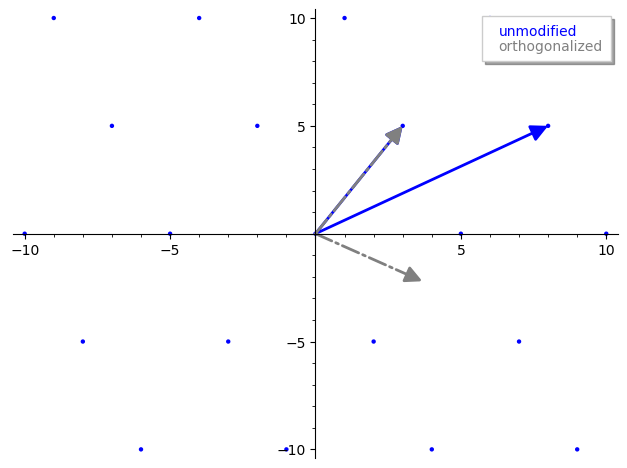

# LLL算法
> 作者简介：Xor0v0，硕士在读，零知识证明小白，目前在做一些circom开发和zk审计，密码学爱好者，打过一些web2/3 CTF，最近对zkHACK产生兴趣。欢迎各位大佬一起交流学习。

LLL 算法于 1982 年由三位 L 开头的外国人设计（因此得名），是一种解决 SVP 的近似算法。

LLL 算法的近似率为 $(\frac{2}{\sqrt{3}})^n$ ，其中 n 是格的维度。在大多数应用中，n 都是一个常数，因此近似率是确定的。

1801年 Guass 给出一种解决二维 SVP 的算法， LLL 算法可以看作是Gauss的算法对高维的推广。

LLL 的用途：

1. 分解整数或者有理数上的多项式。比如分解 $x^2-1$ 为 $(x+1)$ 和 $(x-1)$ 。

2. 求一个给定代数的最小多项式足够好的 approximation。例如，给定 $1.414213$ 输出 $x^2−2=0$ ，给定 $0.645751$ 输出 $x^2+4x−3=0$ 。

3. 求解整数关系，对于一组实数 $x_1, \dots,x_n$ ，如果存在一组非全零整数 $a_1,\dots,a_n$ 使得 $a_1x_1+\dots+a_nx_n=0$ 成立，则称为这组实数具有整数关系。比如，给定 $\arctan(1),\arctan(1/5),\arctan(1/239)$ ，可以证明下列整数关系存在：

$$
\arctan(1)-4\arctan(1/5)+\arctan(1/239)=0
$$

这个等式被称为 $Machin$ 公式。

4. 整数规划问题。这是一个著名的 NP 问题，使用LLL，可以在多项式时间解决固定数量变量的整数规划。

5. 最近向量问题(CVP)，以及其他格问题。

6. 密码分析中的各种应用（即破坏密码协议）。 例如，对基于背包的密码系统的许多攻击。 对RSA的一些特殊情况也有一些攻击，如低公共指数攻击(low public exponent attack)。此外，对DSA系统中求解 HNP 问题也是很好的攻击应用。

> 通俗意义上讲，LLL 算法就是把一个糟糕的格基转换为一个相当好的格基。所谓“糟糕”或者“好”，评价标准是这个格基是否短且与其他基向量接近于正交，如果是则是好的格基，否则是糟糕的格基。

下面从三个方面介绍 LLL 算法：

1. 定义一个 LLL 规约基 (reduced basis)，
2. 提出一种算法来寻找这样的规约基，
3. 分析其运行时间。

## 1. Reduced Basis

首先回顾施密特正交化的定义：

定义 1: 给定 n 个线性无关向量 $\pmb{b_1}, \pmb{b_2}, \dots,\pmb{b_n}\in\mathbb{R}^n$ ，其施密特正交化的定义为：

$$
\tilde{\pmb{b}}_i=\pmb{b}_i-\sum_{j=1}^{i-1}{\mu_{i.j}\tilde{\pmb{b}}_j},where \mu_{i,j}={\frac{(\pmb{b_i,\tilde{b}_j})}{\pmb{(\tilde{b}_j,\tilde{b}_j)}}}
$$

定义 2: 如果下列情况成立，则格基 $B= \pmb{b_1}, \pmb{b_2}, \dots,\pmb{b_n}\in\mathbb{R}^n$ 是一个 $\gamma-LLL$ 规约基: 

1. $\forall 1\le i\le n, j\lt i,|\mu_{i,j}|\le1/2$ .
2. $\forall 1\le i\lt n, \gamma||\pmb{\tilde{b}}_i||^2\le ||\mu_{i+1,i}{\pmb{\tilde{b}_i+\tilde{b}_{i+1}}}||^2$ .

Remark 1：把一个基转换为规约基总是有可能的，实际上 LLL 算法就是在做这件事。

Remark 2 ：考虑 $\gamma=3/4$ 的情形是很有用的，在 LLL 算法中， $1/4\lt\gamma\lt1$ .

Remark 3 ：定义 2中的第二个条件可以等价变化为：

$$
\gamma||\pmb{\tilde{b}}_i||^2\le ||\mu_{i+1,i}{\pmb{\tilde{b}_i+\tilde{b}_{i+1}}}||^2=\mu_{i+1,i}^2||\pmb{\tilde{b}_i}||^2+||\pmb{\tilde{b}_{i+1}}||^2
$$

稍微变换之后，可知：第二个 property 可以解释为: $\pmb{\tilde{b}_{i+1}}$ 不会比 $\pmb{\tilde{b}_{i}}$ 短很多。

具体的，我们考虑经过施密特正交化得到的格基矩阵为：

$$
\begin{pmatrix}
||\tilde{\pmb{b}}_1||&*&\dots&*\\
0&||\tilde{\pmb{b}}_2||&\dots&*\\
\dots&\dots&\dots&\dots\\
0&\dots&0&||\tilde{\pmb{b}}_n||
\end{pmatrix}
$$

【在线性代数中，正交基可以表示为基向量范数的上三角形式，这是由正交基的性质和**格拉姆-施密特正交化过程的结果**所决定的。】

其中列 i 显示了在这个正交基中 $b_i$ 的坐标。 定义LLL规约基中的第一个条件保证：任何非对角元素的绝对值，最多是同一行对角线元素值的一半。 这可以写成：

$$
\begin{pmatrix}
||\tilde{\pmb{b}}_1||&\le\frac{1}{2}||\tilde{\pmb{b}}_1||&\dots&\le\frac{1}{2}||\tilde{\pmb{b}}_1||\\
0&||\tilde{\pmb{b}}_2||&\dots&\le\frac{1}{2}||\tilde{\pmb{b}}_2||\\
\dots&\dots&\dots&\dots\\
0&\dots&0&||\tilde{\pmb{b}}_n||
\end{pmatrix}
$$

第二个条件要求这个矩阵的第二列几乎和它的第一列一样长。

LLL 规约基的一个重要特性是它的第一个向量相对较短，如下一个 **claim** 所示。

Claim 1：假设  $\pmb{b_1}, \pmb{b_2}, \dots,\pmb{b_n}\in\mathbb{R}^n$ 是一个 $\gamma-LLL$ 规约基，则有：

$$
||\pmb{b}_1||\le(\frac{2}{\sqrt{4\gamma-1}})^{n-1}\lambda_1(\mathcal{L})
$$

Remark 4: 如果 $\gamma=3/4$ 则有：

$$
||\pmb{b}_1||\le2^{\frac{n-1}{2}}\lambda_1{(\mathcal{L})}
$$

## 2. LLL Algorithm

这里首先给出 LLL 算法的 python 伪代码：

```python
def lll(basis):
  	while k <= n:
      	# reduction step loop
    		for j in reverse(range(k-1, 0)):
      	m = mu(k, j)
      	basis[k] = basis[k] - mu*basis[j] # vector reduction
    if lovasz_condition:
        k += 1
    else:
        basis[k], basis[k+1] = basis[k+1], basis[k] # swap step
        # update orthogonalized basis
        k = max(k-1,1)
    return basis
```

上面的介绍让 LLL 算法较为晦涩，下面从几个简单的角度解读 LLL 算法。

### LLL  vs  GCD

LLL 算法与最大公约数 GCD 算法可以说是毫不相关，但是从思想上，二者有异曲同工之妙：皆为先 Reduction，后 Swap.

观察一下 GCD 算法的 python 伪代码:

```python
def euclid_gcd(a, b):
  	if a < b:
      	a, b = b, a
    # base condition
  	if b == 0:
      	return a
    # reduction
    x = a mod b 
    return euclid_gcd(b, x) # swap
```

GCD 算法先是一个 reduction step 把数字变小，然后 swap step 交换数字顺序。返回条件是 b = 0。

再观察 LLL 算法的伪代码，也是先 reduction step，使用施密特正交化把基向量变小，然后 swap step 交换向量顺序。返回条件是所有的向量满足 lovacz_condition（暂且不管什么是lovacz_condition）。

### LLL vs Gram-Schmidt

LLL 算法和 施密特正交化算法（简称GS 算法）都是对格基进行处理的算法。GS 算法把格基处理为所有的基向量两两正交，其张成空间 span 与原格基相同，但是格（点）不一定相同。如第一讲所述，GS 算法是通过将基向量分为相关分量，然后从所有向量中减去冗余分量，从而达到正交化的目的。

在上一讲中，我们知道施密特正交基是 successive minima 的下界，那么是否可以直接使用 GS 算法来求得 LLL 规约基呢？答案是否定的。原因在于：GS算法可能可以让我们得到与 LLL 规约基相近的一组格基，但是不能保证它就是 LLL 规约基，这是由于 **GS 正交基可能与原格基不属于同一个格**。

```python
sage: from mage import matrix_utils # https://github.com/kelbyludwig/mage; use the install.sh script to install
sage: b1 = vector(ZZ, [3,5])
sage: b2 = vector(ZZ, [8,3])
sage: B  = Matrix(ZZ, [b1,b2])
sage: Br,_ = B.gram_schmidt()
sage: pplot = matrix_utils.plot_2d_lattice(B[0], B[1])
sage: pplot += plot(Br[0], color='grey', linestyle='-.', legend_label='unmodified', legend_color='blue')
sage: pplot += plot(Br[1], color='grey', linestyle='-.', legend_label='orthogonalized', legend_color='grey')
sage: pplot
```

在 sage 中运行得到的图像:

<div align=center></div>

注意灰色的格基已经不在和原格基属于同一格了。但是 GS 算法对于理解 LLL 算法仍然很重要，因为它会作为 LLL 算法的一部分。

### LLL vs Gaussian Lattice Reduction

正如之前所介绍， Gauss 曾提出过一个解决二维格的最短向量问题 SVP 的算法，即 Gaussian Lattice Reduction，它启发了 LLL 算法的出现。给出 Gaussian Lattice Reduction 的 python 代码：

```python
def gauss_reduction(v1, v2) {
  	while True:
  			if v2.norm() < v1.norm():
            v1, v2 = v2, v1 # swap step
        m = round( (v1 * v2) / (v1 * v1) )
        if m == 0:
            return (v1, v2)
        v2 = v2 - m*v1 # reduction step
}
```

暂时忽略掉 while 无限循环，注意到首先进行了一个 swap step，保证 $|\pmb{v_2}|\ge|\pmb{v_1}|$ 。【[理由](https://kel.bz/post/lll/#stumped)】

$m$ 表示 $\pmb{v_2}$ 在  $\pmb{v_1}$ 上的投影标量，这和 GS 算法产生的投影标量是相同的，但是运用了一个 round 函数将其四舍五入到最近的整数，这样做为了保证得到的向量仍然在同一个格中。注意，得到的新基向量的长度无疑会比原向量短。

直到两个向量之间的投影非常接近，停止循环，此时两个基向量会近似“正交”，而且长度较短。

### LLL

下面正式介绍 LLL 算法的细节。与 Gaussian Reduction 类似，它也是根据输入的基向量进行迭代，然后对每个基向量进行长度规约。与 Gauss 规约不同的是，LLL处理的是 n 维基向量，因此需要一个[方法](https://crypto.stackexchange.com/questions/39532/why-is-the-lov%C3%A1sz-condition-used-in-the-lll-algorithm/39534#39534)确保输入的基向量的顺序不会影响到最终结果，这就是所谓的 lovasc condition，这个条件用于确定输入基向量是否需要执行 swap。

为了深入理解 LLL 算法，我们研究一下维基百科的 LLL python 代码实现：

```python
def LLL(B, delta):
    Q = gram_schmidt(B)

    def mu(i,j):
        v = B[i]
        u = Q[j]
        return (v*u) / (u*u)

    n, k = B.nrows(), 1
    while k < n:

        # length reduction step
        for j in reversed(range(k)):
            if abs(mu(k,j)) > .5:
                B[k] = B[k] - round(mu(k,j))*B[j]
                Q = gram_schmidt(B)

        # swap step
        if Q[k]*Q[k] >= (delta - mu(k,k-1)**2)*(Q[k-1]*Q[k-1]):
            k = k + 1
        else:
            B[k], B[k-1] = B[k-1], B[k]
            Q = gram_schmidt(B)
            k = max(k-1, 1)

   return B
```

##### mu

首先是 mu 函数，可以看到函数代码就是求向量 $\pmb{v}$ 在 $\pmb{u}$ 上的投影向量，并且并没有四舍五入处理，即与 GS 算法中的投影向量一样，因此这个投影向量不一定在格中。所以这个函数就是**求原格基 B 的第 i 个基向量在正交之后的格基 Q 的第 j 个基向量的投影标量**。

我们已经知道 GS 正交化虽然能够提供一个理想的正交矩阵，但是它改变了格基所确定的格。因此我们考虑使用 mu 函数和 GS 正交化来辅助进行格基规约。

##### Length Reduction

接着，定义 n 为原格基的维度【满秩格】，k 表示当前函数处理的向量。两次循环中，内层循环负责针对 B[k] 对其之前所有的向量进行长度缩减：首先判断 $mu(k, j)$ 是否大于 $1/2$ ， 如果大于 $1/2$ 则四舍五入并进行向量缩减，并然后更新施密特正交化，否则不做任何操作；外层循环则控制循环次数。

其实这里的长度缩减和 GS 正交化非常相似：

- LLL Length Reduction

  ```python
  B[0] = B[0]
  B[1] = B[1] - round(mu(1, 0))*B[0]
  B[2] = B[2] - round(mu(2, 1))*B[1] - round(mu(2, 0))*B[0]
  ...
  B[k] = B[k] - round(mu(k, k-1))*B[k-1] - round(mu(k, k-2))*B[k-2] - ... - round(mu(k, 0))*B[0]
  ```

- GS 正交化

  ```python
  Q[0] = B[0]
  Q[1] = B[1] - mu(1, 0)*Q[0]
  Q[2] = B[2] - mu(2, 1)*Q[1] - mu(2, 0)*Q[0]
  ...
  Q[k] = B[k] - mu(k, k-1)*Q[k-1] - mu(k, k-2)*Q[k-2] - ... - mu(k, 0)*Q[0]
  ```

##### lovesz condition and swap step

再关注到代码中的交换部分：

```python
    # swap step
    if Q[k]*Q[k] >= (delta - mu(k,k-1)**2)*(Q[k-1]*Q[k-1]):
        k = k + 1
    else:
        B[k], B[k-1] = B[k-1], B[k]
        Q = gram_schmidt(B)
        k = max(k-1, 1)
```

对当前向量走完一轮长度缩减后，Lovász 条件将告诉我们是继续处理下一个基向量（代码第三行），还是将当前向量和前一个向量互换位置。

暂时忽略 Lovasz 条件的具体含义，这样的交换不免让我们想起了某些排序算法。 $k$ 是当前处理的基向量的索引，假设对于第 $k$ 个基向量的 Lovasz 条件为真，则 LLL 开始处理第 $k+1$ 个基向量，此时大致上可以说从第 0 个基向量到第 $k$ 个基向量是按长度排序的。如果 Lovasz 条件为假，则将该向量放在 $k-1$ 的位置，然后重新处理第 $k-1$ 个基向量。在完成又一轮长度缩减后，再次回到交换步骤，决定是否需要再次交换该基向量的位置。于是我们也可以这样描述 LLL 算法：LLL 算法是一种向量排序算法，不过在向量长度缩减过程中向量变小可能会扰乱顺序，因此必须重新排序。于是我们也可以这样描述 LLL 算法：**LLL 算法是一种向量排序算法，不过在向量长度缩减过程中向量变小可能会扰乱顺序，因此必须重新排序**。

而对于 Lovasz 条件本身，它是一种启发式，用于确定向量是否处于“良好”的顺序。启发式就是那种没法去证明的但是又能用的，就好比机器学习中的调参，调太差了不准，太好了又会过拟合，于是不断微调去找到一个大差不差的。Lovasz 的描述有多种，感兴趣的读者可以参看一下这篇 StackOverflow 上的这篇[文章](https://crypto.stackexchange.com/questions/39532/why-is-the-lov%C3%A1sz-condition-used-in-the-lll-algorithm/39534#39534)。

根据 lovasz 条件，可以推出 LLL 算法输出的最短基向量 $\pmb{v_1}$ 满足：
$$
||\pmb{v_1}||\le 2^{(n-1)/4}|\det(L)|^{1/n}\and ||\pmb{v_1}||\le 2^{(n-1)/2}\min_{0\neq v\in L}||\pmb{v}||
$$
而根据 minkowski 凸体定理有： $\lambda_1(L)\le \sqrt{n}r=|\det(L)|^{1/n}$  

因此，在使用 LLL 算法时可以通过上述公式判断目标向量是否满足上述条件。

## 3. Complexity Analyze

分析包括两个步骤。 首先，我们 bound 了迭代次数。 其次，我们 bound 了单个迭代的运行时间。

可以证明：算法的总体运行时间是关于输入规模的多项式。 输入规模的 rough下界由 $M=\max\{n,\log(max_i|||b_i|\}$ 给出。（因为 n 个向量中的每一个都需要至少一位来表示，范数为 r 的向量需要至少 $\log r$ 位来表示)。 

定理 1: 迭代次数是关于 M 的多项式。

定义 5: 给定格基 B，那么 B 的 potential 是它的施密特正交化后的基的范数乘积。

整个证明过程没看懂，下次如果看懂了再来补充。有兴趣的可以去看原文，证明过程使用到了这个格基的 Potencial。
