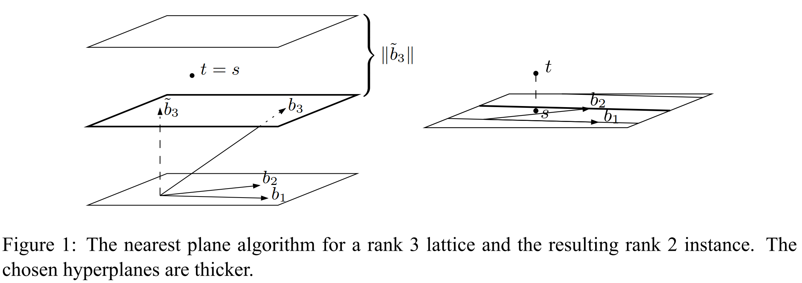

# Nearest Plane Algorithm for CVP

> 作者简介：Xor0v0，硕士在读，零知识证明小白，目前在做一些circom开发和zk审计，密码学爱好者，打过一些web2/3 CTF，最近对zkHACK产生兴趣。欢迎各位大佬一起交流学习。

首先回顾一下 CVP 问题：给定格和一个点，求与之最近的格点。它有三种近似（approximation）变体，分别是 Search $CVP_\gamma$ ， Optimization  $CVP_\gamma$ 和 Promise  $CVP_\gamma$ ，其中 $\gamma\ge1$  是近似因子。如果近似因子等于 1，那么就得到这些问题的精确版本。

1986年，Babai提出了名为 **Nearest Plane Algorithm** 的算法可以解决CVP问题的近似变体，它的近似率达到了 $2(\frac{2}{\sqrt{3}})^n$ ，其中 n 代表格的秩。当 n 确定时，我们也就得到了近似率，进而可以确定近似因子 $\gamma$ .

Babai's nearest plane algorithm可以解决 Search $CVP_\gamma$ ，这意味着解决了它也就可以解决其他两种近似变体（因为其他两种近似变体不难于search 变体）。

## 1. Nearest Plane Algorithm

整个算法分为 2 步，第一步通过 LLL 算法对输入的格基进行规约，然后寻找关于这个格基的一个整数线性组合使其接近于目标向量 $\pmb{t}$ 。第二步基本上与 LLL 算法中 reduction 步骤的内层循环是相同的。

```python
/*
		basis: lattice basis, a (m * n) matrix
  	t: target vector, (1 * m)
/*
def cvp(basis, t):
  	def mu(b,j):
        u = Q[j]
        return (b*u) / (u*u)
    
  	basis = lll(basis)
    b = t
    for j in reversed(range(n)):
        b -= round(mu(b, j)) * basis[j]
    return t - b
```

不难看出，cvp 算法的时间复杂度也是关于输入规模的多项式时间。注意，cvp 算法不要求格是满秩的。

考虑一个正交基向量集合 $\pmb{\tilde{b}_1}/||\pmb{\tilde{b}_1}||, \pmb{\tilde{b}_2}/||\pmb{\tilde{b}_2}||,\dots,\pmb{\tilde{b}_n}/||\pmb{\tilde{b}_n}|| $，如果是满秩格（ $m=n$ ），这就是归一化的正交基，而如果不是满秩格，则需要扩展 $m-n$ 个基向量。

简单阐述 CVP 算法的思想就是：找到这些 LLL 规约基向量（列向量）的一个整数组合，使得它们构造出向量的每个坐标 $i$ 的值都在目标向量 $\pmb{t}$ 对应坐标值的 $\pm\frac{1}{2}||\pmb{\tilde{b}_i}||$ 范围内。因此，算法首先需要找到第 $n-1$ 个基向量的倍数，使得目标向量第 $n-1$ 个坐标值在  $\pm\frac{1}{2}||\pmb{\tilde{b}_n}||$ 范围内。然后是第 $n-2$ 个基向量，直至第 $0$ 个基向量。 注意，如果格不是满秩的，则最后 $m-n$ 维对应于与格 span 正交的空间。

上述描述也许比较晦涩，下面给出一个关于算法中递归操作的最自然的解释，并且更加呼应算法的名字：

<div align=center></div>

1. 假设 $\pmb{s}$ 是 $\pmb{t}$ 在张成空间 $span(\pmb{b_1},\pmb{b_2},\dots,\pmb{b_n})$ 的一个投影；
2. 找到倍数 $c$ ，使得 $c\tilde{b}_n+span(\pmb{b_1},\dots,\pmb{b_{n-1}})$ 尽可能的接近于 $\pmb{s}$ ；
3. 令 $\pmb{s'}=\pmb{s}-c\pmb{b_n}$ ，递归调用 $\pmb{s'}$ 和 $span(\pmb{b_1},\dots,\pmb{b_{n-1}})$，令其答案为 $x'$ 
4. 返回 $x=x'+cb_n$ 即是最接近 t 的向量。

首先第一步是把目标向量 t 投影到向量空间中，最接近 $\pmb{t}$ 的格向量与最接近 $\pmb{s}$ 的格向量相同，因此这一步是有意义的。在第二步中，我们确定了格的平移，并且推测目标向量就在这里。在第三步递归中，我们不断的“降维”找到最接近目标向量的向量。最终我们把它平移回 $c\pmb{b_n}$ ，我们认定这就是最近向量。

> 关于算法的正确性参考讲义内容

## 2. HNP: An application of CVP

HNP(Hidden Number Problem)，这个问题由Dan Boneh于1996年[提出](https://crypto.stanford.edu/~dabo/pubs/abstracts/dhmsb.html)，它论述了计算Diffie-Hellman共享密钥的最低有效位与计算完整密钥同样难。 另一位大佬，使用Lattice攻破了DSA的HNP问题，参考[论文](https://link.springer.com/chapter/10.1007/978-3-0348-8295-8_23) 。

正如密码学其他的困难问题一样，HNP也被定义为与“Oracle”之间的游戏，游戏中Oracle可以**大致**输出用户给定的输入的最低有效位。

具体而言，基于 n 比特质数和一个 k 比特最低有效位（Most Significant Bits）的 leak，我们定义Oracle的输出为： $MSB_k(x)=z$ ，满足
$$
|x-z|<\frac{p}{2^{k+1}}
$$
在原始论文中，HNP可以表述为：对于随机的 $g^x$ ，给定 $g^x$ 和 $MSB_k(\alpha g^x\mod p)$ ，问是否可以求出隐藏的数字 $\alpha$ ？其中 $g^x$ 是随机的，论文中还提出了几种变体，但本文只关注随机版本的HNP。

下面先给出求最低有效位的实现：

```python
# Some parameters of the game, chosen for simplicity.

# p - A prime number for our field.
p = next_prime(2^16)

# n - The number of bits in `p`.
n = ceil(log(p, 2))

# k - The number of significant bits revealed by the oracle.
# Using parameters from Thereom 1.
k = ceil(sqrt(n)) + ceil(log(n, 2))

def msb(query):
    """Returns the MSB of query based on the global paramters p, k.
    """
    while True:
        z = randint(1, p-1)
        answer = abs(query - z)
        if answer < p / 2^(k+1):
            break
    return z

def create_oracle(alpha):
    """Returns a randomized MSB oracle using the specified alpha value.
    """
    alpha = alpha
    def oracle():
        random_t = randint(1, p-1)
        return random_t, msb((alpha * random_t) % p)
    return oracle
```

所以最低有效位到底泄漏了什么？根据定义，我们发现， $MSB_k(x)$ 的输出是不唯一的，并且输出与 p 有关。顾名思义，最低有效位就是一个数字的最低若干比特，本应该是确定的，与其他数无关的。而这两种特性就是 HNP 问题定义中的“大致”所造成的。

因此如何去理解 $MSB_k(x)$ 函数？注意到：

- 当 $z = x$ ，Oracle 总会输出这个结果，且结果就为 x。
- 其他的结果将会在 $x$ 附近上下波动。
- 随着 $k$ 的增大，不等式右边的 $z$ 的选择会极度下降，合法的 $z$ 越来越少，也越来越接近 $x$ 。
- Oracle 输出值不一定只泄漏 $x$ 的 $k$ 比特信息，随着 $k$ 增大， $z$ 的范围越小，则会泄漏 $x$ 更多比特信息。

也就是说，当 $k$ 越接近 $p$ 的位数，Oracle 输出越接近 $x$。

那么什么时候 HNP 将是可解决的呢？Dan Boneh的论文指出：当 k 接近 $\sqrt{\log p}$ 时，使用 $d=2\sqrt{n}$ 次Oracle查询就可恢复出隐藏数字。于是，给定一个 Oracle，我们如何去求解 HNP 呢？答案是：当可以得到 Oracle d 次回复后，solution可以视为 CVP 的一个特例。这个 CVP 的特例在给定足够多 Oracle 回复和特别选定的一组格基的情况下将会很容易解决。

这组格基是：

```python
[  p,  0, ... ,  0,   0 ]
[  0,  p, ... ,  0,   0 ]
[         ...           ]
[  0,  0, ... ,  p,   0 ]
[ t1, t2, ... , td, 1/p ]
```

其中， $t_n$ 是 Oracle 的输入。Oracle 的输出 $[a1, a2,\dots,ad,0]$ 就是我们需要求解的最近向量。

假设某个向量第一个系数为 $\alpha t_1\mod p$  ，由于 $\alpha $ 是最后一行的整数标量， $\mod p$ 记号相当于减去若干整数倍的第一行。假设向量 $\pmb{v}=[\alpha t_1,\alpha t_2,\dots,\alpha t_d,\alpha/p]$  ，求得到这个向量我们就能很轻易的恢复出 $\alpha$ 。根据 $MSB_k(x)$ 的定义，发现 $\pmb{v}$ 是非常接近于 $\pmb{z}$ 的。于是我们可以通过 CVP 算法去找到这样的向量，进而恢复 $\alpha$ 。

> 注意，其实模数 p 并非一定要固定，模数改变仍然是 HNP 问题。

### Paradigm 2023 Oven

题目地址： https://github.com/paradigmxyz/paradigm-ctf-2023/tree/main/oven

```python
#!/usr/bin/env python3
from Crypto.Util.number import *
import random
import os
import hashlib

FLAG = os.getenv("FLAG", "PCTF{flag}").encode("utf8")
FLAG = bytes_to_long(FLAG[5:-1])
assert FLAG.bit_length() < 384

BITS = 1024


def xor(a, b):
    return bytes([i ^ j for i, j in zip(a, b)])


# This doesn't really matter right???
def custom_hash(n):
    state = b"\x00" * 16
    for i in range(len(n) // 16):
        state = xor(state, n[i : i + 16])

    for _ in range(5):
        state = hashlib.md5(state).digest()
        state = hashlib.sha1(state).digest()
        state = hashlib.sha256(state).digest()
        state = hashlib.sha512(state).digest() + hashlib.sha256(state).digest()

    value = bytes_to_long(state)

    return value


def fiat_shamir():
    p = getPrime(BITS)
    g = 2
    y = pow(g, FLAG, p)

    v = random.randint(2, 2**512)

    t = pow(g, v, p)
    c = custom_hash(long_to_bytes(g) + long_to_bytes(y) + long_to_bytes(t))
    r = (v - c * FLAG) % (p - 1)

    assert t == (pow(g, r, p) * pow(y, c, p)) % p

    return (t, r), (p, g, y)


while True:
    resp = input("[1] Get a random signature\n[2] Exit\nChoice: ")
    if "1" in resp:
        print()
        (t, r), (p, g, y) = fiat_shamir()
        print(f"t = {t}\nr = {r}")
        print()
        print(f"p = {p}\ng = {g}\ny = {y}")
        print()
    elif "2" in resp:
        print("Bye!")
        exit()
```

题目大意就是用户可以获取 FLAG 随机签名，生成随机签名的逻辑就在 `fiat-shamir` 函数里。

我们可获得的信息有 `t, r, p, g, y` ，其实 c 也可以求出。那么就可以关注 `fiat_shamir`  函数中使用到 FLAG 进行签名的部分，即： `r = (v - c * FLAG) % (p - 1)` 。分析一下： `r, c, p` 均是已知值，且 FLAG 的位数已经确定： `assert FLAG.bit_length() < 384` 。 可以使用上述 HNP 问题（模数可变），可使用标准的格算法进行攻击。解法如下：

1. 首先对上述式子稍微变形： $r-v+c*FLAG=0\mod (p-1)$ ，只有 v 和 FLAG 是未知数。非常标准的随机版本HNP。

2. 我们可以根据上述式子构建 Lattice：
   $$
   M=\begin{pmatrix}
   (q_1-1)&&&&\\
   &(q_2-1)&&&\\
   &&(q_3-1)&&\\
   c_1&c_2&c_3&1&\\
   r_1&r_2&r_3&0&K\\
   \end{pmatrix}
   $$

解释：

- K是FLAG的一个上界
- 空白处都为0

3. 根据Babai的CVP解决算法，一定存在一个解向量 $\pmb{j}=(l_1,l_2,l_3,FLAG,1)$ ，使得 $\pmb{j}M=\pmb{j_k}$ 成立
4. 注意到 $\pmb{j_k}$ 在格中是一个短向量，于是我们可以采用 LLL 算法在多项式时间内找到这个短向量。注意，短向量的每一个元素用 64bit可以表示，于是上界 $K=2^{64}$ 。 

这里还需要解释一下数据量的问题，怎么知道需要多少数据可以恢复出 FLAG 呢？这个需要使用到 gaussian heuristic 估计最短向量长度，要求的目标向量范数小于这个长度即可。【但是由于这是ctf，所以一般就三四五组数据就出来了，这里我先收集了5组数据备用，实际上用了3组数据，就可解出FLAG】。

我们可以使用论文的方式构造格矩阵，然后使用 LLL 算法在多项式时间内找到一个解向量，FLAG值就在这个向量里。

下面贴出EXP（需要使用 sage-python）。

```python
from Crypto.Util.number import *

BITS = 1024
def xor(a, b):
    return bytes([i ^^ j for i, j in zip(a, b)])

def custom_hash(n):
    state = b"\x00" * 16
    for i in range(len(n) // 16):
        state = xor(state, n[i : i + 16])

    for _ in range(5):
        state = hashlib.md5(state).digest()
        state = hashlib.sha1(state).digest()
        state = hashlib.sha256(state).digest()
        state = hashlib.sha512(state).digest() + hashlib.sha256(state).digest()

    value = bytes_to_long(state)

    return value


g = 2
# p = remote("oven.challenges.paradigm.xyz", 1337)
# # v = (c * flag - r) % (p-1)
# t = 5
# while t > 0:
#     p.sendafter(b'Choice: ', b'1')
#     a = p.recvuntil(b't =')
#     t = int(p.recvuntil(b'\n', drop=True).decode())
#     a = p.recvuntil(b'r = ')
#     r = int(p.recvuntil(b'\n', drop=True))
#     a = p.recvuntil(b'p = ')
#     p = int(p.recvuntil(b'\n', drop=True))
#     a = p.recvuntil(b'g = ')
#     g = int(p.recvuntil(b'\n', drop=True))
#     a = p.recvuntil(b'y = ')
#     y = int(p.recvuntil(b'\n', drop=True))
#     C = [0]
#     R = [0]
#     C.append(custom_hash(long_to_bytes(g) + long_to_bytes(y) + long_to_bytes(t)))
#     R.append(r)
#     t -= 1
t, r, p, y = [0] * 5 , [0] * 5, [0] * 5, [0] * 5
t[0] = 77203516334611379622052884088061339907818193440975523438325956774518601252973654146535129884349539724229562993644509567711307331031087898034347437358013492439542334272757402388064753335866738748958633246857368058563448192261648964749496750146315450540579452655462143813022469489449782882109182150142188348915
r[0] = 116220687218790216091346463439819557695309512176282372943331613053767874084111192169275378671194392846117055362014832383093646731110903547936340541580638231783076185430700045752799252596702505486227877656990705143138976716233681199944248043915239678537679463030334043412573684866623347545004904612417007327217
p[0] = 120199526136097511651530856988060166616679725925744594620901500430819054365226668422844742178771316732438545888088210068701212930988908604238682153307940417480817112540019257024703372145496636861112290091005527647339212358159274475077103689996624113678044891963676612334769162753166782062809526104431258739517
y[0] = 113120257926989954605307518460817169666869094087243249194566086300779837721481071230484420555504633839932263287201776945834030877253212748181186108770595676114564711457140738635967367144272960236148346810327070118837330648022676963528356209004524421455348155068637534190736042536625876773755044593606026293621

t[1] = 41870694301936832255997763505666386906032641226067235004722895066736677752643938706563985367861597477876358530714740119529535551345537670465925209944735777464498665457291484991606280197421907773811941255514802343059520166452091324746732103649911088736843268706303230993742963740287185306251052313964374872878
r[1] = 12006544761341621619143613218949584457040818188588282396732221317912350712975184254483346994199077889478797005980544401923303196850089656891130607887735812677733676744158835380723268515678724429529904080449565289532493612340517128773817940478185157405384294596975266141639161297056291778600404606940053392754
p[1] = 144976418899543143198454834264506179459614866666312385853989423989111679486891620786778481577472101748200328617607483446519049911023390427543308348494008425688855119367843479385647790189753163858970088620586505610840306212549243890107847423807556106192434514110736278569625282073529181653986405771513594134987
y[1] = 115167386542298909971939136044531943159982371048242494889745996527683250097061534781946312891817534916886291355204474301571862159042350976750824212346443402817552375266223638549309886922860921533308382456941718605370216473858986207878047206914813902333192745354148659984602740644345120423788258359941122554440

t[2] = 87583398382601313926735945950364130572816213989909728661491063393166341618362097121819023078210854251839415225428442334046015192711593400640556960974162962105001700930842075200923675422451049033428478754684678493480503204152097382431043129863362081278994409790477935899740897031656629902670114002180266872266
r[2] = 102934065416140965550261549535302192284582871606378190882003659362832329206469482926448881926648454509204767788745574969527319053553977362277660636749471357711849435384231867496681956889560719871615670691536165668156919285052370364456208767031233707532145718791283351837119192545712583721765194876277656314501
p[2] = 148550372281025138704553107737801144273208690400094973764375300381759456124146034135721454543469874579375457504983315183916592877731262163382903701414433532933994780412246010260680217160047355295328211970740422311833479381733781665221952277321615395653804905426059251551309558237245071919868160643681548296643
y[2] = 140198181685722792932050421128846820269664976993249152496309458637445728558822919357043381776927596511506695168631000635135982453895569864162220417018046902591680662347467431250148020323787868422484882819040766008876291088199475630773774170507517261352416744218315033367149608507518388781373699289693595499544

t[3] = 84522638373733120165414722745998118253921972157096808350845007682435315263298662575419222718886673005893479175168776223733676055437884841441137160382376309254755315837431162807596684224207280410300146602535834124511928134257346386899792746556440632650091111389088724071203568000188430042064500145669267026805
r[3] = 18194520459417696159241442307764982202112775710358263541565999857475375951014745782344717997571109484480490257320469370655821185611675102820226656623202547826938945675557174044055104570245311622199906030109190773202049867448625926033119474090713737736579814394048548084259404911639299693897437586858871472420
p[3] = 103592121279236435866010649601463899558315038309765463516665073413464806869884601040096405354399740035138081866812671953467986059509640644754973422603659825874707510675199511411437487386173194105311776020901134014680450244319046258962912483163270496586124101308664731409973532774829535980996775736651508448187
y[3] = 14795900031448786771559087453548388682769488350377145090464794455644462363656204398769939585810191748312766604278524960492756615478207654208905403516432929452543777164921589629460212814049479518397521600744701463005793924336243982001830978693343863219168046923285752069874971698699611717027496799587761203398

t[4] = 137831113158715069584199906447354477289195801883097400523644937444161950367086728510388467524069532778534704803863447302183665431906725284462350375136938902398115607751357373983532375894744842377064414618294084293556345908653608825144019924463160996581138334794345538184522294219836499291245958693984828705682
r[4] = 3997479613798995088324714249284251759517244566415954213469045459939167234231804927756343425727094668124791771030709612850292188541459113635924389128360073088700133564458353848851347410209029075825332791761713207287049093830610503236793718093861017715600469118069736180200062407135030791797264421955154056362
p[4] = 138872772594377036406739890812487312629206229880091799534033353266413752242871671695030657233827552372256865312690361457743622953282647882392520626248323032818493170021525093526571072858177665184977821075559705014261503440906447428819858532553737164369106583570452357928945241596555378143414688075425304805029
y[4] = 26528279589882510502916765470759890048295757018825608100058824483278181810141819962488106009190787416456734047325734614749916264837565765983213768504298640943869226245566784325431289650031372028094050672872660334951958006567067601586551947694563576820491204290496425885685101313332190690230962899252834723225

i = 0
C = [0]
R = [0]
while i < 5:
    C.append(custom_hash(long_to_bytes(g) + long_to_bytes(y[i]) + long_to_bytes(t[i])))
    R.append(r[i])
    i += 1
    
C = C[1:]
R = R[1:]
# print(C)
# print(R)

M = matrix(ZZ, 5, 5)
for i in range(3):
    M[i, i] = p[i]
    M[3, i] = C[i]
    M[4, i] = R[i]
    M[i, 3] = M[i, 4] = 0
M[3, 3] =  1
M[4, 4] = 2^64
M[3, 4]= 0
    
v = M.LLL()[0]
print(v)
flag = v[3] % p[3]
print(long_to_bytes(flag))
```
