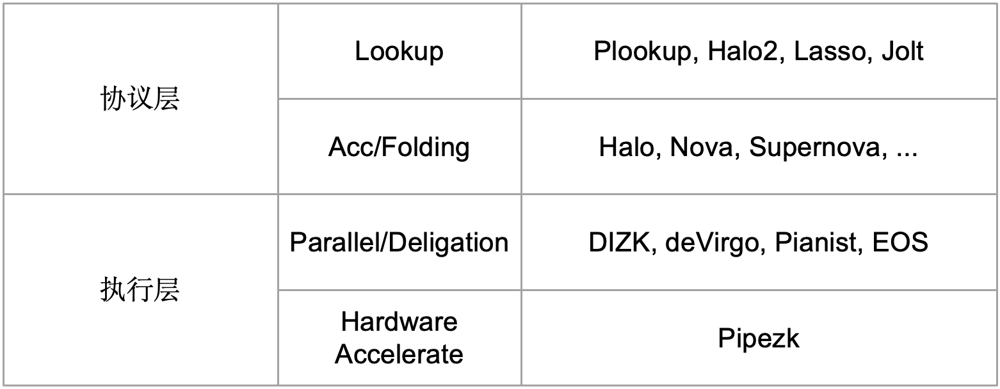

# Nova一镜到底

## 0x00 动机

共学社区产出了很多的Nova相关文章，但是总感觉没串在一起，对于我这种愚笨的小白来说还是不太友好。

因此，我想从一位小白的视角描述我学习Nova的过程，当然不可避免首先要学习社区中大佬们已有的解读文章。本文主要还是把Nova的脉络理清楚，然后补充一些小白视角下的疑问解答（请教了不少老师）。从头到尾捋一遍也有助于我对Nova的理解。

希望大家各有所获！！

## 0x01 问题的起源

### ZK证明系统

关于zk证明系统的来龙去脉，由于不是本文的重点，就不详细介绍了，相信看这篇文章的同志多少还是对ZK证明系统有所认知的。

在这里主要是从**主观**的角度描述ZK证明系统在工业界的可能热门迭代方向：**无需Trusted setup**和**优化证明效率**。当然，ZKP方向当然不仅仅只有这两个方向，理论界还有很多别的发展方向，在此不做讨论。

其中，**优化证明效率**方向我将其分为两个层面，如下表：

解释：

1. 协议层的优化方向分为lookup和Acc/Folding（也可以说Recursion），但是这两者不是互斥的选项，意味着可以同时采用这两种方式构建加速证明效率的方案。
2. 执行层的优化方向分为分布式并行计算和硬件加速，同样的，此二者也不是互斥的选项，可以同时采用分布式并行计算和硬件加速，参考2023年zPrice的[PLONK-DIZK](https://www.zprize.io/prizes/plonk-dizk-gpu-acceleration)。

可以看到，Nova是作为一种协议层的加速证明效率（递归证明）方案出现的。

### 【Why】为什么需要递归证明？

当使用ZK证明系统时，首先需要注意：**一个复杂且庞大的计算在单个证明系统中证明是低效且不切实际的。**这是因为我们需要把计算任务转换成电路，然后把电路、公共输入以及见证输入到证明系统中生成证明。当电路规模增加到一定数量级之后，证明速率会大大降低，甚至证明者由于实际内存限制根本无法生成证明。

再者，需要注意我们通常要求证明系统的**验证复杂度不能太高**，也就是所谓的简洁性 succinctness，在ZKP上下文中，简洁性一般指电路规模的多项式对数（poly-logarithmic）级别。【多项式对数是一种复杂度计算术语，表示为 $n^k\log^m n$】

在上述两点的条件限制下，如何对一个复杂且庞大的计算在单个证明系统中进行证明，并且保证验证者的验证成本在可接受范围内呢？

研究人员提出了三种「高效」证明思想：

1. 证明组合（Proof Composition）：将使用不同特点的证明系统组合起来以生成最终证明。比如可以先使用一个快速的证明系统，但是可能生成的proof size较大。为了减小proof size，可以再组合一个较慢的证明系统，用于证明「快证明系统」的证明可以通过验证者验证。注意，第二个「慢证明系统」其实证明的是第一个「快证明系统」的验证者电路，而验证者电路一般复杂度是较低的。因此，通过证明组合，我们可以实现用相对较快的方式证明一个复杂的计算电路的运行过程。

2. 证明聚合（Proof Aggregation）：将多个proof聚合成一个单一的proof。比如zkEVM包含了许多不同的电路，如EVM电路、RAM电路、存储电路等。在实践中，验证所有这些证明在区块链上是非常昂贵的。因此，我们使用证明聚合，即使用一个证明来证明这些多个子电路证明是有效的。这个单一的证明在区块链上更容易被验证。因此，这种证明思想下，需要首先各自运行证明系统分别生成证明，最后使用一个聚合证明的证明系统以证明各个证明的验证有效性和聚合的合法性。这种时间复杂度还是很高的。

3. 证明递归（Proof Recursion）：这是一种更为高明的证明思想，它旨在把复杂业务电路分割成相对小的计算电路，然后构建一连串验证者电路（**也就是说每次在进行业务电路运算的时候，顺带着把上一次的电路运行证明进行部分或者全部验证**），这样可以有效的**摊销**验证成本。如果每次运行的业务电路是一样的（即IVC，见后文解释），那么这样每一步我们可以生成一个比前一个证明更容易验证的证明。最终，我们只需要用最低的复杂度来验证最终的证明。

   注意上述加粗语句中，部分验证对应于Accumulator，全部验证对应于Folding。

通过上面的解释可知：递归证明可以有效的证明一个复杂且庞大的电路。

### 【What】Nova可以应用于什么领域？

在说回Nova本身，它是一种基于折叠Folding的证明技术，它的最主要用途就是实现高效的IVC。

而Nova的变种方案，则是在Nova基础上更进一步了：

SuperNova：它可以实现每一步证明不同的业务电路。

【TODO】: HyperNova, ProtoStar, UltraPlonkova.....

## 0x02 Cyrpto Primitives

### Pederson

### Poseidon

这两种hash方式具有加法同态+简洁性。【之前说了ZKP的简洁性评价标准，如何评价一个hash方案是否简洁呢？】

## 0x03 R1CS改造计划

### 1. Stantard R1CS

### 2. Relaxed R1CS

### 3. Committed Relaxed R1CS

## 0x04 Basic Folding Scheme(NIFS)

这里介绍第一对Prover-Verifier

## 0x05 IVC Folding Scheme

这里介绍第二对Prover-Verifier

## 0x06 Spartan

## 0x07 Full Nova

这里介绍第三对Prover-Verifier

### Summary

总结一下Nova证明系统的特性：

- No Trusted Setup.
- No Polynomial Multiplication(No FFT!!).
- The Nova prover run time is group exp(MSM) of size $O(|F|)$, which theoretically 5-50 times faster than Groth16, Plonk, Halo, and other solutions.
- The verifier circuit of Nova is constant: 2 scalar multiplication. So the **recuision threshold** can be ....
- The proof size is $O(|\log F|)$.

## 0x08 Code Structure&Example

## 0x09 Nova+ZKML

准备把毕设搞过来简单说一下

## Reference

Vedios:

- [by 作者Srinath Setty [EN\]](https://www.youtube.com/watch?v=mY-LWXKsBLc)

- [by 郭宇@安比: A short introduction to Nova [EN\]](https://www.youtube.com/watch?v=hq-1bLVz59w&t=324s)

- [by 郭宇@安比: Nova - Recursive SNARKs without trusted setup [中文\]](https://www.youtube.com/watch?v=l19roUItyUE)

- [Nova Crash Course with **Justin Drake** [EN\]](https://www.youtube.com/watch?v=SwonTtOQzAk&t=2815s)

Papers:

- [Nova: Recursive Zero-Knowledge Arguments from Folding Schemes](https://eprint.iacr.org/2021/370.pdf)
- [Revisiting the Nova Proof System on a Cycle of Curves](https://eprint.iacr.org/2023/969)

Blogs:

- [difference between base field and scalar field](https://crypto.stackexchange.com/questions/66436/for-an-elliptic-curve-what-is-the-difference-between-the-base-field-modulus-q)
- [order of ecc](https://medium.com/asecuritysite-when-bob-met-alice/whats-the-order-in-ecc-ac8a8d5439e8)
- [Scalable Zero Knowledge via Cycles of Elliptic Curves](https://eprint.iacr.org/2014/595.pdf)
- [The halo2 book](https://zcash.github.io/halo2/index.html)
- [Nova based zk VM](https://hackmd.io/@monyverse/H1XSVmHNh#Curve-Cycling)
- https://mp.weixin.qq.com/s/WPh8b6otBdan3JHejF9zVg
- https://snowolf0620.xyz/index.php/zkp/1267.html