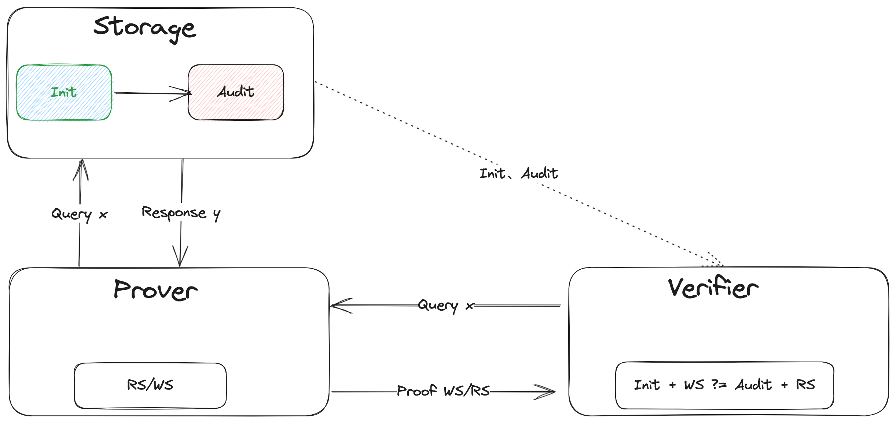
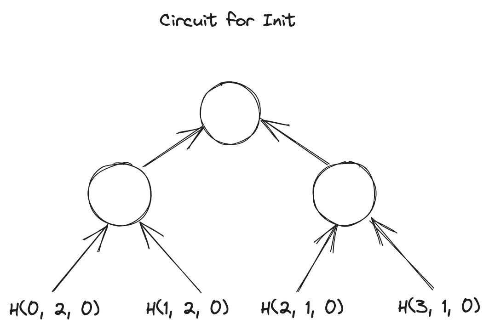
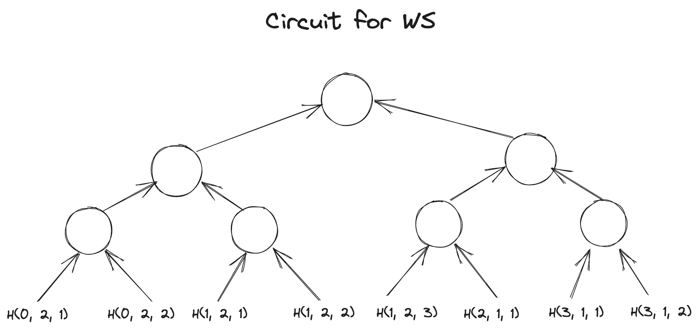

> 作者: [白菜](https://github.com/PayneJoe) \
> 标签: Sumcheck, IPA, GKR, Hyrax, VSM, Spice, Spark, Spartan \
> 时间: 2023-10-06 

<br />

# Table of Content
- [Table of Content](#table-of-content)
- [Motivation](#motivation)
- [Introduction](#introduction)
- [VSM in Spice](#vsm-in-spice)
  - [Takeaways](#takeaways)
- [Memory Check for Spark](#memory-check-for-spark)
  - [Problem](#problem)
  - [Resolution](#resolution)
      - [Initialization](#initialization)
      - [Operation](#operation)
      - [Verification](#verification)
  - [Arithmetic](#arithmetic)
  - [Circuit](#circuit)
      - [for $\\widetilde{H\_{\\gamma\_1, \\gamma\_2}(Init\_{row})}$ evaluation](#for-widetildeh_gamma_1-gamma_2init_row-evaluation)
      - [for $\\widetilde{H\_{\\gamma\_1, \\gamma\_2}(WS\_{row})}$ evaluation](#for-widetildeh_gamma_1-gamma_2ws_row-evaluation)
      - [for $\\widetilde{H\_{\\gamma\_1, \\gamma\_2}(Audit\_{row})}$ evaluation](#for-widetildeh_gamma_1-gamma_2audit_row-evaluation)
      - [for $\\widetilde{H\_{\\gamma\_1, \\gamma\_2}(RS\_{row})}$ evaluation](#for-widetildeh_gamma_1-gamma_2rs_row-evaluation)
- [Spark Overview](#spark-overview)
  - [Target of Spark](#target-of-spark)
  - [Technic in Spark](#technic-in-spark)
- [Spartan Protolcol Overview](#spartan-protolcol-overview)
  - [Round One](#round-one)
  - [Round Two](#round-two)
  - [Round Three](#round-three)
- [One more thing](#one-more-thing)
- [Thanks](#thanks)
- [References](#references)

<br />

# Motivation

<br />

缘于folding，缘于NOVA，缘于Setty，了解到了Spartan，但当时并不认识它，所以才有了本篇及前两篇前置[3] 和[7]...... 


关于Spartan，在ZK领域可能时间上相对也有点儿远了，暂且不考虑它在某些方面的争议，它的一些思想其实已经影响到其它比较热门的方向了，比如当下的热点Lasso & Jolt，所以它的研究意义仍然很大，尤其是其中的Spark。

<br />

# Introduction

本文是Spartan [4] research的终结篇，将重点囊括Spark 和 Spice [1]，前两篇[3] 和 [7] 是本篇的预备部分，如果对Sumcheck 不熟悉，也可以参考一下[6]。

<br />

Spark 是Spartan 整个协议的core part，Memory Check是Spark 的core part，而VSM又是Memory Check或者Spice的core part。本篇文章将从内向外延伸，读者尽管从感兴趣的地方切入即可。

<br />

# VSM in Spice

VSM，全称Verifiable State Machine，这个概念源自Spice[1]。

<br />

它的一个intuitive 的理解就是：把任何一个storage 对象当作一个State Machine，在这个State Machine上的任何operation 导致其state 的transition 都可以生成相应的proof 给verifier 验证。这就是所谓的Verifiable State Machine。

<br />

以单个Query或者read operation为例，我们看看Spice 中的VSM 长什么样子：


<br />

关于Spice的其它细节这里不展开，大家可以参考原始资料Spice [1]。

## Takeaways

- Spice 有两个drawback 或者特性：其一，批量验证，也就是n 个operation之后一起验证，成本会平摊到每个operation上，所以成本会很低，但会有时间上的delay；其二，如果验证不通过，是无法判断哪个operation 出的问题

<br />

- Storage 作为三方一个独立存在的个体，state 通常以**key-value-timestamp**的格式出现，它相比传统的key-value 的Storage 的区别就是加了一个可以**表征State Machine的非常关键元素Timestamp**

<br />

- Prover 自身维护两个set state $RS$ 和 $WS$，发送一个query/read operation 会更新本地的这两个set state $RS$ 和 $WS$，并update Storage的state $Audit$ ，发送一个write operation 会更新本地的state $WS$，并update Storage 的state $Audit$

<br />

- Verifier 拿着更新前的state $Init$，和更新后的state $Audit$，以及operaton 过程产生的中间state 或者proof $RS/WS$，进行最后的验证，验证通过说明返回的结果没有问题

<br />

# Memory Check for Spark

Spark 中Memory Check 的核心思想源自Spice[1]，Spice 支持读、写操作的验证，而Spark 中只需要具备lookup 功能的验证，所以可以简单理解为read-only 版本的Spice。

<br />

验证query/lookup 的结果对与不对，上一节我们提到过，这里我们就以Spartan为背景，举个实例detail一下它的执行过程，可以回答大家可能比较关心的两个问题：1. memory check 究竟解决的是什么问题？2. 为什么它可以work？

<br />

## Problem

假定有这么两个query 向量：
$$

addr_{row} = [0, 0, 1, 1, 1, 2, 3, 3] \\

addr_{col} = [0, 2, 0, 1, 3, 2, 0, 2] \\

$$

<br />

另外，假定：
$$

(r_x, r_y) = ((2, 3), (3, 4))

$$

以及相应的两个Storage 对象，或者叫lookup table $mem_{row} 、mem_{col}$：
$$

\def\arraystretch{1.5}

\begin{array}{c:c:c:c}

i & mem_{row} = \widetilde{eq}(i, r_x) & j & mem_{col} = \widetilde{eq}(j, r_y) \\ \hline

0 & (1 - 2)\sdot (1 - 3) = 2 & 0 & (1 - 3)\sdot (1 - 4) = 2 \\ \hdashline

1 & (1 - 2) \sdot 3 = 2 & 1 & (1 - 3) \sdot 4 = 2 \\ \hdashline

2 & 2 \sdot (1 - 3) = 1 & 2 & 3 \sdot (1 - 4) = 1 \\ \hdashline

3 & 2 \sdot 3 = 1 & 3 & 3 \sdot 4 = 2 \\ \hdashline

\end{array}

$$

<br />

query 的过程：给定$row_{addr}/col_{addr}$ 向量中的某个元素值，返回相应table 中evaluation值。比如请求$addr_{row}[5] = 2$，返回$\widetilde{eq}(2, r_x) = 1$。

<br />

为了简化，以下实例我们均以query $addr_{row} = [0, 0, 1, 1, 1, 2, 3, 3]$ 为例。如何证明它的返回结果 $e_{row} = [2, 2, 2, 2, 2, 1, 1, 1]$ 是正确的呢？这里我们detail 一下上一节中VSM 的逻辑。


<br />

## Resolution

#### Initialization

lookup table $mem_{row}$ 最开始的State：
$$

Init_{row} = [(0, 2, 0), (1, 2, 0), (2, 1, 0), (3, 1, 0)] \\

$$

<br />

#### Operation

批量query $addr_{row} = [0, 0, 1, 1, 1, 2, 3, 3]$ 之后，$mem_{row}$ 的State 变成了：
$$

Audit_{row} = [(0, 2, 2), (1, 2, 3), (2, 1, 1), (3, 1, 2)] \\

$$

<br />

批量query $addr_{row} = [0, 0, 1, 1, 1, 2, 3, 3]$ 之后，prover 这边维护的两个中间State 或者proof 为：
$$

RS_{row} = [(0, 2, 0), (0, 2, 1), (1, 2, 0), (1, 2, 1), (1, 2, 2), (2, 1, 0), (3, 1, 0), (3, 1, 1)] \\
WS_{row} = [(0, 2, 1), (0, 2, 2), (1, 2, 1), (1, 2, 2), (1, 2, 3), (2, 1, 1), (3, 1, 1), (3, 1, 2)] \\

$$

<br />

#### Verification

批量query 之前，verifier 请求拿到$mem_{row}$ 的初始State $Init_{row}$；批量query $addr_{row} = [0, 0, 1, 1, 1, 2, 3, 3]$ 之后，verifier 请求得到$mem_{row}$ 的最新State $Audit_{row}$，再结合prover 传递过来的proof $RS_{row}/WS_{row}$ 进行最后的验证：
$$

Init_{row} \cup WS_{row} \overset{?}= Audit_{row} \cup RS_{row}

$$

<br />

-----

接下来的问题是，如何把上面的计算过程算术化？

<br />

## Arithmetic
$$

Init_{row} \cup WS_{row} \overset{?}= Audit_{row} \cup RS_{row}

$$

这个等式本质是要判定两个set 是否相等？也就是说是一个permutaion的问题，自然就会联想到plonk 里lookup contrain用到的grand-product 的逻辑，也就是说：
$$

[(0, 2, 0), (1, 2, 0), (2, 1, 0), (3, 1, 0)] \cup [(0, 2, 1), (0, 2, 2), (1, 2, 1), (1, 2, 2), (1, 2, 3), (2, 1, 1), (3, 1, 1), (3, 1, 2)] \\

\overset{?}= \\

[(0, 2, 2), (1, 2, 3), (2, 1, 1), (3, 1, 2)] \cup [(0, 2, 0), (0, 2, 1), (1, 2, 0), (1, 2, 1), (1, 2, 2), (2, 1, 0), (3, 1, 0), (3, 1, 1)] 

$$

演变成了：
$$

(0, 2, 0) \sdot (1, 2, 0) \sdot (2, 1, 0) \sdot (3, 1, 0) \sdot (0, 2, 1) \sdot (0, 2, 2) \sdot (1, 2, 1) \sdot (1, 2, 2) \sdot (1, 2, 3) \sdot (2, 1, 1) \sdot (3, 1, 1) \sdot (3, 1, 2) \\

\overset{?}= \\

(0, 2, 2) \sdot (1, 2, 3) \sdot (2, 1, 1) \sdot (3, 1, 2) \sdot (0, 2, 0) \sdot (0, 2, 1) \sdot (1, 2, 0) \sdot (1, 2, 1) \sdot (1, 2, 2) \sdot (2, 1, 0) \sdot (3, 1, 0) \sdot (3, 1, 1)  

$$

<br />

很显明三元组的元素是无法直接相乘的，引入两个challenge factor $\gamma_1、\gamma_2$把三元组的元素合成一个field：
$$

H_{\gamma_1, \gamma_2}(a, v, t) = (a \sdot \gamma_1^2 + v \sdot \gamma_1 + t) - \gamma_2

$$

<br />

因此上面的等式就变成了：
$$

H_{\gamma_1, \gamma_2}(0, 2, 0) \sdot H_{\gamma_1, \gamma_2}(1, 2, 0) \sdot H_{\gamma_1, \gamma_2}(2, 1, 0) \sdot H_{\gamma_1, \gamma_2}(3, 1, 0) \sdot H_{\gamma_1, \gamma_2}(0, 2, 1) \sdot H_{\gamma_1, \gamma_2}(0, 2, 2) \sdot H_{\gamma_1, \gamma_2}(1, 2, 1) \sdot H_{\gamma_1, \gamma_2}(1, 2, 2) \sdot H_{\gamma_1, \gamma_2}(1, 2, 3) \sdot H_{\gamma_1, \gamma_2}(2, 1, 1) \sdot H_{\gamma_1, \gamma_2}(3, 1, 1) \sdot H_{\gamma_1, \gamma_2}(3, 1, 2) \\

\overset{?}= \\

H_{\gamma_1, \gamma_2}(0, 2, 2) \sdot H_{\gamma_1, \gamma_2}(1, 2, 3) \sdot H_{\gamma_1, \gamma_2}(2, 1, 1) \sdot H_{\gamma_1, \gamma_2}(3, 1, 2) \sdot H_{\gamma_1, \gamma_2}(0, 2, 0) \sdot H_{\gamma_1, \gamma_2}(0, 2, 1) \sdot H_{\gamma_1, \gamma_2}(1, 2, 0) \sdot H_{\gamma_1, \gamma_2}(1, 2, 1) \sdot H_{\gamma_1, \gamma_2}(1, 2, 2) \sdot H_{\gamma_1, \gamma_2}(2, 1, 0) \sdot H_{\gamma_1, \gamma_2}(3, 1, 0) \sdot H_{\gamma_1, \gamma_2}(3, 1, 1)  

$$

<br />

----

接下来的问题是，如何把上面的算术逻辑放在电路里，以便通过某个或者某几个协议来完成它的验证？

<br />

## Circuit 

我们把上面的等式grand-product 拆分成四个部分：
$$
\begin{aligned}

H_{\gamma_1, \gamma_2}(Init_{row}) &= H_{\gamma_1, \gamma_2}(0, 2, 0) \sdot H_{\gamma_1, \gamma_2}(1, 2, 0) \sdot H_{\gamma_1, \gamma_2}(2, 1, 0) \sdot H_{\gamma_1, \gamma_2}(3, 1, 0) \\

\\

H_{\gamma_1, \gamma_2}(WS_{row}) &= H_{\gamma_1, \gamma_2}(0, 2, 1) \sdot H_{\gamma_1, \gamma_2}(0, 2, 2) \sdot H_{\gamma_1, \gamma_2}(1, 2, 1) \sdot H_{\gamma_1, \gamma_2}(1, 2, 2) \sdot H_{\gamma_1, \gamma_2}(1, 2, 3) \sdot H_{\gamma_1, \gamma_2}(2, 1, 1) \sdot H_{\gamma_1, \gamma_2}(3, 1, 1) \sdot H_{\gamma_1, \gamma_2}(3, 1, 2) \\

\\

H_{\gamma_1, \gamma_2}(Audit_{row}) &= H_{\gamma_1, \gamma_2}(0, 2, 2) \sdot H_{\gamma_1, \gamma_2}(1, 2, 3) \sdot H_{\gamma_1, \gamma_2}(2, 1, 1) \sdot H_{\gamma_1, \gamma_2}(3, 1, 2) \\

\\

H_{\gamma_1, \gamma_2}(RS_{row}) &= H_{\gamma_1, \gamma_2}(0, 2, 0) \sdot H_{\gamma_1, \gamma_2}(0, 2, 1) \sdot H_{\gamma_1, \gamma_2}(1, 2, 0) \sdot H_{\gamma_1, \gamma_2}(1, 2, 1) \sdot H_{\gamma_1, \gamma_2}(1, 2, 2) \sdot H_{\gamma_1, \gamma_2}(2, 1, 0) \sdot H_{\gamma_1, \gamma_2}(3, 1, 0) \sdot H_{\gamma_1, \gamma_2}(3, 1, 1) 

\end{aligned}
$$

<br />

假定这四组向量都是witness，用GKR-like layered circuit 来把这四个grand-product 的计算trace 给描述出来，通过Hyrax [2] 协议来完成grand-product 的验证，最后验证四个grand-product 的结果是否满足等式即可：
$$

H_{\gamma_1, \gamma_2}(Init_{row}) \sdot H_{\gamma_1, \gamma_2}(WS_{row}) \overset{?}= H_{\gamma_1, \gamma_2}(Audit_{row}) \sdot H_{\gamma_1, \gamma_2}(RS_{row}) 

$$

---
我们用图直观感受一下这四个电路长什么样子？

<br />

Circuit for $Init_{row}$: 


<br />

Circuit for $WS_{row}$: 


<br />

Circuit for $Audit_{row}$: 


<br />

Circuit for $RS_{row}$: 


----

熟悉Hyrax 协议的应该知道，Hyrax协议是由多个Sumcheck 协议与一个IPA协议组成 [3]。Hyrax 的最后需要计算tree 的叶子节点，也就是witness向量，的MLE 多项式在某个opening $r$ 上的evaluation，它是通过一个IPA协议来完成的。

<br />

也就是说，在这里我们分别需要通过IPA协议完成四个evaluation 的验证：
$$
\begin{aligned}

\begin{rcases}

\widetilde{H_{\gamma_1, \gamma_2}(Init_{row}}(r)) &\overset{?}= v_{Init} \\

\\

\widetilde{H_{\gamma_1, \gamma_2}(WS_{row}}(r)) &\overset{?}= v_{WS} \\

\\

\widetilde{H_{\gamma_1, \gamma_2}(Audit_{row}}(r)) &\overset{?}= v_{Audit} \\

\\

\widetilde{H_{\gamma_1, \gamma_2}(RS_{row}}(r)) &\overset{?}= v_{RS} \\

\end{rcases}

\end{aligned}
$$
> 等式右边的四个evaluation值是通过Sumcheck 协议reduce 后拿到的。


$H_{\gamma_1, \gamma_2}(a, v, t)$ 是由相应的三元组$a、v、t$，即$addr、val、ts$ 组成。所以上面的四个evaluation 需要进行再次拆解。

<br />

#### for $\widetilde{H_{\gamma_1, \gamma_2}(Init_{row})}$ evaluation

$$
\begin{aligned}
\widetilde{addr_{Init}(r_{addr})} &\overset{?}= v_{Init}.v_{addr} \\

\widetilde{mem_{Init}(r_{mem})} &\overset{?}= v_{Init}.v_{mem} \\

\widetilde{ts_{Init}(r_{ts})} &\overset{?}= v_{Init}.v_{ts} \\
\end{aligned}
$$

三个dense 向量或者witness 为：

$$
\def\arraystretch{1.5}

\begin{array}{c:c:c}

addr & mem & ts_{init} \\ \hline
0 & 2 & 0 \\ \hdashline
1 & 2 & 0 \\ \hdashline
2 & 1 & 0 \\ \hdashline
3 & 1 & 0 \\ \hdashline

\end{array}
$$

用3个IPA协议去验证以上三个MLE 的evaluation值是否合法。

<br />

#### for $\widetilde{H_{\gamma_1, \gamma_2}(WS_{row})}$ evaluation

$$
\begin{aligned}
\widetilde{addr_{WS}(r_{addr})} &\overset{?}= v_{WS}.v_{addr} \\

\widetilde{e_{WS}(r_{e})} &\overset{?}= v_{WS}.v_{e} \\

\widetilde{ts_{WS}(r_{ts})} &\overset{?}= v_{WS}.v_{ts} \\
\end{aligned}
$$

三个dense 向量或者witness 为：
$$
\def\arraystretch{1.5}

\begin{array}{c:c:c}

addr_{WS} & e_{WS} & ts_{WS} \\ \hline
0 & 2 & 1 \\ \hdashline
0 & 2 & 2 \\ \hdashline
1 & 2 & 1 \\ \hdashline
1 & 2 & 2 \\ \hdashline
1 & 2 & 3 \\ \hdashline
2 & 1 & 1 \\ \hdashline
3 & 1 & 1 \\ \hdashline
3 & 1 & 2 \\ \hdashline

\end{array}
$$

用3个IPA协议去验证以上三个MLE 的evaluation值是否合法。

<br />

#### for $\widetilde{H_{\gamma_1, \gamma_2}(Audit_{row})}$ evaluation
$$
\begin{aligned}
\widetilde{addr_{Audit}(r_{addr})} &\overset{?}= v_{Audit}.v_{addr} \\

\widetilde{mem_{Audit}(r_{mem})} &\overset{?}= v_{Audit}.v_{mem} \\

\widetilde{ts_{Audit}(r_{ts})} &\overset{?}= v_{Audit}.v_{ts} \\
\end{aligned}
$$

三个dense 向量或者witness 为：

$$
\def\arraystretch{1.5}

\begin{array}{c:c:c}

addr & mem & ts_{init} \\ \hline
0 & 2 & 2 \\ \hdashline
1 & 2 & 3 \\ \hdashline
2 & 1 & 1 \\ \hdashline
3 & 1 & 2 \\ \hdashline

\end{array}
$$

用3个IPA协议去验证以上三个MLE 的evaluation值是否合法。

<br />

#### for $\widetilde{H_{\gamma_1, \gamma_2}(RS_{row})}$ evaluation
$$
\begin{aligned}
\widetilde{addr_{RS}(r_{addr})} &\overset{?}= v_{RS}.v_{addr} \\

\widetilde{e_{RS}(r_{e})} &\overset{?}= v_{RS}.v_{e} \\

\widetilde{ts_{RS}(r_{ts})} &\overset{?}= v_{RS}.v_{ts} \\
\end{aligned}
$$

三个dense 向量或者witness 为：
$$
\def\arraystretch{1.5}

\begin{array}{c:c:c}

addr_{WS} & e_{WS} & ts_{WS} \\ \hline
0 & 2 & 0 \\ \hdashline
0 & 2 & 1 \\ \hdashline
1 & 2 & 0 \\ \hdashline
1 & 2 & 1 \\ \hdashline
1 & 2 & 2 \\ \hdashline
2 & 1 & 0 \\ \hdashline
3 & 1 & 0 \\ \hdashline
3 & 1 & 1 \\ \hdashline

\end{array}
$$

用3个IPA协议去验证以上三个MLE 的evaluation值是否合法。

<br />

----
到此为止，Spark 中memory check 的逻辑就完整了！关于Spark 的应用在Brakedown [5]中也有应用，感兴趣的话也可以参考一下。

<br />

最后我们再revisit 一下之前提到的两个问题：

```admonish info
memory check 究竟解决的是什么问题？又为什么可以work？

抽象地说是，Verifiable Random Access Memory，简称vRAM。把对内存访问结果的验证转换成一个Verifiable State Machine，简称VSM，的问题，也就是一个可验证的state transition的问题，最后通过电路的形式把state transition验证计算的trace 表达出来。
```

<br />

接下来我们就可以非常轻松的review 一下Spark 了。

# Spark Overview

## Target of Spark
以$O(n)$ 的时间复杂度完成Sparse Matrix Polynomial 的evaluation。

<br />

比如，有一个Sparse Matrix:
$$

M = 

\begin{bmatrix}

1, 0, 2, 0 \\

2, 4, 0, 3 \\

0, 0, 1, 0 \\

3, 0, 4, 0 \\

\end{bmatrix}

$$

其中涉及到的常量：
$$

\begin{aligned}

&m = 4 \\

&n = 8 \\

&s = \log m = 2 \\

&u = 2s = 4 \\

\end{aligned}

$$

> $m$ 代表矩阵的行数/列数，$n$ 代表矩阵中non-zero 元素的个数，$u$ 代表matrix dense MLE中的变量个数。

<br />

上面这个matrix 的dense MLE 可以表示为：
$$

\widetilde{M}(r_x, r_y) = \sum_{x \in \{0, 1\}^s, y \in \{0, 1\}^s} M(x, y) \sdot \widetilde{eq}(x, r_x) \sdot \widetilde{eq}(y, r_y)

$$

<br />

因为是dense 的表达，所以默认$M(x, y)$是按顺序遍历的，一共有$m^2 \sdot 2s = m^2 \sdot 2 \log m$ 次乘法运算，即时间复杂度为$O(m^2 \sdot \log m)$，成本随着$m$ 的增大，会呈现asymptotic 式的增长。在Spartan中，$m$ 又代表R1CS 的gate 数量，这种特征就会体现得更明显。

<br />

Spark 把sparse matrix 的evaluation代理给prover，并通过memory check 的消除这种asymptotic，把它的时间复杂度控制在$O(n)$，跟R1CS 的gate 数量无关了，仅仅跟Sparse 的呈度有关。因此，matrix 越稀疏，它的优势就体现得越明显。即 $n \ll m^2$

<br />

## Technic in Spark

首先，Spark不再用矩阵表达了，而是换作三个向量来表达：
$$
\begin{aligned}
addr_{row} &= [0, 0, 1, 1, 1, 2, 3, 3] \\

addr_{col} &= [0, 2, 0, 1, 3, 2, 0, 2] \\

val &= [1, 2, 2, 4, 3, 1, 3, 4] \\
\end{aligned}
$$

<br />

其次，Spark 改变了MLE evaluation 的多项式：
$$
\begin{aligned}

\widetilde{M}(r_x, r_y) &= \sum_{x = 0}^{x < n} val(x) \sdot \widetilde{eq}(addr_{row}(x), r_x) \sdot \widetilde{eq}(addr_{col}(x), r_y) \\

\end{aligned}
$$

<br />

假定$(r_x, r_y) = ((2, 3), (3, 4))$，通过时间复杂度为$O(m)$ 的计算，可以拿到两个类似lookup table的东西$mem_{row} 、 mem_{col}$：
$$

\def\arraystretch{1.5}

\begin{array}{c:c:c:c}

i & mem_{row} = \widetilde{eq}(i, r_x) & j & mem_{col} = \widetilde{eq}(j, r_y) \\ \hline

0 & (1 - 2)\sdot (1 - 3) = 2 & 0 & (1 - 3)\sdot (1 - 4) = 2 \\ \hdashline

1 & (1 - 2) \sdot 3 = 2 & 1 & (1 - 3) \sdot 4 = 2 \\ \hdashline

2 & 2 \sdot (1 - 3) = 1 & 2 & 3 \sdot (1 - 4) = 1 \\ \hdashline

3 & 2 \sdot 3 = 1 & 3 & 3 \sdot 4 = 2 \\ \hdashline

\end{array}

$$

**通过查表**的方式，我们很容易拿到$e_{row}(x) = \widetilde{eq}(addr_{row}(x), r_x)$ 和 $e_{row}(x) = \widetilde{eq}(addr_{col}(x), r_x)$ 的取值：
$$

\def\arraystretch{1.5}

\begin{array}{c:c:c:c:c}

x & val(x) & e_{row}(x) & e_{col}(x) & M(x) \\ \hline

000 & 1 & 2 & 2 & 4 \\ \hdashline
001 & 2 & 2 & 1 & 4 \\ \hdashline
010 & 2 & 2 & 2 & 3 \\ \hdashline
011 & 4 & 2 & 2 & 1 \\ \hdashline
100 & 3 & 2 & 2 & 2 \\ \hdashline
101 & 1 & 1 & 1 & 1 \\ \hdashline
110 & 3 & 1 & 2 & 1 \\ \hdashline
111 & 4 & 1 & 1 & 4 \\ \hdashline

\end{array}

$$

因此我们可以得到sparase matrix 在$(r_x, r_y) = ((2, 3), (3, 4))$ 上的evaluation值 $\widetilde{M}(r_x, r_y) = 0$。接下来prover 要做的就是生成相应的proof ：
$$

\begin{aligned}

\widetilde{M}(r_x, r_y) &= \sum_{x = 0}^{x < n} val(x) \sdot \widetilde{eq}(addr_{row}(x), r_x) \sdot \widetilde{eq}(addr_{col}(x), r_y) \\

\Downarrow \\

M(r) &= \sum_{x \in \{0, 1\}^{\log n}} [val(x) \sdot \prod_{i = 1}^{i < \log  n} (x_i \sdot r_i + (1 - x_i) \sdot (1 - r_i))] \\

& \sdot [e_{row}(x) \sdot \prod_{j = 1}^{j < \log  n} (x_j \sdot r_j + (1 - x_j) \sdot (1 - r_j))] \\

& \sdot [e_{col}(x) \sdot \prod_{k = 1}^{k < \log  n} (x_k \sdot r_k + (1 - x_k) \sdot (1 - r_k))] \\

&\overset{?}= 0

\end{aligned}

$$

本质是要证明三个多项式乘积的sum 等于0，这是一个标准的degree为3的Sumcheck。Sumcheck 的last round 需要验证：
$$

\widetilde{val}(r') \sdot \widetilde{e_{row}}(r') \sdot \widetilde{e_{col}}(r') \overset{?}= v_{last}

$$

其中$v_{last}$ Sumcheck 最后reduced 得到的claim，左边的三个term，其中$\widetilde{val}(r') \overset{?}= v_{val}$ 可以轻易地通过一个IPA 协议证明得到；但是，$\widetilde{e_{row}}(r') 、\widetilde{e_{col}}(r')$ 呢？也直接可以通过IPA 协议证明吗？

<br />

不行！细心地会发现上面的表中$e_{row}(x)、e_{col}(x)$ 并不是跟$val(x)$ 一样以determined dense vector 或者 determined witness的形式出现在verifier 面前的，对于verifier 来说，它只知道有：
$$

\begin{aligned}
addr_{row} &= [0, 0, 1, 1, 1, 2, 3, 3] \\

addr_{col} &= [0, 2, 0, 1, 3, 2, 0, 2] \\

val &= [1, 2, 2, 4, 3, 1, 3, 4] \\
\end{aligned}

$$
这三样determined 的东西，$e_{row}(x)、e_{col}(x)$ 是prover 基于$addr_{row}、addr_{col}$通过**查表** $mem_{row}$ 和 $mem_{col}$拿到的，对于verifier来说叫做non-determined witness，也是一种中间过程变量。因此还需要一个**验证查表**过程的电路，来保证它们的来历合规合法！

<br />

剩下的就是memory check的show time，上节已经detail 了它的整个过程，这里就不再赘述。


<br />


到此为止，Spark是如何更高效地解决Sparse Matrix evaluation 问题的就已经解释清楚了。文章的最后我们就可以非常轻松地revisit一下 Spartan 的整个协议了。

<br />

# Spartan Protolcol Overview
假定，有这么一个业务计算：
$$

f(x) = x^3 + 3, x \in \mathbb{F}_{11}

$$

<br />

setup 阶段构造R1CS Instance：
$$

A = 

\begin{bmatrix}

1 & 0 & 0 & 0 & 0 \\
0 & 1 & 0 & 0 & 0 \\
0 & 0 & 1 & 0 & 3 \\

\end{bmatrix} \\

B = 

\begin{bmatrix}

1 & 0 & 0 & 0 & 0 \\
1 & 0 & 0 & 0 & 0 \\
0 & 0 & 0 & 0 & 1 \\

\end{bmatrix} \\

C = 

\begin{bmatrix}

0 & 1 & 0 & 0 & 0 \\
0 & 0 & 1 & 0 & 0 \\
0 & 0 & 0 & 1 & 0 \\

\end{bmatrix} \\

$$

> 这是非常典型的sparse matrix，可以充分发挥Spark的优势！

<br />

prover 填充向量$z$:
$$

z = 

\begin{bmatrix}

2 \\

4 \\

8 \\

0 \\

\textcolor{green} {1} \\

\end{bmatrix} \\

$$

<br />

令：
$$

\begin{aligned}

\widetilde{}v_A(x) &= \sum_{y \in \{0, 1\}^s}\widetilde{A}(x, y) \sdot \widetilde{z}(y) \\
&=  [(1 - x_1)(1 - x_2) * A_{0} \sdot z + (1 - x_1)x_2 * A_{1} \sdot z + x_1 (1 - x_2) * A_{2} \sdot  z + x_1 x_2 * A_{3} \sdot z] \\

\\

v_B(x) &= \sum_{y \in \{0, 1\}^s}\widetilde{B}(x, y) \sdot \widetilde{z}(y) \\
&=  [(1 - x_1)(1 - x_2) * B_{0} \sdot z + (1 - x_1) x_2 * B{1} \sdot z + x_1 (1 - x_2) * B_{2} \sdot z + x_1 x_2 * B_{3} \sdot z] \\

\\

v_C(x) &= \sum_{y \in \{0, 1\}^s}\widetilde{C}(x, y) \sdot \widetilde{z}(y) \\
&=  [(1 - x_1)(1 - x_2) * C_{0} \sdot z + (1 - x_1) x_2 * C_{1} \sdot z + x_1 (1 - x_2) * C_{2} \sdot z + x_1 x_2 * C_{3} \sdot z] \\

\end{aligned}

$$

> 其中$A_0$ 代表矩阵$A$ 的第0行，同理$A_1$、$A_2$ ... $B_0$...

<br />

还有：
$$

\widetilde{F}(x) = v_A(x) \sdot v_B(x) - v_C(x)

$$

<br />

prover 需要证明：
$$

\widetilde{F}(x) = 0, \forall x \in \{0, 1\}^s

$$

<br />

令：
$$
\begin{aligned}

Q(\tau) &= \sum_{x \in \{0, 1\}^s} \widetilde{F}(x) \sdot \widetilde{\text{eq}}(x, \tau), \forall \tau \in \mathbb{F}^s \\

&= \sum_{x \in \{0, 1\}^s} \widetilde{F}(x) \sdot \prod_{i = 0}^s [x_i r_{\tau_i} + (1 - x_i)(1 - r_{\tau_i})] \\

\end{aligned}
$$

<br />

实例中，$s = 2$:
$$

Q(\tau) = \widetilde{F}(00) \sdot \textcolor{red} {[(1 - \tau_0)(1 - \tau_1)]} +  \widetilde{F}(01) \sdot \textcolor{red} {[(1 - \tau_0)\tau_1]} +  \widetilde{F}(10) \sdot \textcolor{red} {[\tau_0 (1 - \tau_1)]} +  \widetilde{F}(11) \sdot \textcolor{red} {[\tau_0 \tau_1]}

$$

<br />

假设：

$$
Q(\tau) = 0, \forall \tau \in \mathbb{F}^s
$$

<br />

上面红色部分等于0的概率就非常低，因为$\tau$ 的domain是整个field，等于0或者1的概率自然就非常小几乎可以忽略，那么我们就可以推出：

$$
\widetilde{F}(x) = 0, \forall x \in \{0, 1\}^s
$$

<br />

## Round One

verifier 随机给定一个challenge factor $r_\tau \in \mathbb{F}^s$，prover 只需要证明：

$$
\begin{aligned}

Q(r_\tau) &= \sum_{x \in \{0, 1\}^s} \widetilde{F}(x) \sdot \widetilde{\text{eq}}(x, r_\tau) \\

&= \sum_{x \in \{0, 1\}^s} \widetilde{F}(x) \sdot \prod_{i = 0}^s [x_i \textcolor{green} {r_{\tau_i}} + (1 - x_i)(1 - \textcolor{green} {r_{\tau_i}})] \\

&\overset{?}= 0 \\

\end{aligned}
$$

<br />

这是典型的degree 为3的Sumcheck（三个MLE polynomial的乘法），Sumcheck 的最后reduce 成：
$$

（\widetilde{v_A}(r_x) \sdot \widetilde{v_B}(r_x) - \widetilde{v_C}(r_x)) \sdot \widetilde{eq}(r_x, r_\tau) \overset{?}= v_{x}

$$

<br />

其中$\widetilde{eq}(r_x, r_\tau)$ verifier 可以自行计算，但$\widetilde{v_A}(r_x)、\widetilde{v_B}(r_x)、\widetilde{v_C}(r_x)$ 隐藏着witness信息，需要prover 计算完成之后发送$v_A 、 v_B、v_C$给verifier，verifier 完成上述等式验证。


## Round Two
接着prover 需要证明：
$$

\begin{aligned}

\widetilde{}v_A(r_x) &= \sum_{y \in \{0, 1\}^s}\widetilde{A}(r_x, y) \sdot \widetilde{z}(y) \\

&= \sum_{y \in \{0, 1\}^s} [(1 - r_x^1)(1 - r_x^2) \sdot \widetilde{A}_0(y) \sdot \widetilde{z}(y)] + [(1 - r_x^1) r_x^2 \sdot \widetilde{A}_1(y) \sdot \widetilde{z}(y)] + [r_x^1 (1 - r_x^2) \sdot \widetilde{A}_2(y) \sdot \widetilde{z}(y)] + + [r_x^1 r_x^2 \sdot \widetilde{A}_3(y) \sdot \widetilde{z}(y)]\\

&= \sum_{y \in \{0, 1\}^s} [(1 - r_x^1)(1 - r_x^2)] \sdot [A((0, 0), y) \sdot \widetilde{eq}(y, r')] \sdot [z(y) \sdot \widetilde{eq}(y, r')] \\

&+ [(1 - r_x^1) r_x^2] \sdot [A((0, 1), y) \sdot \widetilde{eq}(y, r')] \sdot [z(y) \sdot \widetilde{eq}(y, r')] \\

&+ [r_x^1 (1 - r_x^2)] \sdot [A((1, 0), y) \sdot \widetilde{eq}(y, r')] \sdot [z(y) \sdot \widetilde{eq}(y, r')] \\

&+ [r_x^1 r_x^2] \sdot [A((1, 1), y) \sdot \widetilde{eq}(y, r')] \sdot [z(y) \sdot \widetilde{eq}(y, r')]\\

&\overset{?}= v_A \\

\\

v_B(x) &= \sum_{y \in \{0, 1\}^s}\widetilde{B}(r_x, y) \sdot \widetilde{z}(y) \\

&= \sum_{y \in \{0, 1\}^s} [(1 - r_x^1)(1 - r_x^2) \sdot \widetilde{B}_0(y) \sdot \widetilde{z}(y)] + [(1 - r_x^1) r_x^2 \sdot \widetilde{B}_1(y) \sdot \widetilde{z}(y)] + [r_x^1 (1 - r_x^2) \sdot \widetilde{B}_2(y) \sdot \widetilde{z}(y)] + + [r_x^1 r_x^2 \sdot \widetilde{B}_3(y) \sdot \widetilde{z}(y)]\\

&= \sum_{y \in \{0, 1\}^s} [(1 - r_x^1)(1 - r_x^2)] \sdot [B((0, 0), y) \sdot \widetilde{eq}(y, r')] \sdot [z(y) \sdot \widetilde{eq}(y, r')] \\

&+ [(1 - r_x^1) r_x^2] \sdot [B((0, 1), y) \sdot \widetilde{eq}(y, r')] \sdot [z(y) \sdot \widetilde{eq}(y, r')] \\

&+ [r_x^1 (1 - r_x^2)] \sdot [B((1, 0), y) \sdot \widetilde{eq}(y, r')] \sdot [z(y) \sdot \widetilde{eq}(y, r')] \\

&+ [r_x^1 r_x^2] \sdot [B((1, 1), y) \sdot \widetilde{eq}(y, r')] \sdot [z(y) \sdot \widetilde{eq}(y, r')]\\

&\overset{?}= v_B \\

\\

v_C(x) &= \sum_{y \in \{0, 1\}^s}\widetilde{C}(r_x, y) \sdot \widetilde{z}(y) \\

&= \sum_{y \in \{0, 1\}^s} [(1 - r_x^1)(1 - r_x^2) \sdot \widetilde{C}_0(y) \sdot \widetilde{z}(y)] + [(1 - r_x^1) r_x^2 \sdot \widetilde{C}_1(y) \sdot \widetilde{z}(y)] + [r_x^1 (1 - r_x^2) \sdot \widetilde{C}_2(y) \sdot \widetilde{z}(y)] + + [r_x^1 r_x^2 \sdot \widetilde{C}_3(y) \sdot \widetilde{z}(y)]\\

&= \sum_{y \in \{0, 1\}^s} [(1 - r_x^1)(1 - r_x^2)] \sdot [C((0, 0), y) \sdot \widetilde{eq}(y, r')] \sdot [z(y) \sdot \widetilde{eq}(y, r')] \\

&+ [(1 - r_x^1) r_x^2] \sdot [C((0, 1), y) \sdot \widetilde{eq}(y, r')] \sdot [z(y) \sdot \widetilde{eq}(y, r')] \\

&+ [r_x^1 (1 - r_x^2)] \sdot [C((1, 0), y) \sdot \widetilde{eq}(y, r')] \sdot [z(y) \sdot \widetilde{eq}(y, r')] \\

&+ [r_x^1 r_x^2] \sdot [C((1, 1), y) \sdot \widetilde{eq}(y, r')] \sdot [z(y) \sdot \widetilde{eq}(y, r')]\\

&\overset{?}= v_C \\

\end{aligned}

$$

<br />

这又是典型的degree 为2的Sumcheck（两个MLE polynomial的乘法），Sumcheck的最后reduce成：
$$
\begin{aligned}

\widetilde{A(r_x, r_y)} \sdot \widetilde{z(r_y)}  \overset{?}= v_A' \\

\\

\widetilde{B(r_x, r_y)} \sdot \widetilde{z(r_y)} \overset{?}= v_B' \\

\\

\widetilde{C(r_x, r_y)} \sdot \widetilde{z(r_y)} \overset{?}= v_C' \\

\end{aligned}
$$

## Round Three
上述等式中 $\widetilde{z(r_y)}$ evaluation 的证明可以直接通过IPA 协议来完成，而$\widetilde{A(r_x, r_y)}$ evaluation 的证明就需要Spark 协议来完成了。

<br />

剩下的就是Spark的show time，上节已经detail 了它的整个过程，这里就不再赘述。到此为止，Spartan 整个协议的详细逻辑就完整了！

<br />

# One more thing
纵观Spartan 整套协议，里面穿插着大量的Sumcheck 协议、IPA 协议，工程实现中应该会有相应的proof aggregation 的操作，具体细节可以参考Spartan [4]中的7.23 节和 8节。

<br />

# Thanks
- 本着research 的原则，边“猜”paper 作者的意图边手动推理论证，试图用逻辑说服自己，期间免不了叨扰@even @郭宇 老师来求证自己的“猜想”，真诚表达对他们的感谢

- 再次感谢SecbitLabs @郭宇 老师前两个月分享的Spartan Overview，视频链接暂时找不到了，后续再补上；再次感谢SecbitLabs @even 关于Spartan在研究方向上的指引

<br />

# References
[1] Spice: https://eprint.iacr.org/2018/907.pdf 

[2] Hyrax: https://eprint.iacr.org/2017/1132.pdf

[3] Spartan 预备知识：Hyrax: https://learnblockchain.cn/article/6586

[4] Spartan: https://eprint.iacr.org/2019/550.pdf

[5] Brakedown：https://eprint.iacr.org/2021/1043.pdf

[6] GKR 协议系列之Sum-Check: https://learnblockchain.cn/article/6188

[7] Spartan 预备知识：GKR with ZK Argument: https://learnblockchain.cn/article/6566