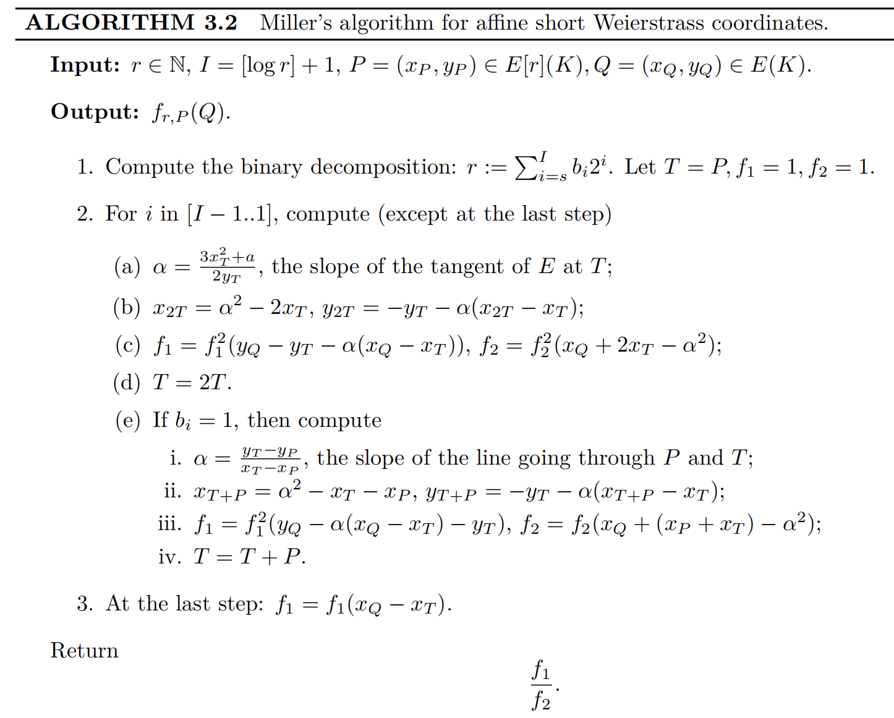
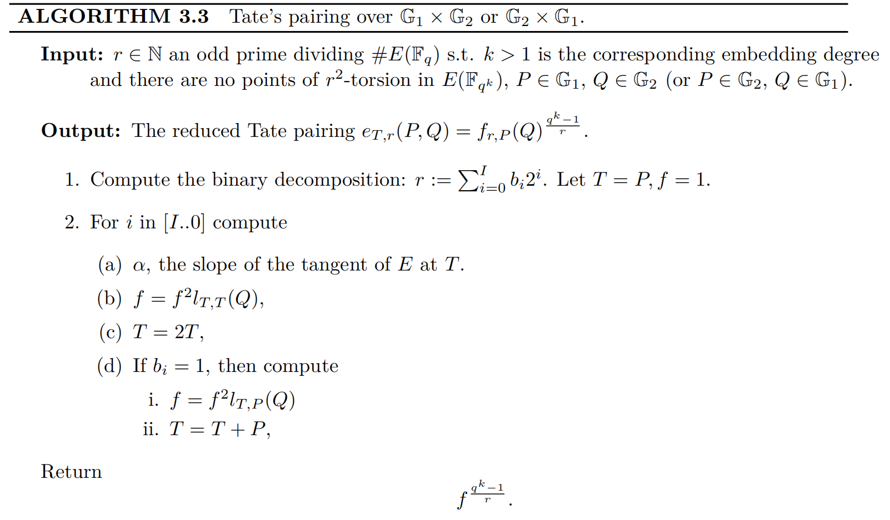
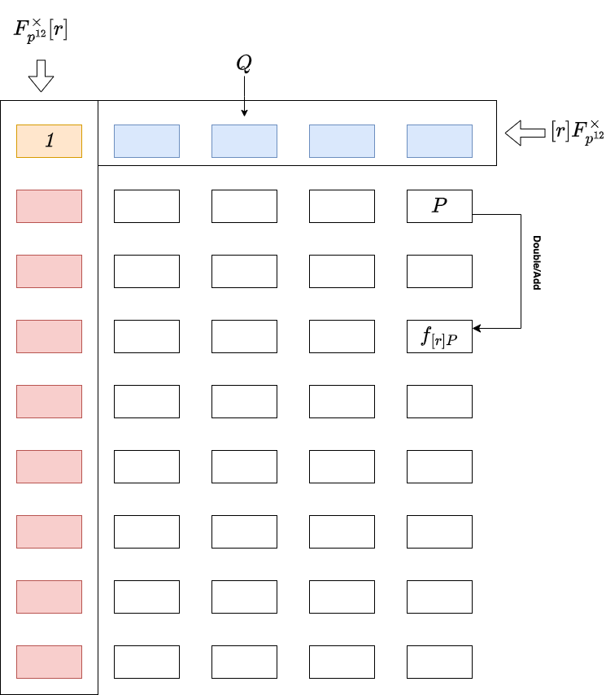
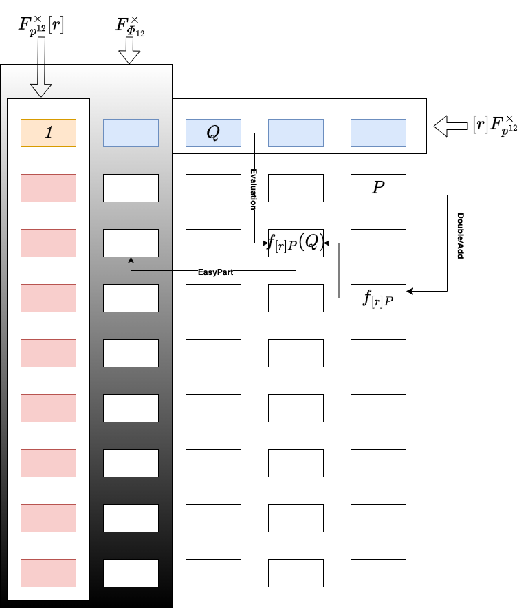
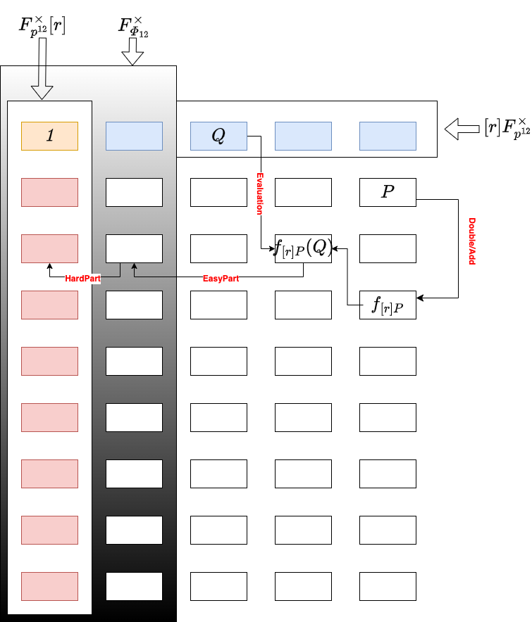

如果你是一个*SNARKER*，你一定听说过*KZG Commitment*，如果你听说过*KZG Commitment*，那你一定知道**Pairing**。这就是我们接下来要讨论的，大家如果想了解**Pairing** 的底层逻辑(**pairing primitives**)，或者对它的应用感兴趣都可以留言，或者添加文末的联系方式。

<br />

至今距离pairing 的“尘埃落定”其实已经大概有6、7年的时间了，网上的资料很完整，但关于它的讨论(工程上)仍未止步，比如[On Proving Pairings](https://eprint.iacr.org/2024/640.pdf).

<br />

*本文所有内容源自hackmd上的[note](https://hackmd.io/@70xfCGp1QViTYYJh3AMrQg/ryo55eEeC)，欢迎follow*.

-----

#  这里没有的

- group theory, field theory and homomorphism
    
    相关基本概念在这里不会涵盖，详情请查阅任何**abstract algebraic** 相关的书籍
    
- divisors

    相关基本概念在这里不会涵盖，对于了解**Pairing** 来说 [Pairing for Beginners](https://static1.squarespace.com/static/5fdbb09f31d71c1227082339/t/5ff394720493bd28278889c6/1609798774687/PairingsForBeginners.pdf) 已足够，如果你还想深入理解最好翻阅一下 **algebraic geometry** 相关的书籍
    
- structure of elliptic curve over finite field and its arithmetics (scalar multiplication)

    理论和算法部分这里不会涵盖，详情可以查阅 [Guide to Elliptic Curve Cryptography](http://tomlr.free.fr/Math%E9matiques/Math%20Complete/Cryptography/Guide%20to%20Elliptic%20Curve%20Cryptography%20-%20D.%20Hankerson,%20A.%20Menezes,%20S.%20Vanstone.pdf)
   
- hash to curve

    bytes string 映射到$\mathbb{G}_1$或者$\mathbb{G}_2$ 上的点，简单说就是hash，是**pairing** 应用层面必备的一大模块，后续会详细补充这块内容
    
- non-affine coordinate
    
    affine coordinate 其实只是椭圆曲线元素表达的需要，它的**scalar multiplication** 并不经济，所以实际计算上都会用non-affine coordinate 来替代，后续会补上这块内容
    
- advanced scalar multiplication algorithms GLV/GLS

    特定的曲线上充分利用同态映射来加速**scalar multiplication**，同时还能(GPU)并行化处理也是当下硬件加速卖点，后续也会再补上

<br />

----

# 这里有的

本篇文章集中讨论了各种**Pairing** 变体:
- [Weil Pairing](#Weil-Pairing)
- [Tate Pairing](#Tate-Pairing)
- [Ate Pairing](#Ate-Pairing)
- [Optimal Pairing](#Optimal-Pairing)

和它们的具体实现。除此之外，我们还包含了一些重要的实现层面的tricks，尤其是:
- [Tower Fields](#Tower-Fields)
- [Frobenius Map](#Magic-Power-of-Frobenius-Map)
- [Twist](#Magic-Power-of-Twist)
- [Cyclotomic Group](#Arithmetics-over-Cyclotomic-Group)
- ...

<br />

-----

# 关于代码

- [python implementation](https://github.com/PayneJoe/crypto_research/tree/main/ecc/src/pairings)

    主要集中在**Pairing**的计算逻辑上，包括**Miller Loop** 和 **Final Exponentiation**。目前已经完成验证。
    
    **Finite Field** 和 **Elliptic Curves**的算术运算并没有逐一实现，用的是Sagemath库自带的 **Galois Field** and **Elliptic Curve**.

- [rust implementation](https://github.com/PayneJoe/crypto_research/tree/main/ecc/src/pairings)

    从零着手，从 **Bigint** 算术运算到 **Finite Field** 算术运算到 **Elliptic Curve** 算术运算，再到 **Pairings Primitives**。底层的逻辑已经验证完毕，目前在**Pairings**验证过程中 ...

<br />

# 公共信息

- Modulus of base prime field (characteristic) $F_p$ with 381-bits:
    $$
    p = 4002409555221667393417789825735904156556882819939007885332058136124031650490837864442687629129015664037894272559787
    $$

<br />

- Embedding degree, or the degree of full extension field $F_{p^k}$:
    $$
    k = 12
    $$

<br />

- Elliptic Curve (additive group) over **base prime field** $F_p$:
    $$
        \mathbb{G}_1/E(F_p): y^2 = x^3 + 4
    $$

<br />

- Elliptic Curve (additive group) over extension field $F_{p^k}$:
    $$
        \mathbb{G}_2/E(F_{p^k}): y^2 = x^3 + 4
    $$

<br />

- Largest prime factor of $|E(F_p)|$ with 255-bits:
    $$
        r = 52435875175126190479447740508185965837690552500527637822603658699938581184513
    $$

<br />

- Trace of Frobenius:
    $$
        t = p + 1 - |E(F_p)| = -15132376222941642751
    $$

<br />

- Parameter for BLS12 Pairing-family:
    $$
        x = -15132376222941642752
    $$
    for:
    $$
        \begin{aligned}
            r(x) &= x^4 - x^2 + 1 \\
            p(x) &= (x - 1)^2 \cdot r(x) \cdot \frac{1}{3} + x\\
            t(x) &= x + 1 \\
        \end{aligned}
    $$
    

<br />

- Target (multiplicative) group with order $r$ defined over $F_{p^k}$:
    $$
        \mathbb{G}_T: F_{p^k}^{\times}[r]
    $$

<br />

------

# Pairing 的演进

## Weil Reciprocity

$g$ and $f$ 是两个定义在椭圆曲线上的divisor function, $f, g \in K(E)$，它们的divisor support 不存在交集, $supp((f)) \land supp((g)) = \emptyset$。然后我们就有:

$$
g((f)) \equiv f((g))
$$

其中 $(f)$ 表示函数 $f$的divisor, $g((f))$ 表示divisor $(g)$ 在函数$g$ 上的evaluation。 $f((g))$ 也类似.

<br />

如果我们放松上面的约束条件, 如果 $supp((f)) \land supp((g)) \ne \emptyset$, 然后就有一个更general 的 **Weil Reciprocity** 公式:
$$
g((f)) \equiv \epsilon((f), (g)) \cdot f((g))
$$
其中 $\epsilon((f), (g)) = 1$，当两个divisor $(f)$ and $(g)$ 的support 存在交集, 否则 $\epsilon((f), (g)) = -1$.


> Details of general definition of Weil Reciprocity, you can refer THEOREM 3.9 of [Guide to Pairing-based Cryptography](https://www.math.u-bordeaux.fr/~damienrobert/csi/book/book.pdf).

<br />

那么Weil Reciprocity 究竟有什么意义呢? 它直接诞生了 **Weil Pairing**.

<br />

## Weil Pairing

### 定义

假定在 $r$-torsion subgroup 中有两个线性不相交的点, $P, Q \in E[r], P \ne \lambda Q$. 基于此，假定 $(f) = r \cdot D_P$, and $D_P \equiv (P) - (\mathcal{O})$, 同样 $(g) = r \cdot D_Q, D_Q \equiv (Q) - (\mathcal{O})$. 它们同样满足 $Supp(D_P) \land Supp(D_Q) = \emptyset$.

<br />

然后我们就有:
$$
\begin{aligned}
g_{rD_Q}(r \cdot D_P) &\equiv f_{rD_P}(r \cdot D_Q) \\
&\Downarrow \\
g_{rD_Q}(D_P)^r &\equiv f_{rD_P}(D_Q)^r \\
&\Downarrow \\
(\frac{g_{rD_Q}(D_P)}{f_{rD_P}(D_Q)})^r &\equiv 1 \\
\end{aligned}
$$

<br />

这样，**Weil Pairing** 就出现了:
$$
\frac{f_{rD_Q}(D_P)}{f_{rD_P}(D_Q)} = \mu_r \in F_{p^k}^{\times}[r]
$$
其中 $(f_{rD_Q}) = rD_Q, (f_{rD_P}) = rD_P$, $\mu_r$ 是乘法group $F_{p^k}^{\times}$ 上的$r$-次单位元根 , 也就是说 $\mu_r^r \equiv 1 \mod p^k - 1$.

<br />

### 如何选择合适的divisor $D_P$ and $D_Q$

理论上我们需要选择合适的 divisors $D_P$ and $D_Q$，让它们的support 不相交, 你可能会奇怪，这应该有很多种选择，那么$D_P$ and $D_Q$不同的选择会导致最终**pairing**的结果 $\mu_r$ 不一样吗？

<br />

事实上 **Weil Pairing** 的结果 $\mu_r$ 它是与 $D_P$ and $D_Q$ 的选择无关的。下面简单证明一下：

<br />

假定 $D_{P1}$ and $D_{P2}$ 都是与divisor $(P) - (\mathcal{O})$ 等效的divisor, 那么一定存在另外一个中间divisor $(t)$ 使得 $D_{P1} = D_{P2} + (t)$, 然后:
$$
\frac{f_{rD_Q}(D_{P1})}{f_{rD_{P1}}(D_Q)} = \frac{f_{rD_Q}(D_{P2}) \cdot  f_{rD_Q}((t))}{f_{rD_{P2}}(D_Q) \cdot f_{(t)}(D_Q)^r}
$$

根据 **Weil Reciprocity** 定理, 由于 $supp((t)) \land supp(rD_Q) = \emptyset$, 所以 $f_{rD_Q}((t)) \equiv f_{(t)}(rD_Q) = f_{(t)}(D_Q)^r$. 因此:
$$
\frac{f_{rD_Q}(D_{P1})}{f_{rD_{P1}}(D_Q)} = \frac{f_{rD_Q}(D_{P2})}{f_{rD_{P2}}(D_Q)}
$$

<br />

既然跟divisor 具体的选择无关，那我们就选择最简单的 divisors： $D_P = (P) - (\mathcal{O}), D_Q = (Q) - (\mathcal{O})$. 这时，它们的support 是存在交集的，根据上面那个general **Weil Reciprocity**公式，我们就有**Weil Pairing**的正式定义:
$$
(-1)^r \cdot \frac{f_{r((Q) - (\mathcal{O}))}((P) - (\mathcal{O}))}{f_{r((P) - (\mathcal{O}))}((Q) - (\mathcal{O}))} = \mu_r \in F_{p^k}^{\times}[r]
$$

<br />

### 如何对divisor $D_P$ and $D_Q$ 进行evaluate

divisor $D_P = (P) - (\mathcal{O})$ 的evaluation 可以被进行一步简化:

$$
f_{rD_Q}(D_P) \equiv f_{rD_Q}(P)
$$

只要$P$ and $Q$ 是线性不相关的，即 $P \ne \lambda Q, \lambda \le r$. 

注意上面的符号是 $\equiv$ 不是 $=$，也就是说它们evaluation的值可能不同，但并不会对**Weil Pairing** 最终的结果$\mu_r$ 有影响，即：
$$
\frac{f_{rD_Q}(P)}{f_{rD_P}(Q)} = \frac{f_{rD_Q}(D_P)}{f_{rD_P}(D_Q)} = \mu_r
$$

<br />

因此 **Weil Pairing** 简化为:
$$
(-1)^r \cdot \frac{f_{r((Q) - (\mathcal{O}))}(P)}{f_{r((P) - (\mathcal{O}))}(Q)} = \mu_r \in F_{p^k}^{\times}[r]
$$

<br />

**Miller Loop** 使得divisor function的evaluation $f_{r((Q) - (\mathcal{O}))}(P)$ 变得更容易实现，是工程上的一大步。很明显 **Weil Pairing** 是几何上对称的, 它实际上需要运行两次 **Miller Loop**. 看起来并不太经济? 实际上单次就够了，这就是 **Tate Pairing** 要做的事情.

<br />

### 算法

直接参考[Guide to Pairing-based Cryptography](https://www.math.u-bordeaux.fr/~damienrobert/csi/book/book.pdf) 中的Algorithm 3.2:




<br />

## Tate Pairing

你可能会奇怪divisor function的evaluation $f_{r((P) - (\mathcal{O}))}(Q)$ 长什么样子? 由于 $P, Q \in E_{F_{p^k}}[r]$, 然后 $P_x, P_y, Q_x, Q_y \in F_{p^k}$, 所以 $f_{r((P) - (\mathcal{O}))}(Q) \in F_{p^k}$. 运用**coset** 的特性, **Tate Pairing** 就出现了:
$$
f_{r((P) - (\mathcal{O}))}(Q)^{\frac{p^k - 1}{r}} \equiv \mu_r \in F_{p^k}^{\times}[r]
$$

它分两步走, **Miller Loop** 和 **Final Exponentiation**. 这也是我们所说的 **Final Exponentiation** 的由来。

<br />

### 定义

其实 **Tate Pairing** 有一个更正式的定义:
$$
e_{T, r}(P, Q): E[r](F_{p^k}) \times E(F_{p^k}) / rE(F_{p^k}) \rightarrow \mu_r
$$
其中 $P \in E[r](F_{p^k}), Q \in E(F_{p^k}) / rE(F_{p^k})$, **$Q$ 并不是$r$-torsion subgroup 中的元素**, 它不再跟$P$一样被定义在group $E(F_{p^k})[r]上$。而是商群的某个元素, 确切的说就是group $E(F_{p^k})$ 上的任意一个与$P$ 线性不相关的元素. 看起来似乎是把约束条件放得更宽了。

<br />

既然这样，那么divisor function的evaluation值 $f_{r, P}(Q)$ (result of **Miller Loop**)会变成什么样子呢? 同样，它一定也是商群的某个元素，确切的说就是group $F_{p^k}^{\times}$上的任意一个元素，这也更加坚定了后续提指**Final Expoentiation**的必要性:

$$
f_{r, P}(Q) \in F_{p^k}^{\times} / r F_{p^k}^{\times}
$$

<br />

似乎**Tate Pairing** 要比**Weil Pairing**更通用 (more relaxed constraints) ，是吧?


> Since $P \ne \lambda Q, \lambda \le r$, usually for the convenience of computation(utilization of Frobenius Automorphism) we let $P \in \mathbb{G}_1 = \pi[1]$, namely $\pi(P) = 1 \cdot P$, $\mathbb{G}_1$ is so-called **Base Group**. While $Q \in \mathbb{G}_2 = \pi[p]$, namely $\pi(Q) = [p] Q$, $\mathbb{G}_2$ is so-called **Trace-zero Group**.
:::

<br />

### 算法

同样直接参考 [Guide to Pairing-based Cryptography](https://www.math.u-bordeaux.fr/~damienrobert/csi/book/book.pdf) 的Algorithm 3.3:




<br />

### Miller Loop

你可能已经注意到， **Weil Pairing** 中**Miller Loop** 的长度 and **Tate Pairing** 的都是 $\log(r)$ (bit length of $r$).

*理论上 **Tate Pairing** 已经够实用了，至少实现起来是没有任何阻碍的了，所以后续的research 其实主要是针对工程实现上的优化，基本框架并没有改变*。 基本集中在缩短 **Miller Loop** 的长度，以及更高效的提指 **Final Expoentiation**运算.

<br />

还有**Miller Loop** 更短的算法? 是的，但是我们需要深入挖掘一下乘法group $F_{p^k}^{\times}$ 的结构.

## Ate Pairing

在**Ate Pairing**中, 点 $Q$ 被严格约束在 $\mathbb{G}_2 = \pi[p]$中，同时点$P$ 也被约束在 $\mathbb{G}_1 = \pi[1]$中，即**Frobenius Map**：
$$
\pi(Q) = [p]Q, \pi(P) = [1]P
$$
充分利用**Frobenius Map**的特性，将大大降低**pairing**的计算成本。

### Miller 算法的两个重要特性

$$
\begin{aligned}
f_{a + b}, Q(P) &= f_{a, Q}(P) \cdot f_{b, Q}(P) \cdot \frac{l_{[a]Q,[b]Q}}{v_{[a + b]Q}} \\
f_{a \cdot b, Q}(P) &= f_{b, Q}^{a}(P) \cdot f_{a, [b]Q}(P) \\
\end{aligned}
$$
关于这两个特性的proof，这里不再推演，熟悉divisor function 后很容易推导出来。

<br />

### 更短的 Miller Loop

由于$r | p^k - 1$, 假定 $u = (p^k - 1) // r$，因此我们就有:
$$
f_{p^k, Q}(P) = f_{p^k - 1, Q}(P) \cdot f_{1, Q}(P) \cdot \frac{l_{[p^k - 1]Q,[1]Q}(P)}{v_{[p^k - 1 + 1]Q}(P)}
$$

<br />

由于  $Q \in \mathbb{G}_2$, 然后 $[r] Q = \mathcal{O}, [p^k - 1]Q = \mathcal{O}$, 我们就有 $l_{[p^k - 1]Q,[1]Q} = v_{[p^k - 1 + 1]Q} = (Q) + (-Q) - 2(\mathcal{O})$, 因此:
$$
f_{p^k, Q}(P) = f_{p^k - 1, Q}(P) = f_{r, Q}(P)^u
$$

看起来我们似乎可以用$p$ 替代 $r$了, 但是这完全没有必要，因为 $p > r$，反而让**Miller Loop** 变得更长了。

<br />

如果 $\lambda \equiv p \mod r$ and $r | p^k - 1$, 然后 $r | \lambda^k - 1$, 假定 $m = (\lambda^k - 1) // r$, 类似地我们有:
$$
f_{\lambda^k, Q}(P) = f_{\lambda^k - 1, Q}(P) = f_{r, Q}(P)^m
$$

<br />

根据上面的两个 **Miller 算法**的特性， 可以继续推导:
$$
\begin{aligned}
f_{\lambda^k, Q} &= f_{\lambda, Q}^{\lambda^{k - 1}} \cdot f_{\lambda^{k - 1}, [\lambda]Q} \\
&= f_{\lambda, Q}^{\lambda^{k - 1}} \cdot f_{\lambda, [\lambda]Q}^{\lambda^{k - 2}} \cdot f_{\lambda^{k - 2}, [\lambda^2]Q} \\
&= f_{\lambda, Q}^{\lambda^{k - 1}} \cdot f_{\lambda, [\lambda]Q}^{\lambda^{k - 2}} \cdot f_{\lambda, [\lambda^2]Q}^{\lambda^{k - 3}} \cdot f_{\lambda^{k - 3}, [\lambda^3]Q} \\
&= ... \\
&= f_{\lambda, Q}^{\lambda^{k - 1}} \cdot f_{\lambda, Q}^{\lambda^{k - 2} \cdot p} \cdot f_{\lambda, Q}^{\lambda^{k - 3} \cdot p^2} \cdot ... \cdot f_{\lambda, Q}^{1 \cdot p^{k - 1}} \\
&= f_{\lambda, Q}^{\sum_{i = 0}^{k - 1} (k - 1 - i) \cdot p^i}
\end{aligned}
$$
令 $c = \sum_{i = 0}^{k - 1} (k - 1 - i) \cdot p^i$, 我们有:
$$
f_{\lambda^k, Q}(P) = f_{\lambda, Q}(P)^c = f_{r, Q}(P)^m
$$

由于 $\lambda < r$, 我们完全可以用 $\lambda$替换 $r$, 但是如何找到这个 $\lambda$ 值呢?

<br />

### Trace of Frobenius

根据 **Hesse Bound** 定理， 我们有:
$$
|p + 1 - t| = \#E(F_p)
$$
令 $T = t - 1$ 其中 $t$ 就是我们据说的**Trace of Frobenius**, 由于 $r | \#E(F_p)$, 然后 $\lambda = T \equiv p \mod r$. 


最后我们得到:
$$
\begin{aligned}
a_{T}(P, Q) &= f_{T, Q}(P)^{\frac{p^k - 1}{r}} \\
(f_{T, Q}(P)^c)^{\frac{p^k - 1}{r}} &= (f_{r, Q}(P)^m)^{\frac{p^k - 1}{r}} \\
\Downarrow \\
a_{T}(P, Q)^c &= e_{T, r}(P, Q)^m \\
\end{aligned}
$$

很明显 **Tate Pairing** $e_{T, r}(P, Q)$ 和 **Ate Pairing** $a_{T}(P, Q)$有着非常紧密的关系。 你可能已经注意到，这两个**pairing**的计算结果$\mu_r$ 很可能不相等，不用紧张，只是**pairing**策略的差异而已，并不影响它在乘法group $F_{p^{12}}^{\times}[r]$ 中的唯一性，这才是**pairing** 的最终目的。

<br />

事实上**Ate Pairing** 在做的就是找到与 $r$ 的某个倍乘相关的数, $T$ 就是我们要找的,它满足 $r | T^k - 1$. 但是，$\log{T}$ 一定是最短的 **Miller Loop**吗? 可能是（也可能不是），下面写几行代码反证一下：

```python=
p = 103
r = 7
k = 6

for i in range(1, k):
    print('lambda[{0}] = {1}'.format(i, (p ** i) % r))
```

运行结果：
```python=
lambda[1] = 5
lambda[2] = 4
lambda[3] = 6
lambda[4] = 2
lambda[5] = 3
```

很明显$\lambda_1 \equiv p^1 \mod r$，并不是最小的，$\lambda_4 \equiv p^4 \mod r$ 才是。

<br />

## Optimal Ate Pairing


<br />

在上面的 **Ate Pairing** 中, 我们直接地用$p$ 替换 $T$ 后得到:
$$
f_{p, Q}^{x2} = f_{r, Q}^u
$$
其中 $u = (p^k - 1) // r$, and $x2 = k \cdot p^{k - 1}$.

<br />

在 **Ate Pairing** 中，我们有:
$$
f_{\lambda, Q}^{x1} = f_{r, Q}^m
$$
其中 $m = (\lambda^k - 1) // r$, and $x1 = \sum_{i = 0}^{k - 1} (k - 1 - i) \cdot p^i$.

<br />

基于此，我们可以找到二者之间的联系:
$$
\begin{aligned}
f_{p, Q}^{x2 \cdot m} &= f_{T, Q}^{x1 \cdot u} \\
\Longrightarrow f_{\lambda, Q}^{x1} &= f_{p, Q}^{\frac{x2 \cdot m}{u}} \\
&= f_{p, Q}^{\frac{k \cdot p^{k - 1} \cdot m}{(p^k - 1) // r}}
\end{aligned}
$$

<br />

因此，**Ate Pairing** 经过 $x1$ 次方提指后变成:
$$
a_{\lambda}(P, Q)^{x1} = (f_{\lambda, Q}(P)^{x1})^{\frac{p^k - 1}{r}}
= (f_{p, Q}(P)^{\frac{k \cdot p^{k - 1} \cdot m}{(p^k - 1) // r}})^{\frac{p^k - 1}{r}}
$$
暂时先把结论放这儿.

<br />

在**Optimal Ate Pairing**中把$\lambda$进行了更通用的定义：$\lambda = \sum_{i = 0}^l c_i \cdot p^i, l < k$, and $\lambda = m \cdot r$. 同样运用上面的 **Miller 算法**的特性, 我们把它的divisor function 进行展开:

$$
\begin{aligned}
f_{\lambda, Q} &= f_{\sum_{i = 0}^l c_i \cdot p^i, Q} \\ 
&= \prod_{i = 0}^l f_{c_i \cdot p^i, Q} \cdot \prod_{j = 0}^{l - 1} \frac{l_{[s_{j + 1}]Q,[c_j \cdot q^j]Q}}{v_{[s_j]Q}} \\
&= \prod_{i = 0}^l f_{p^i, Q}^{c_i} \cdot (\prod_{i = 0}^l f_{c_i, Q}^{p^i} \cdot \prod_{j = 0}^{l - 1} \frac{l_{[s_{j + 1}]Q,[c_j \cdot q^j]Q}}{v_{[s_j]Q}}) \\
\end{aligned}
$$
其中:
$$
\prod_{i = 0}^l f_{p^i, Q}^{c_i} = \prod_{i = 0}^l f_{p, Q}^{i \cdot c_i \cdot p^{i - 1}} = f_{p, Q}^{\sum_{i = 0}^l i \cdot c_i \cdot p^{i - 1}}
$$

<br />

然后 **Ate Pairing** 就被转换成了:
$$
\begin{aligned}
a_{\lambda}(P, Q) &= f_{\lambda, Q}(P)^{\frac{p^k - 1}{r}} \\
&= (f_{p, Q}(P)^{\sum_{i = 0}^l i \cdot c_i \cdot p^{i - 1}})^{\frac{p^k - 1}{r}} \cdot (\prod_{i = 0}^l f_{c_i, Q}(P)^{p^i} \cdot \prod_{j = 0}^{l - 1} \frac{l_{[s_{j + 1}]Q,[c_j \cdot q^j]Q}(P)}{v_{[s_j]Q}(P)})^{\frac{p^k - 1}{r}} \\
&= (f_{p, Q}(P)^{\frac{k \cdot p^{k - 1} \cdot m}{(p^k - 1) // r}})^{\frac{p^k - 1}{r}} \\
\end{aligned}
$$

很明显 **Ate Pairing** $a_{\lambda}(P, Q)$ 被划分成了两部分, 左边部分 $(f_{p, Q}^{\sum_{i = 0}^l i \cdot c_i \cdot p^{i - 1}})^{\frac{p^k - 1}{r}}$ 是基于$p$的 **Ate Pairing** (length of **Miller Loop** is $\log{p}$)。


既然左边已经是一个**Ate Pairing** 了，那么右边部分 $(\prod_{i = 0}^l f_{c_i, Q}^{p^i} \cdot \prod_{j = 0}^{l - 1} \frac{l_{[s_{j + 1}]Q,[c_j \cdot q^j]Q}}{v_{[s_j]Q}})^{\frac{p^k - 1}{r}}$ 肯定也是一个**Ate Pairing**，只要 $\frac{k \cdot p^{k - 1} \cdot m}{(p^k - 1) // r} \ne \sum_{i = 0}^l i \cdot c_i \cdot p^{i - 1}$**。

<br />

所以**Optimal Ate Pairing** 正式定义就来了:
$$
a_{[c_0, c_1,...,c_l]}(P, Q) = (\prod_{i = 0}^l f_{c_i, Q}(P)^{p^i} \cdot \prod_{j = 0}^{l - 1} \frac{l_{[s_{j + 1}]Q,[c_j \cdot q^j]Q}(P)}{v_{[s_j]Q}(P)})^{\frac{p^k - 1}{r}}
$$
其中系数 $c_i$ 都是**尽可能小**的数.


<br />

不用担心指数运算 $p^i$, 它几乎是免费的，在充分运用 **Frobenius Map**后. **Optimal Ate Pairing** 要做的就是并行计算 $f_{c_i, Q}(P)$ and $l_{[s_{j + 1}]Q,[c_j \cdot q^j]Q}(P)$, 此时**Miller Loop** 的长度可能就是 $max(\log{c_i})$.

<br />

可以如何找到这么一组系数 $c_i$ 呢? 实际上它是一个关于 **Lattice 的问题**，感兴趣可以继续研究 [Optimal Pairings](https://eprint.iacr.org/2008/096.pdf).

<br />

----

# 有限域上的算术运算

BLS12-381 曲线的定义是这样的:
$$
E(F_{p^{12}}): y^2 = x^3 + 4
$$
其中 $F_{p^{12}} = F_p[v] / X^{12} - 2 X^6 + 2$。但是这个**extension field** 是如何构建的呢？

<br />

-----

## Pairing 中域的切换

为了对**Pairing** 底层的算术运算有个更直观的sense，下面简单介绍一下**Tate/Ate pairings**中<span style="color:red">域的切换</span>。

<br />

假定定义在域 $F_p$ 上的点$P \in \mathbb{G}_1$，同时点 $Q \in \mathbb{G}_2$ 定义在域 $F_{p^{12}}$上，实际上点 $Q$ 的坐标必须定义在域 $F_{p^{12}}$的某个子域上 (先给出结论，后续有推理过程)，比如说 $x_Q \in F_{p^6}, x_P \in F_p$。整个过程，可以切分为4个部分：

- Miller Loop
    
    - Double-Add 
        
        **line function** $f_{r, P}$ 不会改变所在的域，$P$在哪个域，这个函数仍然在那个域，比如 $F_p$:
        
        


    - Evaluation Line Function 
    
        比如，单个**line function**的evaluation：
        $$
            l_{r, P}(Q) = y_Q - y_T - \alpha \cdot (x_Q - x_T)
        $$
    
        最终evaluation 的结果， $f_{r, P}(Q)$ 不再定义在$Q$原本的域 $[r]F_{p^{12}}^{\times}$ 上了.
    
        

        
- Final Exponentiation
    
    - Easy Part
    
        通过**提指**把**Mill Loop** 的结果$f_{r, P}(Q)$ 推进一个特殊的乘法group，这就是我们所说的 **Cyclotomic Group**， $F_{\varPhi_{12}}$:
    
        

    - Hard Part

        再次通过**提指**从**Cyclotomic Group** 拉到目标乘法group $F_{p^{12}}^{\times}[r]$:

        

<br />

## 域塔 Tower Fields

### 定义

大家知道BLS12-381 Pairing中的目标group $G_T$ 是一个定义在$F_{p^{12}}$上的$r$-torsion multiplicative subgroup，我们经常表示为$F_{p^{12}}^{\times}[r]$。

<br />

那么$F_{p^{12}}$ 是如何被构造出来的呢? 这就是**tower fields** 的由来：


$$
F_p[u] \xrightarrow{X^2 - \alpha} F_{p^2}[v] \xrightarrow{X^3 - \beta} F_{p^6}[w] \xrightarrow{X^2 - \gamma} F_{p^{12}}
$$

<br />

在BLS12-381曲线上，**extension field** modulus的常量分别为:
$$
\begin{aligned}
\alpha &= -1 \in F_{p} \\
\beta &= u + 1 = \sqrt{\alpha} + 1 = \sqrt{-1} + 1 \in F_{p^2} \\
\gamma &= v = \sqrt[3]{\beta} = \sqrt[3]{u + 1} = \sqrt[3]{\sqrt{\alpha} + 1} = \sqrt[3]{\sqrt{-1} + 1} \in F_{p^6}
\end{aligned}
$$

> **$F_{p^{12}}$模的由来**：
> - $X^2 - \gamma = X^2 - v$ is irreducible in $F_{p^6}$
> 
> - since $v$ is one root of $X^3 - \beta$, then we have $X^6 - \beta$ is irreducible in $F_{p^2}$
> 
> - since $\beta - 1$ is one root of $X^2 - \alpha$, then we have $(X^6 - 1)^2 - \alpha = X^{12} - 2 X^6 + 2$ is irreducible in $F_p$ 
> 
> - therefore we have $F_{p^{12}} = F_p[v] / X^{12} - 2 X^6 + 2$


<br />

也就是说，域$F_{p^{12}}$ 上的算术运算可以通过域 $F_{p^6}$ 上的算术运算来完成，同时域 $F_{p^6}$ 的算术运算可以通过域 $F_{p^2}$ 上的算术运算来完成，同样域$F_{p^2}$ 的算术运算可以通过**base prime field** $F_p$ 上的算术运算来完成。这就是我们据说的域塔 **tower fields**。

<br />

你可能已经注意到域的拓展 $F_{p} \longrightarrow F_{p^2}$ 和 $F_{p^6} \longrightarrow F_{p^{12}}$ 都是二次拓展 **quadratic extension**, 而$F_{p^2} \longrightarrow F_{p^6}$ 是三次拓展 **cubic extension**。所以 **quadratic extension** 和 **cubic extension** 在高阶**extension field** （比如$F_{p^{12}}, F_{p^{24}}$）的算术运算中扮演着非常重要的角色。

<br />

### Quadratic Extension 上的算术运算

这部分属于常规的计算逻辑，可以直接参考 [Guide to Pairing-based Cryptography](https://www.math.u-bordeaux.fr/~damienrobert/csi/book/pairings.pdf) 5.2.1 章节。

<br />

### Cubic Extension 上的算术运算

同样，这部分也可以直接参考 [Guide to Pairing-based Cryptography](https://www.math.u-bordeaux.fr/~damienrobert/csi/book/pairings.pdf) 5.2.2 章节。

<br />

## Cyclotomic Group 上的算术运算

分圆群 Cyclotomic group 在**Pairing** 的提指运算 **Final Expoentiation** 扮演着最核心的角色，特别是在 **Tate/Ate Pairings**中。既然是提指，那么主要就是平方 **squaring** 和指数 **exponentiation** 这两个算子。下面主要推演一下**squaring** 的全过程。

<br />

假定 $\alpha \in F_{p^3}, p = q^2$，$F_q$表示**base prime field**，那么如何计算 $\alpha^2$? 

<br />

首先，我们需要利用**tower fields**来表示 $\alpha$，比如：
$$
\begin{aligned}
F_{p^3} &= F_{(q^2)^3} = F_{q^2}[v] / v^3 - u \\
F_{q^2} &= F_q[u] / u^2 - \xi \\
\end{aligned}
$$

假定 :
$$
\alpha = a + b \cdot v + c \cdot v^2
$$
则:
$$
\begin{aligned}
\alpha^2 &= (a + bv + cv^2)^2 \\
&= a^2 + b^2 v^2 + c^2 v^4 + 2(a \cdot bv + a \cdot cv^2 + bv \cdot cv^2) \\
\end{aligned}
$$

由于 $v^3 - u = 0$， 我们继续推进:
$$
\begin{aligned}
\alpha^2 &= (a^2 + 2 bc \cdot u) + (c^2 \cdot u + 2 ab) \cdot v + (b^2 + 2 ac) \cdot v^2 \\
&= A + B \cdot v + C \cdot v^2
\end{aligned}
$$

<br />

所以最终我们会有3次域 $F_{q^2}$ 上的**squaring** (分别是 $a^2, b^2, c^2$ )， 和5次域 $F_{q^2}$ 上的**multiplication** (分别是 $a \cdot b, b \cdot c, a \cdot c, bc \cdot u, c^2 \cdot u$)。

<br />

域 $F_{q^2}$ 上的乘法运算可能会比较昂贵，那么有没有改进的方法呢? YES

<br />

### Squaring Friendly Field

如果 $6 | n$, 而且 $p$ 是一个非常大的素数characteristic，乘法group $F_{p^n}^{\times}$ 的阶$p^n - 1$可以用多个cyclotomic polymomials $\varPhi_i$的连乘来表示:
$$
p^n - 1 = \prod_{i = 1}^{i | n} \varPhi_i(p)
$$

这里我们称 $F_{p^n}$ 为 **Squaring Friendly Field**.

<br />

举个例子乘法group $F_{p^{12}}^{\times}$:
$$
p^{12} - 1 = \varPhi_1(p) \cdot \varPhi_2(p) \cdot \varPhi_3(p) \cdot \varPhi_4(p) \cdot \varPhi_6(p) \cdot \varPhi_{12}(p)
$$

其中:
$$
\begin{aligned}
\varPhi_1(p) &= p - 1 \\
\varPhi_2(p) &= p + 1 \\
\varPhi_3(p) &= (p - \zeta_3^1) \cdot (p - \zeta_3^2) = p^2 + p + 1, \zeta_3^3 = 1 \\
\varPhi_4(p) &= (p - \zeta_4^1) \cdot (p - \zeta_4^3) = p^2 + 1, \zeta_4^4 = 1 \\
\varPhi_6(p) &= (p - \zeta_6^1) \cdot (p - \zeta_6^5) = p^2 - p + 1, \zeta_6^6 = 1 \\
\varPhi_{12}(p) &= (p - \zeta_{12}^1) \cdot (p - \zeta_{12}^5) \cdot (p - \zeta_{12}^7) \cdot (p - \zeta_{12}^{11}) = p^4 - p^2 + 1, \zeta_{12}^{12} = 1 \\
\end{aligned}
$$

<br />

换句话说，乘法group  $F_{p^{12}}^{\times}$ 的阶可以被因子分解成：
$$
|F_{p^{12}}^{\times}| = p^{12} - 1 = (p - 1) \cdot (p + 1) \cdot (p^2 + p + 1) \cdot (p^2 + 1) \cdot (p^2 - p + 1) \cdot (p^4 - p^2 + 1)
$$

<br />

所以乘法group $F_{p^{12}}^{\times}$ 中一定存在一个阶为$r = p^4 - p^2 + 1$ 的subgroup $\mathbb{G}_{\varPhi_{12}(p)}$。

<br />

因此，我们得到一个非常重要的结论:
$$
\begin{aligned}
&\alpha \in \mathbb{G}_{\varPhi_{12}(p)} \subset F_{p^{12}}^{\times} \\
&\Downarrow \\
&\alpha^{\varPhi_{12}(p)} = \alpha^{p^4 - p^2 + 1} = 1
\end{aligned}
$$

<br />

### 更快的 Squaring 算子

回到上面的**Squaring** 运算，有 $\alpha \in F_{(q^2)^3} = F_{q^2}[v] / v^3 - u$:
$$
\begin{aligned}
\alpha = a + b \cdot v + c \cdot v^2, \{a, b, c\} \in F_{q^2} \\
\end{aligned}
$$

**Squaring** 之后:
$$
\begin{aligned}
\alpha^2 &= (a^2 + 2 bc \cdot u) + (c^2 \cdot u + 2 ab) \cdot v + (b^2 + 2 ac) \cdot v^2 \\
&= A + B \cdot v + C \cdot v^2
\end{aligned}
$$

现在的问题是如何有效地计算 $\{a \cdot b, b \cdot c, a \cdot c\}$ ?

<br />

在**Tate/Ate Pairing**的**Final Exponentiation**中 $\alpha \in \mathbb{G}_{\varPhi_6(q)}$，根据上面刚刚推演出的结论:
$$
\begin{aligned}
\alpha^{\varPhi_6(q)} = \alpha^{q^2 - q + 1} = 1 \\
\Longrightarrow \alpha^{q^2} \cdot \alpha = \alpha^q \\
\end{aligned}
$$

其中:
$$
\begin{aligned}
\alpha^q &= (a + b \cdot v + c \cdot v^2)^q \\
&= a^q + b^q \cdot v^q + c^q \cdot (v^q)^2 \\
\end{aligned}
$$

但是如何有效地计算诸如 $a^q, b^q, c^q, v^q, v^{2q}$?  我们拆开来看:

- <span style='color:red'>$a^q, b^q, c^q = ?$</span>

    根据**Frobenius Map** 的特性，我们很容易得到：$a^q = \bar{a}, b^q = \bar{b}, c^q = \bar{c}$ (先给出结论，在后面**Frobenius Map** 部分会进行推理)。因此上面的式子简化成:
    $$
    \begin{aligned}
    \alpha^q = \bar{a} + \bar{b} \cdot v^q + \bar{c} \cdot (v^q)^2
    \end{aligned}
    $$

- <span style="color:red">$v^q = ?$</span>
    
    由于 $v^3 = u, u^2 = \xi, u \in F_{q^2}, \xi \in F_q$，因此：
    $$
    v^q = v^{3 \cdot (q - 1)/3} \cdot v= u^{\frac{q - 1}{3}} \cdot v = \xi^{\frac{q - 1}{6}} \cdot v= \zeta_6 \cdot v
    $$
    其中 $\zeta_6$ 是域$F_q$上的 **primitive 6-th root of unity**，也就是说$\xi_6^6 \equiv 1 \mod q$ .


    > More properties of primitive 6-th root of unity in $F_q$:
    > $1 + \zeta_6^2 = \zeta_6$
    > $\zeta_6^2 + \zeta_6^4 = -1$
    > $\zeta_6^4 + \zeta_6 = 0$

<br />

综合在一起，我们得到:
$$
\alpha^q = \bar{a} + (\bar{b} \cdot \zeta_6) \cdot v + (\bar{c} \cdot \zeta_6^2) \cdot v^2
$$

<br />

应用**Frobenius map** 后:
$$
\begin{aligned}
\alpha^{q^2} &= \bar{a}^q + (\bar{b}^q \cdot \zeta_6^q) \cdot v^q + (\bar{c}^q \cdot \zeta_6^{2q}) \cdot v^{2q} \\
&= a + (b \cdot \zeta_6^{q + 1}) \cdot v + (c \cdot \zeta_6^{2q + 2}) \cdot v^2 \\
&= a + (b \cdot \zeta_6^2) \cdot v + (c \cdot \zeta_6^4) \cdot v^2
\end{aligned}
$$

<br />

应用**Squaring Friendly Field**的特性，我们得到：
$$
\begin{aligned}
&\alpha^{q^2} \cdot \alpha = \alpha^q \\
&\Updownarrow \\
&(a + (b \cdot \zeta_6^2) \cdot v + (c \cdot \zeta_6^4) \cdot v^2) \cdot (a + b \cdot v + c \cdot v^2) = \bar{a} + (\bar{b} \cdot \zeta_6) \cdot v + (\bar{c} \cdot \zeta_6^2) \cdot v^2 \\
\end{aligned}
$$

展开后，得到:
$$
\begin{aligned}
\bar{a} &= (a^2 + bc \zeta_6^2 \cdot u + bc \zeta_6^4 \cdot u) \\
\bar{b} \cdot \zeta_6 &= (ab + ab \zeta_6^2 + c^2 \zeta_6^4 \cdot u) \\
\bar{c} \cdot \zeta_6^2 &= (ac + ac \zeta_6^4 + b^2 \zeta_6^2) \\
\end{aligned}
$$

所以上面的三个乘法运算被转换成:
$$
\begin{aligned}
b \cdot c &= \frac{\bar{a} - a^2}{(\zeta_6^2 + \zeta_6^4) \cdot u} = \frac{\bar{a} - a^2}{-u} \\
a \cdot b &= \frac{(\bar{b} + c^2 \cdot u) \cdot \zeta_6}{1 + \zeta_6^2} = \frac{(\bar{b} + c^2 \cdot u) \cdot \zeta_6}{\zeta_6} = c^2 \cdot u + \bar{b} \\
a \cdot c &= \frac{(\bar{c} - b^2) \cdot \zeta_6^2}{1 + \zeta_6^4} = \frac{(\bar{c} - b^2) \cdot \zeta_6^2}{-\zeta_6^2} = b^2 - \bar{c} \\
\end{aligned}
$$

最终:
$$
\begin{aligned}
A &= a^2 + 2 bc \cdot u = 3a^2 - 2 \bar{a} \\
B &= c^2 \cdot u + 2ab = 3c^2 \cdot u + 2 \bar{b} \\
C &= b^2 + 2 ac = 3 b^2 - 2 \bar{c} \\
\\
\Longrightarrow \alpha^2 &= (3a^2 - \bar{a}) + (3c^2 \cdot u - 2 \bar{b}) \cdot v + (3 b^2 - 2 \bar{c}) \cdot v^2
\end{aligned}
$$

域$F_{q^2}$上的5个乘法，只剩下1个乘法，共轭$\bar{a}, \bar{b}, \bar{c}$ 完全免费。

<br />

## Twist 的力量

### 为什么要twist

尽管我们通过**tower fields** 来表示 $F_{p^{12}}$，不幸的是 $F_{p^{12}}$ 仍然有点儿贵，尤其应用在链上或者微型终端设备上。所以我们可以简单地把twist 当作**pairing**实现层面的一种高级的trick来看待。

<br />

我们可以通过**sextic-twist**(twist degree 是 6) 把高阶域 $F_{p^{12}}$上的元素映射到低阶域 $F_{p^2}$:
$$
\varphi: F_{p^{12}} \longmapsto F_{p^2}
$$
但是如何做呢?

### Sextic Twist

一个定义在高阶**extension field** $F_{p^{12}}$上的椭圆曲线 $E_{12}$ :
$$
E_{12}: y^2 = x^3 + b
$$

另一个定义在低阶**extension field** $F_{p^2}$上的twisted 椭圆曲线 $E_2'$，它与$E_{12}$有着**twist isomorphism**关系：
$$
E_2': y'^2 = x'^3 + b \cdot \xi
$$
其中 $\xi \in F_{p^2}$，$\xi$ is both **non-quadratic** and **non-cubic** residual, 也就是说:
$$
\sqrt{\xi} \in F_{p^4}, \sqrt[3]{\xi} \in F_{p^6}
$$

因此:
$$
\sqrt[6]{\xi} = w \in F_{p^{12}}
$$

<br />

但是如何选择一个合适的 $\xi$呢? 似乎 $\xi$ 刚好把域 $F_{p^2}$ 拓展到了 $F_{p^{12}}$。幸运的是，刚好 $\beta$ 就是这么一个数。

> According to above tower fields, we can easily have:
> $$
> F_{p^{2}}[x] \xrightarrow{X^6 - \beta} F_{p^{12}}
> $$

<br />

所以这个twisted 的椭圆曲线就是  :-1: :
$$
E_2': y'^2 = x'^3 + b \cdot \beta
$$

这就是我们想要的$\mathbb{G}_2$ 吗？$\beta$一定是我们要找的twist参数吗？

不一定，原本$\mathbb{G}_2$  是定义在$F_{p^{12}}$上的，也就是上面的$E(F_{p^{12}})$的subgroup $E(F_{p^{12}})[r]$，但是$F_{p^{12}}$ 上的运算成本较高，所以想通过twist 的方式把$E(F_{p^{12}})[r]$ 上的点**一一映射**到$E'(F_{p^2})[r]$，这样运算成本会大大降低。但是，可能会存在: 
$$
|E_2'| \mod r \ne 0
$$
也就是说$r$可能不能整除 $|E_2'|$，曲线$E_2'$ 上可能不存在一个$r$-torsion subgroup。这是不满足我们**一一映射**的目的:
$$
\varphi: E(F_{p^{12}}) \longmapsto E(F_{p^2})'
$$
所以我们在选择twist 参数里要特别小心。那如何找到满足条件的twist 参数呢？其实这个参数只有两种可能性。

<br />

如果$\beta$ 不合适，那么$\beta^5$ 一定是那个合适的([论文](http://indigo.ie/%7Emscott/twists.pdf) 也有提及)，大家也可以试一下，最终我们确定$\mathbb{G}_2$ 所在的曲线:
$$
\begin{aligned}
&E_2': y'^2 = x'^3 + b \cdot \xi \\
&\Updownarrow \\
&E_{12}: (\frac{y'}{\sqrt[2]{\xi}})^2 = (\frac{x'}{\sqrt[3]{\xi}})^3 + b
\end{aligned}
$$
其中 <span style="color:red">$\xi = \beta^5 \in F_{p^2}$ 或者 $\xi = \beta \in F_{p^2}$</span> and $\sqrt[2]{\xi} \in F_{p^4}, \sqrt[3]{\xi} \in F_{p^6}$.

<br />

### Sextic Twist Map

下面简单介绍一下两group $E_{12}$ and $E_2'$ 元素之间的映射关系：

- **Twist Operation**
    
    把 $E_{12}$ 上的元素映射到 $E_2'$上:
    $$
        \varphi: (x, y) \longmapsto (x \cdot \sqrt[3]{\xi}, y \cdot \sqrt[2]{\xi})
    $$
    
- **Untwist Operation**
    
    把$E_2'$ 上的元素映射到 $E_{12}$ 上:
    $$
        \varphi^{-1}: (x', y') \longmapsto (\frac{x'}{\sqrt[3]{\xi}}, \frac{y'}{\sqrt[2]{\xi}})
    $$

<br />

twist/untwist的过程是很便宜的，尤其是当我们把期间用到的常量 $\sqrt[2]{\xi}, \sqrt[3]{\xi}$ **预先算出来**。最后明确一下，既然要用twist trick，那么将尽可能把运算都限制在低阶的域上，只是在必要的时候才通过untwist 把值转换到高阶域上。

<br />

##  Frobenius Map 的力量

同twist 一样，Frobenius Map 同样是**pairing** 实现层面的高级trick。它在**extension field**的运算过程中扮演着非常重要的角色，特别是**Tate/Ate Pairings** 中的提指**Final Expoentiation**。

<br />

下面我们粗略感受一下它分别在**extension field** $F_{p^2}, F_{p^6}, F_{p^{12}}$上有哪些特性：

### Frobenius Map over $F_{p^2}$

假定:
$$
\begin{aligned}
F_{p^2} &= F_p[u] / X^2 - \alpha \\
a &= (a_0 + a_1 u) \in F_{p^2} \\
\end{aligned}
$$

其中 $u^2 = \alpha = -1$ and $a_0, a_1 \in F_p$, we have $a_0^p = a_0, a_1^p = a_1$.

<br />

然后:
$$
\begin{aligned}
a^p &= a_0^p + a_1^p \cdot u^p \\
&= a_0 + a_1 \cdot \alpha^{(p - 1)/2} \cdot u
\end{aligned}
$$

由于 $(p - 1) / 2$ 一定是个奇数，所以我们有:
$$
\begin{aligned}
a^p &= a_0 - a_1 \cdot u \\
a^{p^2} &= a_0 + a_1 \cdot u \\
... \\
a^{p^d} &= a_0 + (-1)^d a_1 \cdot u
\end{aligned}
$$

<br />

**结论： Frobenius Map $\Phi_d(a) = a^{p^d} = a \in F_{p^2}$ 只要 $2 | d$.**

<br />

### Frobenius Map over $F_{p^6}$

假定:
$$
\begin{aligned}
F_{p^6} &= F_{p^2}[v] / X^3 - \beta \\
a &= (a_0 + a_1 v + a_2 v^2) \in F_{p^6} \\
\end{aligned}
$$

其中 $v^3 = \beta = u + 1$ and $\beta, a_0, a_1, a_2 \in F_{p^2}$, 我们有 $a_0^p = \bar{a}_0, a_1^p = \bar{a}_1, a_2^p = \bar{a}_2$, and 
$$
\begin{aligned}
v^p &= \beta^{(p - 1)/3} \cdot v \\
(v^p)^2 &= \beta^{2 \cdot \frac{p - 1}{3}} \cdot v^2 \\
\beta \cdot \bar{\beta} &= 1 - u^2 = N_2(\beta) \in F_p \\
\\
\end{aligned}
$$

<br />

然后:
$$
\begin{aligned}
a^p &= a_0^p + a_1^p \cdot v^p + a_2^p \cdot (v^p)^2 \\
&= \bar{a}_0 + \bar{a}_1 \cdot \beta^{(p - 1)/3} \cdot v + \bar{a}_2 \cdot \beta^{2 \cdot \frac{p - 1}{3}} \cdot v^2
\\
\\
a^{p^2} &= a_0 + a_1 \cdot \bar{\beta}^{(p - 1)/3} \cdot \beta^{(p - 1)/3} \cdot v + a_2 \cdot \bar{\beta}^{2 \cdot \frac{p - 1}{3}} \cdot \beta^{2 \cdot \frac{p - 1}{3}} \cdot v^2 \\
\\
...\\
\\
a^{p^d} &= C_d(a_0) + C_d(a_1) \cdot N_d(\beta)^{\frac{p - 1}{3}} \cdot v + C_d(a_2) \cdot N_d(\beta)^{2 \cdot \frac{p - 1}{3}} \cdot v^2 \\
\end{aligned}
$$
其中 $C_d(a_i)$ 表示在$a_i$ 共轭 $d$ 次 , and $N_d(\beta)$ 表示在$\beta$上norm  $d$次. 

<br />

两个方面需要考虑:

- for $C_d(a_i)$

    We can easily have $C_2(a_i) = a_i, C_4(a_i) = a_i, C_6(a_i) = a_i$.

- for $N_d(\beta)$

    Since $N_2(\beta) = (1 - u^2) \in F_p$, then $N_4(\beta) = (1 - u^2)^2, N_6(\beta) = (1 - u^2)^3 \in F_p$, so we have:
    $$
    \begin{aligned}
    a^{p^6} &= C_d(a_0) + C_d(a_1) \cdot (1 - u^2)^{p - 1} \cdot v + C_d(a_2) \cdot ((1 - u^2)^{p - 1})^2 \cdot v^2 \\
    &= a_0 + a_1 \cdot v + a_2 \cdot v^2 \\
    &= a
    \end{aligned}
    $$

<br />

**结论： $\Phi_d(a) = a^{p^d} = a \in F_{p^6}$ 只要 $6 | d$.**

<br />

### Frobenius Map over $F_{p^{12}}$

假定:
$$
\begin{aligned}
F_{p^{12}} &= F_{p^6}[w] / X^2 - v \\
a &= (a_0 + a_1 w) \in F_{p^{12}} \\
\end{aligned}
$$

其中 $w^2 = v, v^3 = u + 1, u^2 = -1$ and $w, a_0, a_1 \in F_{p^6}$. 

<br />

类似地,
$$
\begin{aligned}
a^p &= a_0^p + a_1^p \cdot w^p \\
&= \Phi_1(a_0) + \Phi_1(a_1) \cdot v^{(p - 1)/2} \cdot w \\
\\
a^{p^2} &= \Phi_2(a_0) + \Phi_2(a_1) \cdot (v^{p + 1})^{(p - 1)/2} \cdot w \\
\\
...\\
a^{p^d} &= \Phi_d(a_0) + \Phi_d(a_1) \cdot (v^{p^d + p^{d - 1} + ... + 1})^{(p - 1)/2} \cdot w \\
&= \Phi_d(a_0) + \Phi_d(a_1) \cdot (v^{\frac{p^{d} - 1}{p - 1}})^{(p - 1)/2} \cdot w \\
&= \Phi_d(a_0) + \Phi_d(a_1) \cdot v^{(p^d - 1)/2} \cdot w \\
\end{aligned}
$$

当 $d = 12$, 由于 $6 | d$, 然后我们就有 $\Phi_d(a_i) = a_i$. 由于 $\frac{p^{12} - 1}{2} = (p^6 - 1) \cdot \frac{p^6 + 1}{2}$, and $v \in F_{p^6}$, 然后我们就有:
$$
(v^{p^6 - 1})^{\frac{p^6 + 1}{2}} = 1
$$

因此:
$$
\begin{aligned}
a^{p^{12}}&= a_0 + a_1 \cdot w \\
&= a \\
\end{aligned}
$$

**结论： $\Phi_d(a) = a^{p^d} = a \in F_{p^{12}}$ 只要 $12 | d$.**

<br />

### Frobenius Map and Conjunction

有一个 **quadratic extension**:
$$
F_{q^2} = F_{q}[u] / X^2 - \alpha
$$
其中 $q = p^m$, 假定 $a = a_0 + a_1 \cdot u \in F_{q^2} = F_{p^{2m}}$, 其中 $a_0, a_1 \in F_{q} = F_{p^m}$. 如果我们想要在$a$上执行$m$次 **Frobenius Map**:
$$
\begin{aligned}
a^{p^m} &= a_0^{p^m} + a_1^{p^m} \cdot u^{p^m} \\
&= a_0 + a_1 \cdot \alpha^{(p^m - 1)/2} \cdot u\\
\end{aligned}
$$
由于 $\alpha$ is non-quadratic residual, 也就是说 $\alpha^{(p^m - 1)/2} = -1$, 因此我们有:
$$
a^q = a^{p^m} = \bar{a}
$$
完全免费!

<br />

比如 $(F_{p^{12}})^{p^6} = \bar{F}_{p^{12}}, (F_{p^{6}})^{p^3} = \bar{F}_{p^{6}}, (F_{p^{2}})^{p} = \bar{F}_{p^2}, ...$.

<br />

-----

# Curve 上的算术运算

这里将是**Scalar Multiplication** 的主要战场。在BLS12-381中有两条曲线我们需要实例化，$\mathbb{G}_1$ and $\mathbb{G}_2$： 
$$
\begin{aligned}
\mathbb{G}_1 &= E(F_p)[r] \\
\mathbb{G}_2 &= E'(F_{p^2})[r]\\
\end{aligned}
$$
其中 $\mathbb{G}_1$ 是定义在**Base Prime Field** $F_p$上的 $r$-torsion curve (subgroup)  , $\mathbb{G}_2$ 是定义在**sextic-twisted field** (relative to $F_{p^{12}}$)， $F_{p^{12 / 6}} = F_{p^2}$上的 $r$-torsion **twisted curve** (subgroup).

<br />

##  $\mathbb{G}_1$ 上的算术运算

$$
E(F_p): y^2 = x^3 + 4
$$
其中 $x, y \in F_p$.

<br />

 $\mathbb{G}_1$ 定义在 **Base Prime Field** $F_p$上，它只是 $E(F_p)$ 的一个$r$-torsion subgroup. 所以它的算术运算(Scalar Multiplication) 跟$E(F_p)$一样，定义在$F_p$。

<br />

## $\mathbb{G}_2$上的算术运算

$$
E'(F_{p^2}): y^2 = x^3 + 4 \cdot \beta
$$
其中 $x, y, \beta \in F_{p^2}, w = \sqrt[6]{\beta} \in F_{p^{12}}$.

<br />

类似地， $\mathbb{G}_2$ 只是$E'(F_{p^2})$上的 $r$-torsion subgroup, 它的算术运算 (Scalar Multiplication) 跟$E'(F_{p^2})$一样，定义在**extension field** $F_{p^2}$上（上面有介绍**extension field** 的运算）。


## $\mathbb{G}_T$ 上的算术运算

目标group $\mathbb{G}_T$ 实际上并不是曲线 (additional group)，而是一个$r$-torsion multiplicative subgroup，通常表示为 $F_{p^k}^{\times}[r]$。它的算术运算与 $F_{p^k}^{\times}$ 一样.

<br />

-------

# Python Implementation

## Instantiation of Curve BLS12-381 

### Trace/Unti-trace Map

Trace Map:
$$
Tr(Q) = \sum_{i = 0}^k (Q_x^{p^i}, Q_y^{p^i})
$$
where $k$ is the full extension degree. It maps any $r$-torsion points of $E(F_{p^k})[r]$ into $\mathbb{G}_1 = E(F_p)[r]$.

<br />

Untri-trace Map:
$$
UnTr(Q) = [k] Q - Tr(Q)
$$
It maps any $r$-torsion points of $E(F_{p^k})[r]$ into $\mathbb{G}_2$, whose **Trace Map** result is $\mathcal{O}$.


<br />

Since $\mathbb{G}_1$ is defined over $F_p$, so $Q \in \mathbb{G}_1, Tr(Q) = [d] Q$. While $Q \in \mathbb{G}_2, Tr(Q) = \mathcal{O}$, this is where **Trace-zero subgroup** come from.

<br />

```python=
def anti_trace_map(point, d, p, E):
    return d * point - trace_map(point, d, p, E)

def trace_map(point, d, p, E):
    result = point
    point_t = point
    for i in range(1, d):
        point_x, point_y = list(point_t)[0], list(point_t)[1]
        point_t = E(point_x ** p, point_y ** p)
        result = result + point_t
    return result
```

<br />

### Finite Field Conversion

```python=
## map element of Fp2 into Fp12
def into_Fp12(e_fp2, beta, F, gen):
    a = beta.polynomial().list()
    if len(a) == 1 :
        a = a + [0]
    e = e_fp2.polynomial().list()
    if len(e) == 1:
        e = e + [0]
    return F(e[0]) + F(e[1]) * (gen ** 6 - F(a[0])) / F(a[1])

## map elements of Fp12 into Fp2 with critical conditions
def into_Fp2(e_fp12, F, gen):
    coef = e_fp12.polynomial().list()
    zero_coeff = [1 for i in range(12) if ((len(coef) > i) and (i != 0) and (i != 6) and (F(coef[i]) == F(0)))]
    assert(reduce(mul, zero_coeff) == 1)
    
    return (F(coef[0]) + F(coef[6])) + gen * F(coef[6])

## map elements of Fp12_t into Fp12
def Fp12_t_into_Fp12(e_fp12_t, F, gen):
    coef = list(e_fp12_t)
    result = []
    for i in range(len(coef)):
        result.append([(F(c) * (((gen ** 6) - F(1)) ** j) * (gen ** i)) for j, c in enumerate(coef[i].polynomial().list())])
    
    return reduce(add, sum(result, [])) 
```

<br />

### Twist and Untwist

```python=
def untwist(x, y, t_x, t_y):
    return x / t_x, y / t_y

def twist(x, y, t_x, t_y):
    return x * t_x, y * t_y
```

<br />

### Definition of $\mathbb{G}_1$

$\mathbb{G}_1$ denotes curve defined **base prime field**, namely $E(F_p)[r]$

```python=

p = 4002409555221667393417789825735904156556882819939007885332058136124031650490837864442687629129015664037894272559787
q = 52435875175126190479447740508185965837690552500527637822603658699938581184513

A = 0
B = 4

## base prime field
Fp = GF(p)

## E1 over base prime field, map any point on Efp into the q-torsion subgroup
Efp = EllipticCurve(Fp, [A, B])
r_E = Efp.order()
cofactor_E1 = r_E // q
# g_E1 = Efp(0)
# while g_E1 == Efp(0):
#     a = Efp.random_element()
#     g_E1 = cofactor * a
g_E1 = Efp(
    2262513090815062280530798313005799329941626325687549893214867945091568948276660786250917700289878433394123885724147,
    3165530325623507257754644679249908411459467330345960501615736676710739703656949057125324800107717061311272030899084
)
assert(q * g_E1 == Efp(0))
## trace map on E1 is trival, stays on E1
assert(trace_map(g_E1, 12, p, Efp) == 12 * g_E1)

print('\n ##################################### Curve G1: \n cofactor = {}, \n generator = {}, \n order = {} \n'.format(cofactor_E1, g_E1, r_E))
```

<br />

### Definition of $\mathbb{G}_2'$

$\mathbb{G}_2'$ denotes curve defined over field $F_{p^{k/d}}$, namely $E'(F_{p^{k/d}})[r]$, who is $d$-twisted with $E(F_{p^k})[r]$. In BLS12-381 (sextic-twist), $\mathbb{G}_2' = E'(F_{p^{2}})[r]$.

```python=
########## Fp2 = Fp[X] / X^2 - alpha
## alpha = -1
d = 2
alpha = Fp(-1)
X = Fp['X'].gen()
pol2 = X ** d - alpha
assert(pol2.is_irreducible() == True)
Fp2 = GF(p ** d, 'u', modulus = pol2)
u = Fp2.gen()

## Fp12 = Fp2[X] / X^6 - beta
d = 6
beta = u + 1
XX = Fp2['XX'].gen()
pol12 = XX ** d - beta
assert(pol2.is_irreducible() == True)
beta_t = beta 
Efp2_t = EllipticCurve(Fp2, [A, B * beta_t])
## find the proper twisted curve, who has a q-torsion subgroup which is isomorphism with Efpk's one
if Efp2_t.order() % q != 0:
    beta_t = beta ** 5
    Efp2_t = EllipticCurve(Fp2, [A, B * beta_t])
```

<br />

### Definition of $\mathbb{G}_{12}'$

$\mathbb{G}_{12}'$ denotes twisted curve defined over $F_{p^k}$, namely $E'(F_{p^k})[r]$.

```python=
## twist curve E' over Fp12
Fp12_t = Fp2.extension(pol12, 'x')
Efp12_t = Efp2_t.change_ring(Fp12_t)
print('\n Twist curve E defined over Fp12: {}\n'.format(Efp12_t))
```

<br />

### Definition of $\mathbb{G}_{12}$

$\mathbb{G}_{12}$ denotes curve defined over $F_{p^k}$, namely $E(F_{p^k})[r]$.

```python=
## Fp12 = Fp[X] / X^12 - 2X^6 + 2
Fp12 = GF(p ** 12, 'w', modulus = X ** 12 - 2 * (X ** 6) + 2)
w = Fp12.gen()

## constant parameters of twist/untwist 
beta_t_x = w ** 2
beta_t_y = w ** 3

## make sure g_E2 is in the q-torsion subgroup on Efp2_t
r_E2_t = Efp2_t.order()
cofactor_E2_t = r_E2_t // q
# g_E2 = Efp2_t(0)
# while g_E2 == Efp2_t(0):
#     b = Efp2_t.random_element()
#     g_E2 = cofactor_E2_t * b
g_E2 = Efp2_t([
    [
        1265792444950586559339325656560420460408530841056393412024045461464508512562612331578200132635472221512040207420018,
        12405554917932443612178266677500354121343140278261928092817953758979290953103361135966895680930226449483176258412
    ],
    [
        3186142311182140170664472972219788815967440631281796388401764195993124196896119214281909067240924132200570679195848,
        1062539859838502367600126754068373748370820338894390252225574631210227991825937548921368149527995055326277175720251
    ],
])
assert(q * g_E2 == Efp2_t(0))
print('\n #################################### Curve G2: \n cofactor = {}, \n generator = {}, \n order = {} \n'.format(cofactor_E2_t, g_E2, r_E2_t))

## make sure g_E2 is in Fp12 first, uniform the field before untwist
Efp12 = Efp.change_ring(Fp12)
g_E12 = into_E12(g_E2, beta, Fp, w, beta_t_x, beta_t_y, Efp12)

## For the convenience of do Frobenius Map within Fp2, namely (x^p, y^p)
## traditionaly need 3 steps:
## 1. untwist (x, y) to (x', y'), (x', y') = (x / beta_t_x, y / beta_t_y)
## 2. do Frobenius Map within Fp12, (x'^p, y'^p) = (x^p / beta_t_x^p, y^p / beta_t_y^p)
## 3. twist back to (x, y), (x, y) = (x'^p * beta_t_x, y'^p * beta_t_y) = (x^p / beta_t_x^{p - 1}, y^p / beta_t_y^{p - 1})
## 
## Someone may wonder why wouldn't we do Frobenius Map within Fp2 directly? 
## Since one time of Frobenius Map within Fp2, phi(P), may skip out of G2, though P belongs to G2, 
## so we must do it within the FULL EXTENSION Fp12.
##
## Caching beta_t_x^{-(p - 1)} or beta_t_y^{-(p - 1)} would be much preferable
## 
twist_frob_x = into_Fp2(1 / (beta_t_x ** (p - 1)), Fp, u)
twist_frob_y = into_Fp2(1 / (beta_t_y ** (p - 1)), Fp, u)
print('\n Twist parameters: cubic_root(beta_t)^-1 = {}, sqrt(beta_t)^-1 = {} \n'.format(beta_t_x, beta_t_y))
print('\n Twist parameters for Frobenius Map within Fp2: \n cubic_root(beta_t)^-(p - 1) = {}, \n sqrt(beta_t)^-(p - 1) = {} \n'.format(
    twist_frob_x, twist_frob_y
))

print('\n ==================================== DEBUG ====================================\n ')
## make sure g_E12 is in the zero-trace subgroup of q-torsion
assert(q * g_E12 == Efp12(0))
assert(trace_map(g_E12, 12, p, Efp12) == Efp12(0))
print('\n #### UNTWIST: Point of E2 \n {} \n is mapped into E12 \n {} \n successfully! \n'.format(g_E2, g_E12))

## make sure it can be twisted back
x, y = twist(list(g_E12)[0], list(g_E12)[1], beta_t_x, beta_t_y)
x, y = (into_Fp2(x, Fp, u), into_Fp2(y, Fp, u))
assert(Efp2_t(x, y) == g_E2)
print('\n #### TWIST: Point of E12 \n {} \n is mapped into E2 \n {} \n successfully! \n'.format(g_E12, Efp2_t(x, y)))
```

<br />

## Weil Pairing

### Evaluation of Double-line Function

```python=
## evaluation of double line divisor function
## arithmetics on fields, not on multiplicative group
def double_line(line_point, eval_point, E, phi, reverse = False):
    ######################## arithemtic on finite field of line_point
    ## lambda = 3x^2 / 2y
    (x_L, y_L) = (list(line_point)[0], list(line_point)[1])
    (x_E, y_E) = (list(eval_point)[0], list(eval_point)[1])
    alpha = (3 * x_L^2) / (2 * y_L)
    x_2L = alpha * alpha - 2 * x_L
    y_2L = -y_L - alpha * (x_2L - x_L)
    
    ######################## arithmetic on mixed finite field
    ## x_E, y_E \in F2
    ## y_L, x_L, alpha, x_2L \in F1
    if reverse:
        ## evaluation of slop line l_2T
        e_1 = phi(y_E) - y_L - alpha * (phi(x_E) - x_L)
        ## evaluation of vertical line v_2T
        e_2 = phi(x_E) - x_2L
    else:
        ## evaluation of slop line l_2T
        e_1 = y_E - phi(y_L) - phi(alpha) * (x_E - phi(x_L))
        ## evaluation of vertical line v_2T
        e_2 = x_E - phi(x_2L)

    return E(x_2L, y_2L), e_1, e_2
```

<br />

### Evaluation of Add-line Function

```python=
## evaluation of add line divisor function
## arithmetics on fields, not on multiplicative group
def add_line(line_left_point, line_right_point, eval_point, E, phi, reverse = False):
    ######################## arithemtic on finite field of line_point
    ## lambda = (y2 - y1) / (x2 - x1)
    (x_L, y_L) = (list(line_left_point)[0], list(line_left_point)[1])
    (x_R, y_R) = (list(line_right_point)[0], list(line_right_point)[1])
    (x_E, y_E) = (list(eval_point)[0], list(eval_point)[1])
    alpha = (y_L - y_R) / (x_L - x_R)
    x_LR = alpha * alpha - x_L - x_R
    y_LR = -y_L - alpha * (x_LR - x_L)
    
    ######################## arithmetic on mixed finite field
    ## x_E, y_E \in F2
    ## y_L, x_L, alpha, x_LR \in F1
    if reverse:
        ## evaluation of slop line l_{T + P}
        e_1 = phi(y_E) - y_L - alpha * (phi(x_E) - x_L)
        ## evaluation of vertical line v_{T + P}
        e_2 = phi(x_E) - x_LR
    else:
        ## evaluation of slop line l_{T + P}
        e_1 = y_E - phi(y_L) - phi(alpha) * (x_E - phi(x_L))
        ## evaluation of vertical line v_{T + P}
        e_2 = x_E - phi(x_LR)
    
    return E(x_LR, y_LR), e_1, e_2
```

<br />

### Miller Loop

```python=
## Miller Loop of Weil Pairing
def MillerLoop(P, Q, G, q, phi, reverse = False):
    T = P
    f1 = 1
    f2 = 1
    e_bits = [int(i) for i in bin(q)[2:]]
    ## last bit cannot be evaluated, since the slope would be a vertical line
    for i in range(1, len(e_bits)):
        if (i == len(e_bits) - 1) and (e_bits[i] == 0):
            f1 = f1 * (list(Q)[0] - list(T)[0])
            T = 2 * T
            break
        T, e_1, e_2 = double_line(T, Q, G, phi, reverse)
        f1, f2 = (f1 * f1 * e_1, f2 * f2 * e_2)
        if (i == len(e_bits) - 1) and (e_bits[i] == 1):
            f1 = f1 * (list(Q)[0] - list(T)[0])
            T = T + P
            break
        if e_bits[i] == 1:
            T, e_1, e_2 = add_line(T, P, Q, G, phi, reverse)
            f1, f2 = (f1 * e_1, f2 * e_2)
    assert(T == G(0))
    
    return f1 / f2
```

<br />

### Testation of Weil Pairing

```python=
## Weil Pairing Entry
def WeilPairing(P, Qx, G1, G12, q, phi):
    t0 = time.perf_counter()
    f_rP_Q = MillerLoop(P, Qx, G1, q, phi, False)
    t1 = time.perf_counter()
    f_rQ_P = MillerLoop(Qx, P, G12, q, phi, True)
    t2 = time.perf_counter()
    mu_r = ((-1) ** q) * (f_rP_Q / f_rQ_P)
    print('\n ##[Weil Pairing] Time consuming: t[f(P, Qx)] = {:.3f},  t[f(Qx, P)] = {:.3f}'.format(t1 - t0, t2 - t1))
    
    return mu_r


G1, G2_t, G12, G12_t = (Efp, Efp2_t, Efp12, Efp12_t)
C1, C2 = (cofactor_E1, cofactor_E2_t)

## make sure they are in G1 and G2_t repectively
P, Q = (C1 * G1.random_element(), C2 * G2_t.random_element())
assert(q * P == G1(0))
assert(q * Q == G2_t(0))

## untwist from E2_t to E12: Q -> Qx
Qx = into_E12(Q, beta, Fp, w, beta_t_x, beta_t_y, G12)
assert(q * Qx == G12(0))
assert(trace_map(Qx, 12, p, G12) == G12(0))

####################################### Weil Pairing Testation 
## P is defined over E(Fp), Qx is defined over E(Fpk)
## phi maps Fp to Fp12
phi = Hom(Fp, Fp12)(Fp.gen().minpoly().roots(Fp12)[0][0])
assert(P.curve() is not Qx.curve())
mu_r_weil = WeilPairing(P, Qx, G1, G12, q, phi)
## make sure pairing result is in q-torsion subgroup
assert(mu_r_weil ** q == Fp12(1))
#######################################
```

<br />

Output:
```python=
## Time consuming: t[f(P, Qx)] = 0.060,  t[f(Qx, P)] = 0.095
```

<br />

Obviousely time cost of $f_{r, Q}(P)$ is much more than that of $f_{r, P}(Q)$, since $P$ is defined over **Base Prime Field**, $P \in E(F_p)$, while $Q$ is defined over **Full Extension Field**, $Q \in E(F_{p^k})$. 


- Double-add on $F_{p^k}$ is more expensive than on $F_p$
- Function evaluation is absolutely defined over $F_{p^k}$, so this part would be almost equal

<br />

## Tate Pairing

Actually in **Tate Pairing** the vertical line evaluation can be ommited due to the **Final Exponentiation**. Let's prove that!

<br />

Recall twist/ untwist operation:
$$
\begin{aligned}
\varphi: (x', y') \mapsto (x, y) \\
\\
\Longrightarrow \begin{cases}
x = x' \cdot w^2 \\
y = y' \cdot w^3 \\
\end{cases}
\end{aligned}
$$
where $x', y' \in F_{p^2}$, $x, y \in F_{p^{12}}, w \in F_{p^{12}}, w^2 \in F_{p^6}, w^3 \in F_{p^4}$.

<br />

According to definition of embedding degree, $k = 12$ is the **minimal value** satisfying $r | p^k - 1$, namely $q \nmid p^2 - 1, q \nmid p^4 - 1, q \nmid p^6 - 1$, so we must have $p^2 - 1 | (p^{12} - 1) / q, p^4 - 1 | (p^{12} - 1) / q, p^6 - 1 | (p^{12} - 1) / q$.

<br />

Also since $x'^{p^2 - 1} = 1, (w^2)^{p^6 - 1} = 1, (w^3)^{p^4 - 1} = 1$, assuming $(p^{12} - 1) / q = c_1 \cdot (p^2 - 1) = c_2 \cdot (p^6 - 1)$, then we must have $x^{(p^{12} - 1) / q} = (x'^{p^2 - 1})^{c_1} \cdot ((w^2)^{p^6 - 1})^{c_2} = 1$.

<br />

Before untwisting $Q \in \mathbb{G}_2' = E'(F_{p^2})[r]$, after untwisting $Q \in \mathbb{G}_{12} = E(F_{p^{12}})[r]$. The vertical line funcion $x - x_T$, the evaluation would be $x_Q - x_T$, where $x_Q$ is untwisted value and $x_T \in F_p$. Finaly we have $(x_Q - x_T)^{(p^{12} - 1) / q} \equiv 1$.
  

<br />

### Optimized Evaluation of Double-line Function

```python=
## evaluation of double line divisor function
## arithmetics on fields, not on multiplicative group
def double_line(line_point, eval_point, E, phi, reverse = False):
    ######################## arithemtic on finite field of line_point
    ## lambda = 3x^2 / 2y
    (x_L, y_L) = (list(line_point)[0], list(line_point)[1])
    (x_E, y_E) = (list(eval_point)[0], list(eval_point)[1])
    alpha = (3 * x_L^2) / (2 * y_L)
    x_2L = alpha * alpha - 2 * x_L
    y_2L = -y_L - alpha * (x_2L - x_L)
    
    ######################## arithmetic on mixed finite field
    ## x_E, y_E \in F2
    ## y_L, x_L, alpha, x_2L \in F1
    if reverse:
        ## evaluation of slop line l_2T
        e_1 = phi(y_E) - y_L - alpha * (phi(x_E) - x_L)
        # ## evaluation of vertical line v_2T
        # e_2 = phi(x_E) - x_2L
    else:
        ## evaluation of slop line l_2T
        e_1 = y_E - phi(y_L) - phi(alpha) * (x_E - phi(x_L))
        # ## evaluation of vertical line v_2T
        # e_2 = x_E - phi(x_2L)

    return E(x_2L, y_2L), e_1
```

<br />

### Optimized Evaluation of Add-line Function

```python=
## evaluation of add line divisor function
## arithmetics on fields, not on multiplicative group
def add_line(line_left_point, line_right_point, eval_point, E, phi, reverse = False):
    ######################## arithemtic on finite field of line_point
    ## lambda = (y2 - y1) / (x2 - x1)
    (x_L, y_L) = (list(line_left_point)[0], list(line_left_point)[1])
    (x_R, y_R) = (list(line_right_point)[0], list(line_right_point)[1])
    (x_E, y_E) = (list(eval_point)[0], list(eval_point)[1])
    alpha = (y_L - y_R) / (x_L - x_R)
    x_LR = alpha * alpha - x_L - x_R
    y_LR = -y_L - alpha * (x_LR - x_L)
    
    ######################## arithmetic on mixed finite field
    ## x_E, y_E \in F2
    ## y_L, x_L, alpha, x_LR \in F1
    if reverse:
        ## evaluation of slop line l_{T + P}
        e_1 = phi(y_E) - y_L - alpha * (phi(x_E) - x_L)
        # ## evaluation of vertical line v_{T + P}
        # e_2 = phi(x_E) - x_LR
    else:
        ## evaluation of slop line l_{T + P}
        e_1 = y_E - phi(y_L) - phi(alpha) * (x_E - phi(x_L))
        # ## evaluation of vertical line v_{T + P}
        # e_2 = x_E - phi(x_LR)
    
    return E(x_LR, y_LR), e_1
```

### Optimized Miller Loop

```python=
## General Miller Loop Entry
def MillerLoop(P, Q, G, q, phi, reverse = False):
    T = P
    f1 = 1
    f2 = 1
    e_bits = [int(i) for i in bin(q)[2:]]
    
    print('Miller Loop Length: {}'.format(len(e_bits)))
    
    ## last bit cannot be evaluated, since the slope would be a vertical line
    for i in range(1, len(e_bits)):
        if (i == len(e_bits) - 1) and (e_bits[i] == 0):
            f1 = f1 * (list(Q)[0] - list(T)[0])
            T = 2 * T
            break
        T, e_1 = double_line(T, Q, G, phi, reverse)
        f1 = f1 * f1 * e_1
        if (i == len(e_bits) - 1) and (e_bits[i] == 1):
            f1 = f1 * (list(Q)[0] - list(T)[0])
            T = T + P
            break
        if e_bits[i] == 1:
            T, e_1 = add_line(T, P, Q, G, phi, reverse)
            f1 = f1 * e_1
    assert(T == G(0))
    
    return f1
```

<br />

### Easy-part of Final Exponentiation

For illustration convenience, we does not use **Frobenius Map** trick here, just directly use time-consuming trivial power. Actually it's almost free cost after using **Frobenius Map**.

<br />

```python=
## trival implementation of easy part, Frobenius not used here actually
## exp = (p^6 - 1) * (p^2 + 1)
## 2 * Frobenius + 2 * Mul + 1 * Inv
def easy_part(f):
    ff = f
    ## 1 * Frobenius
    t0 = f ** (p ** 6)
    ## 1 * Inv
    t1 = 1 / f
    ## 1 * Mul
    f = t0 * t1
    ## 1 * Frobenius
    t0 = f ** (p ** 2)
    ## 1 * Mul
    f = t0 * f
    
    actual = ff ** (((p ** 6) - 1) * ((p ** 2) + 1))
    assert(actual == f)
    
    return f
```

<br />

### Hard-part of Final Exponentiation

Same as above, we does not use **Frobenius Map** here. 

<br />

As we know, the hard part is arithmetics on **Cyclotomic Subgroup**, namely $F_{\varPhi_{12}}^{\times}$. According to [On the Computation of the Optimal Ate Pairing at the 192-bit Security Level](https://eprint.iacr.org/2016/130.pdf), the power of hard part is not $\frac{p^4 - p^2 + 1}{r}$, but **three times of that**:
$$
f^{3 \cdot \frac{p^4 - p^2 + 1}{r}} = f^{\lambda_0 + \lambda_1 \cdot p + \lambda_2 \cdot p^2 + \lambda_3 \cdot p^3}
$$
where:
$$
\begin{aligned}
\lambda_3 &= x^2 - 2 x + 1 \\
\lambda_2 &= \lambda_3 \cdot x \\
\lambda_1 &= \lambda_2 \cdot x - \lambda_3 \\
\lambda_0 &= \lambda_1 \cdot x + 3 \\
\end{aligned}
$$
In conclusion :
$$
e_{T, r}(P, Q) = (f_{r, P}(Q)^{\frac{p^k - 1}{r}})^3 \ne f_{r, P}(Q)^{\frac{p^k - 1}{r}}
$$

<br />

```python=
## reference from Algorithm 1 of "On the Computation of the Optimal Ate Pairing at the 192-bit Security Level"
## trival implementation of hard part, Frobenius not used here actually
## exp = (p^4 - p^2 + 1) / r
def hard_part(f, u, p, q):
    ## 1 * Sqr + 1 * Inv
    t0 = 1 / (f * f)
    ## 1 * Pow
    t5 = f ** u
    ## 1 * Sqr
    t1 = t5 * t5
    ## 1 * Mul
    t3 = t0 * t5
    
    ## 1 * Pow
    t0 = t3 ** u
    
    ## 1 * Pow
    t2 = t0 ** u
    
    ## 1 * Pow
    t4 = t2 ** u
    
    ## 1 * Mul
    t4 = t1 * t4
    ## 1 * Pow
    t1 = t4 ** u
    ## 1 * Inv
    t3 = 1 / t3
    ## 1 * Mul
    t1 = t3 * t1
    ## 1 * Mul
    t1 = t1 * f # f^\lambda_0
    
    # 1 * Inv
    t3 = 1 / f
    ## 1 * Mul
    t0 = t0 * f
    ## 1 * Frobenius
    t0 = t0 ** (p ** 3) # f^\lambda_3
    
    ## 1 * Mul
    t4 = t3 * t4
    ## 1 * Frobenius
    t4 = t4 ** p # f^\lambda_1
    
    ## 1 * Mul
    t5 = t2 * t5
    ## 1 * Frobenius
    t5 = t5 ** (p ** 2) # f^\lambda_2
    
    ## 3 * Mul
    t5 = t5 * t0
    t5 = t5 * t4
    t5 = t5 * t1
    
    ## third power of actual pairing result
    actual = f ** (((p ** 4) - (p ** 2) + 1) // q)
    assert(t5 == actual ** 3)
    assert(t5 ** q == 1)
    
    return t5
```

<br />

### Final Exponentiation

```python=
## Final Exponentiation Entry
def FinalExponentiation(f, p, k, q, u, trivial = True):
    if trivial:
        mu_r = f ** (((p ** k) - 1) // q)
    else:
        t0 = time.perf_counter()
        f = easy_part(f)
        t1 = time.perf_counter()
        mu_r = hard_part(f, u, p, q)
        t2 = time.perf_counter()
        print('\n     ##[Hard Part of Tate Pairing] Time consuming: t[easy] = {:.3f},  t[hard] = {:.3f}'.format(t1 - t0, t2 - t1))
    return mu_r
```

<br />

### Testation of Tate Pairing

```python=
## Tate Pairing Entry
def TatePairing(P, Qx, G1, q, phi, p, k, u, trivial = True):
    t0 = time.perf_counter()
    f = MillerLoop(P, Qx, G1, q, phi, False)
    t1 = time.perf_counter()
    mu_r = FinalExponentiation(f, p, k, q, u, trivial)
    t2 = time.perf_counter()
    print('\n ##[Tate Pairing] Time consuming: t[f(P, Qx)] = {:.3f},  t[exp] = {:.3f}'.format(t1 - t0, t2 - t1))
    
    return mu_r


G1, G2_t, G12, G12_t = (Efp, Efp2_t, Efp12, Efp12_t)
C1, C2 = (cofactor_E1, cofactor_E2_t)

## make sure they are in G1 and G2_t repectively
P, Q = (C1 * G1.random_element(), C2 * G2_t.random_element())
assert(q * P == G1(0))
assert(q * Q == G2_t(0))

## untwist from E2_t to E12: Q -> Qx
Qx = into_E12(Q, beta, Fp, w, beta_t_x, beta_t_y, G12)
assert(q * Qx == G12(0))
assert(trace_map(Qx, 12, p, G12) == G12(0))

####################################### Trivial Tate Pairing Testation
mu_r_tate_1 = TatePairing(P, Qx, G1, q, phi, p, k, True)
assert(mu_r_tate ** q == Fp12(1))
#######################################

####################################### parameter for p(x), q(x), and t(x)
x = -15132376222941642752
t = x + 1
## p = ((x - 1)^2 * (x^4 - x^2 + 1)) / 3 + x
assert((pow((x - 1), 2) * (pow(x, 4) - pow(x, 2) + 1)) // 3 + x == p)
## q = x^4 - x^2 + 1
assert(pow(x, 4) - pow(x, 2) + 1 == q)
## t = x + 1
assert(abs(p + 1 - t) == Efp.order())

####################################### Nontrivial Tate Pairing Testation
mu_r_tate_2 = TatePairing(P, Qx, G1, q, phi, p, k, x, False)
assert(mu_r_tate ** q == Fp12(1))

## The hard part is 3rd power of pairing
assert(mu_r_tate_1 ** 3 == mu_r_tate_2)
```

<br />

The running output:
```python=
Miller Loop Length: 255

 ##[Tate Pairing] Time consuming: t[f(P, Qx)] = 0.039,  t[exp] = 0.079
Miller Loop Length: 255

     ##[Hard Part of Tate Pairing] Time consuming: t[easy] = 0.114,  t[hard] = 0.082

 ##[Tate Pairing] Time consuming: t[f(P, Qx)] = 0.051,  t[exp] = 0.195
```

After applying **Frobenius Map**, the time cost of final exponentiation would greately reduced.

<br />

## Ate Pairing

### Miller Loop

In **Ate Pairing**, since $[r] P = \mathcal{O}$, $l_{[r - 1]P, P}$ actually is a vertical line, the last step of **Miller Loop** cannot evaluated directly, so we used a specific manner to deal with it. 


But in **Ate Pairing**, $[T] P \ne \mathcal{O}$ which is far away from $\mathcal{O}$, no need to worry $l_{[r - 1]P, P}$, so we will strip that specific manner used in **Tate Pairing**.

<br />

```python=
## General Miller Loop Entry
def MillerLoop(P, Q, G, q, phi, reverse = False):
    ## if power q is negative or not
    P = P if q > 0 else -P
    q = q if q > 0 else -q
    
    T = P
    f1 = 1
    e_bits = [int(i) for i in bin(q)[2:]]

    print('Miller Loop Length: {}'.format(len(e_bits)))
    
    for i in range(1, len(e_bits)):
        ##### strip this specific manner used in Tate Pairing
        # if (i == len(e_bits) - 1) and (e_bits[i] == 0):
        #     f1 = f1 * (list(Q)[0] - list(T)[0])
        #     T = 2 * T
        #     break
        T, e_1 = double_line(T, Q, G, phi, reverse)
        f1 = f1 * f1 * e_1
        ##### strip this specific manner used in Tate Pairing
        # if (i == len(e_bits) - 1) and (e_bits[i] == 1):
        #     f1 = f1 * (list(Q)[0] - list(T)[0])
        #     T = T + P
        #     break
        if e_bits[i] == 1:
            T, e_1 = add_line(T, P, Q, G, phi, reverse)
            f1 = f1 * e_1
    
    return f1
```

<br />

### Testation of Ate Pairing

Notice that in curve BLS12-381, the parameter $x$ for polynomials $p(x), q(x), t(x)$ is a **negative one**:

$$
\begin{aligned}
q(x) &= x^4 - x^2 + 1 \\
p(x) &= (x - 1)^2 \cdot q(x) \cdot \frac{1}{3} + x \\
t(x) &= x + 1
\end{aligned}
$$

where $x = -15132376222941642752$.

<br />

Therefore we must deal with it properly in **Miller Loop** before looping.

<br />

```python=
## Ate Pairing Entry
def AtePairing(P, Qx, G1, q, phi, p, k, u, T, trivial = True):
    t0 = time.perf_counter()
    f = MillerLoop(P, Qx, G1, T, phi, False)
    t1 = time.perf_counter()
    mu_r = FinalExponentiation(f, p, k, q, u, trivial)
    t2 = time.perf_counter()
    print('\n ##[Ate Pairing] Time consuming: t[f(P, Qx)] = {:.3f},  t[exp] = {:.3f}'.format(t1 - t0, t2 - t1))
    
    return mu_r

G1, G2_t, G12, G12_t = (Efp, Efp2_t, Efp12, Efp12_t)
C1, C2 = (cofactor_E1, cofactor_E2_t)

## make sure they are in G1 and G2_t repectively
P, Q = (C1 * G1.random_element(), C2 * G2_t.random_element())
assert(q * P == G1(0))
assert(q * Q == G2_t(0))

## untwist from E2_t to E12: Q -> Qx
Qx = into_E12(Q, beta, Fp, w, beta_t_x, beta_t_y, G12)
assert(q * Qx == G12(0))
assert(trace_map(Qx, 12, p, G12) == G12(0))

## parameter for p(x), q(x), and t(x)
x = -15132376222941642752
t = x + 1
## p = ((x - 1)^2 * (x^4 - x^2 + 1)) / 3 + x
assert((pow((x - 1), 2) * (pow(x, 4) - pow(x, 2) + 1)) // 3 + x == p)
## q = x^4 - x^2 + 1
assert(pow(x, 4) - pow(x, 2) + 1 == q)
## t = x + 1
assert(abs(p + 1 - t) == Efp.order())

## p \equiv T \mod q
T = t - 1
####################################### Ate Pairing Testation
mu_r_ate = AtePairing(P, Qx, G1, q, phi, p, k, x, T, False)
assert(mu_r_ate ** q == Fp12(1))
```

<br />

The running output:
```python=
Miller Loop Length: 64

     ##[Hard Part of Ate Pairing] Time consuming: t[easy] = 0.105,  t[hard] = 0.081

 ##[Ate Pairing] Time consuming: t[f(P, Qx)] = 0.007,  t[exp] = 0.186
```

Obviousely time cost of **Miller Loop** is greatly reduced, since $\log{T}$ is far more less than $\log{q}$ (64 vs 255).

<br />

---

# Rust Implementation

Much testation work need to be done, [code](https://github.com/PayneJoe/crypto_research/tree/main/ecc/src) to be updated...

<br />

# References

[1] [A note on twists for pairing friendly curves](http://indigo.ie/%7Emscott/twists.pdf)

[2] [Pairing-Friendly Elliptic Curves of Prime Order](https://eprint.iacr.org/2005/133.pdf)

[3] [Pairing for Beginners](https://static1.squarespace.com/static/5fdbb09f31d71c1227082339/t/5ff394720493bd28278889c6/1609798774687/PairingsForBeginners.pdf)

[4] [Guide to Pairing-based Cryptography](https://www.math.u-bordeaux.fr/~damienrobert/csi/book/book.pdf)

[5] [Faster pairing computations on curves with high-degree twists](https://www.iacr.org/archive/pkc2010/60560227/60560227.pdf)

[6] [Optimal Pairings](https://eprint.iacr.org/2008/096.pdf)

[7] [On the Computation of the Optimal Ate Pairing at the 192-bit Security Level](https://eprint.iacr.org/2016/130.pdf)

[8] [Efficient Final Exponentiation via Cyclotomic Structure for Pairings over Families of Elliptic
Curves](https://eprint.iacr.org/2020/875.pdf)

[9] [Faster Squaring in the Cyclotomic Subgroup of Sixth Degree Extensions](https://eprint.iacr.org/2009/565.pdf)

[10] [A Guide to Plane Algebraic Curves]()

<br />

-----

# Touch

- twitter: @pingzhouyuan
- email: joepayne@163.com
- wechat: paynejoe